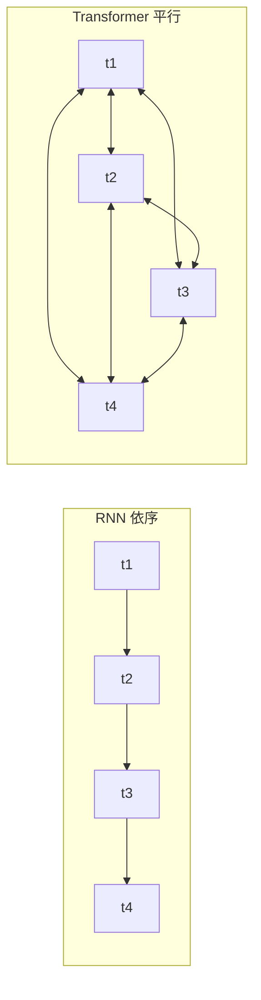
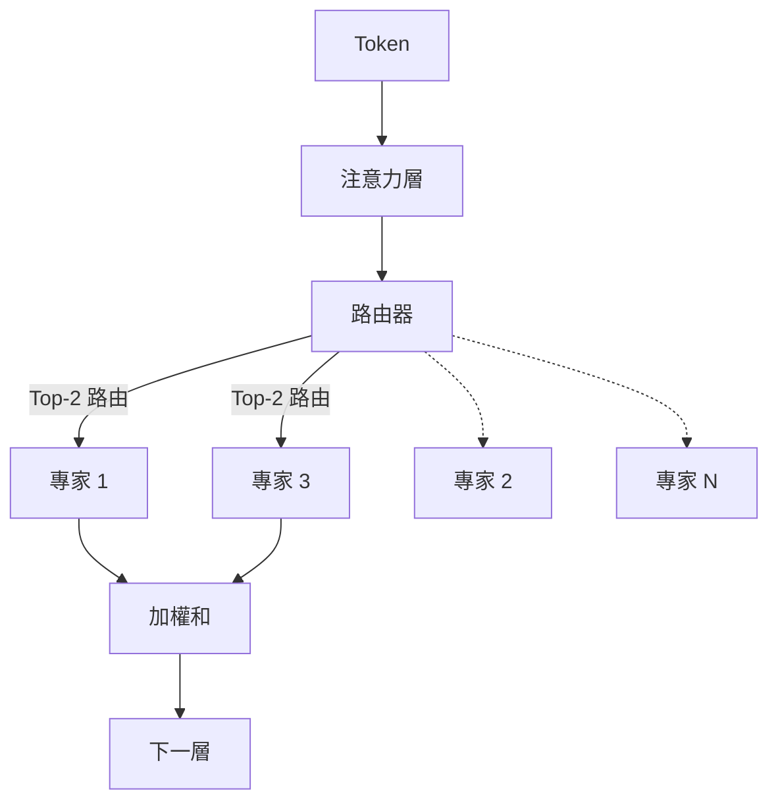

# LLM 內部原理

大型語言模型（LLM，Large Language Model）的架構核心：Transformer、MoE、注意力機制數學、RoPE、GQA、KV 快取，以及推動 2026 模型設計的推論最佳化轉移。

本章涵蓋大型語言模型背後的核心概念。了解這些內部原理對於做出明智的 AI 系統架構決策至關重要。有關這些架構選擇的實際影響，請參閱[推論優化](../04-inference-optimization/)（KV 快取、PagedAttention）、[模型分類學](../02-model-landscape/01-model-taxonomy.md)（生產環境中的 MoE 模型），以及[詞彙表](../GLOSSARY.md)以獲取 MoE、RoPE、ALiBi、GQA、MLA 的定義。

## 目錄

- [Transformer 革命](#the-transformer-revolution)
- [架構變體](#architecture-variants)
- [混合專家（MoE）](#mixture-of-experts-moe)
- [縮放定律：訓練最佳化與推論最佳化](#scaling-laws-training-vs-inference-optimal)
- [原生多模態](#native-multimodality)
- [自注意力機制](#self-attention-mechanism)
- [多頭注意力](#multi-head-attention)
- [位置編碼](#position-encodings)
- [前饋網路](#feed-forward-networks)
- [層正規化](#layer-normalization)
- [整合一切](#putting-it-all-together)
- [關鍵數字](#key-numbers-to-know)
- [面試問題](#interview-questions)
- [參考文獻](#references)

---

## Transformer 革命

在 2017 年之前，序列建模依賴循環架構（RNN、LSTM），這些架構依序處理 token。這造成兩個問題：

1. **訓練緩慢**：依序處理阻礙了平行化
2. **長期依賴難以捕捉**：資訊必須流經許多隱藏層

Transformer 架構在《Attention Is All You Need》（Vaswani 等人，2017 年）中提出，通過用自注意力替換循環來解決這兩個問題。

**給分散式系統工程師的心理模型：**
將循環視為單執行緒請求管線，其中每個步驟取決於前一個。自注意力就像一個完全連接的圖，其中每個節點都可以平行查詢所有其他節點。



---

## 架構變體

根據使用的原始 Transformer 部分，出現了三種主要變體：

| 架構 | 注意力類型 | 範例 | 最適用途 |
|--------------|---------------|----------|----------|
| 僅編碼器 | 雙向 | BERT、RoBERTa | 分類、NER、嵌入 |
| 僅解碼器 | 因果（由左至右） | GPT-4、Claude、Llama | 文字生成、聊天 |
| 編碼器-解碼器 | 交叉注意力 | T5、BART | 翻譯、摘要 |

### 僅解碼器（當今大多數 LLM）

```
┌─────────────────────────────────────────────────────┐
│                 解碼器區塊（×N）                     │
│  ┌───────────────────────────────────────────────┐  │
│  │           遮罩自注意力                          │  │
│  │   （每個 token 只關注前面的 token）              │  │
│  └───────────────────────────────────────────────┘  │
│                         │                           │
│                    Add & Norm                       │
│                         │                           │
│  ┌───────────────────────────────────────────────┐  │
│  │              前饋網路                            │  │
│  └───────────────────────────────────────────────┘  │
│                         │                           │
│                    Add & Norm                       │
└─────────────────────────────────────────────────────┘
                          │
                          ▼
                   輸出機率
```

**為什麼僅解碼器占主導地位：**
- 最簡單的架構
- 預訓練目標（下一個 token 預測）與生成對齊
- 可隨計算資源擴展

### 僅編碼器（BERT 風格）

使用雙向注意力。每個 token 可以看到所有其他 token。無法自迴歸生成文字，但在理解任務上表現出色。

**實際相關性：**
- 針對分類進行微調（意圖檢測、情感分析）
- 作為嵌入模型的骨幹
- 針對特定任務更小、更快

### 編碼器-解碼器（編碼器的回歸）

雖然僅解碼器多年來占主導地位，但對於專門的**推理**和**驗證**任務，編碼器-解碼器架構已有部分回歸（例如 o 系列和 Claude 推理模型內部的內部驗證器）。

---

## 混合專家（MoE）

**前沿模型中最重要的架構轉變（GPT-5.5、Claude Opus 4.7、Gemini 3.1 Pro、DeepSeek V4、Llama 4 Maverick、Mixtral）。**

MoE 用多個「專家」和一個「路由器」替換了密集的前饋網路（FFN），路由器選擇哪些專家處理給定的 token。

```
┌─────────────────────────────────────────────────────┐
│                 MoE 層（解碼器）                    │
│  ┌───────────────────────────────────────────────┐  │
│  │               注意力層                          │  │
│  └───────────────────────────────────────────────┘  │
│                         │                           │
│                 ┌───────▼───────┐                   │
│                 │     路由器     │                   │
│                 └─┬───┬───┬───┬─┘                   │
│          ┌────────┘   │   │   └────────┐            │
│          ▼            ▼   ▼            ▼            │
│   ┌──────────┐ ┌──────────┐ ┌──────────┐ ┌──────────┐│
│   │ 專家 1   │ │ 專家 2   │ │ 專家 3   │ │ 專家 N   ││
│   └────┬─────┘ └────┬─────┘ └────┬─────┘ └────┬─────┘│
│        └────────────┴───┬───┴────────────┘        │
└─────────────────────────▼───────────────────────────┘
```

### MoE 系統設計的關鍵細節：
1. **總參數與活躍參數**：一個 1.6T 參數的 MoE 模型（如 DeepSeek V4 Pro）每個 token 可能只使用 490 億參數。Llama 4 Maverick 在 128 個專家中活躍參數為 170 億。Kimi K2.6 總參數 1T / 活躍 320 億。
    - **記憶體限制**：你必須儲存所有 1.2T 參數（高 VRAM）。
    - **計算限制**：你只須支付 100B 參數的 FLOPs（延遲更快）。
2. **路由崩潰**：如果路由器只選擇一個專家，其他專家就無法學習。現代模型使用**負載平衡損失**和**輔助損失**來確保所有專家都被利用。
3. **DeepSeek-V3 改進**：引入了**多頭潛在注意力（MLA）**和**無輔助損失負載平衡**，這成為 MoE 效率的實際標準。DeepSeek V4（2026 年 4 月）將這兩種技術擴展到 100 萬 token 的上下文視窗。

每個 token 的路由決策，流程圖如下：



---

## 縮放定律：訓練最佳化與推論最佳化

原始的 Chinchilla 定律（2022 年）專注於**訓練最佳化**：在給定訓練預算下找到最佳模型大小。

業界現已轉向**推論最佳化**縮放：
- **過度訓練**：在海量資料（15T+ token）上訓練較小的模型（如 Llama 3 8B），遠超 Chinchilla 點。
- **為什麼？**：推論成本在數百萬用戶中遠超一次性訓練成本。在 Chinchilla 點訓練的 70B 模型相比，用於訓練 10 倍時間的 7B 模型更便宜。

---

## 原生多模態

較舊的模型使用**視覺轉接器**（將凍結的 CLIP 風格視覺編碼器連接到 LLM）。前沿模型（GPT-5.2、Gemini 3）是**原生多模態**的。

- **共享詞彙表**：視覺 token 和文字 token 存在於相同的潛在空間中。
- **統一 Transformer**：相同的區塊處理像素和文字。
- **優勢**：與基於轉接器的方法相比，空間推理和「世界模型」理解能力更好。

---

## 自注意力機制

自注意力是核心創新。它允許每個 token「關注」序列中所有其他 token（收集資訊）。

### 直覺

考慮這個句子：「The animal didn't cross the street because it was too tired.」

「it」指的是什麼？理解需要將「it」與「animal」連接。自注意力通過計算所有 token 對之間的相關性分數來學習這些連接。

### 數學

對於維度 d 的 n 個 token 輸入序列 X：

```
Q = XW_Q   （Query：我正在尋找什麼？）
K = XW_K   （Key：我包含什麼？）
V = XW_V   （Value：我貢獻什麼？）

Attention(Q, K, V) = softmax(QK^T / √d_k) × V
```

**逐步說明：**
1. **QK^T**：點積測量查詢和鍵之間的相似度（n × n 矩陣）
2. **/ √d_k**：縮放以防止大維度下 softmax 飽和
3. **softmax**：轉換為機率（每行總和為 1）
4. **× V**：根據注意力權重對值進行加權求和

### 為什麼要按 √d_k 縮放？

**面試最愛**：這是常被問到的問題，因為它揭示了對數值穩定性的理解。

如果不縮放，隨著維度 d 增大，點積也會成正比增大。大的點積將 softmax 推向飽和區域，梯度消失。

```python
# 不縮放（對大 d 有問題）
d = 512
q = np.random.randn(d)
k = np.random.randn(d)
dot = np.dot(q, k)  # 預期大小：~√d ≈ 22.6

# 縮放後
scaled_dot = dot / np.sqrt(d)  # 預期大小：~1
```

### 注意力複雜度

| 操作 | 時間複雜度 | 空間複雜度 |
|-----------|-----------------|------------------|
| QK^T 計算 | O(n²d) | O(n²) |
| Softmax | O(n²) | O(n²) |
| 與 V 的加權求和 | O(n²d) | O(nd) |

O(n²) 複雜度限制了上下文長度。100K 上下文視窗意味著每層 100 億次注意力計算。

---

## 多頭注意力

現代 Transformer 不使用單一注意力，而是使用多個「頭」平行關注不同方面。

```
┌─────────────────────────────────────────────────────────────┐
│                    多頭注意力                                │
│                                                              │
│   ┌─────────┐  ┌─────────┐  ┌─────────┐       ┌─────────┐   │
│   │ 頭 1    │  │ 頭 2    │  │ 頭 3    │  ...  │ 頭 h    │   │
│   │ d_k=64 │  │ d_k=64 │  │ d_k=64 │       │ d_k=64 │   │
│   └────┬────┘  └────┬────┘  └────┬────┘       └────┬────┘   │
│        │            │            │                  │        │
│        └────────────┴────────────┴──────────────────┘        │
│                              │                               │
│                         串接                                 │
│                              │                               │
│                         W_O（投影）                          │
└─────────────────────────────────────────────────────────────┘
```

**為什麼多個頭？**
- 不同的頭學習不同的模式（語法、語義、共指）
- 類似集成方法：多個視角提高穩健性
- 支援跨頭的平行處理

**典型配置：**
- GPT-3 175B：96 頭 × 128 維度 = 12,288 總維度
- Llama 2 70B：64 頭 × 128 維度 = 8,192 總維度

### 分組查詢注意力（GQA）

**對生產系統至關重要**：標準多頭注意力需要在 KV 快取中為每個頭儲存單獨的 K 和 V。GQA 在頭組之間共享 K 和 V。

| 注意力類型 | 每查詢的 K,V | KV 快取減少 | 範例 |
|----------------|---------------|-------------------|----------|
| 多頭（MHA） | 1:1 | 基線 | GPT-3 |
| 分組查詢（GQA） | 8:1 典型 | ~8x | Llama 2、Mistral |
| 多查詢（MQA） | 全部:1 | ~n_heads × | PaLM、Falcon |

**實際影響：**
對於 Llama 2 70B 在 8K 上下文：
- MHA KV 快取：每請求約 10 GB
- GQA KV 快取：每請求約 1.3 GB

這直接影響批次大小，進而影響吞吐量。

---

## 位置編碼

自注意力是排列不變的。沒有位置資訊，「dog bites man」和「man bites dog」將是相同的。位置編碼注入序列順序。

### 正弦曲線（原始 Transformer）

使用不同頻率的正弦和餘弦函數：

```
PE(pos, 2i) = sin(pos / 10000^(2i/d))
PE(pos, 2i+1) = cos(pos / 10000^(2i/d))
```

**特性：**
- 確定性，無需學習參數
- 理論上可以推斷到更長的序列
- 實際上，推斷效果不佳

### 學習的絕對位置

為每個位置學習一個單獨的嵌入：

```python
position_embeddings = nn.Embedding(max_length, d_model)
```

**特性：**
- 簡單有效
- 無法推斷到訓練長度之外
- 大多數早期模型（GPT-2、BERT）

### 旋轉位置嵌入（RoPE）

通過旋轉查詢和關鍵向量來編碼位置：

```
RoPE(x, pos) = x × cos(pos × θ) + rotate(x) × sin(pos × θ)
```

**特性：**
- 相對的：注意力取決於（pos_q - pos_k）
- 比絕對位置更好的推斷能力
- 用於：Llama、Mistral、PaLM

### ALiBi（帶線性偏差的注意力）

直接將位置相關偏差添加到注意力分數：

```
Attention = softmax(QK^T / √d_k - m × distance)
```

其中 m 是特定於頭的斜率，distance 是 |pos_q - pos_k|。

**特性：**
- 無需修改嵌入
- 優異的推斷能力
- 用於：BLOOM、MPT

### 位置編碼比較

| 方法 | 推斷能力 | 計算開銷 | 現代使用 |
|--------|---------------|------------------|--------------|
| 正弦曲線 | 差 | 無 | 很少 |
| 學習的 | 無 | 極小 | 舊式 |
| RoPE | 良好 | ~5% | 大多數 LLM |
| ALiBi | 優秀 | ~2% | 部分 LLM |

---

## 前饋網路

每個 Transformer 層都有一個前饋網路（FFN），獨立處理每個位置：

```python
def feed_forward(x):
    hidden = activation(x @ W1 + b1)  # 擴展：d → 4d
    output = hidden @ W2 + b2         # 收縮：4d → d
    return output
```

**關鍵特性：**
- 按位置：相同的權重應用於每個位置
- 擴展比率：通常為 4 倍（例如 4096 → 16384 → 4096）
- 參數所在之處：FFN 約佔層參數的 2/3

### 啟動函數

| 啟動函數 | 公式 | 特性 | 使用 |
|------------|---------|------------|-------|
| ReLU | max(0, x) | 簡單、稀疏 | 原始 |
| GELU | x × Φ(x) | 平滑，用於 BERT | GPT-2、BERT |
| SwiGLU | Swish(xW) × xV | 最先進 | Llama、PaLM |

SwiGLU 添加了門控機制，以犧牲 FFN 中約 50% 更多參數為代價提高性能。

### GLU 變體

```python
# 標準 FFN
hidden = gelu(x @ W1)
output = hidden @ W2

# SwiGLU FFN
gate = silu(x @ W_gate)
hidden = x @ W_up
output = (gate * hidden) @ W_down
```

---

## 層正規化

層正規化通過正規化激活來穩定訓練：

```python
def layer_norm(x, gamma, beta):
    mean = x.mean(dim=-1, keepdim=True)
    var = x.var(dim=-1, keepdim=True)
    normalized = (x - mean) / sqrt(var + eps)
    return gamma * normalized + beta
```

### Pre-LN 與 Post-LN

**Post-LN（原始 Transformer）：**
```
x = x + Attention(LayerNorm(x))  # 錯誤 - 這是 Pre-LN
x = LayerNorm(x + Attention(x))  # Post-LN：在殘差後正規化
```

**Pre-LN（現代 LLM）：**
```
x = x + Attention(LayerNorm(x))  # Pre-LN：在子層之前正規化
```

| 變體 | 訓練穩定性 | 最終性能 | 使用 |
|---------|-------------------|-------------------|-------|
| Post-LN | 更難 | 稍好 | 原始論文 |
| Pre-LN | 更容易 | 良好 | 大多數現代 LLM |

Pre-LN 是標準，因為它能夠在不仔細調整學習率的情況下訓練深度模型。

### RMSNorm

簡化版本，跳過均值中心化：

```python
def rms_norm(x, gamma):
    rms = sqrt(mean(x^2) + eps)
    return gamma * (x / rms)
```

比 LayerNorm 快約 10-15%，性能相似。用於 Llama、Mistral。

---

## 整合一切

一個完整的 Transformer 層：

```python
class TransformerLayer:
    def __init__(self, d_model, n_heads, d_ff):
        self.attn_norm = RMSNorm(d_model)
        self.attn = MultiHeadAttention(d_model, n_heads)
        self.ff_norm = RMSNorm(d_model)
        self.ff = SwiGLU_FFN(d_model, d_ff)
    
    def forward(self, x, mask=None):
        # 帶殘差的預正規化注意力
        h = x + self.attn(self.attn_norm(x), mask)
        # 帶殘差的預正規化 FFN
        out = h + self.ff(self.ff_norm(h))
        return out
```

**完整模型：**
```
Token IDs → 嵌入 → [Transformer 層 × N] → 輸出正規化 → LM Head → Logits
```

---

## 關鍵數字

### 模型大小

| 模型 | 參數 | 層數 | 頭數 | 維度 | FFN 維度 |
|-------|------------|--------|-------|-----------|---------|
| GPT-3 | 175B | 96 | 96 | 12,288 | 49,152 |
| Llama 2 70B | 70B | 80 | 64 | 8,192 | 28,672 |
| Llama 2 7B | 7B | 32 | 32 | 4,096 | 11,008 |
| Mistral 7B | 7B | 32 | 32 | 4,096 | 14,336 |

### 記憶體需求

```
模型權重（FP16）≈ 2 位元組 × 參數
- 70B 模型：~140 GB
- 7B 模型：~14 GB

每 token 的 KV 快取（FP16）：
= 2 × 層數 × 頭數 × 頭維度 × 2 位元組
- Llama 70B：2 × 80 × 64 × 128 × 2 = 每 token 2.6 MB
- 8K 上下文：每請求 21 GB
```

### 計算需求

```
每次 token 前向傳遞的 FLOPs ≈ 2 × 參數
```

### 面試問題

### Q：解釋 Transformer 的基本架構。

**強而有力的回答：**
Transformer 是一種利用自注意力機制處理序列數據的架構，由 Vaswani 等人在 2017 年提出。它由編碼器和解碼器組成，每個都包含多頭注意力、前饋網路和殘差連接。關鍵創新是自注意力允許序列中的每個位置關注所有其他位置。

### Q：什麼是 KV 快取，為什麼它很重要？

**強而有力的回答：**
KV 快取儲存注意力計算中的鍵和值張量。在自迴歸生成期間，每個新 token 需要 attending 到所有先前位置。如果每次都重新計算，會導致重複計算。KV 快取允許我們快取並重複使用這些值，顯著加快生成速度。

### Q：比較 GQA 和 MQA。

**強而有力的回答：**
GQA（分組查詢注意力）在查詢頭組之間共享鍵和值，而 MQA（多查詢注意力）在所有查詢頭之間共享單一的鍵和值。GQA 提供更好的質量，接近標準 MHA，同時比 MQA 使用更少的記憶體。

### Q：解釋 SwiGLU 啟動函數。

**強而有力的回答：**
SwiGLU 是門控線性單元（GLU）的一種變體，使用 Swish 作為啟動函數。它添加了門控機制，可以更好地控制資訊流動。與標準 FFN 相比，它需要三個線性投影而不是兩個，這增加了約 50% 的參數但提高了性能。

### Q：什麼是專家混合（MoE）？

**強而有力的回答：**
MoE 是一種稀疏激活架構，其中只有少數「專家」網路針對每個輸入 token 被激活。路由器網路決定哪些專家處理哪個 token。這允許更大的模型容量，同時只消耗處理每個 token 的計算成本的一小部分。

---

## 參考文獻

- Vaswani et al. "Attention Is All You Need" (2017)
- Kaplan et al. "Scaling Laws for Neural Language Models" (2020)
- Brown et al. "Language Models are Few-Shot Learners" (GPT-3, 2020)
- Touvron et al. "LLaMA: Open and Efficient Foundation Language Models" (2023)
- Touvron et al. "LLaMA 2: Open Foundation and Fine-Tuned Chat Models" (2023)
- Jiang et al. "Mistral 7B" (2023)
- DeepSeek-V3 Technical Report (2024)

---

*上一章：[模型概觀](../02-model-landscape/README.md) | 下一章：[分詞器深入探討](02-tokenization-deep-dive.md)*
