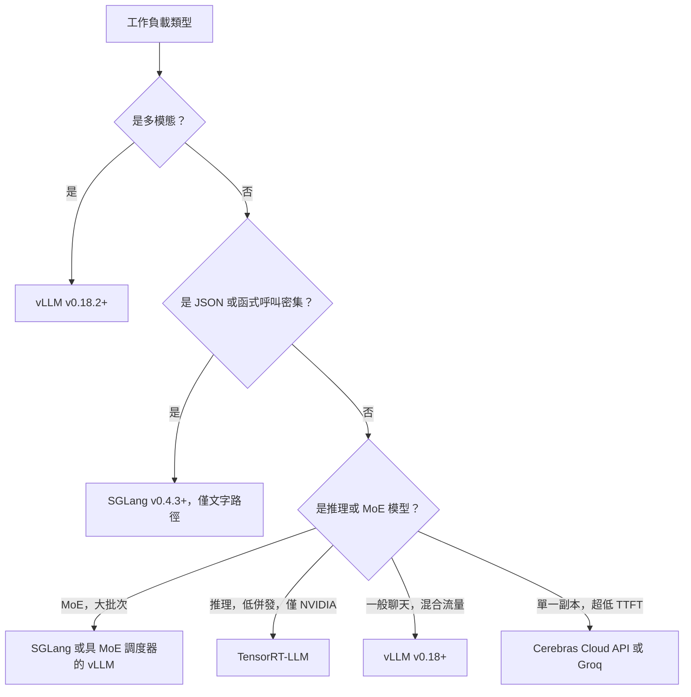

# 服務基礎設施

大規模部署 LLM 需要強健的基礎設施層，處理負載平衡、模型並行和多租戶隔離。重點已從「提供一個模型」轉向「協調推論叢集」。

## 目錄

- [推論閘道](#inference-gateway)
- [模型並行（張量對比管線）](#parallelism)
- [多 GPU 協調](#multi-gpu)
- [串流與長連接](#streaming)
- [2026 年 5 月推論引擎版圖](#may-2026-inference-engine-landscape)
- [面試題目](#interview-questions)
- [參考文獻](#references)

---

## 推論閘道

閘道是 AI 工作負載的「交通指揮官」。

| 元件 | 職責 |
|------|------|
| **認證與速率限制** | 基於 Token 的配額和租戶隔離。 |
| **模型路由器** | 將請求導向特定模型版本（金絲雀/A-B）。 |
| **上下文追蹤器** | 確保使用者的提示詞快取被發送到同一 GPU 節點（粘性會話）。 |
| **輸出過濾器** | 對串流回應進行即時安全與 PII 清理。 |

---

## 模型並行

對於無法容納在單一 GPU 上的模型（如 Llama 4 405B 需要約 800GB VRAM），必須拆分它們。

### 1. 張量並行（TP）

將各層/張量拆分到多個 GPU。
- **延遲**：低（最快）。
- **通訊**：高（需要 NVLink）。
- **標準**：單節點內（8x GPU）90% 生產服務使用。

### 2. 管線並行（PP）

將不同層拆分（例如，GPU 1 上的層 1-40，GPU 2 上的層 41-80）。
- **延遲**：高（微批次處理開銷）。
- **效率**：較低閒置時間（泡泡時間）。
- **標準**：只用於跨多節點的大型模型。

---

## 多 GPU 協調

Kubernetes 操作器（如 **Kube-Ray** 或 **Gloo**）在生產環境中管理「GPU 池」。

- **異構叢集**：在同一叢集中混合使用 H100（前沿模型）和 L4（小模型）。
- **自動擴縮**：基於 **KV 快取利用率**而非 CPU 或標準記憶體使用量進行擴縮。
- **冷啟動**：使用**未量化基礎映像**並從高速 Lustre/掛載載入權重，將啟動時間從分鐘縮短至 15-20 秒。

---

## 串流與長連接

LLM 幾乎總是透過 **Server-Sent Events（SSE）** 或 **WebSockets** 提供服務。

**基礎設施挑戰**：標準負載平衡器（第 4 層）在處理長壽命 AI 連接時會遇到困難。
- **解決方案**：使用**第 7 層負載平衡器**（Envoy/Istio），它們理解「序列結束」Token，能夠在使用者回合*之間*重新平衡流量，而不僅僅是在連接層級。

---

## 2026 年 5 月推論引擎版圖

到 2026 年 5 月，引擎選擇不再是「哪個最快」的問題。每個領先引擎都贏得了特定工作負載類別，正確答案是每種工作負載用對應引擎，而非單一主力引擎。以下是團隊實際使用的實用版圖。

### vLLM v0.18+：預設開源引擎

[vLLM](https://docs.vllm.ai/) 在 2026 年 Q1 達到 **v0.18**，並持續有 5 月的點版本發布。主要功能：

- **Blackwell Ultra（B300）支援**在樹中，包括 FP4 和動態稀疏（[vLLM v0.18 發布說明](https://github.com/vllm-project/vllm/releases)）。
- **PagedAttention v3** 具備 NUMA 感知配置；在多插槽主機上有明顯的尾延遲改善。
- **分離式前置/解碼**在配置標記後，主要適用於很長的上下文工作負載。
- **MoE 調度器**適用於 Llama 4 Maverick、DeepSeek V4 Pro、Mixtral 8x22B，具備專家駐留感知批次處理。

**重要安全注意**：vLLM 修補了一個高嚴重性的**多模態 RCE**（[2026 年 2 月發布的 GHSA](https://github.com/vllm-project/vllm/security/advisories)），影響 0.18 以前版本的多模態前置處理器。**所有多模態 vLLM 部署必須執行 v0.18.2 或更高版本。** 修復是一行補丁，但 CVE是真實存在的，可通過精心設計的圖像輸入被利用。請升級。

vLLM 在工作負載為「連續批次處理下的 Llama / Mistral / Qwen / DeepSeek」時仍是預設開源引擎。它不一定總是最快的，但最容易操作、測試最完整，且最有可能在同一週內收到新漏洞的修補。

### SGLang v0.4.3+：吞吐量領先，但有重要警告

[SGLang](https://github.com/sgl-project/sglang) v0.4.3（2026 年 4 月）在多個工作負載上領先吞吐量：

- 在結構化輸出/函式呼叫工作負載上比 vLLM **高出約 29% 吞吐量**（[SGLang 部落格，2026 年 4 月](https://lmsys.org/blog/2024-12-04-sglang-v0-4/)）。勝利來自**非同步約束解碼**，其中約束編譯與 LLM 前向傳播平行執行。
- 一流的 **RadixAttention** 前綴快取重用（用於聊天工作負載）。
- 專家路由感知批次處理的一級 **MoE 服務**。

**2026 年 5 月關鍵安全警告**：SGLang 在多模態和分離式前置處理程式碼路徑中有**未修補的 RCE**（[SGLang 安全公告，2026 年 3 月](https://github.com/sgl-project/sglang/security/advisories)）。純文字路徑是安全的，這也是每個公開基準測試所使用的。多模態路徑應被視為**未年生產就緒**，直到 CVE修補完成。多個大型部署已將多模態流量從 SGLang 移回 vLLM v0.18.2，並將 SGLang 用於純文字函式呼叫工作負載。

2026 年 5 月的正確姿勢：在**文字函式呼叫和結構化輸出工作負載**（吞吐量優勢顯著）使用 SGLang；在 CVE修補前，**不要將 SGLang 用於多模態或分離式前置處理的生產流量**。

### TensorRT-LLM：峰值 NVIDIA 吞吐量，營運成本

[TensorRT-LLM](https://github.com/NVIDIA/TensorRT-LLM) 仍是純 NVIDIA 硬體上吞吐量領先者：

- 在 H200、B200 和 B300 上對於經過調校的模型，擁有**最高的峰值 Token/秒/$**。
- 與 **NVIDIA Triton**（服務）和 **NVIDIA NIM**（託管部署）緊密整合。
- **Blackwell Ultra FP4 / FP8** 的自訂核心，通常領先開源引擎數月。

代價是營運層面：

- 每個新模型都需要**引擎建置**（多小時編譯步驟，特定於模型和 GPU）。
- 需綁定特定 TensorRT 和 CUDA 版本；升級通常很痛苦。
- **僅限 NVIDIA**。沒有脫離 CUDA 的路徑，需要完整的重新平台化。

決定是二元的：若您未來兩年專注 NVIDIA，且有一到兩個旗艦模型需要榨乾每個 Token/秒，TensorRT-LLM 值得。若需要引擎靈活性、廠商獨立性或快速模型迭代，vLLM 或 SGLang 更合適。

### MoE 感知服務（Llama 4 Maverick、DeepSeek V4 Pro）

MoE 模型打破了「服務成本隨批次大小平滑擴縮」的假設。2026 年 5 月 MoE 服務引擎的重要屬性：

- **專家權重駐留**：具有每 Token 17B 活躍參數的 400B 參數 MoE，大部門 VRAM 浪費在保持未使用專家熱度。引擎必須感知專家對 Token 路由，並固定熱門專家或串流冷門專家。
- **專家路由延遲**：路由決策發生在**每 Token**，並增加可測量的成本。引擎現在跨批次維度批次處理路由決策。
- **非單調批次設定檔**：向批次添加請求可能會*減少*吞吐量（如果它強制更冷的一組專家活躍）。最佳批次大小取決於批次中**路由模式的分布**，而非僅僅是批次計數。
- **管線感知調度**：最佳引擎將新請求調度到與 in-flight 批次共享專家啟動的批次。

| 引擎 | Llama 4 Maverick（2026 年 5 月） | DeepSeek V4 Pro（2026 年 5 月） |
|------|----------------------------------|--------------------------------|
| vLLM v0.18+ | 穩定，MoE 調度器在樹中 | 穩定 |
| SGLang v0.4.3+ | 穩定，批次>32 時吞吐量領先 | 穩定 |
| TensorRT-LLM | 穩定，低併發時吞吐量領先 | 穩定 |

面試就緒的洞察：**MoE 服務不再是「vLLM 加大權重」。** 這是一個不同的調度問題，引擎在過去 12 個月都開發了專用 MoE 路徑。

### 決策框架：每種工作負載用對應引擎

更明確的團隊實際部署地圖：

| 工作負載 | 引擎選擇（2026 年 5 月） | 原因 |
|----------|------------------------|------|
| 公開聊天機器人（混合流量，需快速修補） | **vLLM v0.18.2+** | 最容易操作，最佳安全節奏 |
| JSON 函式呼叫後端 | **SGLang v0.4.3+**（僅文字路徑） | 結構化輸出吞吐量勝利約 29% |
| 單模型低延遲（一個模型，一個團隊） | **B300 上的 TensorRT-LLM** | 峰值 NVIDIA 吞吐量，在單一模型上值得營運成本 |
| 多模態（圖像、音頻、影片輸入） | **vLLM v0.18.2+** | SGLang 多模態尚未修補 |
| 推理模型（長 CoT，低併發） | **TensorRT-LLM** 或具分離式前置的 **vLLM** | 解碼邊界，受益於自訂核心 |
| MoE 模型（Llama 4 Maverick、DeepSeek V4 Pro） | 具 MoE 調度器的 **vLLM v0.18+** 或 **SGLang v0.4.3+** | 兩者現在都有一級 MoE 路徑 |
| 單一副本，子 50ms TTFT | **Cerebras Cloud API** 或 **Groq LPU** | GPU 無法在 70B+ 模型上達到此目標 |

### 2026 年 5 月營運姿勢

- **時刻保持在已修補版本。** 推論引擎現在有與網頁伺服器相當的 CVE 節奏。多模態 RCE 不是理論。
- **在第二引擎上執行金絲雀。** 生產流量在 vLLM，1-5% 金絲雀在 SGLang 或 TensorRT-LLM，警示質量和延遲差異。這能捕捉引擎特定錯誤，並提供更快的遷移路徑。
- **將引擎視為部署清單的一部分。** 模型不是「Llama 4 Maverick」；它是「此批次配置在此硬體上的 vLLM v0.18.3 上的 Llama 4 Maverick」。全部四項都要固定。
- **關注安全公告摘要**，而不僅是發布說明：[vLLM 公告](https://github.com/vllm-project/vllm/security/advisories)、[SGLang 公告](https://github.com/sgl-project/sglang/security/advisories)、[TensorRT-LLM CVE 清單](https://nvd.nist.gov/vuln/search/results?form_type=Basic&search_type=all&query=tensorrt-llm)。

---

## 面試題目

### Q：為什麼張量並行比管線並行更適合低延遲服務？

**理想回答：**
張量並行（TP）在多個 GPU 上同時執行單層的矩陣乘法。這意味著該層的延遲按 GPU 數量減少。相反，管線並行（PP）依序處理不同層。當 GPU 2 处理層 40-80 時，GPU 1 處於閒置狀態，除非您有多個請求的深管道（批次處理）。對於單一使用者的請求，PP 增加了所有 GPU 的延遲，而 TP 將延遲分攤到所有 GPU 上。

### Q：如何在多租戶 LLM 叢集中處理「嘈雜鄰居」問題？

**理想回答：**
我們透過**分層迭代級調度**處理嘈雜鄰居。每個租戶被分配「總 GPU 週期」的「份額」。在連續批次處理迴圈中，調度器確保單一租戶不佔用 100% 的 KV 快取槽位。如果租戶 A 壓倒系統，調度器將優先為租戶 B 和 C 處理「前置處理」步驟，或每週期只處理租戶 A 的解碼迭代子集。這在閘道層透過 Token 桶速率限制和在服務引擎透過特定調度策略來強制執行。

---

## 參考文獻

- Narayanan et al. "Efficient Large-Scale Language Model Training on GPU Clusters Using Pipedream" (2019/2021)
- NVIDIA. "Megatron-LM: Training Multi-Billion Parameter Models on GPU Clusters" (2021)

---

*下一篇：[成本優化手冊](07-cost-optimization-playbook.md)*
