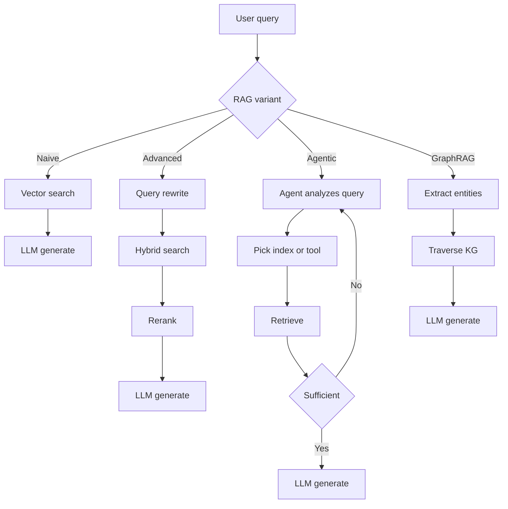
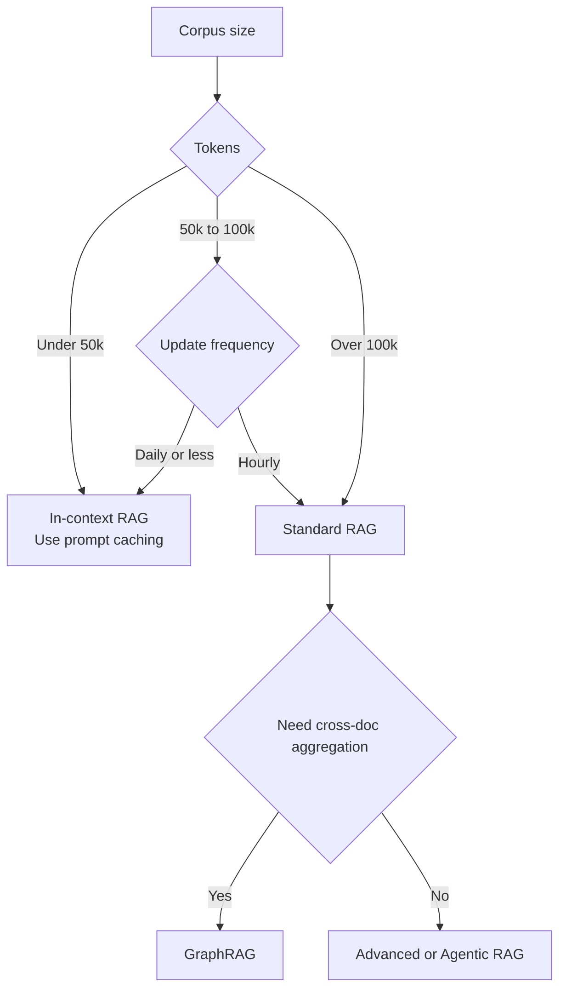

# RAG 基礎概念

RAG 如何從簡單的向量搜尋演進為代理式與圖形化檢索。在何種情況下選擇 RAG 與長上下文，以及導致生產環境失敗的三個檢索缺口。

檢索增強生成（Retrieval-Augmented Generation，RAG）是一種系統架構模式，透過向大型語言模型提供外部、可驗證的上下文來強化其回應的基礎。它已從「簡單的向量搜尋」演進為多階段推理流程：混合檢索、重排序、上下文分塊，以及代理式迴圈已成為生產環境的基本標配。更深入的內容請參閱[分塊策略](02-chunking-strategies.md)、[向量資料庫](04-vector-databases.md)、[重排序策略](06-reranking-strategies.md)、[上下文檢索](10-contextual-retrieval.md)、[ColBERT 晚期互動](11-late-interaction-colbert.md)以及[GraphRAG 重新框架](07-graph-rag.md)。

## 目錄

- [核心哲學： grounding 與訓練的對比](#philosophy)
- [RAG 分類法](#taxonomy)
- [RAG 與 2M 上下文（「混合時代」）](#rag-vs-long-context)
- [檢索品質缺口](#quality-gap)
- [面試問題](#interview-questions)
- [參考文獻](#references)

---

## 核心哲學：Grounding 與訓練的對比

| 面向 | 微調 | RAG |
|------|------|-----|
| **知識類型** | 內化（權重） | 外化（上下文） |
| **更新週期** | 高成本（重新訓練） | 零成本（更新資料庫） |
| **歸因** | 無（黑箱） | 明確（引用） |
| **隱私** | 難以「遺忘」 | 易於過濾/刪除 |

**經驗法則**：微調用於**形式**（風格、語調、語法）；RAG 用於**事實**（知識、資料、 grounding）。

---

## RAG 分類法

生產環境中的 RAG 系統按其「代理深度」進行分類：

### 1. 樸素 RAG（檢索後生成）
- **流程**：使用者查詢 -> 向量搜尋 -> Top-K -> 大語言模型。
- **狀態**：因「檢索缺口」與精確度低而不適用於生產環境，已被取代。

### 2. 進階 RAG（多階段）
- **流程**：查詢轉換 -> 混合搜尋 -> 重排序 -> 大語言模型。
- **關鍵細節**：使用**RRF（相互排名融合）**來結合關鍵字與語意結果。

### 3. 代理式 RAG（迴圈式）
- **流程**：代理分析查詢 -> 決定要搜尋哪些工具/索引 -> 評估結果 -> 如果資訊不足則重新檢索。
- **技術**：Self-RAG、修正型 RAG（CRAG）。

### 4. GraphRAG（結構化上下文）
- **流程**：擷取實體/關係 -> 建立知識圖譜 -> 遍歷圖譜以找到「關聯知識」。
- **優勢**：解決「聚合問題」（例如：「總結 50 份文件中所有法律風險」）。

四種代理深度的變體：

---

## RAG 與 2M 上下文（「混合時代」）

隨著 Gemini 1.5 Pro（2M+）與 Claude Sonnet 4.6（1M+）等上下文視窗的出現，RAG 正在改變。

- **上下文內 RAG（ICR）**：對於資料集 < 50k 詞元，我們跳過向量資料庫，將所有內容放入提示中。
- **提示快取**：透過在 GPU 上快取「背景知識」，使長上下文 RAG 成本降低 90%。

**架構決策**：
- 如果您的語料庫 > 100k 詞元且為動態：使用**標準 RAG**。
- 如果您的語料庫 < 100k 詞元：使用**上下文內 RAG**。

選擇標準 RAG 與上下文內 RAG 的決策樹：

---

## 檢索品質缺口

「檢索缺口」是 RAG 失敗的首要原因。
- **缺口 1：語意不匹配**：查詢說「快速的車」，資料庫有「Porsche 911」。透過**嵌入重排序器**解決。
- **缺口 2：上下文缺失**：相關資訊在資料庫中，但檢索器漏掉了。透過**混合搜尋**解決。
- **缺口 3：中間遺失**：資訊在提示中，但大語言模型忽略了。透過**上下文壓縮**解決。

---

## 面試問題

### Q：即使前沿模型配備 1M-2M 詞元的上下文，為什麼還要使用 RAG？

**強而有力的回答：**
三層理由：
1. **成本與延遲**：即使有提示快取，為每個新使用者查詢重讀 2M 詞元，比檢索 5 個相關區塊（約 2k 詞元）要昂貴得多，且 TTFT（首詞元時間）更高。
2. **時效性**：RAG 可以存取即時 API（股價、新聞），這些無法靜態嵌入到上下文視窗中。
3. **規模**：企業資料集（SharePoint、TB 級日誌）甚至超過 2M 詞元。RAG 作為「篩選器」，找出應進入那個高價值上下文視窗的 0.01% 相關資料。

### Q：什麼是「代理式 RAG」，它與「進階 RAG」有何不同？

**強而有力的回答：**
進階 RAG 是一個**確定性流程**（線性：重寫 -> 搜尋 -> 重排序）。代理式 RAG 是一個**隨機迴圈**。在代理式 RAG 中，模型被賦予工具來決定*如何*檢索。例如，如果代理發現檢索到的文件不相關，它可以決定「搜尋 Google」或「查詢 SQL 資料庫」。它 essentially 在檢索前後新增了一個「推理步驟」，以確保上下文足以回答提示。

---

## 重點摘要

- 樸素 RAG（向量搜尋 + Top-K + 大語言模型）已不適用於生產環境；將進階 RAG（混合 + RRF + 重排序）作為新的基準。
- 長上下文視窗不會終結 RAG：成本、延遲、時效性和語料庫規模，都促使您在即使 2M 上下文的情境下仍回歸檢索。
- 按語料庫大小選擇：50k 詞元以下使用上下文內 RAG（搭配提示快取）；100k 以上使用標準 RAG；聚合問題使用 GraphRAG。
- 大多數 RAG 失敗是檢索失敗，而非生成失敗；在調整提示之前，先診斷三個缺口（語意、上下文缺失、中間遺失）。
- 代理式 RAG 與進階 RAG 是隨機迴圈與確定性流程的選擇；只有當查詢模式太過多樣化、無法用固定流程處理時，才採用代理式。

---

## 參考文獻

- Gao et al. "Retrieval-Augmented Generation for LLMs: A Survey" (2024 update)
- Microsoft. "From RAG to GraphRAG" (2024)
- Google. "Long-context LLMs as Retrievers" (2025)
- [Anthropic. "Introducing Contextual Retrieval" (Sep 2024)](https://www.anthropic.com/news/contextual-retrieval)

---

*下一篇：[分塊策略](02-chunking-strategies.md)*