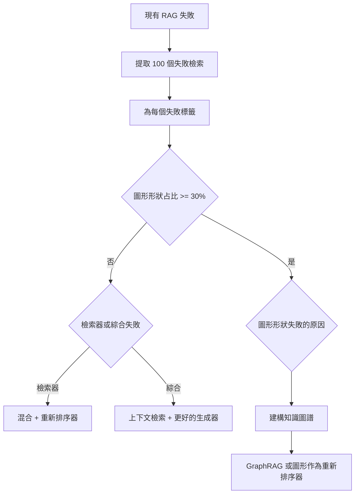

# GraphRAG

GraphRAG 是**知識圖譜（Knowledge Graphs, KG）**與**檢索增強生成（Retrieval-Augmented Generation）**的結合。雖然向量 RAG 擅長「找到特定區塊」，但 GraphRAG 專為整個資料集的**全域推理**而設計。

## 目錄

- [GraphRAG 何時真正有效（以及何時無效）](#graphrag-何時真正有效以及何時無效)
- [圖形作為重新排序器模式（2026 年 5 月）](#圖形作為重新排序器模式2026年5月)
- [向量 RAG 的局限性](#向量-rag-的局限性)
- [GraphRAG 架構（萃取-建構-查詢）](#graphrag-架構萃取-建構-查詢)
- [社群摘要（Microsoft 模式）](#社群摘要microsoft-模式)
- [實體關係檢索](#實體關係檢索)
- [何時使用 GraphRAG](#何時使用-graphrag)
- [面試問題](#面試問題)
- [參考文獻](#參考文獻)

---

## GraphRAG 何時真正有效（以及何時無效）

GraphRAG 是處理圖形形狀問題的專業工具，而非相較於向量 RAG 的預設升級。大約 80% 的生產檢索工作負載中，混合 BM25 加上密集檢索器再加上交叉編碼器重新排序器的方案，無論在建構成本、營運成本或答案品質上都具有競爭力。只有當問題確實需要多跳周遊，且向量相似性無法恢復時，圖形才值得建構。

此決定應基於資料驅動，而非美學考量。從現有 RAG 系統中提取 100 個失敗的檢索，為每個失敗標籤為三個類別之一，然後讓分布來決定：

1. **詞彙或分塊失敗**：答案在語料庫中，但檢索器未能將其呈現。修復檢索器（更好的嵌入、混合評分、更大的 top-k、重新排序器，或上下文檢索）。
2. **綜合失敗**：檢索器呈現了正確的區塊，但生成器組合不佳。修復提示、重新排序器或模型。
3. **圖形形狀失敗**：答案需要沿著關係鏈周遊，這些關係在文件中不會共現任何表面文字。這是 GraphRAG 的類別。

如果第三個類別少於 30% 的失敗，則不要建構圖形。建構和維護成本不會回報。如果達到 30% 或更多，GraphRAG（或圖形作為重新排序器的混合模式，見下文）是正確的下一個投資。

### GraphRAG 是正確工具的工作負載

這些工作負載的模式是相同的：問題需要連接在任何單一區塊中不會共同出現的實體，而關係本身携帶著表面嵌入無法捕捉的語義權重。

- **藥物發現與生物醫學研究**：在基因、蛋白質、化合物和疾病之間追蹤路徑。像 GraLC-RAG 這類基於 UMLS 的變體針對此領域進行了調整。
- **金融欺詐集團**：連接跨文件從未相互提及的帳戶、設備、位置和交易。
- **法律先例鏈**：通過多個司法管轄區層級追蹤案例引用，其中每個案例只引用其直接前驅。
- **企業組織圖與政策所有權**：像「誰批准 Y 地區 X 政策的例外」這類問題，需要周遊報告線和政策所有權邊。
- **儲存庫規模的程式碼智慧**：呼叫圖、類型階層和依賴關係本質上是圖形形狀；對原始碼區塊的向量相似性會失去使答案可找到的結構。

### 決策流程



---

## 向量 RAG 的局限性

### 1. 語義鴻溝

向量相似性在處理以下情況時會失敗：

- **專有名詞**：產品 ID、版本號碼、縮寫
- **數值比較**：準確匹配「GPT-4o」比語義相似性更重要
- **否定查詢**：「不包含 X 的文件」難以用向量表示

### 2. 缺乏關係推理

向量 RAG 無法回答以下問題：

- 「哪些公司收購了本公司也收購的公司？」
- 「與此藥物有相互作用的所有蛋白質的路徑是什麼？」
- 「基於專利引用網路的技術演變趨勢」

### 3. 聚合查詢失敗

向量 RAG 擅長「找到答案」但失敗於「總結答案」：

- 「50 份文件中所有提到的人的總結」
- 「過去一年所有政策變化的時序」
- 「此法律案件的所有先例鏈」

---

## GraphRAG 架構（萃取-建構-查詢）

GraphRAG 有三個核心階段：

### 階段 1：萃取（Extract）

從文件中萃取出結構化知識：

```python
# 實體萃取
entities = llm.extract([
    {"type": "ORGANIZATION", "text": "...", "name": "..."},
    {"type": "PERSON", "text": "...", "name": "..."},
    {"type": "RELATIONSHIP", "from": "...", "to": "...", "type": "ACQUIRED"},
])
```

### 階段 2：建構（Build）

將萃取結果轉換為知識圖譜：

```python
# 圖形建構
for entity in entities:
    graph.add_node(entity.id, entity.type, entity.properties)

for relationship in relationships:
    graph.add_edge(relationship.from, relationship.to, relationship.type)
```

### 階段 3：查詢（Query）

基於圖形結構進行推理檢索：

```python
# 圖形周遊 + 向量檢索混合
def graphrag_query(question):
    # 找到相關實體
    entities = graph.find_entities(question)

    # 周遊鄰近關係
    subgraph = graph.traverse(entities, depth=2)

    # 在子圖上執行向量搜尋
    results = vector_search(subgraph, question)

    return synthesize(results, subgraph)
```

---

## 社群摘要（Microsoft 模式）

Microsoft 的 GraphRAG 實現包含一個**社群摘要**層：

1. **社群偵測**：使用 Leiden 或 Louvain 演算法識別圖形中的社群
2. **社群摘要**：為每個社群生成簡潔描述
3. **分層檢索**：先在社群級別匹配，再在實體級別細化

```python
# 社群偵測
communities = community_detection(graph, algorithm="leiden")

# 為每個社群生成摘要
for community in communities:
    summary = llm.summarize(
        f"這些實體和關係：{community.entities_and_relations}"
    )
    community.summary = summary
```

**為何有效**：社群摘要將大量文件壓縮為可管理的叢集。當查詢是「關於 X 的所有內容」時，我們可以先識別相關社群，再在該社群內搜尋。

---

## 實體關係檢索

### 雙軌檢索

GraphRAG 使用雙軌檢索：

1. **向量檢索**：快速但淺層
2. **圖形周遊**：深入但昂貴

```python
def dual_retrieval(question, top_k=10):
    # 軌道 1：向量搜尋
    vector_results = vector_search(question, top_k=50)

    # 軌道 2：圖形查詢
    key_entities = extract_entities(question)
    graph_results = graph.traverse(key_entities, depth=3)

    # 融合
    fused = reciprocal_rank_fusion(
        [vector_results, graph_results],
        weights=[0.4, 0.6]
    )

    return fused[:top_k]
```

### 圖形作為重新排序器

2026 年 5 月的新興模式是**圖形作為重新排序器**（Graph-as-Reranker）：

```python
# 先用向量檢索獲得候選
candidates = vector_search(question, top_k=100)

# 用圖形關係重新排序
def graph_rerank(candidates, question):
    scores = []
    for doc in candidates:
        entity_matches = count_entity_overlaps(doc, question)
        relationship_strength = measure_relationship_depth(doc, question)
        graph_score = (entity_matches * 0.6) + (relationship_strength * 0.4)
        scores.append(graph_score)

    return sort_by_scores(candidates, scores)
```

---

## 何時使用 GraphRAG

### 決策矩陣

| 查詢類型 | 向量 RAG | GraphRAG |
|---------|---------|----------|
| 簡單事實（「誰是 X？」） | ✅ 足夠 | ❌ 過度 |
| 單一跳轉（「X 與 Y 的關係？」） | ⚠️ 尚可 | ✅ 更好 |
| 多跳推理（「X 影響 Z 的路徑？」） | ❌ 失敗 | ✅ 擅長 |
| 聚合（「所有 X 的總結」） | ❌ 失敗 | ✅ 擅長 |
| 比較（「X vs Y 在 Z 方面」） | ⚠️ 尚可 | ✅ 更好 |

### 建構成本估算

建構 GraphRAG 的成本：

| 元件 | 成本 | 複雜度 |
|------|------|--------|
| 實體萃取 | 每文件 $0.01-0.05 | 中 |
| 關係識別 | 每文件 $0.02-0.10 | 高 |
| 圖形儲存（Neo4j） | 每百萬節點 ~$500/月 | 低 |
| 圖形查詢延遲 | 50-200ms | 中 |

---

## 面試問題

### Q：什麼情況下向量 RAG 失敗但 GraphRAG 成功？

**理想回答：** 向量 RAG 在需要沿著關係鏈進行推理時會失敗。典型範例：「有多少公司同時被我們也投資的公司收購了？」這個問題中的每個關係都存在於文件中，但沒有任何單一區塊包含完整答案。GraphRAG 透過建構實體圖並周遊關係來解決這個問題。我首先會從 100 個現有 RAG 失敗中分析，看有多少屬於「圖形形狀失敗」——如果不足 30%，建構和維護圖形的成本並不合理。

### Q：GraphRAG 的主要維護挑戰是什麼？

**理想回答：** 三個主要挑戰：
1. **圖形漂移**：隨著文件更新，實體和關係會過時。需要持續的圖形更新流程。
2. **萃取品質**：LLM 萃取的品質參差不齐。需要驗證和糾正機制。
3. **規模型挑戰**：當圖形包含數百萬個節點時，周遊成本會飆升。解決方案包括社群分層、圖形压缩和預先計算路徑。

### Q：GraphRAG 與一般知識圖譜問答有何不同？

**理想回答：** 傳統 KG 問答假設圖形是完整且權威的。GraphRAG 面對的是**部分建構的圖形**——並非所有文件中的關係都已萃取。因此，GraphRAG 使用**混合檢索**：圖形周遊捕獲結構化關係，向量搜尋捕獲未被萃取的語義相似性。GraphRAG 也是**迭代的**：初始檢索可能返回部分答案，代理會根據此結果繼續周遊和檢索。

---

## 參考文獻

- Microsoft Research. 「GraphRAG: Unlocking Quality Grounding across Full corpora」（2024/2025）
- Edge & Paxton. 「From Local to Global: A GraphRAG Approach to Query-Focused Summarization」（2024）
- Neo4j. 「知識圖譜與生成式 AI」（2025）
- RAGatouille. 「GraphRAG 實作」（2024/2025）

---

*上一篇：[重排序策略](06-reranking-strategies.md)*
*下一篇：[代理式 RAG](08-agentic-rag.md)*