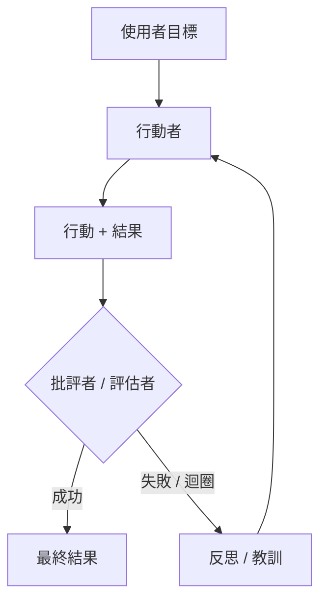

# 推理迴圈：ReAct 及其超越

推理迴圈定義了代理的控制流程。雖然 **ReAct** 是 2023 年的基準，但目前系統使用更複雜的模式，如**規劃即解決（Plan-and-Solve）**、**自我反思**，以及在推理原生模型上運行的**推理時間擴展（Inference-Time Scaling）**。

## 目錄

- [迴圈演進](#迴圈演進)
- [ReAct：經典模式](#react經典模式)
- [自我反思迴圈](#自我反思迴圈)
- [規劃即解決（Soto）](#規劃即解決soto)
- [流程工程（LangGraph 模式）](#流程工程langgraph-模式)
- [面試問題](#面試問題)
- [參考文獻](#參考文獻)

---

## 迴圈演進

| 時代 | 模式 | 核心哲學 |
|------|------|---------|
| **2023** | ReAct | 交替思考與行動。 |
| **2024** | Reflexion（自我反思） | 評估錯誤並重試。 |
| **今日** | 系統二迴圈（System 2 Loop） | 使用隱藏 CoT 實現穩健的多步驟邏輯。 |

---

## ReAct：推理 + 行動

適用於 90% 代理的基礎迴圈：
1. **思考（Thought）**：「我需要找 X。」
2. **行動（Action）**：`search_engine("X")`
3. **觀察（Observation）**：「X 在 Y。」
4. **重複（Repeat）**。

**批評**：ReAct 很脆弱。若搜尋回傳「無結果」，一個簡單的 ReAct 代理常會再次嘗試同一搜尋。現代迴圈注入**「負面約束」（Negative Constraints）**（例如「不要嘗試我們已經看過的搜尋結果」）。

---

## 自我反思迴圈

Reflexion 在迴圈中新增了「批評」步驟。

**效益**：透過在短期記憶中儲存這些「反思」，代理在目前工作階段中建立一個「心智地圖」，了解哪些方法行不通。

---

## 規劃即解決

不等每次逐步決定（貪心法），代理先建立**靜態規劃（Static Plan）**，再執行。

1. **規劃者（Planner）**：「我將做 A，然後 B，然後 C。」
2. **執行者（Executor）**：執行步驟。
3. **重新規劃者（Replanner）**：若步驟 B 失敗，觸發完整重新規劃，而非局部修復。

**原因**：規劃減少「隨機錯誤」。透過承諾一條路徑，模型較不會被嘈雜的工具結果分心。

---

## 流程工程（LangGraph 模式）

現代代理系統已從「聊天介面」轉向**「狀態機（State Machine）」**。

- **循環圖（Cycle Graph）**：而非線性序列，定義一個圖，模型可多次返回「清理」節點或「驗證」節點。
- **微型代理（Micro-Agent）**：圖中的每個節點是一個專業的「提示」或「工具」。

**關鍵細節**：「代理」不再只是 LLM；代理是**圖執行引擎（Graph Execution Engine）**。

---

## 面試問題

### Q：何時使用「推理迴圈」（ReAct）vs.「規劃即解決」架構？

**理想回答：**
我選擇 **ReAct** 處理**探索性**任務，環境不可預測（例如：瀏覽一個你不知道 URL 結構的新網站）。代理需要對每個觀察做出反應。我選擇**規劃即解決**處理**可預測但複雜**的工作流程（例如：從 5 個已知 API 產生財務報告）。規劃防止模型「漫遊」，並允許對彼此獨立的步驟進行更好的平行化。

### Q：什麼是「推理時間擴展」（Inference-Time Scaling），它與代理迴圈有何關聯？

**理想回答：**
推理時間擴展（常與 OpenAI 的 o1 相關）指的是在回應生成*過程中*投入更多計算，而非僅在訓練期間。在代理情境中，這意味著模型不會只輸出第一個看起來有效的動作。它使用**搜尋樹（Search Tree）**（如蒙地卡羅樹搜尋（MCTS））在內部模擬不同動作路徑，然後才承諾最可能成功的那個。這減少了所需的「現實世界」工具呼叫次數，節省外部 API 成本並降低失敗率。

---

## 參考文獻

- Yao et al. 《ReAct：推理與行動的協同》（2022/2025 更新）
- Shinn et al. 《Reflexion：具有迭代穩態學習的語言代理》（2024）
- Wang et al. 《規劃即解決提示》（2023）

---

*下一篇：[工具使用與模型上下文協定（MCP）](03-tool-use-and-mcp.md)*
