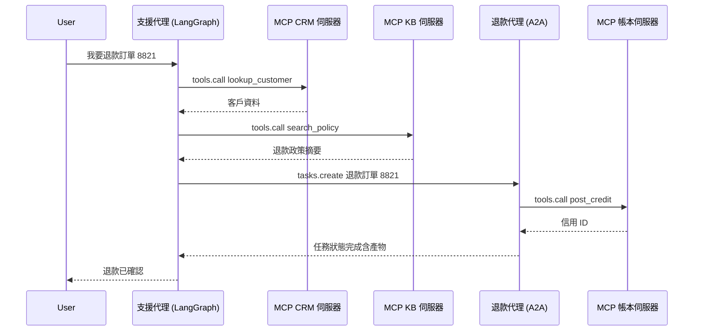
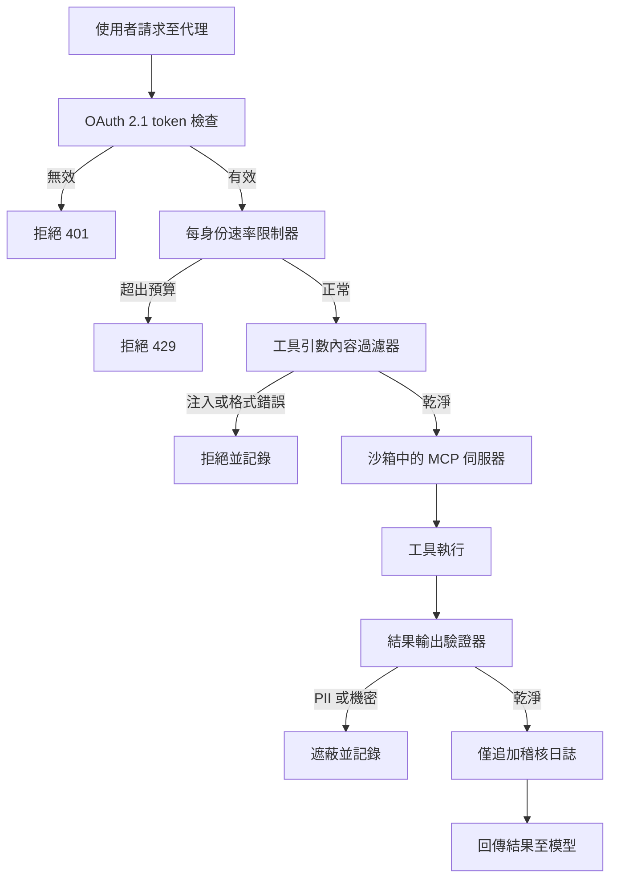

# 工具使用與 MCP

工具是代理的「雙手」。產業已對**模型上下文協定（Model Context Protocol, MCP）**達成標準化共識，MCP 以統一、本地優先的通訊層取代了零散的自訂工具定義。MCP 快速成熟：Streamable HTTP 傳輸、OAuth 2.1 認證，以及 MCP 2.0（2026 年 3 月批准）中原生的電腦使用工具皆已落地。與此同時，**代理對代理（Agent-to-Agent, A2A）**及其他互通性協定也已興起，與 MCP 的工具存取層互補，提供了代理協調能力。

## 目錄

- [工具使用機制](#工具使用機制)
- [模型上下文協定（MCP）](#模型上下文協定mcp)
- [MCP 2.0：Streamable HTTP 與認證](#mcp-20-streamable-http-與認證)
- [MCP 藍圖與生態系](#mcp-藍圖與生態系)
- [代理對代理協定（A2A）](#代理對代理協定a2a)
- [協定格局：MCP + A2A + ACP](#協定格局-mcp-a2a-acp)
- [電腦使用工具（Anthropic）](#電腦使用工具anthropic)
- [定義高精度工具](#定義高精度工具)
- [MCP vs. OpenAI Function Calling](#mcp-vs-openai-function-calling)
- [Context7：即時文件 MCP](#context7即時文件-mcp)
- [串流工具呼叫](#串流工具呼叫)
- [面試問題](#面試問題)
- [參考文獻](#參考文獻)

---

## 工具使用機制

工具使用發生在三步驟迴圈中：
1. **結構描述呈現**：模型收到工具的 JSON 結構描述。
2. **意圖與萃取**：模型輸出一个「呼叫」（例如 `{"tool": "get_weather", "args": {"city": "Tokyo"}}`）。
3. **執行與語境化**：系統執行函數，並將結果回饋至提示中。

**細微差別**：生產堆疊不再將工具定義「寫死」在系統提示中。它們使用**動態資訊清單**，根據使用者意圖只取用必要的工具。

---

## 模型上下文協定（MCP）

MCP 由 Anthropic 開發（2024 年 11 月發布），現已成為跨 Anthropic、OpenAI、Google、Microsoft 與 AWS 的通用工具整合標準。MCP 讓模型能與資料及工具互動，無論它們位於何處。治理權於 2025 年 12 月移轉至 Linux 基金會的 Agentic AI Foundation。

- **MCP 用戶端**：AI 應用程式（即你的代理程式碼）。
- **MCP 伺服器**：公開工具（函數）、資源（資料）與提示（範本）的獨立程序。
- **通訊**：透過 stdio 或 HTTP 的 JSON-RPC。

### 為何用 MCP？
- **安全性**：工具在自己的程序中執行，不在模型邏輯中。
- **可攜性**：寫一次「Postgres 工具」，即可用於 Claude、GPT 或 Llama。
- **可探索性**：標準化的 `list_tools` 與 `get_resource` 命令。

---

## 定義高精度工具

生產品質的工具必須包含：

1. **嚴格類型驗證**：使用 Pydantic 或 Zod 在模型看到呼叫前就強制執行結構描述。
2. **詳細文件字串**：描述工具的「使用時機」與「不使用時機」。
3. **信心閾值**：要求模型為工具呼叫輸出 `confidence` 分數。

```python
# MCP 伺服器範例（概念性）
@server.tool()
class ExecuteSQL(PydanticModel):
    """執行唯讀 SQL 查詢。請勿用於 DROP/DELETE。"""
    query: str = Field(..., description="要執行的 SELECT 查詢。")

    async def run(self):
        # 實作...
        pass
```

---

## MCP vs. OpenAI Function Calling

| 功能 | OpenAI 原生 | MCP |
|------|------------|-----|
| **耦合度** | 高（OpenAI 專屬） | 低（跨平台） |
| **傳輸** | API 主體中的 JSON | JSON-RPC（本地/遠端） |
| **資料存取** | 無原生「資源」 | 原生 `Resources` 支援 |
| **適用場景** | 原型開發 | 企業編排 |

---

## 串流工具呼叫

前沿模型支援**部分工具推測**。
系統不必等待完整 JSON 生成，一旦在串流中看到工具名稱與關鍵 ID，就開始「預先取出」工具結果。這將可察覺延遲減少 **400-800ms**。

---

## MCP 2.0：Streamable HTTP 與認證

MCP 2.0 規範（2026 年 3 月批准）引入了兩項重大變更：

### 1. Streamable HTTP 傳輸
先前 MCP 使用 `stdio` 或基本 HTTP 與 SSE。MCP 2.0 新增 **Streamable HTTP**——一種單一長壽 HTTP 連線處理雙向串流：

```
[MCP 用戶端] ←── Streamable HTTP POST /mcp ──→ [MCP 伺服器]
                  （含 SSE 回應串流）
```

- 使 MCP 伺服器能部署為雲端微服務（不僅是本地程序）
- 允許在一個連線上多個同時工具呼叫
- 向後相容 stdio 傳輸

### 2. OAuth 2.1 授權

遠端 MCP 伺服器現在可以要求適當的認證：

```json
{
  "type": "oauth2",
  "grant_type": "client_credentials",
  "scopes": ["tools:read", "resources:documents"]
}
```

這使得企業 MCP 伺服器能夠實現每個租戶的細緻存取控制。

---

## MCP 藍圖與生態系

截至 2026 年 5 月，已有超過 2,300 個公開 MCP 伺服器，主要 AI 工具（Claude、Cursor、Windsurf）皆已原生支援。MCP 已從開發者工具進入消費者硬體（例如 Elgato Stream Deck 7.4 於 2026 年 3 月隨 MCP 支援出貨）。Microsoft 更將 MCP 採納為 Windows AI Foundry 與 Microsoft 365 Copilot 的主要整合標準。

MCP 藍圖聚焦於四大支柱：

1. **傳輸擴展性**：為無狀態操作演進 Streamable HTTP，橫向擴展伺服器執行個體，並在負載平衡器與代理後正確運作。**MCP 伺服器卡**提供 `.well-known` URL 以取得結構化伺服器中繼資料探索。
2. **代理通訊**：在 MCP 現有工具層之上啟用代理對代理模式。
3. **企業認證（2026 Q2）**：OAuth 2.1 搭配瀏覽器代理的 PKCE，加上企業身分提供者的 SAML/OIDC 整合，解鎖受監管產業的部署。
4. **MCP 登錄系統（2026 Q4）**：一個經過審查、驗證的伺服器目錄，包含安全性稽核、使用統計與 SLA 承諾。

**治理**：MCP 治理工作組引入了貢獻者階梯與 delegation 模型，允許特定領域工作組在不需要完整核心維護者審查的情況下接受 SEP（規範增強提案）。

> *2026 年 5 月驗證。來源：modelcontextprotocol.io/development/roadmap*

---

## 代理對代理協定（A2A）

Google 在 2025 年 4 月推出 **Agent2Agent（A2A）** 協定，旨在解決 MCP 無法處理的問題：來自不同供應商的代理如何相互通訊（不僅是與工具）。

### A2A 解決的問題

MCP 定義代理如何連接到**工具和資料**。A2A 定義**編排代理如何將任務委託**給來自不同供應商或框架的專家代理，即使它們不共享記憶體、工具或上下文。

### 技術基礎

- 基於 **HTTP、SSE 與 JSON-RPC**（與 MCP 相同基礎，便於整合）
- 支援企業級認證，與 OpenAPI 認證方案對等
- **代理卡**：描述代理能力、技能與端點的 JSON 中繼資料文件——類似於 MCP 伺服器卡，但適用於代理

### A2A 任務生命週期

```
[用戶端代理] ── POST /tasks ──→ [遠端代理]
                                     │
                  ← SSE 串流 ────────┘  （狀態更新、產物）
                                     │
                  ← 任務完成 ─────────┘  （最終結果）
```

A2A 任務支援長時間執行的作業與串流狀態更新，適合橫跨數分鐘或數小時的企業工作流程。

### 產業採用

- 獲得 50 餘家技術合作夥伴支持，包括 Atlassian、Salesforce、SAP、LangChain 與 PayPal
- 2025 年 6 月捐贈給 **Linux 基金會** 作為開放治理專案
- **0.3 版**（2026 年 5 月最新）新增了 gRPC 支援、簽署安全性卡，以及擴展的 Python SDK 支援
- NIST 於 2026 年 2 月啟動「AI 代理標準倡議」，部分因應 A2A/MCP 的動能

> *2026 年 5 月驗證。來源：developers.googleblog.com, a2a-protocol.org*

---

## 協定格局：MCP + A2A + ACP

在生產企業系統中，多種協定同時在不同層運作：

| 協定 | 層級 | 目的 | 治理方 |
|------|------|------|--------|
| **MCP** | 代理對工具 | 通用工具與資料存取 | Anthropic（開放規範） |
| **A2A** | 代理對代理 | 跨供應商代理委託 | Linux 基金會 |
| **ACP** | 代理通訊 | 輕量級非同步代理訊息（REST） | IBM / Linux 基金會 |

### 它們如何互補

```
┌──────────────────────────────────────────┐
│            企業系統                        │
│                                          │
│  ┌─────────┐  A2A   ┌─────────┐         │
│  │ 代理 A   │◄──────►│ 代理 B   │         │
│  │(供應商 X)│        │(供應商 Y)│        │
│  └────┬─────┘        └────┬─────┘        │
│       │ MCP                │ MCP          │
│  ┌────▼─────┐        ┌────▼─────┐        │
│  │ DB 工具   │        │ API 工具  │        │
│  │ 伺服器    │        │ 伺服器    │        │
│  └──────────┘        └──────────┘        │
└──────────────────────────────────────────┘
```

**關鍵洞察**：MCP 與 A2A 是互補而非競爭的。MCP 處理代理對工具的連線；A2A 處理代理對代理的協調。生產系統兩者都使用。

**ACP 備註**：IBM 起源的代理通訊協定（ACP）團隊於 2025 年 9 月與 Google A2A 團隊合併，開發統一的代理通訊標準。新專案應以 A2A 作為主要的代理對代理協定。

---

## A2A v1.0 GA 與 2026 年 5 月 MCP 生產現況

A2A v1.0 於 Google Cloud Next 2026（4 月）達到正式上市，獲得 150 餘家組織的公開承諾，包括 AWS、Microsoft、Salesforce、SAP、ServiceNow、Workday 與 IBM。該專案移至 Linux 基金會的 Agentic AI Foundation 之下治理，該基金會現在與合併後的 ACP 工作一同治理 A2A。一個點發行版本（v1.2）新增了密碼學簽署代理卡：卡是綁定至代理操作者公鑰的 JWS 簽署文件，因此用戶端代理可以在向 `https://refunds.acme.com/.well-known/agent.json` 的遠端代理發出任務前，驗證該代理確實屬於 ACME。原生的 A2A 用戶端/伺服器支援已在 Google ADK 1.0、LangGraph、CrewAI、LlamaIndex、Semantic Kernel 與 AutoGen 中出貨。

### 組合模式：支援代理委託退款

LangGraph 客戶服務代理擁有對話狀態與一套 MCP 工具（CRM、工單搜尋、知識庫）。當使用者要求退款時，該工作屬於不同團隊的財務退款代理，後者位於 A2A 端點之後並強制執行自己的政策、稽核日誌與 SOX 控制。支援代理不直接呼叫退款資料庫；它發出 A2A 任務並讓財務代理決定。



支援代理從未看過帳本。退款代理透過自己的 MCP 伺服器擁有帳本存取權並強制執行不同政策。A2A 任務是非同步的：支援代理可以在退款處理期間向使用者回應保持訊息，然後在產物到達時重新連接。

### MCP 2026 藍圖重點

MCP 2026 年下半年藍圖集中於兩個領域。**傳輸擴展性**瞄準多執行個體與負載平衡部署：Streamable HTTP 獲得工作階段恢復與黏性工作階段提示，使 MCP 伺服器能作為水平擴展的 Kubernetes Deployment 執行，而不會破壞長壽工具工作階段。**企業管理認證**將 OAuth 資源伺服器姿態正式化：MCP 伺服器現在根據 RFC 8707 被歸類為資源伺服器，這意味著 token 綁定至特定伺服器 URI，不能跨伺服器重放。

### MCP 生產強化（2026 年 5 月後）

2026 年 5 月浮現了 MCP STDIO 傳輸的一類漏洞：STDIO MCP 伺服器隱含假設程序邊界就是信任邊界，但來自上游模型的特殊工具引數可能欺騙寫得不好的 STDIO 伺服器，使用主機使用者的權限叫用主機命令。架構修復分兩步：

1. **盡可能將 STDIO MCP 伺服器遷移至 HTTP 傳輸並搭配 TLS**。HTTP 傳輸強制執行明確的信任邊界（網路），並啟用 STDIO 無法提供的 OAuth 2.1 資源伺服器強制執行。
2. **對於無法遷移的 STDIO 伺服器**，將每個伺服器執行在專用容器中，無主機檔案系統掛載、無網路出口、嚴格 CPU 和記憶體限制，以及唯讀映像。將容器作為信任邊界；危害的爆炸半徑就是該容器。

**生產 MCP 縱深防禦檢查清單：**

- 所有遠端 MCP 伺服器在 OAuth 2.1 搭配 PKCE 與 audience-bound token（RFC 8707）後執行。
- STDIO 伺服器在 `network: none`、唯讀根檔案系統、無主機磁碟區掛載，以及 `nproc` 和 `memory` 上限的容器內執行。
- 每個工具叫用都附有使用者識別、bound token audience、工具名稱、引數雜湊與結果雜湊的日誌。日誌傳送至僅追加存放區。
- 每個 MCP 伺服器前有速率限制器，以使用者識別為範圍。具有寫入能力的工具適用嚴格的突發預算。
- 工具引數在到達伺服器前通過內容過濾器：字串欄位上基於模式的提示注入偵測、結構化欄位上的結構描述驗證、在不需要 shell 元字元的工具上對 shell 元字元的硬性拒絕。
- 工具結果在回傳模型前通過輸出驗證器：PII 偵測、機密偵測、大小上限、已知外洩標記的內容過濾。
- 危險工具（檔案寫入、殼層執行、輸出 HTTP）需要人類審批步驟或簽署能力 token，而非依賴模型安全地呼叫它們。

含所有防禦層的請求流程：



管線刻意保守。每一層都可以拒絕；只有通過全部五個關卡的結果才會送達模型。

**本節來源：**
- [Google Cloud A2A v1.0 GA at Cloud Next 2026](https://cloud.google.com/blog/products/ai-machine-learning/agent2agent-protocol-is-getting-an-upgrade)
- [MCP 2026 Roadmap (The New Stack)](https://thenewstack.io/model-context-protocol-roadmap-2026/)
- [RFC 8707: Resource Indicators for OAuth 2.0](https://www.rfc-editor.org/rfc/rfc8707)
- [Adversa AI: Top MCP Security Resources May 2026](https://adversa.ai/blog/top-mcp-security-resources-may-2026/)
- [Anthropic Constitutional Classifiers](https://www.anthropic.com/research/constitutional-classifiers)

---

## 電腦使用工具（Anthropic）

Claude 3.5+ 推出了原生的**電腦使用**工具——模型能直接控制桌面或網頁瀏覽器。可透過 Anthropic API 取得：

| 工具 | 能力 | 備註 |
|------|------|------|
| `bash` | 執行殼層命令 | 跨回合持久工作階段 |
| `text_editor` | 讀取/寫入/編輯檔案 | 支援 view、create、str_replace 命令 |
| `computer` | 滑鼠、鍵盤、截圖 | 完整桌面 GUI 控制 |

```python
import anthropic

client = anthropic.Anthropic()

response = client.beta.messages.create(
    model="claude-3-7-sonnet-20250219",
    max_tokens=4096,
    tools=[
        {"type": "bash_20250124", "name": "bash"},
        {"type": "text_editor_20250124", "name": "str_replace_based_edit_tool"},
        {"type": "computer_20251022", "name": "computer",
         "display_width_px": 1280, "display_height_px": 800}
    ],
    messages=[{"role": "user", "content": "開啟 Firefox，前往 GitHub，克隆我的 repo。"}],
    betas=["computer-use-2024-10-22", "interleaved-thinking-2025-05-14"]
)
```

**電腦使用生產安全規則：**
1. 始終在沙箱化 VM 中執行（Docker + VNC 或 E2B cloud）
2. 在破壞性動作前截圖驗證關鍵狀態
3. 對不可逆動作（檔案刪除、表單提交）使用 HITL（人類在迴圈中）
4. 設定 `ANTHROPIC_MAX_COMPUTER_TOKENS` 以限制失控迴圈

---

## Context7：即時文件 MCP

2026 年最實用的 MCP 伺服器之一是 **Context7**——它解決了程式碼代理的「訓練資料過時」問題：

```
# 無 Context7：
代理：「我將使用 langchain 的 `create_openai_tools_agent` 函數...」
（此函數已廢棄 6 個月）

# 有 Context7：
代理 → MCP: list_resources("langchain")
MCP → 代理: 回傳目前 v0.3.x 文件
代理：「我將使用新的 `create_react_agent` 介面...」
```

**在 Claude Desktop / Claude Code 中設定：**
```json
{
  "mcpServers": {
    "context7": {
      "command": "npx",
      "args": ["-y", "@upstash/context7-mcp"]
    }
  }
}
```

Claude 在使用該函式庫寫程式碼前自動呼叫 `resolve-library-id` 與 `get-library-docs`。

---

## 面試問題

### Q：MCP 如何解決「工具過多」問題（結構描述過載）？

**理想回答：**
2023 年，提供 50 個工具會降低效能，因為提示變得太長。MCP 透過**動態資源探索**解決這個問題。代理不將 50 個工具結構描述全部載入提示，而是傳送 `list_resources` 呼叫至 MCP 伺服器。接著它只「附上」與目前 `Resource` 上下文相關的特定工具。這使提示保持精實，注意力集中在推理而非解析未使用的結構描述上。

### Q：為什麼使用 MCP 伺服器分離「工具邏輯」與「代理應用程式」很重要？

**理想回答：**
關注點分離。如果工具邏輯（例如 Python 爬蟲）存在於單獨的 MCP 伺服器中，我可以獨立於 LLM 編排器擴展爬蟲基礎設施。更重要的是，它提供了**安全沙箱**。如果模型嘗試透過工具引數進行注入，它只影響 MCP 伺服器程序，該程序可以與核心代理狀態零網路存取隔離在容器中。

### Q：MCP 與 A2A 在生產多代理系統中如何协同運作？

**理想回答：**
它們處理**不同的通訊層**。MCP 是代理對工具的協定——它透過 MCP 伺服器給任何代理標準化存取資料庫、API 與檔案的權限。A2A 是代理對代理的協定——它讓編排代理（供應商 X）將任務委託給專家代理（供應商 Y），而無需共享記憶體或上下文。在生產環境中，我對每個工具連線使用 MCP，需要跨供應商代理協調時使用 A2A。例如，建構於 LangGraph 上的採購編排器使用 MCP 查詢庫存資料庫，然後使用 A2A 將合規檢查委託給由不同團隊托管的專門代理。關鍵設計原則是：MCP 用於代理自身工具堆疊內部，A2A 用於跨組織或供應商邊界。

---

## 參考文獻

- Anthropic. 《模型上下文協定規範》（2025）
- Google. 《代理對代理協定規範 v0.3》（2026）
- Linux 基金會. 《代理對代理協定專案》（2025）
- NIST. 《AI 代理標準倡議》（2026 年 2 月）
- JSON-RPC 2.0 規範。
- Pydantic v3.0 文件。

---

*下一篇：[多代理編排](04-multi-agent-orchestration.md)*
