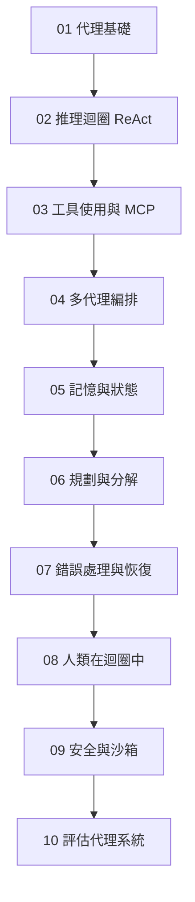
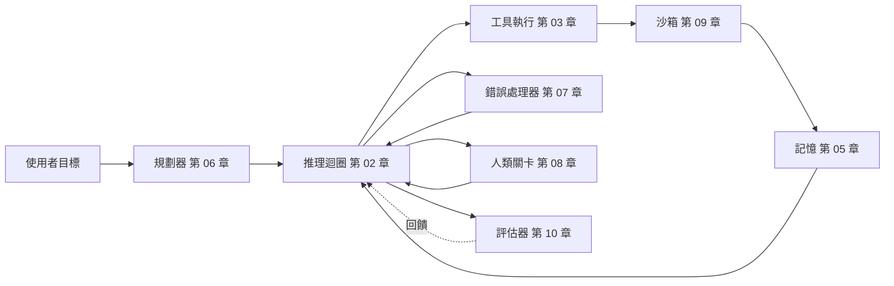

# 智慧代理系統（Intelligent Agentic Systems）

2026 年構建生產 AI 代理：推理迴圈、MCP 工具使用、多代理編排、記憶、規劃、錯誤恢復、人類在迴圈中，以及評估。

代理不是單一技術。它是推理迴圈、工具層、記憶、規劃器、錯誤處理器與評估器的組合。本資料夾中的 10 章深入涵蓋每一層，並按順序排列，使早期章節建立後續章節使用的詞彙。

## 章節順序

## 參考架構

每章的概念映射至已部署代理的一個元件。下圖顯示每章的內容在生產系統中的位置：

## 本資料夾中的檔案

| 檔案 | 內容 |
|------|------|
| [01-agent-fundamentals.md](01-agent-fundamentals.md) | 是什麼讓一個系統成為「代理」；代理 vs. 工作流程的區別；何時選擇哪個。 |
| [02-reasoning-loops-react-and-beyond.md](02-reasoning-loops-react-and-beyond.md) | ReAct、規劃即執行、Reflexion、Tree-of-Thought；迴圈設計模式。 |
| [03-tool-use-and-mcp.md](03-tool-use-and-mcp.md) | 函數呼叫、模型上下文協定（MCP）、A2A v1.0、MCP 生產強化。 |
| [04-multi-agent-orchestration.md](04-multi-agent-orchestration.md) | 多代理何時有幫助何時有傷害；編排 vs. 編舞。 |
| [05-agent-memory-and-state.md](05-agent-memory-and-state.md) | L1-L4 記憶層級（工作、情節、語義、程序）與取捨。 |
| [06-planning-and-decomposition.md](06-planning-and-decomposition.md) | 任務分解、計畫修訂、長期規劃。 |
| [07-error-handling-and-recovery.md](07-error-handling-and-recovery.md) | 工具失敗、重試、迴圈守衛、「第 100 次工具呼叫」問題。 |
| [08-human-in-the-loop-patterns.md](08-human-in-the-loop-patterns.md) | 確認關卡、升級、受監督的自主性。 |
| [09-agentic-security-and-sandboxing.md](09-agentic-security-and-sandboxing.md) | 程式碼執行沙箱、能力門控、代理中的提示注入。 |
| [10-evaluating-agentic-systems.md](10-evaluating-agentic-systems.md) | 軌跡評估、代理作為法官、流程獎勵模型、代理基準。 |

## 配套章節

- [工具使用與電腦代理](../17-tool-use-and-computer-agents/) 以 OpenClaw、電腦使用與工具代理版圖擴展本節。
- [LangGraph 編排](../09-frameworks-and-tools/02-langgraph-orchestration.md) 是本節模式最常見的實作框架。
- [代理 RAG](../06-retrieval-systems/08-agentic-rag.md) 交會代理與檢索。
- [可靠性與安全](../13-reliability-and-safety/) 將代理安全擴展至第 09 章沙箱之外。

## 關鍵要點

- 代理不是單一技術；它是推理迴圈、工具層、記憶、規劃器與評估器的組合。先讀第 01 章。
- MCP 是 2026 年的標準工具互通協定；除非你有充分理由，否則不要建立自訂工具協定。
- 多代理編排（第 04 章）被過度應用；對於大多數用例，良好工具化的單一代理勝過多代理。
- 記憶（第 05 章）與錯誤恢復（第 07 章）是大多數生產代理錯誤所在；在那裡預算評估工作。
- 人類在迴圈中（第 08 章）不是備用方案；為高風險動作刻意設計關卡。
