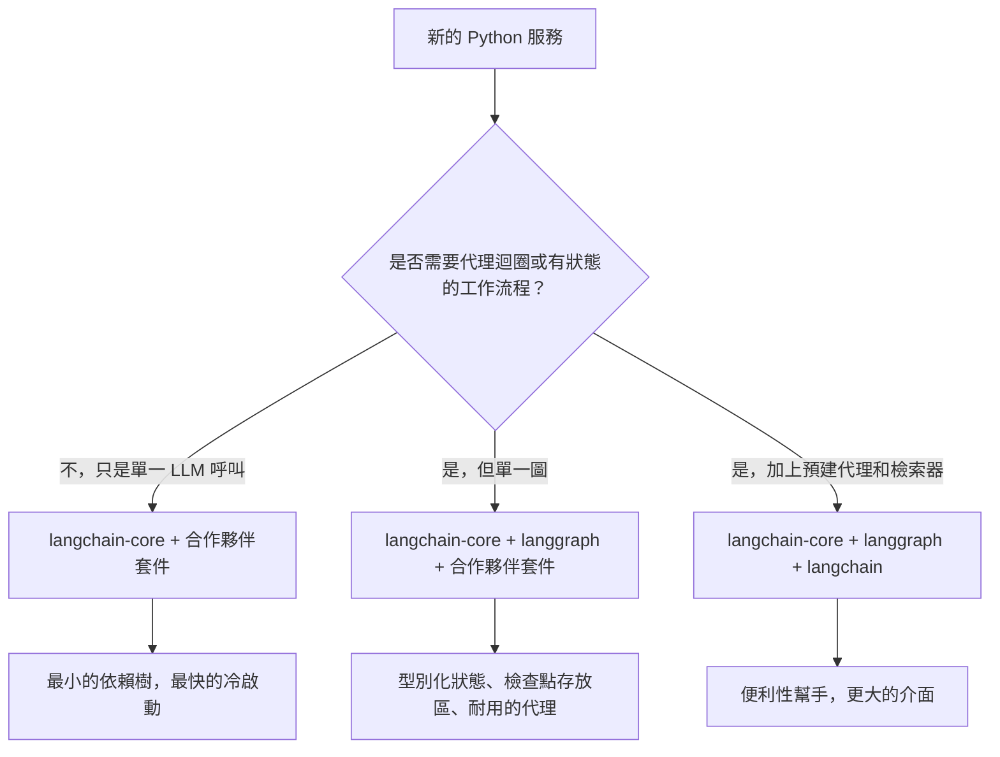

# LangChain 深度解析

LangChain 不再只是一個「提示詞函式庫」。它已成熟為一個用於構建生產級 LLM 應用程式的**模組化生態系統**。LangGraph（於 2025 年底達到 v1.0，是所有 LangChain 代理的預設執行環境）負責有狀態的編排。**LCEL（LangChain 表達式語言）** 仍然是構建可組合鏈的最快方式。

## 目錄

- [LangChain 技術堆疊](#stack)
- [LCEL：管道程式設計](#lcel)
- [標準抽象層（核心）](#core)
- [管理複雜度（社群 vs 合作夥伴套件）](#complexity)
- [LangChain 模組化推進](#langchain-modularity-push)
- [面試題目](#interview-questions)
- [參考文獻](#references)

---

## LangChain 技術堆疊

生態系統現在分為三個明確的層級：
1. **LangChain Core**：最小的提示詞、輸出解析器和 Runnables 抽象層。（依賴佔比低）。
2. **LangChain Community/Partner**：500+ 資料庫、模型和工具的整合。
3. **LangGraph**：有狀態的編排層（將在下一章中介紹）。

---

## LCEL：管道程式設計

LangChain 表達式語言（LCEL）使用 `|` 運算子建立一個有向無環圖（DAG）的執行流程。

```python
# 標準 RAG 鏈
chain = (
    {"context": retriever, "question": RunnablePassthrough()}
    | prompt
    | model.with_structured_output(Schema) 
)
```

**為何使用 LCEL？**
- **預設非同步**：每個鏈都支援 `.ainvoke()` 和 `.astream()`。
- **平行處理**：多個分支自動平行執行。
- **可觀測性**：自動與 **LangSmith** 整合，提供完整追蹤視覺化。

---

## 標準抽象層

### 1. Runnables
這是 LangChain 中所有事物的「基底類別」。Runnables 為 `.invoke`、`.batch` 和 `.stream` 提供了統一的介面。

### 2. 工具與工具呼叫
LangChain 對 **MCP（Model Context Protocol，模型上下文協定）** 有一級支援。
- 您可以將任何 MCP 伺服器轉換為 LangChain `BaseTool`。

### 3. 輸出解析器
早期系統使用正規表達式，現代程式碼使用 `.with_structured_output()`，它利用模型原生的 JSON 能力（OpenAI `.json_mode` 或 Anthropic `tools`）。

---

## 管理複雜度

> [!TIP]
> **生產環境最佳實踐**：避免在關鍵路徑中使用 `langchain-community`。使用**合作夥伴套件**（如 `langchain-openai`、`langchain-pinecone`）來減少依賴地獄並提高穩定性。

---

## LangChain 模組化推進

到 2026 年 5 月，生態系統已完成從單體 `langchain` 導入到具有明確依賴邊界的多層結構的長期遷移。這樣的拆分是為了讓團隊能夠精確選擇他們需要的介面，而無需引入 500+ 個整合。

### 套件分層（已發布）

| 套件 | 用途 | 直接依賴 |
|---------|---------|---------------------|
| `langchain-core` | Runnables、提示詞、輸出解析器、工具抽象 | Pydantic、`tenacity`，幾乎沒有其他 |
| `langchain` | 純 Python 的參考鏈、檢索器、代理 | `langchain-core` |
| `langgraph` | 有狀態圖編排、檢查點、時間回溯 | `langchain-core` |
| `langchain-openai`、`langchain-anthropic`、`langchain-google-vertexai` 等 | 供應商合作夥伴套件 | `langchain-core` + 供應商 SDK |
| `langchain-community` | 長尾整合（保持可用，不再建議用於生產路徑） | 很多 |
| `langchain-classic` | 舊版 v0 鏈，保留用於遷移 | `langchain-core` |

根據 v1 發布訊息（[LangChain 部落格，使用 LangChain 1.0 構建](https://blog.langchain.com/langchain-1-0/)），`langchain-core` 是唯一具有穩定介面和向後相容性保證的套件。

### 跨驗證庫的標準 JSON Schema

應用程式碼的最大變化：`with_structured_output()`、`bind_tools()` 和 `@tool` 現在接受任何 [JSON Schema](https://json-schema.org/) 相容物件。包括：

- **Pydantic v2**（歷史預設值）
- **[Zod 4](https://zod.dev/v4)** 透過 `zod-to-json-schema`，用於 JavaScript / TypeScript LangChain
- **[Valibot](https://valibot.dev/)**（功能性、可 tree-shake 的 TS 驗證）
- **[ArkType](https://arktype.io/)**（TypeScript 型別作為執行期 schema）
- Python 中的純 dict / TypedDict
- 手寫的 JSON Schema 文件

這記錄在 [LangChain v1 結構化輸出指南](https://docs.langchain.com/oss/python/langchain/structured-output) 和 [JS 結構化輸出指南](https://js.langchain.com/docs/how_to/structured_output) 中。實際效果：框架選擇不再決定驗證器選擇，已標準化使用 Valibot 或 ArkType 處理 HTTP 層的團隊可以將這些 schema 重用為 LangChain 工具定義。

```python
# Python：TypedDict 工具 schema，路徑中無 Pydantic
from typing import TypedDict, Annotated
from langchain_anthropic import ChatAnthropic

class CreateInvoice(TypedDict):
    """為客戶建立發票。"""
    customer_id: Annotated[str, ..., "Stripe 客戶 ID"]
    amount_cents: Annotated[int, ..., "金額（分），需 > 0"]

llm = ChatAnthropic(model="claude-opus-4-7")
structured = llm.with_structured_output(CreateInvoice)
```

```typescript
// TypeScript：Valibot schema 在 HTTP 和工具呼叫中重用
import * as v from "valibot";
import { ChatAnthropic } from "@langchain/anthropic";
import { toJsonSchema } from "@valibot/to-json-schema";

const CreateInvoice = v.object({
  customer_id: v.pipe(v.string(), v.description("Stripe customer id")),
  amount_cents: v.pipe(v.number(), v.minValue(1)),
});

const llm = new ChatAnthropic({ model: "claude-opus-4-7" });
const structured = llm.withStructuredOutput(toJsonSchema(CreateInvoice));
```

### 何時僅使用 `langchain-core` 對比完整 LangChain



2026 年 5 月的建議姿勢：

- **函式庫 / SDK 程式碼**：僅依賴 `langchain-core`。可重用構建模組（向量儲存、切割器、自訂工具）的生產者不應將 `langchain` 或合作夥伴套件作為直接依賴。[LangChain 整合指南](https://docs.langchain.com/oss/python/integrations/providers) 將此描述為 `langchain-community` 貢獻者的硬性規則。
- **應用程式服務**：`langchain-core` + 您實際呼叫的合作夥伴套件 + 如果您有多步驟工作流程則加上 `langgraph`。跳過 `langchain`（套件，而非品牌），除非您明確使用內建檢索器或舊版鏈。
- **筆記本和原型**：`langchain` 適合便利性。

版本固定很重要。`langchain-core >= 1.0` 是新程式碼的支援底線；0.3.x 行仍接收關鍵修補，但根據 [LangChain v1 發布公告](https://blog.langchain.com/langchain-1-0/)將在 2026 年第三季度 EOL。

### 現有程式碼的遷移注意事項

- `LLMChain`、`RetrievalQA`、`ConversationalRetrievalChain` 和 `AgentExecutor` 位於 `langchain-classic` 中且已凍結。取代方案是 LCEL 管道，或者更常見的是 `langgraph` 圖（[LangChain 遷移指南](https://python.langchain.com/docs/versions/v0_3/)）。
- 工具裝飾器從 `langchain.tools` 匯入 `langchain_core.tools`。
- 依賴 Pydantic v1 的輸出解析器必須移植。`langchain-core` v1.0 取消了 v1 墊片（[發布說明](https://github.com/langchain-ai/langchain/releases/tag/langchain-core%3D%3D1.0.0)）。

---

## 面試題目

### Q：LCEL 相比傳統 Python「鏈」（函式呼叫序列）的主要優勢是什麼？

**強烈回答：**
LCEL 提供**自動串流和平行處理**。在傳統的 Python 鏈中，我必須手動處理 `asyncio.gather` 來處理平行步驟，以及自訂產生器來進行串流。LCEL 的 `Runnable` 架構在底層處理這個問題。如果我定義一個 `RunnableParallel` 區塊，LangChain 會同時執行它們。更重要的是，LCEL 透過 `RunnableBranch` 提供**動態路由**，使建立複雜邏輯變得容易，而不需要深度嵌套的 if/else 陳述式。

### Q：LangChain 常因「過於笨重」而受批評。您如何用它架構精簡的生產系統？

**強烈回答：**
關鍵是**只匯入 Core**。我使用 `langchain-core` 來處理抽象層，針對模型使用特定的**合作夥伴套件**（如 `langchain-anthropic`）。我避免使用 `langchain-community` 和舊版 `Chain` 類別（如 `LLMChain` 或 `RetrievalQA`），它們實際上已被棄用。我使用 **Runnable** 原語來建立邏輯，這樣可以保持依賴樹小且執行路徑透明。

---

## 參考文獻

- LangChain。〈LangChain 表達式語言規格〉（2025）
- Anthropic。〈LangChain 合作夥伴整合指南〉（2025）
- Harrison Chase。〈AI 編排的未來〉（2024 podcast/post）

---

*下一篇：[LangGraph 編排](02-langgraph-orchestration.md)*