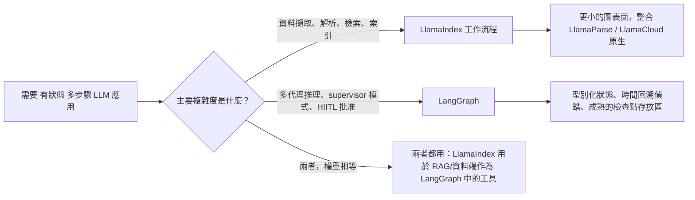

# LlamaIndex

當 LangChain 專注於「編排」時，**LlamaIndex** 是**資料驅動 AI** 的專家。它已從一個 RAG 函式庫演變為一個用於**工作流程**和**代理式資料操作**的框架。

## 目錄

- [資料框架哲學](#philosophy)
- [LlamaIndex 工作流程](#workflows)
- [進階索引：超越向量搜尋](#indexing)
- [LlamaCloud 和託管攝入](#llamacloud)
- [作為工具的代理](#agents-as-tools)
- [LlamaIndex 工作流程：事件驅動應用程式框架](#llamaindex-workflows-event-driven-application-framework)
- [面試題目](#interview-questions)
- [參考文獻](#references)

---

## 資料框架哲學

LlamaIndex 基於一個信念：**資料比模型更重要**。
- **節點**：每個資料區塊都是一個具有豐富中繼資料的「節點」（關係、摘要和父子連結）。
- **檢索器**：LlamaIndex 提供最多樣化的檢索器集（摘要、知識圖譜、樹狀結構和關鍵字）。

---

## LlamaIndex 工作流程

2024 年底，LlamaIndex 引入了**工作流程**，這是它對 LangGraph 的答案。
- **事件驅動架構**：節點透過發出 `Events` 進行通訊。
- **並發**：工作流程原生支援非同步，並且比線性鏈更好地處理大規模平行資料處理。

```python
# 概念性工作流程
class RAGWorkflow(Workflow):
    @step
    async def ingest(self, ev: StartEvent) -> RetrievalEvent:
        # 自訂邏輯...
        return RetrievalEvent(results=nodes)
```

---

## 進階索引

1. **屬性圖**：將向量區塊連結到圖形節點以進行 RAG。
2. **上下文感知切割器**：按「意義」而非「Token 數量」分組文字（使用較小的 LLM 來尋找最佳斷點）。
3. **動態路徑**：檢索器根據問題的複雜度決定*查詢哪個*索引。

---

## LlamaCloud 和託管攝入

對於企業規模，LlamaIndex 專注於 **LlamaCloud**。
- **託管攝入**：處理 PDF 解析、OCR 和表格萃取作為服務。
- **解析作為模型**：使用 Vision-LLM（Gemini 3.1 Pro、Claude Opus 4.7、GPT-5.5）來「理解」版面配置，而不是使用基於規則的解析器。

---

## 作為工具的代理

LlamaIndex 將代理視為**高階檢索器**。
- 您可以將複雜的 LlamaIndex 查詢引擎「包裝」為工具並將其提供給 LangGraph 代理。
- **好處**：代理獲得「智慧資料存取」而無需知道向量資料庫或圖形 schema 的技術細節。

---

## LlamaIndex 工作流程：事件驅動應用程式框架

2024 年的策略是「工作流程就是我們的 LangGraph」。今天的策略不同：工作流程是一個適用於任何 AI 應用程式的通用事件驅動框架，RAG 是其中一種可能的用途。`llama-index-core` 的 1.x 系列將工作流程作為主要應用程式介面，而索引/檢索器類別已移至圍繞它的整合套件（[LlamaIndex 工作流程文件](https://developers.llamaindex.ai/python/framework/understanding/workflows/)）。

### 架構上的變化

| 維度 | 工作流程前 LlamaIndex | 工作流程優先 LlamaIndex |
|-----------|--------------------------|-----------------------------------|
| 主要抽象 | 查詢引擎、聊天引擎 | 具有 `@step` 方法的 `Workflow` 類別 |
| 控制流 | 線性；巢狀查詢引擎 | 步驟消耗/發出型別 `Event` 子類別 |
| 狀態 | 引擎執行個體中的隱式 | 明確的 `Context`，具有可序列化狀態 |
| 並發 | 透過非同步查詢引擎的協作 | 一級：發出多個事件，扇出，聯結 |
| 持久性 | 無 | Context 可以是 `pickle` 的或存儲為 JSON 以便恢復 |
| 串流 | 每引擎 | 從任何步驟 `ctx.write_event_to_stream()` |
| 人在迴路中 | 手動 | `InputRequiredEvent` / `HumanResponseEvent` 模式 |

### 事件驅動思維模型

```python
from llama_index.core.workflow import (
    Workflow, step, Event, StartEvent, StopEvent, Context
)

class RetrievedEvent(Event):
    nodes: list

class JudgedEvent(Event):
    nodes: list
    keep: bool

class GraphRAG(Workflow):
    @step
    async def plan(self, ctx: Context, ev: StartEvent) -> RetrievedEvent:
        await ctx.set("query", ev.query)
        nodes = await self.retriever.aretrieve(ev.query)
        return RetrievedEvent(nodes=nodes)

    @step
    async def judge(self, ctx: Context, ev: RetrievedEvent) -> JudgedEvent:
        keep = await self.relevance_judge(ev.nodes, await ctx.get("query"))
        return JudgedEvent(nodes=ev.nodes, keep=keep)

    @step
    async def answer(self, ctx: Context, ev: JudgedEvent) -> StopEvent:
        if not ev.keep:
            return StopEvent(result="No good evidence found.")
        return StopEvent(result=await self.llm.acomplete(...))
```

這個設計產生兩個特性：

1. 引擎純粹基於**事件類型**進行分派，因此新增分支就是新增一個新的 `Event` 子類別和一個消費它的步驟。沒有中央路由器需要編輯。
2. **並發是資料驅動的**：發出三個 `RetrievedEvent` 的步驟會自動扇出三個下游 `judge` 調用，聯結步驟使用 `ctx.collect_events` 收集它們。

### 工作流程對比 LangGraph



| 維度 | LlamaIndex 工作流程 (1.x) | LangGraph (1.x) |
|-----------|----------------------------|-----------------|
| 控制流原語 | 事件分派 | 圖形節點和邊，加上型別化 reducer 狀態 |
| 狀態模型 | 自由形式的 `Context`（類字典） | 具有 reducer 的 Pydantic / TypedDict 狀態 |
| 恢復/時間回溯 | 可 pickle 的 context，基本恢復 | 一級檢查點，從任何節點分支（[LangGraph 持久性文件](https://docs.langchain.com/oss/python/langgraph/persistence)） |
| 原生整合 | LlamaParse、LlamaCloud、所有 LlamaHub 載入器 | LangSmith eval、所有 LangChain 整合 |
| 最適合複雜度 | 資料導向：解析、嵌入、檢索、優化 | 邏輯導向：規劃、執行、反思、委派 |
| 多代理幫手 | `AgentWorkflow`、函式呼叫代理（[LlamaIndex AgentWorkflow](https://developers.llamaindex.ai/python/framework/understanding/agent/multi_agent/)） | `create_supervisor`、`create_react_agent`、swarm 模式 |
| 串流 UI | `ctx.write_event_to_stream` + AG-UI 協定 | `astream_events` v2、AG-UI 協定 |

何時應選擇 LlamaIndex 工作流程而非 LangGraph：

- 艱難的部分是**資料擷取**，而不是推理。LlamaCloud、LlamaParse 和屬性圖堆疊都是原生的，不是橋接的（[LlamaCloud 概述](https://www.llamaindex.ai/llamacloud)）。
- 您想要**文件驅動的平行處理**：解析 1000 個 PDF，每個區塊扇出一個嵌入步驟，聯結到一個索引更新。
- 您在 **TypeScript** 生態系統中使用 `llama-index-ts` 並希望與 Python 核心的功能對等。

LangGraph 獲勝的情況：

- 艱難的部分是**代理控制迴圈**本身：許多代理、supervisor 模式、耐用的中斷、回放。
- 您需要**開箱即用的時間回溯偵錯**。LlamaIndex 恢復功能對崩潰恢復很好，但不像 LangGraph 檢查點那樣能從任意歷史狀態分支。
- 您已經在使用 LangSmith eval 堆疊並希望在不橋接的情況下進行追蹤級整合。

### 現實世界的姿勢

許多資深架構師同時執行兩者：LlamaIndex 工作流程用於資料平面（擷取、索引、混合檢索、重新排序）作為工具包裝，和 LangGraph 用於其上的代理控制平面。這是 [AIMultiple 框架比較](https://research.aimultiple.com/agentic-ai-frameworks/) 和 LlamaIndex 自己的[混合整合 cookbook](https://developers.llamaindex.ai/python/framework/understanding/workflows/) 中指出的模式。

如果您只為新的綠地應用程式選擇一個，問題會歸結為：**您的團隊將在資料管線還是代理編排上花費更多時間？** 答案決定框架。

---

## 面試題目

### Q：LangChain 和 LlamaIndex 現在都有「圖形/工作流程」功能。您如何選擇？

**強烈回答：**
我為**資料密集型**任務選擇 **LlamaIndex 工作流程**，其中主要複雜性在於擷取、多模態解析和複雜檢索。它的事件驅動架構在大量平行資料處理方面表現更好。我為**邏輯密集型**多代理系統選擇 **LangGraph**，其中複雜性在於「推理」和「人在迴路中」邏輯。在許多資深架構中，我們**兩者都使用**：LlamaIndex 用於 RAG 引擎，LangGraph 用於整體代理監督器。

### Q：LlamaIndex 中的「屬性圖」是什麼，為何優於基本的向量 RAG？

**強烈回答：**
屬性圖結合了向量的**語意靈活性**和資料庫的**結構精確性**。在基本 RAG 中，您可能找到關於「Alpha 專案」的區塊，但您不知道誰擁有它。在屬性圖中，向量區塊是一個節點，連結到一個 `User` 節點和一個 `Timeline` 節點。這允許**全局推理**（例如，「找出 Tom 在過去一個月寫的關於 Alpha 專案的所有文件」）。基本 RAG 可能會錯過許多相關節點，因為它們不包含確切的關鍵字「Alpha」。

---

## 參考文獻

- LlamaIndex。〈工作流程框架：事件驅動代理〉（2025）
- Jerry Liu。〈LLM 時代的資料驅動 AI〉（2024/2025）
- LlamaHub。〈1000+ 資料載入器的倉庫〉（2025）

---

*下一篇：[DSPy：程式化語言模型](05-dspy.md)*