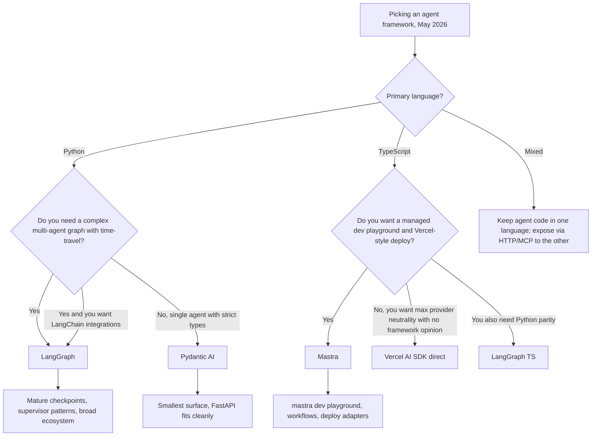

# Pydantic AI 和 Mastra：型別化代理框架（2026 年）

到 2026 年 5 月，代理框架辯論不再只是「LangGraph 或 LlamaIndex」。兩個較新的進入者在優先重視型別安全而非廣度的團隊中現在佔有重要的生產份額：**Python 世界中的 Pydantic AI** 和 **TypeScript 世界中的 Mastra**。兩者都拒絕舊框架接受的「字串輸入、字串輸出」表面，兩者都押注於完全型別化的代理比聰明但無類型的代理更容易測試、評估和操作。

## 目錄

- [這些框架是什麼](#what-these-frameworks-are)
- [Pydantic AI：Python 中的型別化代理](#pydantic-ai-typed-agents-in-python)
- [Mastra：TypeScript 優先代理](#mastra-typescript-first-agents)
- [與 LangGraph 的比較](#comparison-with-langgraph)
- [選擇框架](#choosing-a-framework)
- [生產參考](#production-references)
- [面試題目](#interview-questions)
- [參考文獻](#references)

---

## 這些框架是什麼

Pydantic AI 和 Mastra 都出於對框架鎖定和無類型提示拼接的挫敗。它們專注於同一組想法：

- 代理迴圈由**程式碼**定義，而非由 YAML / JSON 圖形定義。
- 工具呼叫、結構化輸出和人在迴路中檢查點都在**函式簽名**處型別化。
- 提供者可移植性是硬性要求：透過更改一行來將 Anthropic 換為 OpenAI 或 Google。
- 評估、追蹤和部署是一級功能，而非附加上去的。

差異主要是堆疊形狀：一個針對已經使用 Pydantic 進行 HTTP 驗證的 Python 服務；另一個針對想要 Vercel 風格開發者體驗的 Next.js / Node 團隊。

---

## Pydantic AI：Python 中的型別化代理

### 目前狀態

[Pydantic AI](https://ai.pydantic.dev/) 於 2025 年 9 月發布 v1.0，於 2026 年 4 月在 **v1.85.1** 穩定 1.x 系列，並於 **2026 年 5 月 21 日進入 v2.0 beta 循環**（[PyPI 發布歷史](https://pypi.org/project/pydantic-ai/#history)）。該函式庫由 Pydantic 背後的團隊構建，也運營 [Pydantic Logfire](https://pydantic.dev/logfire)。根據 MIT 開源。

關鍵表面區域：

- 由輸出類型和型別化工具列表參數化的 `Agent` 類別。
- 用於 Anthropic、OpenAI、Google、Mistral、Groq、Cohere、Ollama 及任何 OpenAI 相容端點的提供者適配器。
- 原生 OpenTelemetry 追蹤，匯出到 Logfire 或任何 OTLP 收集器。
- `pydantic_evals` 用於具有 LLM-judge 和程式碼評分評估器的宣告式評估套件。
- 用於明確狀態機的 `Graph` API，當簡單的 `Agent` 迴圈不夠時。

### 團隊選擇它的原因

```python
from pydantic import BaseModel, Field
from pydantic_ai import Agent, RunContext

class RefundDecision(BaseModel):
    approved: bool
    amount_cents: int = Field(ge=0)
    reason: str

agent = Agent(
    "anthropic:claude-opus-4-7",
    output_type=RefundDecision,
    system_prompt="You are a refund analyst. Approve only if policy allows.",
)

@agent.tool
async def lookup_order(ctx: RunContext, order_id: str) -> dict:
    """Look up an order by id."""
    return await ctx.deps.orders.get(order_id)

result = await agent.run("Refund order 1234", deps=DepContainer(orders=db))
assert isinstance(result.output, RefundDecision)
```

三個特性使其在生產中具有吸引力：

1. **返回類型被強制執行。** `result.output` 是 `RefundDecision` 否則呼叫失敗。沒有靜默字串漂移。
2. **工具是函式，不是字典。** Schema 在註冊時從 Python 簽名和文件字串生成，因此您不能意外地將 LLM 面對的 schema 與實現漂移。
3. **依賴注入是明確的。** `ctx.deps` 是一個型別化容器，這使得使用 mock 進行單元測試代理變得平凡。

[Pydantic AI 評估文件](https://ai.pydantic.dev/evals/) 描述了一個典型迴圈，其中相同的 Pydantic 模型用於生產 schema、LLM 輸出類型和評估評分器的 `expected_output`。

### 何時是正確選擇

- 服務是 **Python** 並且已經使用 Pydantic 進行 HTTP 驗證（FastAPI 是典型案例）。
- 您想要**端到端嚴格 schema**：HTTP 邊界、LLM 工具呼叫、LLM 輸出、資料庫列。
- 您想要**提供者可移植性**而不編寫自己的適配器層。
- 您樂意將代理迴圈編寫為命令式 Python 而不是圖形定義。

### 何時不是

- 您想要一個**宣告式圖形**用於具有 supervisor 模式的多代理協調。`Graph` API 存在但比 LangGraph 更簡陋。
- 您想要**時間回溯偵錯**並具有從任何節點分支的語義。
- 您需要 LangChain 整合生態系統的廣度（向量儲存、文件載入器等）。

---

## Mastra：TypeScript 優先代理

### 目前狀態

[Mastra](https://mastra.ai/) 由 Gatsby 背後的團隊創立（畢業於 YC W25），於 2025 年 10 月宣布由 Lightspeed 領投的 **$13M 種子輪**（[TechCrunch 報導](https://techcrunch.com/2025/10/16/mastra-typescript-agent-framework-seed/)），並於 **2026 年 1 月發布 v1.0**。截至 2026 年 5 月，GitHub 存放庫已突破 **22.3K stars**，每週 npm 下載量超過 **300K+**（[mastra-ai/mastra](https://github.com/mastra-ai/mastra)）。Mastra 根據 Elastic License v2 開源。

關鍵表面區域：

- `Agent`、`Workflow` 和 `Tool` 原語，全部作為 TypeScript 定義並具有完整推斷。
- 內建**本地開發伺服器**（`mastra dev`），帶有 playground UI、評估執行器和追蹤檢視器。
- 與 Vercel 的 **AI SDK** 緊密整合，用於串流、多步工具呼叫和提供者交換。
- 開箱即用的記憶體和 RAG，帶有 `libsql` / `pgvector` 適配器。
- 一命令部署到 **Mastra Cloud**、Vercel、Cloudflare Workers 或 Node 伺服器。

### 團隊選擇它的原因

```typescript
import { Agent } from "@mastra/core/agent";
import { createTool } from "@mastra/core/tools";
import { anthropic } from "@ai-sdk/anthropic";
import { z } from "zod";

const lookupOrder = createTool({
  id: "lookup-order",
  description: "Look up an order by id",
  inputSchema: z.object({ orderId: z.string() }),
  outputSchema: z.object({ status: z.string(), totalCents: z.number() }),
  execute: async ({ context }) => ordersDb.get(context.orderId),
});

export const refundAgent = new Agent({
  name: "refund-agent",
  model: anthropic("claude-opus-4-7"),
  instructions: "You are a refund analyst. Approve only if policy allows.",
  tools: { lookupOrder },
});
```

三個特性使其具有吸引力：

1. **端到端推斷的類型。** Zod schema 驅動工具的執行期驗證、LLM 面對的 JSON Schema，以及 `execute` 內 `context` 的 TypeScript 類型。一個真相來源。
2. **`mastra dev` 是殺手功能。** 它啟動一個本地 UI，讓您呼叫任何代理、重放任何追蹤、執行任何評估，並檢查任何工具輸入/輸出，而無需編寫前端。
3. **一等工作流程。** `createWorkflow` 定義一個型別化的步驟圖（每個步驟是一個 Mastra 工具或代理），帶有分支、暫停/恢復和人在迴路，全部類型檢查。

[Generative.inc Mastra 指南](https://generative.inc/blog/mastra-typescript-agent-framework) 描述了團隊如何在堆疊的其餘部分已經是 TypeScript 時完全用 Mastra 取代 Python 編排。

### 何時是正確選擇

- 團隊是 **TypeScript 優先** 並且應用程式的其餘部分是 Next.js / Node / Bun / Cloudflare Workers。
- 您想要 **Vercel 風格 DX**：單一 CLI、本地 playground、固執部署。
- 串流 UI 很重要，您想要依靠 AI SDK 的 `useChat` 和 `streamText` 原語。
- 您想要**暫停/恢復工作流程**，並將人類批准步驟預設連接。

### 何時不是

- 您需要**大量預建代理**或社群整合。生態系統比 LangChain 小。
- 您的團隊和大部 AI 工具是 **Python**。透過 HTTP 層將 TS 橋接到 Python 服務是可以的，但會增加延遲。
- 您需要**學術風格**的自訂推理行為（自訂解碼等）。留在 Python。

---

## 與 LangGraph 的比較

| 維度 | Pydantic AI v1.85 | Mastra（2026 年 5 月） | LangGraph 1.x |
|-----------|-------------------|---------------------|----------------|
| 語言 | Python | TypeScript | Python 和 TypeScript |
| 授權 | MIT | Elastic License v2 | MIT |
| 主要單元 | 具有 `output_type` 的型別 `Agent` | 型別 `Agent` 和 `Workflow` | 基於型別狀態的圖形節點 |
| Schema 來源 | Pydantic v2 | Zod | JSON Schema（Pydantic、Zod、Valibot、ArkType） |
| 提供者中立性 | 內建適配器 | 透過 Vercel AI SDK | 透過 LangChain 合作夥伴套件 |
| 多代理 | 手動或 `Graph` API | `Workflow` + agent-as-tool | `create_supervisor`、swarm、自訂圖形 |
| 狀態持久性 | 手動或 `pydantic_graph` 檢查點 | Workflow 快照 + 儲存適配器 | 一級檢查點存放區（Postgres、Redis、SQLite、記憶體） |
| 時間回溯偵錯 | 否 | 本地 playground 中的重放 | 是，從任何檢查點分支 |
| 評估框架 | `pydantic_evals` | Mastra 評估（內建） | LangSmith 或外部 |
| 追蹤 | OTLP / Logfire | OTLP / Mastra Cloud | LangSmith 或 OTLP |
| 耦合 | 無到 LangChain | 無到 LangChain | 與 LangChain 生態系統緊密耦合 |
| 生態系統規模 | 小但成長中 | 小但成長中 | 大（LangChain 整合） |



---

## 選擇框架

三個決策驅動因素，按權重排序：

1. **現有服務的語言。** Pydantic AI 和 LangGraph（Python）用於 Python 服務。Mastra 和 LangGraph TS 用於 TypeScript 服務。跨越邊界幾乎總是一個比選擇正確一側更糟糕的交易。
2. **複雜性的形狀。** 如果代理本質上是「LLM + 一些工具 + 嚴格輸出類型」，Pydantic AI 或 Mastra 就足夠了而且運營成本更低。如果您有許多具有分支、重試和批准的合作的代理，LangGraph 的圖形 + 檢查點模型會脫穎而出。
3. **生態系統耦合。** LangGraph 為您提供 LangChain 整合、LangSmith 評估及其餘表面。Pydantic AI 和 Mastra 為您提供更清晰的類型保證和更快的冷路徑，但您連線自己的整合。

一個有用的啟發式：如果頁面上最長的東西是工具列表，選擇 Pydantic AI 或 Mastra。如果頁面上最長的東西是狀態機，選擇 LangGraph。

---

## 生產參考

這些是截至 2026 年 5 月每個框架在認真使用中的公開參考：

- **Pydantic AI**
  - [Pydantic Logfire 儀表板](https://pydantic.dev/logfire) 本身使用 Pydantic AI 進行其內部分類代理。
  - [Sourcegraph Cody](https://sourcegraph.com/cody) 團隊有[關於使用 Pydantic AI](https://ai.pydantic.dev/) 的部落格文章，用於其伺服器端工作流程中的型別化程式碼動作代理。
  - 許多 FastAPI 商店採用它，因為相同的 Pydantic 模型為 HTTP 邊界和 LLM 輸出類型提供服務。
- **Mastra**
  - [Stripe](https://stripe.com/) 開發者體驗原型（[mastra.ai](https://mastra.ai/)）。
  - [Resend](https://resend.com/)、[Liveblocks](https://liveblocks.io/) 和 [Vercel](https://vercel.com/) 演示應用程式。
  - 種子公告（[TechCrunch](https://techcrunch.com/2025/10/16/mastra-typescript-agent-framework-seed/)）列出了金融科技和開發者工具中的生產用戶。
- **LangGraph**（供參考）
  - [LinkedIn 的 SQL Bot](https://www.linkedin.com/blog/engineering/ai/practical-text-to-sql-for-data-analytics)、[Uber 的程式設計助手](https://www.uber.com/en-IN/blog/genie-uber-genai-on-call-copilot/)、[Klarna](https://www.klarna.com/)、[Elastic](https://www.elastic.co/) AI 助手、[Replit](https://replit.com/)，以及 [LangChain 客戶頁面](https://www.langchain.com/built-with-langgraph) 上數十個更多。

---

## 面試題目

### Q：何時會為 Python 服務選擇 Pydantic AI 而非 LangGraph？

**強烈回答：**
當代理本質上是一個具有型別輸出和一些工具的 LLM，且服務的其餘部分已經是 Pydantic 形的（FastAPI、SQLModel 等）時，我會選擇 Pydantic AI。好處是相同的 Pydantic 模型定義 HTTP 回應、LLM 輸出和評估評分器的預期形狀，因此沒有 schema 漂移。當我需要具有基於檢查點的時間回溯、supervisor 模式或 LangChain 整合生態系統的真正多代理圖形時，LangGraph 值得更重的表面。我問的決定問題是設計中最複雜的部分是工具列表還是狀態機。工具列表，Pydantic AI。狀態機，LangGraph。

### Q：Mastra 是 Vercel AI SDK 的替代品嗎？

**強烈回答：**
不是。Mastra 在 Vercel AI SDK 之上構建，用於實際的提供者呼叫和串流。Mastra 添加的是**代理抽象**、**工作流程引擎**、**記憶體**、**RAG**、**評估**和 **`mastra dev` playground**。如果您只需要在 Next.js 應用程式中呼叫具有串流和工具呼叫的 LLM，AI SDK 本身就足夠了。如果您想要一個具有工作流程、暫停/恢復、記憶體和本地 playground 的型別化代理，Mastra 是為您添加這些而不強制您自己編寫它們的層。

### Q：「型別化代理框架」在生產中實際上為您購買什麼？

**強烈回答：**
三件事。首先，**更少的錯誤輸入泄漏**。LLM 面對的 schema 來自與驗證執行期有效載荷相同的 Pydantic / Zod 定義，因此如果 LLM 產生幻覺的欄位，解析步驟在任何下游程式碼執行之前拒絕它。其次，**乾淨的單元測試**。型別化工具只是一個具有 Pydantic / Zod 邊界的函式，因此我可以在沒有迴路中的任何 LLM 的情況下測試它。第三，**schema 感知評估**。評估框架可以欄位對欄位比較兩個型別化物件，而不是區分字串，這會捕獲微妙的回歸，如欄位變得可選或列舉獲得新值。

---

## 參考文獻

- Pydantic AI v1.85 發布說明：https://github.com/pydantic/pydantic-ai/releases
- Pydantic AI 文件：https://ai.pydantic.dev/
- Pydantic AI 評估：https://ai.pydantic.dev/evals/
- Mastra 存放庫：https://github.com/mastra-ai/mastra
- Mastra 文件：https://mastra.ai/
- TechCrunch，「Mastra 為 TypeScript 代理框架籌集 $13M 種子輪」（2025 年 10 月）：https://techcrunch.com/2025/10/16/mastra-typescript-agent-framework-seed/
- Generative.inc Mastra 指南：https://generative.inc/blog/mastra-typescript-agent-framework
- LangGraph 1.x 文件：https://docs.langchain.com/oss/python/langgraph/
- LangChain 「使用 LangGraph 構建」客戶列表：https://www.langchain.com/built-with-langgraph
- Vercel AI SDK：https://ai-sdk.dev/
- AIMultiple 「代理 AI 框架比較」（2026）：https://research.aimultiple.com/agentic-ai-frameworks/

---

*下一篇：請參閱[框架選擇指南](08-framework-selection-guide.md)以獲取跨框架選擇標準。*