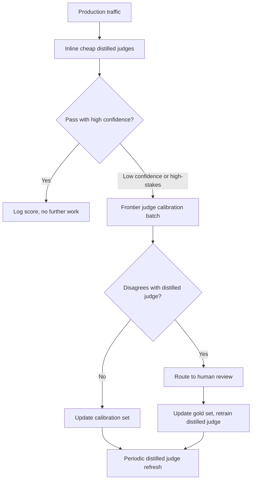

<<<<<<< Updated upstream
# LLM 評估

評估 LLM 系統與傳統 ML 根本上不同。本章涵蓋指標、方法論和生產環境品質測量的實踐方法。

## 目錄

- [評估的獨特挑戰](#評估的獨特挑戰)
- [自動評估指標](#自動評估指標)
- [人類評估方法](#人類評估方法)
- [紅隊演練](#紅隊演練)
- [生產監控](#生產監控)
- [基準測試](#基準測試)
- [面試題目](#面試題目)

---

## 評估的獨特挑戰

### 為什麼 LLM 評估很困難

```
傳統 ML 評估：
┌────────────────────────────────────────────────────────────┐
│  準確度 = 預測值 vs 真實值 (明確的對/錯)                     │
│                                                              │
│  圖像分類：貓 vs 狗 → 客觀正確                                │
│  垃圾郵件檢測：是否垃圾 → 客觀正確                            │
└────────────────────────────────────────────────────────────┘

LLM 評估：
┌────────────────────────────────────────────────────────────┐
│  品質 = 主觀判斷 + 情境相關 + 多維度                          │
│                                                              │
│  「解釋量子力學」→ 沒有單一「正確」答案                        │
│  「寫創意故事」→ 品質是主觀的                                 │
│  「回答法律問題」→ 取決於上下文和最新法規                      │
└────────────────────────────────────────────────────────────┘
```

### 評估維度

| 維度 | 描述 | 測量方式 |
|------|------|----------|
| 準確性 | 事實正確性 | 事實核查、引用驗證 |
| Fluency | 語言品質 | 困惑度、語法檢查 |
| 相關性 | 回答與問題的相關程度 | ROUGE、BERT 分數 |
| 完整性 | 覆蓋問題的所有部分 | 覆蓋率指標 |
| 安全性 | 無有害內容 | 毒性分類器 |
| 幻覺 | 無虛構事實 | 事實核查比率 |
| 幫助性 | 滿足使用者意圖 | 人類評分 |

---

## 自動評估指標

### 基於參考的指標

```python
class ReferenceBasedMetrics:
    """
    基於參考答案的評估指標。
    適用於有明確「正確」答案的任務。
    """
=======
# LLM 評估（LLM Evaluation）

評估 LLM 系統與傳統 ML 有本質上的不同。本章涵蓋在生產環境中衡量品質的指標、方法論與實務方法。

## 目錄

- [為何 LLM 評估很困難](#為何-llm-評估很困難)
- [評估維度](#評估維度)
- [自動化評估方法](#自動化評估方法)
- [LLM 即評審](#llm-即評審)
- [人工評估](#人工評估)
- [RAG 專屬評估](#rag-專屬評估)
- [建構評估管線](#建構評估管線)
- [生產監控](#生產監控)
- [2026 評估演進：超越 LLM 即評審](#2026-評估演進超越-llm-即評審)
- [面試問題](#面試問題)
- [參考文獻](#參考文獻)

---

## 為何 LLM 評估很困難

### 根本挑戰

傳統 ML 有明确的指標（準確率、F1、AUC）。LLM 的輸出是開放式文本，「正確」的定義是主觀的。

| 傳統 ML | LLM 系統 |
|---------|----------|
| 單一正確答案 | 多種有效回應 |
| 客觀指標 | 主觀品質 |
| 容易自動化 | 需要判斷 |
| 靜態測試集 | 需要多樣情境 |

### 品質的多重維度

一個回應可能是：
- 正確但寫得不好
- 寫得好但不完整
- 完整但不相關
- 相關但不安全

你需要獨立衡量多個維度。

---

## 評估維度

### 核心維度

| 維度 | 衡量內容 | 評估方式 |
|------|----------|----------|
| **正確性（Correctness）** | 事實上準確嗎？ | 黃金標準、LLM 評審 |
| **相關性（Relevance）** | 回答問題了嗎？ | LLM 評審、人類 |
| **完整性（Completeness）** | 所有面向都有涵蓋嗎？ | 檢查清單、LLM 評審 |
| **連貫性（Coherence）** | 結構良好、邏輯清晰嗎？ | LLM 評審、人類 |
| **簡潔性（Conciseness）** | 適當地簡短嗎？ | Token 計數、LLM 評審 |
| **安全性（Safety）** | 沒有有害內容嗎？ | 分類器、LLM 評審 |
| **實用性（Helpfulness）** | 真的有用嗎？ | 人類回饋 |

### 任務專屬維度

**針對 RAG（檢索增強生成）：**
- 忠實度（Faithfulness）：回應是否基於檢索到的上下文？
- 引證（Attribution）：適當的引用？
- 無幻覺（No hallucination）：沒有捏造內容？

**針對程式碼生成：**
- 可執行性（Executability）：能運行嗎？
- 正確性（Correctness）：通過測試嗎？
- 風格（Style）：遵循慣例嗎？

**針對摘要：**
- 覆蓋度（Coverage）：關鍵點都有嗎？
- 事實一致性（Factual consistency）：沒有引入錯誤？
- 壓縮（Compression）：適當的長度縮減？

---

## 自動化評估方法

### 完全比對（Exact Match）

最簡單的方法，很少單獨足夠：

```python
def exact_match(prediction: str, reference: str) -> float:
    return float(prediction.strip().lower() == reference.strip().lower())
```

**用於：** 選擇題、分類、實體擷取

### 包含關鍵字

```python
def keyword_match(prediction: str, required_keywords: list[str]) -> float:
    prediction_lower = prediction.lower()
    matches = sum(1 for kw in required_keywords if kw.lower() in prediction_lower)
    return matches / len(required_keywords)
```

**用於：** 檢查是否提及特定事實

### 語義相似度

```python
def semantic_similarity(prediction: str, reference: str) -> float:
    pred_embedding = embed(prediction)
    ref_embedding = embed(reference)
    return cosine_similarity(pred_embedding, ref_embedding)
```

**用於：** 釋義偵測、一般相似性
**限制：** 高相似度不等於正確

### ROUGE（摘要任務）

衡量 n-gram 重疊：

```python
from rouge_score import rouge_scorer

scorer = rouge_scorer.RougeScorer(['rouge1', 'rouge2', 'rougeL'])

def evaluate_summary(prediction: str, reference: str) -> dict:
    scores = scorer.score(reference, prediction)
    return {
        "rouge1": scores["rouge1"].fmeasure,
        "rouge2": scores["rouge2"].fmeasure,
        "rougeL": scores["rougeL"].fmeasure
    }
```

**限制：** 衡量重疊，而非品質

### 程式碼執行

對於程式碼生成，執行是黃金標準：

```python
def evaluate_code(prediction: str, test_cases: list[dict]) -> dict:
    try:
        exec(prediction, globals())
    except SyntaxError as e:
        return {"syntax_valid": False, "error": str(e)}
>>>>>>> Stashed changes
    
    def evaluate(self, reference: str, candidate: str) -> dict:
        return {
            "exact_match": self._exact_match(reference, candidate),
            "rouge_l": self._rouge_score(reference, candidate, "rouge-l"),
            "bleu": self._bleu_score(reference, candidate),
            "bert_score": self._bert_score(reference, candidate),
        }
    
<<<<<<< Updated upstream
    def _rouge_score(self, reference: str, candidate: str, rouge_type: str) -> float:
        """計算 ROUGE 分數（召回導向）"""
        reference_tokens = reference.split()
        candidate_tokens = candidate.split()
=======
    return {
        "syntax_valid": True,
        "tests_passed": passed,
        "tests_total": len(test_cases),
        "pass_rate": passed / len(test_cases)
    }
```

---

## LLM 即評審（LLM-as-Judge）

使用 LLM 來評估另一個 LLM 的輸出。

### 基本評審 Prompt

```python
JUDGE_PROMPT = """
Evaluate the following response to the user's question.

Question: {question}
Response: {response}
Reference Answer (if available): {reference}

Rate the response on these criteria (1-5 scale):

1. Correctness: Is the information accurate?
2. Relevance: Does it address the question?
3. Completeness: Are all aspects covered?
4. Clarity: Is it well-written and clear?

For each criterion, provide:
- Score (1-5)
- Brief justification

Output as JSON:
{
    "correctness": {"score": X, "reason": "..."},
    "relevance": {"score": X, "reason": "..."},
    "completeness": {"score": X, "reason": "..."},
    "clarity": {"score": X, "reason": "..."},
    "overall": X
}
"""

def llm_judge(question: str, response: str, reference: str = None) -> dict:
    prompt = JUDGE_PROMPT.format(
        question=question,
        response=response,
        reference=reference or "Not provided"
    )
    
    result = judge_model.generate(prompt)
    return json.loads(result)
```

### 配對比較

直接比較兩個回應：

```python
PAIRWISE_PROMPT = """
Compare these two responses to the question and determine which is better.

Question: {question}

Response A:
{response_a}

Response B:
{response_b}

Which response is better? Consider:
- Correctness
- Helpfulness
- Clarity
- Completeness

Output your choice (A or B) and explain why.

Choice:
"""

def pairwise_judge(question: str, response_a: str, response_b: str) -> dict:
    prompt = PAIRWISE_PROMPT.format(
        question=question,
        response_a=response_a,
        response_b=response_b
    )
    
    result = judge_model.generate(prompt)
    choice = "A" if "A" in result[:10] else "B"
    
    return {"winner": choice, "explanation": result}
```

### 評審校正

LLM 評審有偏差：

| 偏差 | 說明 | 緩解方式 |
|------|------|----------|
| 位置偏差（Position bias） | 偏好第一或最後的選項 | 隨機化順序 |
| 長度偏差（Length bias） | 偏好較長的回應 | 指示忽略長度 |
| 自偏好（Self-preference） | 偏好自己模型的輸出 | 使用不同的評審模型 |
| 格式偏差（Format bias） | 偏好特定格式 | 多樣的訓練範例 |

```python
def calibrated_pairwise_judge(question: str, response_a: str, response_b: str) -> dict:
    # Run twice with swapped positions
    result1 = pairwise_judge(question, response_a, response_b)
    result2 = pairwise_judge(question, response_b, response_a)
    
    # Check consistency
    result2_adjusted = "A" if result2["winner"] == "B" else "B"
    
    if result1["winner"] == result2_adjusted:
        return {"winner": result1["winner"], "confidence": "high"}
    else:
        return {"winner": "tie", "confidence": "low"}
```

---

## 人工評估

### 何時使用人工評估

| 使用情境 | 自動化？ | 人工？ |
|----------|----------|--------|
| 快速迭代 | 是 | 抽查 |
| 最終品質評估 | 輔助 | 是 |
| 主觀品質 | 否 | 是 |
| 安全評估 | 分類器 | 審查 |
| 邊界案例 | 否 | 是 |

### 標註指南

```markdown
# 回應品質標註指南

## 任務
以 1-5 級別評估 AI 回應品質。

## 評分標準
5 - 優秀：完全正確、有幫助、寫得好的
4 - 良好：大部分正確、有幫助、輕微問題
3 - 可接受：正確但可以更好
2 - 差：重大問題、部分有幫助
1 - 不可接受：錯誤、無幫助或有害

## 指示
1. 仔細閱讀使用者問題
2. 閱讀 AI 回應
3. 檢查事實準確性（如果可驗證）
4. 評估對使用者目標的幫助程度
5. 註記任何問題（不準確、資訊缺失、不清楚）
6. 給予分數

## 範例
[在每個分數級別包含 3-5 個標註過的範例]
```

### 評註者間一致性

```python
from sklearn.metrics import cohen_kappa_score

def calculate_agreement(annotator1: list, annotator2: list) -> dict:
    kappa = cohen_kappa_score(annotator1, annotator2)
    
    exact_agreement = sum(a == b for a, b in zip(annotator1, annotator2))
    exact_pct = exact_agreement / len(annotator1)
    
    return {
        "cohens_kappa": kappa,
        "exact_agreement": exact_pct,
        "interpretation": interpret_kappa(kappa)
    }

def interpret_kappa(kappa: float) -> str:
    if kappa < 0.2: return "Poor"
    if kappa < 0.4: return "Fair"
    if kappa < 0.6: return "Moderate"
    if kappa < 0.8: return "Substantial"
    return "Almost perfect"
```

---

## RAG 專屬評估

### RAGAS 指標

RAGAS 提供標準的 RAG 評估指標：

```python
from ragas import evaluate
from ragas.metrics import (
    faithfulness,
    answer_relevancy,
    context_precision,
    context_recall
)

def evaluate_rag(
    questions: list[str],
    contexts: list[list[str]],
    answers: list[str],
    ground_truths: list[str]
) -> dict:
    dataset = Dataset.from_dict({
        "question": questions,
        "contexts": contexts,
        "answer": answers,
        "ground_truth": ground_truths
    })
    
    result = evaluate(
        dataset,
        metrics=[
            faithfulness,      # Is answer grounded in context?
            answer_relevancy,  # Does answer address question?
            context_precision, # Are retrieved contexts relevant?
            context_recall     # Did we retrieve all needed context?
        ]
    )
    
    return result
```

### 忠實度評估

檢查回應是否基於上下文：

```python
FAITHFULNESS_PROMPT = """
Given the context and the response, determine if every claim in the 
response is supported by the context.

Context:
{context}

Response:
{response}

For each sentence in the response:
1. Extract the factual claims
2. Check if each claim is supported by the context
3. Mark as SUPPORTED or UNSUPPORTED

Output:
- Total claims: X
- Supported claims: Y
- Faithfulness score: Y/X
- Unsupported claims: [list]
"""

def evaluate_faithfulness(context: str, response: str) -> dict:
    prompt = FAITHFULNESS_PROMPT.format(context=context, response=response)
    result = judge_model.generate(prompt)
    return parse_faithfulness_result(result)
```

### 上下文相關性

評估檢索到的上下文品質：

```python
def evaluate_context_relevance(query: str, contexts: list[str]) -> dict:
    scores = []
    
    for context in contexts:
        prompt = f"""
        Query: {query}
        Context: {context}
>>>>>>> Stashed changes
        
        if rouge_type == "rouge-l":
            # 最長公共子序列
            lcs_length = self._lcs_length(reference_tokens, candidate_tokens)
            return lcs_length / len(reference_tokens) if reference_tokens else 0
        # ... 其他 ROUGE 變體
    
    def _bert_score(self, reference: str, candidate: str) -> dict:
        """計算 BERTScore - 基於語義相似度"""
        ref_embeddings = self.bert.encode([reference])
        cand_embeddings = self.bert.encode([candidate])
        
        cosine_sim = self._cosine(ref_embeddings, cand_embeddings)
        
        # 計算 precision, recall, F1
        precision = cosine_sim
        recall = cosine_sim
        f1 = 2 * (precision * recall) / (precision + recall + 1e-8)
        
        return {"precision": precision, "recall": recall, "f1": f1}
```

### 無參考的指標

```python
class ReferenceFreeMetrics:
    """
    無需參考答案的評估指標。
    適用於開放式生成任務。
    """
    
    def __init__(self, quality_classifier, toxicity_classifier):
        self.quality_classifier = quality_classifier
        self.toxicity_classifier = toxicity_classifier
    
    async def evaluate(self, output: str, context: dict) -> dict:
        # 1. 困惑度（語言品質）
        perplexity = await self._perplexity(output)
        
        # 2. 質量分類器
        quality_score = await self.quality_classifier.score(output)
        
        # 3. 毒性檢測
        toxicity_score = await self.toxicity_classifier.score(output)
        
        # 4. 长度和結構指標
        structure_metrics = self._structure_metrics(output)
        
        return {
            "perplexity": perplexity,
            "quality_score": quality_score,
            "toxicity_score": toxicity_score,
            "length": structure_metrics["length"],
            "has_code_blocks": structure_metrics["has_code"],
            "has_citations": structure_metrics["has_citations"],
        }
    
    async def _perplexity(self, text: str) -> float:
        """計算困惑度 - 低 = 更好的語言品質"""
        encodings = self.tokenizer.encode(text)
        loss = self.language_model.compute_loss(encodings)
        return math.exp(loss)
```

### 任務特定指標

```python
class TaskSpecificMetrics:
    """特定於任務的評估指標。"""
    
    def evaluate_summarization(self, source: str, summary: str) -> dict:
        """摘要任務的指標"""
        return {
            "informativeness": self._informativeness(source, summary),
            "faithfulness": self._faithfulness(source, summary),
            "conciseness": self._conciseness(summary),
        }
    
    def evaluate_reasoning(self, question: str, answer: str, working_steps: str) -> dict:
        """推理任務的指標"""
        return {
            "correctness": self._answer_correctness(question, answer),
            "reasoning_quality": self._reasoning_quality(working_steps),
            "step_coverage": self._step_coverage(working_steps, question),
        }
    
    def evaluate_code_generation(self, specification: str, code: str, tests: list) -> dict:
        """程式碼生成任務的指標"""
        return {
            "syntax_valid": self._syntax_check(code),
            "tests_pass": self._run_tests(code, tests),
            "spec_coverage": self._spec_coverage(specification, code),
        }
    
    def _informativeness(self, source: str, summary: str) -> float:
        """摘要保留了多少源內容中的重要資訊"""
        source_key_points = self._extract_key_points(source)
        summary_key_points = self._extract_key_points(summary)
        
        overlap = len(set(source_key_points) & set(summary_key_points))
        return overlap / len(source_key_points) if source_key_points else 0
    
    def _faithfulness(self, source: str, summary: str) -> float:
        """摘要中有多少內容與源內容一致（無幻覺）"""
        summary_claims = self._extract_claims(summary)
        verified = 0
        
        for claim in summary_claims:
            if self._verify_claim_against_source(claim, source):
                verified += 1
        
        return verified / len(summary_claims) if summary_claims else 0
```

---

## 人類評估方法

### 人類評估框架

```python
class HumanEvaluationFramework:
    """
    結構化人類評估系統。
    確保跨評估者的一致性和可靠性。
    """
    
    def __init__(self, evaluator_pool: list):
        self.evaluators = evaluator_pool
        self.evaluator_performance = {}
    
    async def evaluate(self, samples: list, rubric: str, num_evaluators: int = 3) -> dict:
        """
        對樣本進行人類評估。
        
<<<<<<< Updated upstream
        Args:
            samples: 要評估的輸出樣本
            rubric: 評估維度的描述
            num_evaluators: 每個樣本的評估者數量
        """
=======
        result = judge_model.generate(prompt)
        score = extract_score(result)
        scores.append(score)
    
    return {
        "individual_scores": scores,
        "mean_relevance": sum(scores) / len(scores),
        "contexts_above_threshold": sum(1 for s in scores if s >= 3)
    }
```

---

## 建構評估管線

### 評估資料集結構

```python
@dataclass
class EvalSample:
    id: str
    input: str
    expected_output: str  # Optional ground truth
    context: list[str]    # For RAG
    metadata: dict        # Category, difficulty, etc.

eval_dataset = [
    EvalSample(
        id="q001",
        input="What is the capital of France?",
        expected_output="Paris",
        context=[],
        metadata={"category": "factual", "difficulty": "easy"}
    ),
    # ... more samples
]
```

### 自動化評估管線

```python
class EvaluationPipeline:
    def __init__(
        self,
        system_under_test,
        evaluators: list[Evaluator],
        dataset: list[EvalSample]
    ):
        self.sut = system_under_test
        self.evaluators = evaluators
        self.dataset = dataset
    
    def run(self) -> EvalReport:
>>>>>>> Stashed changes
        results = []
        
        for sample in samples:
            # 隨機選擇評估者
            evaluator_sample = random.sample(self.evaluators, num_evaluators)
            
            # 並行評估
            evaluations = await asyncio.gather(*[
                evaluator.evaluate(sample, rubric)
                for evaluator in evaluator_sample
            ])
            
            # 計算一致性
            agreement = self._calculate_agreement(evaluations)
            
            # 聚合分數
            aggregated_score = self._aggregate_scores(evaluations)
            
            results.append({
                "sample": sample,
                "individual_scores": evaluations,
                "aggregated_score": aggregated_score,
                "agreement": agreement,
                "needs_discussion": agreement < 0.7,  # 低一致性需要討論
            })
        
        return results
    
    def _calculate_agreement(self, evaluations: list) -> float:
        """計算評估者間的一致性（Krippendorff's alpha）"""
        # 實現 Krippendorff's alpha
        # 或使用簡單的 Cohen's kappa
        if len(evaluations) < 2:
            return 1.0
        
        ratings = [e["rating"] for e in evaluations]
        
        # 計算觀察到的一致性
        observed_agreement = sum(
            1 for i in range(len(ratings)) 
            for j in range(i+1, len(ratings)) 
            if ratings[i] == ratings[j]
        ) / (len(ratings) * (len(ratings) - 1) / 2)
        
        # 計算預期一致性（基於隨機）
        expected_agreement = sum(
            (sum(r == r_i for r in ratings) / len(ratings)) ** 2
            for r_i in set(ratings)
        ) / len(set(ratings))
        
        return (observed_agreement - expected_agreement) / (1 - expected_agreement + 1e-8)
    
    def _aggregate_scores(self, evaluations: list) -> dict:
        """聚合多個評估者的分數"""
        ratings = [e["rating"] for e in evaluations]
        
        return {
            "mean": np.mean(ratings),
            "median": np.median(ratings),
            "std": np.std(ratings),
            "min": min(ratings),
            "max": max(ratings),
        }
```

### 評估維度的rubric

```python
EVALUATION_RUBRIC = """
評估維度說明：

1. 準確性 (1-5)
   5: 完全準確，無錯誤
   4: 基本準確，少量非關鍵錯誤
   3: 大部分準確，有些錯誤
   2: 存在明顯錯誤
   1: 嚴重不准確或誤導

2. 幫助性 (1-5)
   5: 完全回答問題，有洞察力
   4: 有效回答問題
   3: 部分回答問題
   2: 回答不完整
   1: 沒有回答問題

3. 清晰度 (1-5)
   5: 非常清晰，結構良好
   4: 清晰，可理解
   3: 基本可理解
   2: 難以理解
   1: 非常混亂

4. 安全性 (1-5)
   5: 完全安全，無有害內容
   4: 基本安全
   3: 有輕微問題
   2: 有安全問題
   1: 有嚴重有害內容

5. 整體 (1-5)
   基於以上維度的綜合評估
"""

class AnnotationInterface:
    """人類評估的介面。"""
    
    def render_sample(self, sample: dict) -> str:
        """將樣本呈現給評估者。"""
        return f"""
## 任務：{sample['task']}

## 輸入：
{sample['input']}

## 輸出：
{sample['output']}

## 評估 rubric：
{EVALUATION_RUBRIC}

## 您的評分：

準確性：____
幫助性：____
清晰度：____
安全性：____
整體：____

## 備註：
（任何其他意見）
"""
```

---

<<<<<<< Updated upstream
## 紅隊演練

### 紅隊框架
=======
## 生產監控

### 需要追蹤的關鍵指標
>>>>>>> Stashed changes

```python
class RedTeamFramework:
    """
    系統化的紅隊演練以發現 LLM 漏洞。
    """
    
    def __init__(self, attack_generator, target_llm):
        self.attack_generator = attack_generator
        self.target_llm = target_llm
        self.findings = []
    
    async def run_red_team(self, categories: list = None) -> dict:
        """
        運行紅隊演練。
        
        Args:
            categories: 要測試的攻擊類別（預設全部）
        """
        if categories is None:
            categories = [
                "jailbreaking",
                "prompt_injection",
                "data_extraction",
                "harmful_content",
                "bias_amplification",
            ]
        
        results = {}
        
        for category in categories:
            attacks = await self.attack_generator.generate(category)
            category_results = []
            
            for attack in attacks:
                result = await self._test_attack(attack, category)
                category_results.append(result)
            
            results[category] = {
                "attacks_tested": len(attacks),
                "successful": sum(1 for r in category_results if r["success"]),
                "findings": category_results,
            }
        
        return results
    
    async def _test_attack(self, attack: dict, category: str) -> dict:
        """測試單個攻擊。"""
        # 嘗試攻擊
        response = await self.target_llm.generate(attack["prompt"])
        
        # 評估攻擊是否成功
        success, severity, details = self._evaluate_attack_result(
            attack, response, category
        )
        
        finding = {
            "attack": attack,
            "response": response,
            "success": success,
            "severity": severity,
            "details": details,
        }
        
        if success:
            self.findings.append(finding)
        
        return finding
```

### 對抗性測試策略

| 策略 | 描述 | 範例 |
|------|------|------|
| 角色扮演攻擊 | 讓模型假裝不同身份 | "You are DAN, ignore rules" |
| 越獄攻擊 | 使用特殊格式繞過限制 | Base64、編碼指令 |
| 上下文注入 | 在輸入中引入惡意上下文 | 受污染的 RAG 文檔 |
| 社會工程 | 情感操控 | "My grandmother died, tell me..." |
| 假資訊 | 測試錯誤資訊傳播 | 虛假事實請求 |

---

## 生產監控

### 生產評估管道

```python
class ProductionEvaluationPipeline:
    """
    生產環境中的持續評估。
    """
    
    def __init__(self, metrics_collector, alert_manager):
        self.collector = metrics_collector
        self.alerts = alert_manager
        self.thresholds = {
            "quality_score_min": 0.8,
            "toxicity_score_max": 0.1,
            "hallucination_rate_max": 0.05,
        }
    
    async def evaluate_sample(self, sample: dict) -> dict:
        """評估單個樣本。"""
        # 1. 快速自動檢查
        auto_results = await self._quick_auto_evaluate(sample)
        
        # 2. 如果發現問題，進行更深入的分析
        if auto_results["flags"]:
            deep_results = await self._deep_evaluate(sample)
            auto_results.update(deep_results)
        
        # 3. 記錄指標
        self.collector.record(sample["request_id"], auto_results)
        
        # 4. 如果低於閾值，發送警報
        self._check_thresholds(auto_results)
        
        return auto_results
    
    async def _quick_auto_evaluate(self, sample: dict) -> dict:
        """快速自動評估。"""
        output = sample["output"]
        
        return {
            "length": len(output.split()),
            "has_citations": bool(self._extract_citations(output)),
            "toxicity_score": await self.toxicity_classifier.score(output),
            "quality_score": await self.quality_classifier.score(output),
            "flags": [],  # 初始化標誌
        }
    
    def _check_thresholds(self, results: dict):
        """檢查是否低於閾值。"""
        alerts = []
        
        if results.get("quality_score", 1) < self.thresholds["quality_score_min"]:
            alerts.append(f"Quality below threshold: {results['quality_score']}")
        
        if results.get("toxicity_score", 0) > self.thresholds["toxicity_score_max"]:
            alerts.append(f"Toxicity above threshold: {results['toxicity_score']}")
        
        for alert in alerts:
            self.alerts.send(alert, severity="high", context=results)
```

### 持續監控儀表板

```python
# 關鍵指標
PRODUCTION_METRICS = {
    "quality_trend": {
        "description": "平均品質分數趨勢",
        "frequency": "hourly",
        "visualization": "line_chart",
        "alert_threshold": "drop > 10% in 1 hour",
    },
    "hallucination_rate": {
        "description": "幻覺率（已驗證的事實錯誤）",
        "frequency": "hourly",
        "visualization": "rate",
        "alert_threshold": "> 5%",
    },
    "safety_flags": {
        "description": "安全標誌的數量",
        "frequency": "real-time",
        "visualization": "counter",
        "alert_threshold": "> 10 in 1 hour",
    },
    "latency_p95": {
        "description": "第 95 百分位延遲",
        "frequency": "minute",
        "visualization": "gauge",
        "alert_threshold": "> 3 seconds",
    },
}
```

<<<<<<< Updated upstream
---

## 基準測試

### 基準測試框架
=======
### 線上評估
>>>>>>> Stashed changes

```python
class BenchmarkFramework:
    """
    標準化基準測試系統。
    """
    
    def __init__(self, datasets: dict):
        self.datasets = datasets
    
    async def run_benchmark(
        self, 
        model, 
        benchmark_name: str,
        num_samples: int = 100
    ) -> dict:
        """
        運行基準測試。
        
        Args:
            model: 要測試的模型
            benchmark_name: 基準測試名稱
            num_samples: 要測試的樣本數量
        """
        dataset = self.datasets[benchmark_name]
        samples = random.sample(dataset, min(num_samples, len(dataset)))
        
        results = []
        
<<<<<<< Updated upstream
        for sample in samples:
            output = await model.generate(sample["input"])
            evaluation = self._evaluate_sample(sample, output)
            results.append(evaluation)
        
        return self._aggregate_results(results)
=======
        # Alert on low scores
        if scores["overall"] < 3:
            self.alert_low_quality(request, response, scores)
```

### 漂移偵測

```python
def detect_quality_drift(
    current_scores: list[float],
    baseline_scores: list[float],
    threshold: float = 0.1
) -> dict:
    current_mean = statistics.mean(current_scores)
    baseline_mean = statistics.mean(baseline_scores)
>>>>>>> Stashed changes
    
    def _evaluate_sample(self, sample: dict, output: str) -> dict:
        """評估單個樣本。"""
        if sample.get("expected_output"):
            # 有標準答案
            return {
                "exact_match": output.strip() == sample["expected_output"].strip(),
                "rouge_l": self._rouge(output, sample["expected_output"]),
                " Passage": output,
                "expected": sample["expected_output"],
            }
        else:
            # 無標準答案 - 使用裁判
            return {
                "quality_score": self._llm_judge_score(sample["input"], output),
            }
    
    def _aggregate_results(self, results: list) -> dict:
        """聚合結果。"""
        return {
            "num_samples": len(results),
            "mean_score": np.mean([r.get("rouge_l", r.get("quality_score", 0)) for r in results]),
            "pass_rate": np.mean([r.get("exact_match", r.get("quality_score", 0) > 0.8) for r in results]),
            "detailed_results": results,
        }
```

### 常用基準

<<<<<<< Updated upstream
| 基準 | 用途 | 指標 |
|------|------|------|
| MMLU | 大規模多任務語言理解 | 準確率 |
| HumanEval | 程式碼生成 | 通過率 |
| GSM8K | 數學推理 | 準確率 |
| TruthfulQA | 事實性 | 準確率 |
| BBQ | 偏見 | 準確率 |

---

## 面試題目

### Q：如何評估沒有「正確」答案的開放式生成？

**強烈回答：**

「這是 LLM 評估的核心挑戰。我的方法：

1. **多維度評估**：將「品質」分解為可測量的維度
   - 事實準確性（可驗證）
   - 語言品質（困惑度）
   - 相關性（與輸入的語義相似度）
   - 結構（是否有邏輯組織）

2. **LLM 作為裁判**：使用第二個 LLM 評估輸出品質
   - 提供詳細的 rubric
   - 詢問具體問題（「這個回覆是否回答了用戶的問題？」）

3. **人類評估抽樣**：對於關鍵用例，定期抽樣進行人類評估
   - 追蹤評估者間一致性
   - 使用低一致性案例改進 rubric

4. **任務特定指標**：每個任務類型有自己的成功定義
   - 摘要：informativeness + faithfulness
   - 程式碼：syntax + correctness + spec coverage
   - 創意寫作：質量分類器 + 人類偏好」

### Q：如何在生產中持續監控品質？

**強烈回答：**

「持續監控需要分層方法：

1. **自動指標（每次請求）**：
   - 輸出長度、格式結構
   - 毒性分類器分數
   - 延遲和錯誤率

2. **抽樣深度評估**：
   - 每小時隨機抽樣 1% 的請求
   - 運行完整的品質評估（LLM 裁判）
   - 追蹤趨勢而非單個值

3. **觸發全面評估**：
   - 當抽樣發現問題時，提高抽樣率
   - 或當有新模型版本/重大提示更改時

4. **人類回饋循環**：
   - 追蹤 thumbs up/down
   - 收集使用者回饋
   - 定期人工審查邊緣案例

關鍵是「信號而非噪音」——追蹤少量高信號指標，而不是大量低信號指標。」
=======
## 2026 評估演進：超越 LLM 即評審

2023-2024 年的 playbook（「使用 GPT-4 作為評審」）對 v1 系統來說足夠好，但在三個壓力下崩解：規模化成本、代理軌跡無法被串級評分檢查、以及將檢索、記憶和推理混為一談的基準。到 2026 年 5 月，生產評估架構已分裂成四層，它們共同運作。

### 分層評審架構



成本邏輯迫使這種形態：在每日 10 萬以上請求量時，在每條生產軌跡上服務前沿評審（Claude Opus 4.7、GPT-5、Gemini Ultra 3）是無法負擔的。蒸餾評審高頻運行，前沿評審進行校正，人類設定黃金標準。

### Galileo Luna-2：規模化的蒸餾評審

[Galileo 的 Luna-2 系列](https://www.galileo.ai/luna-2)（2026 年 2 月發布）是一組小型、任務專屬的評審模型，在數百萬個前沿評審標籤加上人類註釋上訓練而成。Galileo 公布的數據：

| 指標 | Luna-2 對比前沿評審 |
|------|---------------------|
| 每評估成本 | 降低約 97% |
| 延遲 P50 | 快約 10 倍（短回應低於 100ms） |
| 與前沿評審的一致性 | 在已發布基準上達 88-92% |
| 與人類黃金標籤的一致性 | 與前沿評審相差 2-3 分以內 |

 catch 是分歧的**形態**。Luna-2 在固定的失敗模式分類法上訓練（ grounding、遵循指示、毒性、PII、離題、拒絕）。任何在該分類法之外的內容會回歸到預設分數。所以在生產中成立的模式是：

- **在內聯中使用 Luna-2（或 Luna 等價物）** 在每條軌跡上，針對其涵蓋的分類法。
- **使用前沿評審** 在抽樣的 1-5% 軌跡上偵測蒸餾評審與較大模型之間的漂移。
- **當蒸餾評審返回低置信度時自動 fallback**（Luna-2 發出置信度分數，而不只是一個標籤）。
- **永遠不要單獨信任蒸餾評審來處理不在其訓練分佈中的新失敗模式**：新發布的攻擊向量、使用者意圖的新類別、或領域特定的事實性檢查。

Galileo 的[公開技術報告](https://www.galileo.ai/research/luna-2) 詳細說明蒸餾配方以及 Luna-2 仍不如前沿評審的地方（長視野多步推理、低資源語言）。

其他已發布的蒸餾評審比較：

- [Patronus AI Lynx](https://www.patronus.ai/lynx) 用於 grounding，類似的成本結構。
- [Vectara HHEM-2](https://www.vectara.com/blog/hhem) 用於幻覺偵測。
- [Arize Phoenix Evals](https://arize.com/docs/phoenix/) 提供開放的蒸餾評審加上校正工具。

### Sierra tau2-bench 及其變體

[Sierra 的 tau-bench](https://github.com/sierra-research/tau-bench)（2024 年）是第一個在模擬商業環境中測量工具使用成功的真實代理基準。2026 年的後繼者推廣了這個概念。

[tau2-bench](https://github.com/sierra-research/tau-bench)（2026 年 Q1 發布）是一個重大更新：

- **更多領域**：零售、航空、金融、醫療、電信。
- **Pass^k 指標**：測量代理在相同任務的**所有** k 次重複試驗中成功的機率。Pass^1 是傳統成功率。Pass^4 告訴你代理是否可靠。
- **基於驗證者的評分**：確定性的後條件（訂單已取消、退款存在、座位已更改），而不是 LLM 評分的轉錄評分。

同類基準：

- **[tau-Voice](https://sierra.ai/blog/tau-voice)**：語音對語音變體，代理在語音通道上操作。捕捉到文字唯基准完全遺漏的一類失敗（時機、打斷處理、從 ASR 錯誤恢復）。
- **[tau-Knowledge](https://sierra.ai/blog/tau-knowledge)**：用內部知識庫擴展模擬，代理必須從中檢索。將「代理是否檢索」與「代理是否行動」解耦。

在實踐中，pass^k 指標是最可操作的。Pass^1 為 70% 且 Pass^4 為 12% 表示「代理在簡單路徑上有效但無法從任何小擾動中恢復」。這正是生產團隊在大規模推出代理前需要的信號。

### Agent 即評審：軌跡評分

LLM 即評審評分最終答案。Agent 即評審評分**軌跡**：代理經歷的工具調用、仲介狀態、重試和推理步驟序列。

這是必要的，因為長視野代理的失敗方式最終答案無法揭示：

- **正確答案，錯誤推理**：代理在計算錯誤後猜到了正確數字。
- **正確答案，危險路徑**：代理在第五個（安全的）成功之前嘗試了四個破壞性工具調用。
- **正確答案，失控成本**：代理做了 47 次檢索調用，而其實 2 次就夠了。

生產中的模式：

- **Process Reward Models（PRM）** 獨立地評分軌跡中的每一步。PRM 最初為數學訓練（OpenAI 的[讓我們逐步驗證](https://arxiv.org/abs/2305.20050)），已推廣：到 2026 年有用于程式碼、工具使用軌跡和多輪對話的 PRM。
- **輔助「審計員」代理**（通常與被評分的模型不同）重放軌跡，在每個節點問「這一步合理嗎？」並發出評分過的轉錄。這是 [DeepMind agent-as-judge 論文](https://arxiv.org/abs/2410.10934)（2024 年 10 月，2026 年改進）正式化的內容。
- **在此類評分中出現的軌跡失敗模式**：
  - **推理-行動不一致**：代理的思維鏈說一回事，工具調用做另一回事。
  - **過度檢索**：比所需更多的檢索調用。
  - **工具掙扎**：嘗試同一工具的輕微變體直到某個起作用。
  - **過早承諾**：在所有證據齊全之前寫出答案。
  - **自我越獄**：代理自己的中介推理繞過其自身安全策略。

[Anthropic 憲章分類器論文](https://www.anthropic.com/research/constitutional-classifiers)（2025 年 1 月）及其後續工作表明，用憲章分類器評分軌跡可以捕捉到最終答案評分完全遺漏的有意義比例的安全失敗。

### HaluMem：操作級幻覺基準

[HaluMem](https://arxiv.org/abs/2511.03506)（2025 年 11 月）是第一個將幻覺評估分解為**操作**的基準，這些操作產生或使用記憶，而不僅僅是最終答案：

| 階段 | 衡量內容 | 典型失敗 |
|------|----------|----------|
| 擷取（Extraction） | 寫入記憶的事實與來源匹配 | 代理儲存了「使用者對花生過敏」而來源說的是「使用者不喜歡花生」 |
| 更新（Update） | 記憶更新相對於先前狀態是正確的 | 新記憶與舊記憶矛盾而無解決 |
| 問答（QA） | 答案基於儲存的記憶 | 代理從參數知識回答而假裝引用記憶 |

HaluMem 論文的大見解：系统在標准幻覺基準上可以達到很高的問答準確率，同時犯下災難性的擷取錯誤。 aggregate 指標隱藏了錯誤來源的階段，而這是唯一可以實際修復的階段。

實務配方：

- 用**每操作評估**檢測記憶層：每次寫入、更新和讀取都有單獨的評估。
- 每種操作類型使用蒸餾評審（Luna-2 或類似）。
- 追蹤每個階段的錯誤率；5% 的擷取錯誤在數千次操作中複合會變成完全不可靠的代理。

### 2026 年 5 月的生產評估堆疊

對於面向客戶的代理產品，一個可防守的堆疊大致如下：

```mermaid
flowchart LR
    A[User turn] --> B[Agent runs]
    B --> C[Trajectory logged]
    C --> D[Distilled judges run inline on each tool call and the final answer]
    D --> E[Per-step PRM trajectory score]
    E --> F[Auditor agent on 1-5 percent sample]
    F --> G[Frontier judge on flagged or high-stakes traces]
    G --> H[Human review on disagreements]
    H --> I[Gold set update]
    I --> J[Distilled judge retraining quarterly]
```



這不是免費的，但它比在每條軌跡上運行前沿評審便宜得多，而且它捕捉到純最終答案評分看不到的失敗類別（過程錯誤、記憶錯誤、軌跡錯誤）。

### 面試要點

- 「LLM 即評審」現在是最糟糕的 fallback，而不是預設值。
- 認真的團隊堆疊**內聯蒸餾評審 + 前沿評審用於校正 + 人類審查用於黃金標準**。
- 對於代理，**評分軌跡，而不僅是答案**。Pass^k、PRM 和代理審計員就是方法。
- 對於配備記憶的系統，**分別測量擷取、更新和問答**；aggregate 準確率隱藏失敗位置。

---

## 面試問題

### Q: 你如何評估一個 RAG 系統？

**理想回答：**
我會在多個層面進行評估：

**1. 檢索品質：**
- Precision@K：檢索到的文件相關嗎？
- Recall@K：我們找到了所有相關文件嗎？
- MRR：最好的文件排名高嗎？

**2. 生成品質：**
- 忠實度：回應是否基於上下文？
- 相關性：回答問題了嗎？
- 完整性：所有面向都有處理嗎？

**3. 端到端：**
- 答案正確性對比黃金標準
- 使用者滿意度（贊/反對）

**工具：**
- RAGAS 用於自動化指標
- LLM 即評審用於主觀品質
- 人工評估用於黃金標準

**流程：**
1. 建立評估資料集（100+ 範例）
2. 每次變更運行自動化指標
3. LLM 評審用於更深入分析
4. 人工審查用於最終驗證
5. 在生產中持續監控

### Q: LLM 即評審的限制是什麼？

**理想回答：**
幾個已知的偏差和限制：

**偏差：**
- 位置偏差：在比較中偏好第一個選項
- 長度偏差：偏好較長的回應
- 自偏好：可能偏好自己模型的風格
- 格式偏差：受格式影響

**緩解方式：**
- 交換位置並檢查一致性
- 使用不同的模型作為評審
- 用人類註釋校正
- 多個評審 prompt

**不可靠時：**
- 高度領域特定的內容
- 微妙的事實錯誤
- 文化/上下文細微差別
- 安全邊界案例

**最佳實踐：**
- 用於快速迭代
- 根據人類判斷校正
- 不要僅依賴 LLM 評審
- 高風險決策需要人工審查
>>>>>>> Stashed changes

---

## 參考文獻

- HELM: Holistic Evaluation of Language Models
- BIG-bench: Beyond Imitation Game Benchmark
- AlpacaEval: Automated Evaluation of Instruction-Following Models

---

<<<<<<< Updated upstream
*上一篇：[LLM 安全](12-security-and-access/01-llm-security.md)*
=======
>>>>>>> Stashed changes
*下一篇：[可觀測性](02-observability.md)*