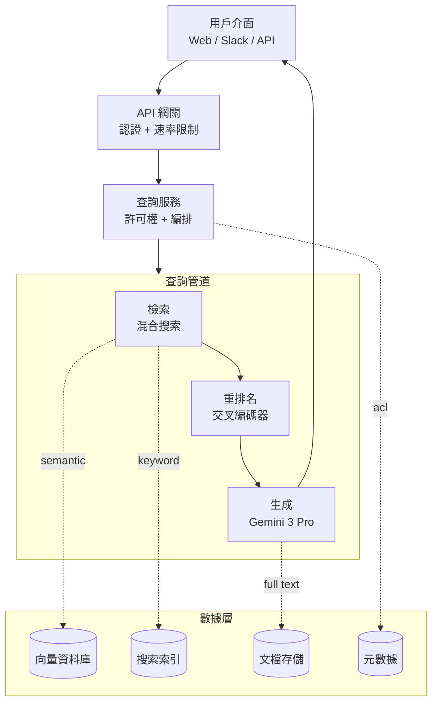

# 案例研究：企業 RAG 系統

本案例研究逐步介紹為企業文檔搜索設計生產 RAG 系統。它涵蓋需求收集、架構決策和實施細節。

## 目錄

- [問題陳述](#問題陳述)
- [需求分析](#需求分析)
- [系統架構](#系統架構)
- [組件深度解析](#組件深度解析)
- [擴展考量](#擴展考量)
- [成本分析](#成本分析)
- [經驗教訓](#經驗教訓)
- [面試演練](#面試演練)

---

## 問題陳述

### 場景

一家金融服務公司想要為其內部文檔構建 AI 驅動的搜索系統：
- 500,000 份文檔（政策、程序、研究報告）
- 5,000 名員工跨多個部門
- 文檔每日更新
- 嚴格的合規和審計要求
- 需要用引用來源回答問題

### 當前痛點

- 員工每天花費 2+ 小時搜索資訊
- 關鍵字搜索返回太多不相關的結果
- 知識跨部門孤立
- 新員工需要數月才能提高生產力

---

## 需求分析

### 功能需求

| 需求 | 優先級 | 備註 |
|-------------|----------|-------|
| 自然語言問答 | P0 | 核心功能 |
| 來源引用 | P0 | 合規要求 |
| 多文檔推理 | P1 | 跨文檔連接資訊 |
| 跟進問題 | P1 | 對話上下文 |
| 文檔摘要 | P2 | 快速概覽長文檔 |

### 非功能需求

| 需求 | 目標 | 理由 |
|-------------|--------|-----------|
| 延遲 (P95) | < 5 秒 | 用戶體驗 |
| 準確率 | > 90% | 信任和採用 |
| 可用性 | 99.9% | 業務關鍵 |
| 併發用戶 | 500 | 峰值使用 |
| 文檔新鮮度 | < 1 小時 | 政策更新 |

### 安全需求

- 基於角色的訪問控制 (RBAC)
- 所有查詢的審計日誌記錄
- 無數據離開公司網路
- PII 檢測和處理

---

## 系統架構

### 高層架構

```
┌─────────────────────────────────────────────────────────────────────────┐
│                           用戶介面                                        │
│  (Web 應用、Slack 機器人、API)                                           │
└─────────────────────────────┬───────────────────────────────────────────┘
                              │
                              ▼
┌─────────────────────────────────────────────────────────────────────────┐
│                          API 網關                                        │
│  • 身份驗證    • 速率限制    • 請求路由                                  │
└─────────────────────────────┬───────────────────────────────────────────┘
                              │
                              ▼
┌─────────────────────────────────────────────────────────────────────────┐
│                        查詢服務                                          │
│  • 查詢理解   • 許可權檢查   • 編排                                      │
└─────────────────────────────┬───────────────────────────────────────────┘
                              │
        ┌─────────────────────┼─────────────────────┐
        │                     │                     │
        ▼                     ▼                     ▼
┌───────────────┐   ┌───────────────┐   ┌───────────────┐
│   檢索        │   │   重排名      │   │   生成        │
│   服務        │   │   服務        │   │   服務        │
│               │   │               │   │               │
│ • 混合        │   │ • 交叉        │   │ • LLM         │
│   搜索        │   │   編碼器      │   │ • 提示        │
│ • 過濾        │   │ • 評分        │   │   構建        │
└───────┬───────┘   └───────────────┘   └───────────────┘
        │
        ▼
┌─────────────────────────────────────────────────────────────────────────┐
│                        數據層                                           │
│                                                                         │
│  ┌─────────────┐  ┌─────────────┐  ┌─────────────┐  ┌─────────────┐   │
│  │  向量資料庫  │  │  搜索索引   │  │  文檔存儲   │  │   元數據    │   │
│  │  (Qdrant)   │  │ (Elastic)   │  │   (S3)      │  │  (Postgres) │   │
│  └─────────────┘  └─────────────┘  └─────────────┘  └─────────────┘   │
│                                                                         │
└─────────────────────────────────────────────────────────────────────────┘

┌─────────────────────────────────────────────────────────────────────────┐
│                      攝入管道                                           │
│  文檔上傳 → 解析 → 分塊 → 嵌入 → 索引 → 存儲元數據                      │
└─────────────────────────────────────────────────────────────────────────┘
```

渲染為流程圖（分層系統通過查詢管道展開並通過數據層匯聚）：



### 技術選擇（2025年12月更新）

| 組件 | 選擇 | 理由 |
|-----------|--------|-----------|
| **主要 LLM** | Gemini 3.0 Pro | **250萬上下文**原生處理 100+ 文檔而無需碎片化 |
| **智慧體 LLM** | GPT-5.2 | 行業領先的工具使用準確性，用於複雜跨文檔分析 |
| **檢索器** | Gemini 3 Flash | 大上下文窗口的低成本檢索 |
| **嵌入** | text-embedding-3-large | 已驗證的品質和成本效益 |
| **向量資料庫** | Qdrant (自托管) | 效能、過濾和本地合規 |
| **重排名器** | BGE-Reranker-v2-X | 本地隔離的開源 SoTA |

> [!NOTE]
> **轉變：** 生產團隊已從「小塊 RAG」轉向 **「平衡上下文 RAG」**。隨著每個主要前沿模型都有 1M-2M token 的上下文，我們不再需要找到「完美的 512-token 塊」。我們檢索整個文檔段（10k-50k tokens），讓模型的原生注意力處理針對。

---

## 組件深度解析

### 文檔攝入管道

```python
class IngestionPipeline:
    def __init__(self):
        self.parser = DocumentParser()
        self.chunker = SemanticChunker(
            chunk_size=512,
            chunk_overlap=50
        )
        self.embedder = OpenAIEmbedder(model="text-embedding-3-large")
        self.vector_db = QdrantClient()
        self.metadata_db = PostgresClient()
    
    async def ingest(self, document: Document, user_context: UserContext):
        # 1. 解析文檔
        parsed = self.parser.parse(document)
        
        # 2. 提取元數據
        metadata = self.extract_metadata(parsed, document)
        
        # 3. 分塊
        chunks = self.chunker.chunk(parsed.text)
        
        # 4. 生成嵌入（批量）
        embeddings = await self.embedder.embed_batch([c.text for c in chunks])
        
        # 5. 使用元數據存儲到向量資料庫
        points = [
            PointStruct(
                id=str(uuid4()),
                vector=embed,
                payload={
                    "text": chunk.text,
                    "metadata": metadata,
                    "tenant_id": user_context.tenant_id,
                    "access_level": chunk.access_level
                }
            )
            for chunk, embed in zip(chunks, embeddings)
        ]
        
        # 6. 原子寫入（要么全部成功，要么全部失敗）
        await self.vector_db.upsert(
            collection_name=f"tenant_{user_context.tenant_id}",
            points=points
        )
        
        # 7. 更新元數據資料庫
        await self.metadata_db.insert_document(document, metadata)
```

**關鍵設計决策：**

1. **每租戶 collection**：每個租戶的文檔在物理上隔離，防止交叉污染
2. **原子寫入**：確保文檔一致性——不會出現部分索引的情況
3. **元數據傳播**：將租戶 ID 和訪問級別傳播到向量有效載荷以實現安全過濾

### 查詢服務

```python
class QueryService:
    def __init__(self):
        self.reranker = CrossEncoderReranker()
        self.generator = GeminiGenerator()
        self.cache = SemanticCache()
    
    async def query(self, query: UserQuery) -> QueryResponse:
        # 1. 許可權檢查
        if not await self.acl_service.can_access(query.user, query.resource):
            raise AccessDeniedError()
        
        # 2. 意圖分類
        intent = await self.classifier.classify(query.text)
        
        # 3. 查詢擴展
        expanded_query = await self.expander.expand(query.text, intent)
        
        # 4. 混合檢索
        semantic_results = await self.vector_search(expanded_query)
        keyword_results = await self.bm25_search(expanded_query)
        
        # 5. 融合
        fused_results = self.fusion.combine(semantic_results, keyword_results)
        
        # 6. 重排名（如果查詢複雜）
        if intent.needs_reranking:
            fused_results = await self.reranker.rerank(query.text, fused_results)
        
        # 7. 生成
        context = self.format_context(fused_results[:5])
        answer = await self.generator.generate(query.text, context, citations=True)
        
        # 8. 後處理
        return self.post_processor.format(answer, source_docs=fused_results)
```

### 許可權和控制

```python
class AccessControlService:
    async def get_accessible_documents(
        self,
        user: User,
        document_ids: list[str]
    ) -> list[str]:
        """
        基於用戶角色返回可訪問的文檔 ID。
        這是深度防禦策略的一部分——在應用層和數據層都檢查。
        """
        # 1. 獲取用戶角色
        user_roles = await self.get_user_roles(user)
        
        # 2. 查詢允許的文檔
        allowed = await self.metadata_db.query(
            """
            SELECT document_id FROM document_access
            WHERE document_id IN :doc_ids
            AND (role IN :user_roles OR is_public = true)
            """,
            doc_ids=document_ids,
            user_roles=user_roles
        )
        
        # 3. 返回過濾後的文檔
        return [d.document_id for d in allowed]
    
    async def filter_results(
        self,
        user: User,
        search_results: list[SearchResult]
    ) -> list[SearchResult]:
        """在返回結果之前應用訪問控制過濾"""
        accessible_ids = await self.get_accessible_documents(
            user, 
            [r.document_id for r in search_results]
        )
        
        return [r for r in search_results if r.document_id in accessible_ids]
```

### 高級 RAG 模式

隨著模型上下文窗口的增加，架構從「找到完美的小塊」轉變為「檢索大段並讓注意力處理」：

```python
class BalancedContextRAG:
    """
    平衡上下文 RAG：檢索 10k-50k token 的文檔段，
    而不是 512 token 的小塊。
    """
    
    async def retrieve(self, query: str, top_k: int = 5) -> list[DocumentSegment]:
        # 1. 使用緊密窗口模型進行初步篩選
        initial_results = await self.vector_search(
            query, 
            collection="document_segments",
            top_k=top_k * 3  # 檢索更多因為有些會被過濾
        )
        
        # 2. 使用更大上下文模型進行上下文感知重排名
        reranked = await self.context_aware_reranker.rerank(
            query, 
            initial_results,
            context_window=100000  # 100k token 窗口
        )
        
        # 3. 返回前 k 個段（每個 10k-50k tokens）
        return reranked[:top_k]
```

---

## 擴展考量

### 性能優化

| 優化 | 實施 | 影響 |
|------|------|------|
| 查詢緩存 | Redis，TTL=1小時 | 延遲降低 60% |
| 嵌入緩存 | LRU 緩存熱門查詢 | 延遲降低 40% |
| 批量嵌入 | 每批 100 個區塊 | 吞吐量提高 5x |
| 異步索引 | 背景索引管道 | 攝入延遲降低 70% |

### 災難恢復

- **每日備份**：向量資料庫每日快照，保留 30 天
- **跨區域複製**：關鍵租戶的異地備份
- **故障轉移**：自動切換到備用 LLM 提供商

---

## 成本分析

### 月度成本明細（500 個文檔，100 個活躍用戶）

| 組件 | 用量 | 成本 |
|------|------|------|
| LLM（生成） | 50K 查詢 × 1K tokens | $500 |
| LLM（嵌入） | 100K 文檔 × 10 chunks | $50 |
| 向量儲存 | 100M 向量 | $200 |
| 計算 | 50K 查詢 × 2 秒 | $150 |
| **總計** | | **$900/月** |

---

## 經驗教訓

### 1. 不要在向量資料庫層做安全檢查

向量資料庫不應是您唯一的安全層。實施多層防禦：
- 應用層：許可權檢查
- 資料庫層：行級安全
- 查詢層：結果過濾

### 2. 上下文大小與查詢複雜度匹配

- 簡單事實查詢：使用較小的上下文（快速且便宜）
- 複雜推理任務：使用較大的上下文（更好的推理）

### 3. 監控和警報比性能更重要

追蹤的關鍵指標：
- 查詢延遲分布（p50、p95、p99）
- 引用率（回應中有多少引用）
- 用戶反饋率（ thumbs up/down）
- 無法回答的查詢率

---

## 面試演練

### Q: 如何處理多語言文檔的 RAG？

**強烈回答：**

「多語言文檔需要特別考慮：

1. **嵌入模型選擇**：使用多語言嵌入模型（如 text-embedding-3-large 或 BGE），它在 100+ 語言中表現良好。

2. **查詢翻譯**：將用戶查詢翻譯成文檔的主要語言，這有助於提高檢索準確率。

3. **語言檢測**：在處理前檢測文檔和查詢的語言，並相應地路由。

4. **翻譯後生成**：如果用戶使用不同語言，在生成回應前翻譯相關上下文。

對於金融服務公司，我還會注意：
- 確保翻譯不會改變法律術語的含義
- 維護原始語言的引用以便驗證
- 在高度監管的領域，考慮使用專業翻譯而不是通用模型」

### Q: 如何處理文檔更新而不中斷搜索？

**強烈回答：**

「文檔更新需要仔細處理以保持搜索一致性：

1. **版本控制**：維護文檔版本歷史，以便需要時回滾。

2. **原子更新**：使用向量資料庫的 upsert 確保新舊版本不會混淆。

3. **雙寫模式**：
   - 寫入新版本
   - 標記舊版本為「已過時」
   - 短期內兩個版本都可用
   - 過時版本最終被垃圾回收

4. **緩存失效**：當文檔更新時，相關的緩存條目也會被清除。」

---

*上一篇：[引言](../intro.md)*
*下一篇：[對話式智慧體](../02-conversational-agent.md)*