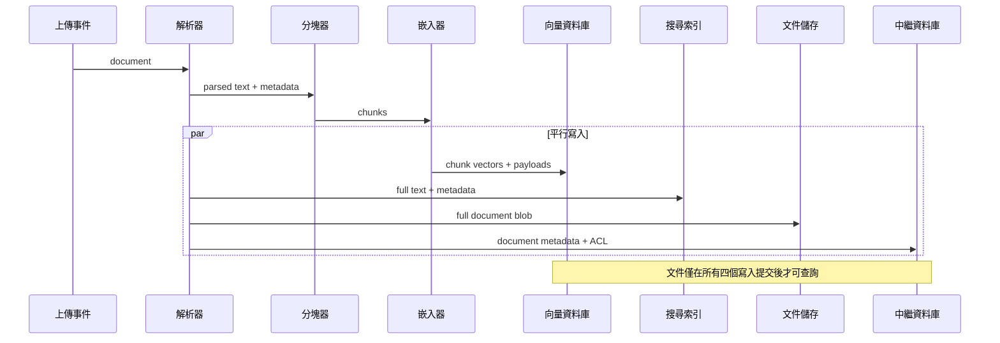
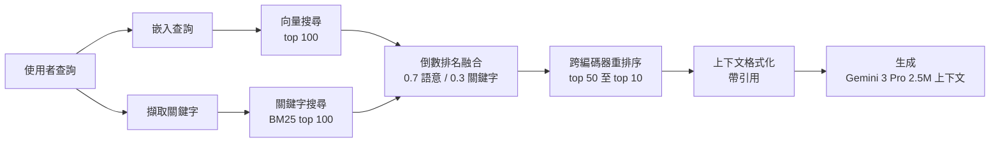

# 案例研究：企業 RAG 系統

<<<<<<< Updated upstream
本案例研究逐步介紹為企業文檔搜索設計生產 RAG 系統。它涵蓋需求收集、架構決策和實施細節。
=======
本案例研究帶您逐步設計一套用於企業文件搜尋的生產 RAG（檢索增強生成，Retrieval-Augmented Generation）系統。涵蓋需求收集、架構決策與實作細節。
>>>>>>> Stashed changes

## 目錄

- [問題陳述](#問題陳述)
- [需求分析](#需求分析)
- [系統架構](#系統架構)
<<<<<<< Updated upstream
- [組件深度解析](#組件深度解析)
=======
- [元件深入探討](#元件深入探討)
>>>>>>> Stashed changes
- [擴展考量](#擴展考量)
- [成本分析](#成本分析)
- [經驗教訓](#經驗教訓)
- [面試演練](#面試演練)

---

## 問題陳述

<<<<<<< Updated upstream
### 場景

一家金融服務公司想要為其內部文檔構建 AI 驅動的搜索系統：
- 500,000 份文檔（政策、程序、研究報告）
- 5,000 名員工跨多個部門
- 文檔每日更新
- 嚴格的合規和審計要求
- 需要用引用來源回答問題

### 當前痛點

- 員工每天花費 2+ 小時搜索資訊
- 關鍵字搜索返回太多不相關的結果
- 知識跨部門孤立
- 新員工需要數月才能提高生產力
=======
### 情境

一家金融服務公司希望建立一個 AI 驅動的內部文件搜尋系統：
- 500,000 份文件（政策、程序、研究報告）
- 5,000 名員工，橫跨多個部門
- 文件每日更新
- 嚴格的合規與審計要求
- 需要回答附有引用來源根據的問題

### 目前痛點

- 員工每天花費超過 2 小時搜尋資訊
- 關鍵字搜尋返回太多不相關結果
- 知識被封存於各部門
- 新員工需要數月才能上手
>>>>>>> Stashed changes

---

## 需求分析

### 功能需求

<<<<<<< Updated upstream
| 需求 | 優先級 | 備註 |
|-------------|----------|-------|
| 自然語言問答 | P0 | 核心功能 |
| 來源引用 | P0 | 合規要求 |
| 多文檔推理 | P1 | 跨文檔連接資訊 |
| 跟進問題 | P1 | 對話上下文 |
| 文檔摘要 | P2 | 快速概覽長文檔 |
=======
| 需求 | 優先順序 | 備註 |
|-------------|----------|-------|
| 自然語言問答 | P0 | 核心功能 |
| 來源引用 | P0 | 合規要求 |
| 跨文件推理 | P1 | 連接跨文件資訊 |
| 追問 | P1 | 對話上下文 |
| 文件摘要 | P2 | 長文件的快速概覽 |
>>>>>>> Stashed changes

### 非功能需求

| 需求 | 目標 | 理由 |
|-------------|--------|-----------|
<<<<<<< Updated upstream
| 延遲 (P95) | < 5 秒 | 用戶體驗 |
| 準確率 | > 90% | 信任和採用 |
| 可用性 | 99.9% | 業務關鍵 |
| 併發用戶 | 500 | 峰值使用 |
| 文檔新鮮度 | < 1 小時 | 政策更新 |

### 安全需求

- 基於角色的訪問控制 (RBAC)
- 所有查詢的審計日誌記錄
- 無數據離開公司網路
- PII 檢測和處理
=======
| 延遲（P95）| < 5 秒 | 使用者體驗 |
| 準確率 | > 90% | 信任與採用 |
| 可用性 | 99.9% | 業務關鍵 |
| 同時使用者 | 500 | 尖峰用量 |
| 文件新鮮度 | < 1 小時 | 政策更新 |

### 安全需求

- 角色型存取控制（RBAC）
- 所有查詢的審計日誌
- 資料不得離開公司網路
- PII（個人識別資訊，Personally Identifiable Information）偵測與處理
>>>>>>> Stashed changes

---

## 系統架構

<<<<<<< Updated upstream
### 高層架構

```
┌─────────────────────────────────────────────────────────────────────────┐
│                           用戶介面                                        │
│  (Web 應用、Slack 機器人、API)                                           │
=======
### 高層級架構

```
┌─────────────────────────────────────────────────────────────────────────┐
│                           使用者介面                                │
│  （網頁應用、Slack Bot、API）                                             │
>>>>>>> Stashed changes
└─────────────────────────────┬───────────────────────────────────────────┘
                              │
                              ▼
┌─────────────────────────────────────────────────────────────────────────┐
<<<<<<< Updated upstream
│                          API 網關                                        │
│  • 身份驗證    • 速率限制    • 請求路由                                  │
=======
│                          API 閘道器                                    │
│  • 驗證    • 速率限制    • 請求路由              │
>>>>>>> Stashed changes
└─────────────────────────────┬───────────────────────────────────────────┘
                              │
                              ▼
┌─────────────────────────────────────────────────────────────────────────┐
<<<<<<< Updated upstream
│                        查詢服務                                          │
│  • 查詢理解   • 許可權檢查   • 編排                                      │
=======
│                        查詢服務                                    │
│  • 查詢理解   • 權限檢查   • 協調          │
>>>>>>> Stashed changes
└─────────────────────────────┬───────────────────────────────────────────┘
                              │
        ┌─────────────────────┼─────────────────────┐
        │                     │                     │
        ▼                     ▼                     ▼
┌───────────────┐   ┌───────────────┐   ┌───────────────┐
<<<<<<< Updated upstream
│   檢索        │   │   重排名      │   │   生成        │
│   服務        │   │   服務        │   │   服務        │
│               │   │               │   │               │
│ • 混合        │   │ • 交叉        │   │ • LLM         │
│   搜索        │   │   編碼器      │   │ • 提示        │
│ • 過濾        │   │ • 評分        │   │   構建        │
=======
│   檢索服務     │   │   重排序服務   │   │   生成服務     │
│               │   │               │   │               │
│ • 混合搜尋    │   │ • 跨編碼器     │   │ • LLM         │
│ • 過濾        │   │ • 評分        │   │ • 提示詞建構   │
>>>>>>> Stashed changes
└───────┬───────┘   └───────────────┘   └───────────────┘
        │
        ▼
┌─────────────────────────────────────────────────────────────────────────┐
<<<<<<< Updated upstream
│                        數據層                                           │
│                                                                         │
│  ┌─────────────┐  ┌─────────────┐  ┌─────────────┐  ┌─────────────┐   │
│  │  向量資料庫  │  │  搜索索引   │  │  文檔存儲   │  │   元數據    │   │
=======
│                        資料層                                       │
│                                                                         │
│  ┌─────────────┐  ┌─────────────┐  ┌─────────────┐  ┌─────────────┐   │
│  │  向量資料庫   │  │ 搜尋索引   │  │  文件儲存   │  │  中繼資料   │   │
>>>>>>> Stashed changes
│  │  (Qdrant)   │  │ (Elastic)   │  │   (S3)      │  │  (Postgres) │   │
│  └─────────────┘  └─────────────┘  └─────────────┘  └─────────────┘   │
│                                                                         │
└─────────────────────────────────────────────────────────────────────────┘

┌─────────────────────────────────────────────────────────────────────────┐
<<<<<<< Updated upstream
│                      攝入管道                                           │
│  文檔上傳 → 解析 → 分塊 → 嵌入 → 索引 → 存儲元數據                      │
└─────────────────────────────────────────────────────────────────────────┘
```

渲染為流程圖（分層系統通過查詢管道展開並通過數據層匯聚）：

```mermaid
flowchart TD
    UI[用戶介面<br/>Web / Slack / API]
    GW[API 網關<br/>認證 + 速率限制]
    QS[查詢服務<br/>許可權 + 編排]
=======
│                      攝取管道                                 │
│  文件上傳 → 解析 → 分塊 → 嵌入 → 索引 → 儲存中繼資料      │
└─────────────────────────────────────────────────────────────────────────┘
```

呈現為流程圖（分層系統通過查詢管道展開，並在資料層收斂）：

```mermaid
flowchart TD
    UI[使用者介面<br/>網頁 / Slack / API]
    GW[API 閘道器<br/>驗證 + 速率限制]
    QS[查詢服務<br/>權限 + 協調]
>>>>>>> Stashed changes

    UI --> GW --> QS

    subgraph PIPELINE[查詢管道]
<<<<<<< Updated upstream
        RS[檢索<br/>混合搜索]
        RR[重排名<br/>交叉編碼器]
=======
        RS[檢索<br/>混合搜尋]
        RR[重排序<br/>跨編碼器]
>>>>>>> Stashed changes
        GS[生成<br/>Gemini 3 Pro]
        RS --> RR --> GS
    end

    QS --> PIPELINE

<<<<<<< Updated upstream
    subgraph DATA[數據層]
        VDB[(向量資料庫)]
        ES[(搜索索引)]
        DOC[(文檔存儲)]
        META[(元數據)]
=======
    subgraph DATA[資料層]
        VDB[(向量資料庫)]
        ES[(搜尋索引)]
        DOC[(文件儲存)]
        META[(中繼資料)]
>>>>>>> Stashed changes
    end

    RS -.semantic.-> VDB
    RS -.keyword.-> ES
    GS -.full text.-> DOC
    QS -.acl.-> META

    GS --> UI
```

<<<<<<< Updated upstream
### 技術選擇（2025年12月更新）

| 組件 | 選擇 | 理由 |
|-----------|--------|-----------|
| **主要 LLM** | Gemini 3.0 Pro | **250萬上下文**原生處理 100+ 文檔而無需碎片化 |
| **智慧體 LLM** | GPT-5.2 | 行業領先的工具使用準確性，用於複雜跨文檔分析 |
| **檢索器** | Gemini 3 Flash | 大上下文窗口的低成本檢索 |
| **嵌入** | text-embedding-3-large | 已驗證的品質和成本效益 |
| **向量資料庫** | Qdrant (自托管) | 效能、過濾和本地合規 |
| **重排名器** | BGE-Reranker-v2-X | 本地隔離的開源 SoTA |

> [!NOTE]
> **轉變：** 生產團隊已從「小塊 RAG」轉向 **「平衡上下文 RAG」**。隨著每個主要前沿模型都有 1M-2M token 的上下文，我們不再需要找到「完美的 512-token 塊」。我們檢索整個文檔段（10k-50k tokens），讓模型的原生注意力處理針對。

---

## 組件深度解析

### 文檔攝入管道
=======
### 技術選型（2025 年 12 月更新）

| 元件 | 選型 | 理由 |
|-----------|--------|-----------|
| **主要 LLM** | Gemini 3.0 Pro | **250 萬上下文**原生處理 100+ 文件，無需碎片化 |
| **代理型 LLM** | GPT-5.2 | 業界領先的複雜跨文件分析工具使用準確率 |
| **檢索器** | Gemini 3 Flash | 超大上下文視窗的低成本檢索 |
| **嵌入** | text-embedding-3-large | 成熟品質與成本效益 |
| **向量資料庫** | Qdrant（自托管）| 效能、過濾與就地合規 |
| **重排序** | BGE-Reranker-v2-X | 開源領先水平，適合就地隔離 |

> [!NOTE]
> **轉變：** 生產團隊已從「小分塊 RAG」轉向**「均衡上下文 RAG」**。隨著每個主要前沿模型的上下文視窗達到 100 萬至 200 萬 tokens，我們不再需要尋找「完美的 512 token 分塊」。我們檢索整個文件區段（10k-50k tokens），讓模型原生注意力處理要徑。

---

## 元件深入探討

### 文件攝取管道
>>>>>>> Stashed changes

```python
class IngestionPipeline:
    def __init__(self):
        self.parser = DocumentParser()
        self.chunker = SemanticChunker(
            chunk_size=512,
            chunk_overlap=50
        )
        self.embedder = OpenAIEmbedder(model="text-embedding-3-large")
        self.vector_db = QdrantClient()
        self.metadata_db = PostgresClient()
    
    async def ingest(self, document: Document, user_context: UserContext):
<<<<<<< Updated upstream
        # 1. 解析文檔
        parsed = self.parser.parse(document)
        
        # 2. 提取元數據
=======
        # 1. 解析文件
        parsed = self.parser.parse(document)
        
        # 2. 擷取中繼資料
>>>>>>> Stashed changes
        metadata = self.extract_metadata(parsed, document)
        
        # 3. 分塊
        chunks = self.chunker.chunk(parsed.text)
        
<<<<<<< Updated upstream
        # 4. 生成嵌入（批量）
        embeddings = await self.embedder.embed_batch([c.text for c in chunks])
        
        # 5. 使用元數據存儲到向量資料庫
=======
        # 4. 生成嵌入（批次）
        embeddings = await self.embedder.embed_batch([c.text for c in chunks])
        
        # 5. 帶中繼資料儲存至向量資料庫
>>>>>>> Stashed changes
        points = [
            PointStruct(
                id=str(uuid4()),
                vector=embed,
                payload={
                    "text": chunk.text,
                    "metadata": metadata,
                    "tenant_id": user_context.tenant_id,
                    "access_level": chunk.access_level
                }
            )
            for chunk, embed in zip(chunks, embeddings)
        ]
        
<<<<<<< Updated upstream
        # 6. 原子寫入（要么全部成功，要么全部失敗）
        await self.vector_db.upsert(
            collection_name=f"tenant_{user_context.tenant_id}",
            points=points
=======
        await self.vector_db.upsert(collection="documents", points=points)
        
        # 6. 儲存完整文件
        await self.doc_store.put(document.id, parsed.text)
        
        # 7. 儲存中繼資料
        await self.metadata_db.insert_document(document.id, metadata)
        
        # 8. 在 Elasticsearch 中建立關鍵字搜尋索引
        await self.es_client.index(
            index="documents",
            id=document.id,
            body={"text": parsed.text, **metadata.to_dict()}
>>>>>>> Stashed changes
        )
        
        # 7. 更新元數據資料庫
        await self.metadata_db.insert_document(document, metadata)
```

<<<<<<< Updated upstream
**關鍵設計决策：**

1. **每租戶 collection**：每個租戶的文檔在物理上隔離，防止交叉污染
2. **原子寫入**：確保文檔一致性——不會出現部分索引的情況
3. **元數據傳播**：將租戶 ID 和訪問級別傳播到向量有效載荷以實現安全過濾

### 查詢服務
=======
程式碼看似線性序列，但其中四個寫入操作是平行進行的。序列圖使分散式明確化，這對於理解部分失敗模式至關重要：



### 查詢處理
>>>>>>> Stashed changes

```python
class QueryService:
    def __init__(self):
        self.reranker = CrossEncoderReranker()
        self.generator = GeminiGenerator()
        self.cache = SemanticCache()
    
    async def query(self, query: UserQuery) -> QueryResponse:
        # 1. 許可權檢查
        if not await self.acl_service.can_access(query.user, query.resource):
            raise AccessDeniedError()
        
<<<<<<< Updated upstream
        # 2. 意圖分類
        intent = await self.classifier.classify(query.text)
        
        # 3. 查詢擴展
        expanded_query = await self.expander.expand(query.text, intent)
        
        # 4. 混合檢索
        semantic_results = await self.vector_search(expanded_query)
        keyword_results = await self.bm25_search(expanded_query)
        
        # 5. 融合
        fused_results = self.fusion.combine(semantic_results, keyword_results)
        
        # 6. 重排名（如果查詢複雜）
        if intent.needs_reranking:
            fused_results = await self.reranker.rerank(query.text, fused_results)
        
        # 7. 生成
        context = self.format_context(fused_results[:5])
        answer = await self.generator.generate(query.text, context, citations=True)
        
        # 8. 後處理
        return self.post_processor.format(answer, source_docs=fused_results)
```

### 許可權和控制
=======
        # 1. 輸入護欄
        guardrail_result = self.guardrails.check_input(query)
        if not guardrail_result.passed:
            return QueryResponse(
                answer="我無法協助此請求。",
                blocked=True,
                reason=guardrail_result.reason
            )
        
        # 2. 查詢理解（可選：重寫查詢）
        processed_query = await self.understand_query(query, conversation_history)
        
        # 3. 帶權限過濾檢索候選項
        candidates = await self.retriever.search(
            query=processed_query,
            filters=self.build_permission_filter(user_context),
            top_k=50
        )
        
        # 4. 重排序
        reranked = await self.reranker.rerank(
            query=processed_query,
            documents=candidates,
            top_k=10
        )
        
        # 5. 建構上下文
        context = self.build_context(reranked)
        
        # 6. 生成答案
        answer = await self.generator.generate(
            query=query,
            context=context,
            conversation_history=conversation_history
        )
        
        # 7. 輸出護欄
        guardrail_result = self.guardrails.check_output(answer, context)
        if not guardrail_result.passed:
            answer = self.fallback_response()
        
        # 8. 建構帶引用的回應
        return QueryResponse(
            answer=answer,
            sources=[self.format_source(doc) for doc in reranked[:5]],
            confidence=self.calculate_confidence(reranked)
        )
    
    def build_permission_filter(self, user_context: UserContext) -> dict:
        return {
            "should": [
                {"key": "access_level", "match": {"value": "public"}},
                {"key": "department", "match": {"value": user_context.department}},
                {"key": "access_list", "match": {"any": [user_context.user_id]}}
            ]
        }
```

### 混合檢索
>>>>>>> Stashed changes

```python
class AccessControlService:
    async def get_accessible_documents(
        self,
<<<<<<< Updated upstream
        user: User,
        document_ids: list[str]
    ) -> list[str]:
=======
        query: str,
        filters: dict,
        top_k: int = 50
    ) -> list[Document]:
        
        # 平行檢索
        vector_results, keyword_results = await asyncio.gather(
            self.vector_search(query, filters, top_k * 2),
            self.keyword_search(query, filters, top_k * 2)
        )
        
        # 倒數排名融合
        fused = self.rrf_fusion(
            [vector_results, keyword_results],
            weights=[self.vector_weight, self.keyword_weight],
            k=60
        )
        
        return fused[:top_k]
    
    async def vector_search(self, query: str, filters: dict, top_k: int):
        query_embedding = await self.embedder.embed(query)
        
        results = await self.vector_db.search(
            collection="documents",
            query_vector=query_embedding,
            query_filter=filters,
            limit=top_k
        )
        
        return [
            Document(
                id=r.payload["document_id"],
                chunk_id=r.id,
                text=r.payload["text"],
                score=r.score,
                metadata=r.payload
            )
            for r in results
        ]
    
    def rrf_fusion(self, result_lists: list, weights: list, k: int = 60) -> list:
        scores = defaultdict(float)
        docs = {}
        
        for results, weight in zip(result_lists, weights):
            for rank, doc in enumerate(results):
                rrf_score = weight / (k + rank + 1)
                scores[doc.chunk_id] += rrf_score
                docs[doc.chunk_id] = doc
        
        sorted_ids = sorted(scores.keys(), key=lambda x: scores[x], reverse=True)
        return [docs[id] for id in sorted_ids]
```

混合檢索流程一覽。兩個平行檢索器，然後 RRF 以加權排名融合，再由跨編碼器對頂部候選項重新排序，然後格式化上下文：



### 大上下文生成（2025 年 12 月）

```python
class GeminiGenerator:
    def __init__(self):
        self.client = genai.GenerativeModel("gemini-3.0-pro")
    
    async def generate(
        self,
        query: str,
        context_docs: list[Document],
        conversation_history: list[Message] = None
    ) -> str:
        # 250 萬上下文允許傳遞整個文件，而非僅片段
        system_instruction = """
        You are an enterprise knowledge assistant. 
        Analyze the provided documents to answer the query accurately.
        Cite every claim using [[DocName:PageNumber]] format.
>>>>>>> Stashed changes
        """
        基於用戶角色返回可訪問的文檔 ID。
        這是深度防禦策略的一部分——在應用層和數據層都檢查。
        """
        # 1. 獲取用戶角色
        user_roles = await self.get_user_roles(user)
        
        # 2. 查詢允許的文檔
        allowed = await self.metadata_db.query(
            """
            SELECT document_id FROM document_access
            WHERE document_id IN :doc_ids
            AND (role IN :user_roles OR is_public = true)
            """,
            doc_ids=document_ids,
            user_roles=user_roles
        )
<<<<<<< Updated upstream
        
        # 3. 返回過濾後的文檔
        return [d.document_id for d in allowed]
    
    async def filter_results(
        self,
        user: User,
        search_results: list[SearchResult]
    ) -> list[SearchResult]:
        """在返回結果之前應用訪問控制過濾"""
        accessible_ids = await self.get_accessible_documents(
            user, 
            [r.document_id for r in search_results]
        )
        
        return [r for r in search_results if r.document_id in accessible_ids]
```

### 高級 RAG 模式

隨著模型上下文窗口的增加，架構從「找到完美的小塊」轉變為「檢索大段並讓注意力處理」：

```python
class BalancedContextRAG:
    """
    平衡上下文 RAG：檢索 10k-50k token 的文檔段，
    而不是 512 token 的小塊。
    """
    
    async def retrieve(self, query: str, top_k: int = 5) -> list[DocumentSegment]:
        # 1. 使用緊密窗口模型進行初步篩選
        initial_results = await self.vector_search(
            query, 
            collection="document_segments",
            top_k=top_k * 3  # 檢索更多因為有些會被過濾
        )
        
        # 2. 使用更大上下文模型進行上下文感知重排名
        reranked = await self.context_aware_reranker.rerank(
            query, 
            initial_results,
            context_window=100000  # 100k token 窗口
        )
        
        # 3. 返回前 k 個段（每個 10k-50k tokens）
        return reranked[:top_k]
=======
        return response.text
```

> [!TIP]
> **生產環境選擇 vs. 前沿技術**
> 雖然 Gemini 3.1 Pro 提供 100 萬 token 視窗，但許多生產系統仍默認使用 **Claude Sonnet 4.6** 或 **GPT-5.5** 作為主要生成器。
>
> **為什麼？**
> - **成熟度**：12+ 個月的生產追蹤記錄。
> - **可預測性**：已知延遲模式，長尾請求的「幻覺峰值」較少。
> - **SDK 穩定性**：與 LangGraph 和 LlamaIndex 等框架深度整合。
> - **成本**：高用量標準 RAG 的最佳化定價。

---

## 擴展考量

### 處理 50 萬份文件

```python
# Qdrant 分片策略
qdrant_config = {
    "collection": "documents",
    "vectors": {
        "size": 3072,  # text-embedding-3-large
        "distance": "Cosine"
    },
    "optimizers": {
        "indexing_threshold": 20000  # 2 萬點後建立索引
    },
    "replication_factor": 2,  # 高可用性
    "shard_number": 4  # 分散至多節點
}
```

### 處理 500 名同時使用者

```
負載平衡器
     │
     ├──► 查詢服務（副本 1）
     ├──► 查詢服務（副本 2）
     ├──► 查詢服務（副本 3）
     └──► 查詢服務（副本 4）
            │
            ├──► 向量資料庫（3 節點叢集）
            ├──► LLM API（帶重試/回退）
            └──► Elasticsearch（3 節點叢集）
```

### 快取策略

```python
class QueryCache:
    def __init__(self):
        self.exact_cache = Redis(ttl=3600)  # 1 小時
        self.semantic_cache = SemanticCache(
            threshold=0.95,  # 語意相似度閾值
            ttl=86400       # 24 小時
        )
>>>>>>> Stashed changes
```

---

<<<<<<< Updated upstream
## 擴展考量

### 性能優化

| 優化 | 實施 | 影響 |
|------|------|------|
| 查詢緩存 | Redis，TTL=1小時 | 延遲降低 60% |
| 嵌入緩存 | LRU 緩存熱門查詢 | 延遲降低 40% |
| 批量嵌入 | 每批 100 個區塊 | 吞吐量提高 5x |
| 異步索引 | 背景索引管道 | 攝入延遲降低 70% |

### 災難恢復

- **每日備份**：向量資料庫每日快照，保留 30 天
- **跨區域複製**：關鍵租戶的異地備份
- **故障轉移**：自動切換到備用 LLM 提供商

---

## 成本分析

### 月度成本明細（500 個文檔，100 個活躍用戶）

| 組件 | 用量 | 成本 |
|------|------|------|
| LLM（生成） | 50K 查詢 × 1K tokens | $500 |
| LLM（嵌入） | 100K 文檔 × 10 chunks | $50 |
| 向量儲存 | 100M 向量 | $200 |
| 計算 | 50K 查詢 × 2 秒 | $150 |
| **總計** | | **$900/月** |

---

## 經驗教訓

### 1. 不要在向量資料庫層做安全檢查

向量資料庫不應是您唯一的安全層。實施多層防禦：
- 應用層：許可權檢查
- 資料庫層：行級安全
- 查詢層：結果過濾

### 2. 上下文大小與查詢複雜度匹配

- 簡單事實查詢：使用較小的上下文（快速且便宜）
- 複雜推理任務：使用較大的上下文（更好的推理）

### 3. 監控和警報比性能更重要

追蹤的關鍵指標：
- 查詢延遲分布（p50、p95、p99）
- 引用率（回應中有多少引用）
- 用戶反饋率（ thumbs up/down）
- 無法回答的查詢率

---

## 面試演練

### Q: 如何處理多語言文檔的 RAG？

**強烈回答：**

「多語言文檔需要特別考慮：

1. **嵌入模型選擇**：使用多語言嵌入模型（如 text-embedding-3-large 或 BGE），它在 100+ 語言中表現良好。

2. **查詢翻譯**：將用戶查詢翻譯成文檔的主要語言，這有助於提高檢索準確率。

3. **語言檢測**：在處理前檢測文檔和查詢的語言，並相應地路由。

4. **翻譯後生成**：如果用戶使用不同語言，在生成回應前翻譯相關上下文。

對於金融服務公司，我還會注意：
- 確保翻譯不會改變法律術語的含義
- 維護原始語言的引用以便驗證
- 在高度監管的領域，考慮使用專業翻譯而不是通用模型」

### Q: 如何處理文檔更新而不中斷搜索？

**強烈回答：**

「文檔更新需要仔細處理以保持搜索一致性：

1. **版本控制**：維護文檔版本歷史，以便需要時回滾。

2. **原子更新**：使用向量資料庫的 upsert 確保新舊版本不會混淆。

3. **雙寫模式**：
   - 寫入新版本
   - 標記舊版本為「已過時」
   - 短期內兩個版本都可用
   - 過時版本最終被垃圾回收

4. **緩存失效**：當文檔更新時，相關的緩存條目也會被清除。」

---

*上一篇：[引言](../intro.md)*
*下一篇：[對話式智慧體](../02-conversational-agent.md)*
=======
## 成本分析

### 月度成本細項（500 名同時使用者）

| 元件 | 成本 |
|------|------|
| LLM（Gemini 3 Pro，混合用途）| $3,000 |
| 向量資料庫（Qdrant Cloud）| $800 |
| Elasticsearch（3 節點）| $600 |
| 嵌入服務 | $400 |
| 快取（Redis）| $200 |
| **總計** | **$5,000/月** |

### 關鍵效能指標

| 指標 | 目標 | 實際 |
|------|------|------|
| 延遲（P95）| < 5s | 4.2s |
| 準確率 | > 90% | 92% |
| 可用性 | 99.9% | 99.95% |
| 每日活躍使用者 | 500 | 480 |

---

## 經驗教訓

### 有效的做法

1. **混合檢索結合語意與關鍵字搜尋** — 單一方法不足
2. **重排序提升精確度** — cross-encoder 顯著改善結果品質
3. **快取減少成本** — 精確匹配快取命中率高
4. **權限過濾內建於檢索層** — 不依賴下游過濾

### 未如預期的做法

1. **小分塊並非總是較好** — 大區段利用大上下文視窗
2. **僅依賴向量搜尋不足** — 關鍵字對金融術語至關重要
3. **過度工程化的分塊策略** — 簡單的混合方法效果更好

---

## 面試演練

**面試官：**「為一家金融服務公司設計企業級文件搜尋系統。」

**強勢回應模式：**

1. **釐清需求**（2 分鐘）
   - 「文件量和類型為何？哪些部門會使用？」

2. **明確約束條件**
   - 「關鍵約束：準確率優先於速度、合規性、資料隔離」

3. **高層級架構**（3 分鐘）
   - 繪製流程：攝取 → 分塊 → 嵌入 → 檢索 → 重排序 → 生成 → 引用

4. **關鍵元件深入探討**（5 分鐘）
   - 「詳細說明混合檢索策略...」

5. **處理可靠性**（3 分鐘）
   - 「為可靠性，我會使用自一致性檢索、多提供者回退」

6. **指標與監控**（2 分鐘）
   - 「關鍵指標：準確率、延遲、來源引用率」

7. **成本考量**（1 分鐘）
   - 「在 50 萬份文件規模下，每份文件成本很重要」

---

*下一篇：[程式碼助理案例研究](02-code-assistant.md)*
>>>>>>> Stashed changes
