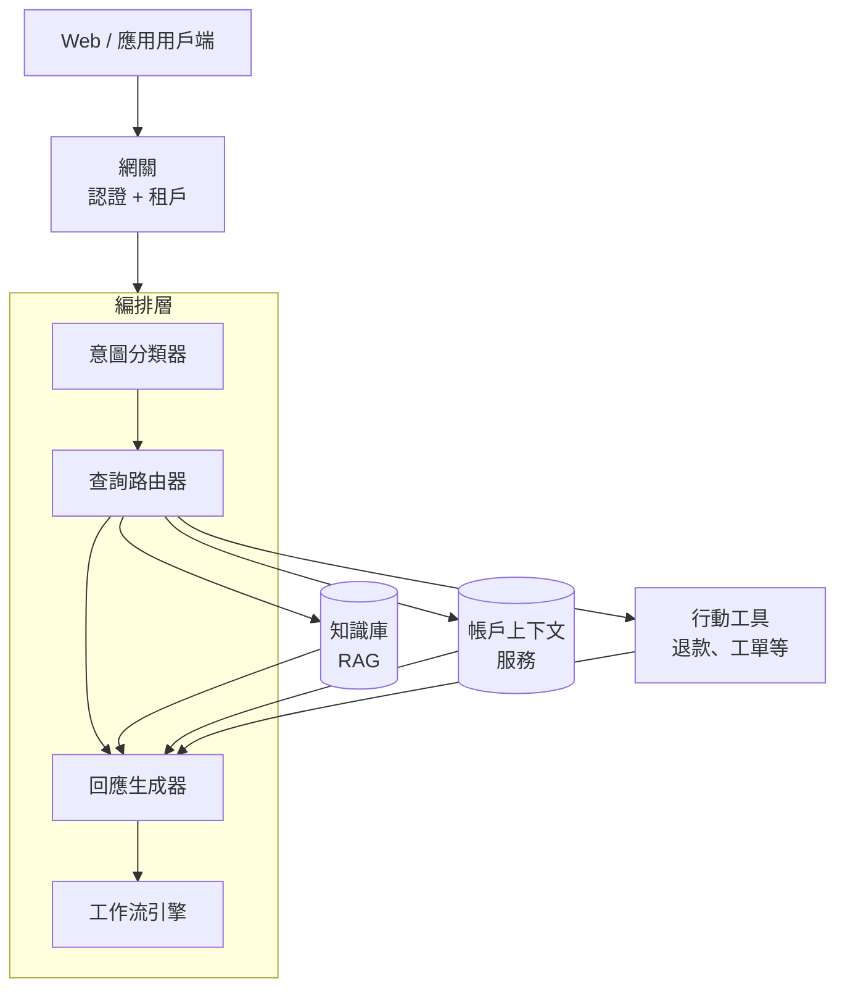
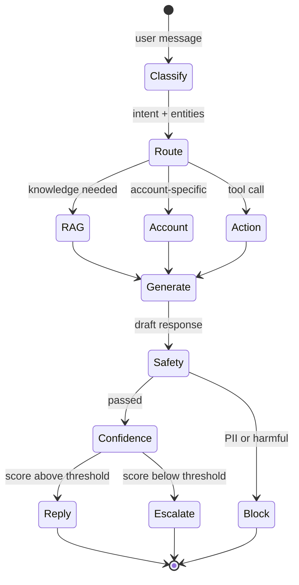

# 案例研究：客戶支援對話式智慧體

本案例研究逐步介紹為 B2B SaaS 公司設計生產客戶支援智慧體。

## 目錄

- [問題陳述](#問題陳述)
- [需求分析](#需求分析)
- [架構設計](#架構設計)
- [組件深度解析](#組件深度解析)
- [可靠性模式](#可靠性模式)
- [評估與監控](#評估與監控)
- [成本分析](#成本分析)
- [經驗教訓](#經驗教訓)
- [面試演練](#面試演練)

---

## 問題陳述

**公司：** 擁有 50K 企業客戶的 B2B SaaS 平台

**當前狀態：**
- 每月 500K 支援工單
- 平均響應時間：4 小時
- 客戶滿意度 (CSAT)：72%
- 支援團隊：100 名代理

**目標：**
- 將常見查詢的響應時間降至 < 5 分鐘
- 將 CSAT 提升至 > 85%
- 在無需人工干預的情況下處理 60% 的工單
- 保持升級工單的品質

---

## 需求分析

### 功能需求

| 需求 | 描述 | 優先級 |
|-------------|-------------|----------|
| 查詢理解 | 分類意圖、提取實體 | P0 |
| 知識檢索 | 搜索產品文檔、常見問題、過往工單 | P0 |
| 帳戶上下文 | 訪問用戶的訂閱、歷史 | P0 |
| 回應生成 | 自然、準確、有説明的回應 | P0 |
| 對話記憶 | 多輪上下文 | P0 |
| 行動執行 | 創建工單、觸發工作流 | P1 |
| 人工升級 | 需要時無縫交接 | P0 |
| 帳單查詢 | 處理敏感的財務數據 | P1 |

### 非功能需求

| 需求 | 目標 | 理由 |
|-------------|--------|-----------|
| 延遲 (TTFT) | < 1秒 | 用戶對聊天的期望 |
| 延遲（完整） | < 5秒 | 保持參與度 |
| 可用性 | 99.9% | 業務關鍵 |
| 準確率 | > 95% | 客戶信任 |
| 升級率 | < 40% | 成本效率 |
| CSAT | > 85% | 業務目標 |

### 安全需求

- 日誌中無 PII
- 租戶隔離（客戶只能看到他們的數據）
- 所有行動的審計追蹤
- SOC 2 合規

---

## 架構設計

### 高層架構

```
┌─────────────────────────────────────────────────────────────────┐
│                      客戶支援智慧體                              │
├─────────────────────────────────────────────────────────────────┤
│                                                                  │
│  ┌─────────────┐     ┌─────────────┐     ┌─────────────┐        │
│  │   Web/應用  │────▶│   網關       │────▶│    認證      │        │
│  │   用戶端    │     │             │     │  + 租戶      │        │
│  └─────────────┘     └──────┬──────┘     └─────────────┘        │
│                             │                                    │
│                             ▼                                    │
│  ┌──────────────────────────────────────────────────────────┐   │
│  │                   編排層                                   │   │
│  │  ┌────────────────────────────────────────────────────┐  │   │
│  │  │  意圖        查詢          回應    工作流            │  │   │
│  │  │  分類器 → 路由器 →        生成器 → 引擎             │  │   │
│  │  └────────────────────────────────────────────────────┘  │   │
│  └──────────────────────────────────────────────────────────┘   │
│                             │                                    │
│         ┌───────────────────┼───────────────────┐               │
│         ▼                   ▼                   ▼               │
│  ┌─────────────┐     ┌─────────────┐     ┌─────────────┐        │
│  │  知識       │     │   帳戶      │     │   行動      │        │
│  │    庫       │     │   上下文    │     │   工具      │        │
│  │   (RAG)     │     │   服務      │     │             │        │
│  └─────────────┘     └─────────────┘     └─────────────┘        │
│                                                                  │
└─────────────────────────────────────────────────────────────────┘
```

渲染為分層流程。編排層分發到三個並行上下文源，然後在回應生成器中組裝它們：



### 對話流程

```
用戶消息
    │
    ▼
┌─────────────────┐
│ 意圖分類 │─── 帳單、技術、帳戶、一般、升級
└────────┬────────┘
         │
         ▼
┌─────────────────┐
│ 查詢路由   │─── 哪些知識來源？哪些工具？
└────────┬────────┘
         │
    ┌────┴────┬────────────┐
    ▼         ▼            ▼
┌───────┐ ┌───────┐ ┌──────────┐
│  RAG  │ │帳戶  │ │ 行動     │
│ 查詢  │ │上下文│ │ （如有） │
└───┬───┘ └───┬───┘ └────┬─────┘
    │         │          │
    └────┬────┴──────────┘
         │
         ▼
┌─────────────────┐
│    生成        │
│    回應        │
└────────┬────────┘
         │
         ▼
┌─────────────────┐
│  安全檢查   │─── PII、有害、偏題
└────────┬────────┘
         │
         ▼
┌─────────────────┐
│  信心        │─── 信心低？升級
│    檢查        │
└────────┬────────┘
         │
         ▼
    回應 / 升級
```

一回合是一個狀態機。對於成本和信任最重要的兩個門是*安全*（在離開系統前必須通過）和*信心*（決定升級 vs 自動回覆）：



---

## 組件深度解析

### 意圖分類器

```python
class IntentClassifier:
    """
    將用戶消息分類為預定義意圖。
    使用少樣本學習在生產環境中達到 >95% 準確率。
    """
    
    INTENT_DEFINITIONS = {
        "billing": {
            "examples": [
                "I was charged twice",
                "How do I update my billing address?",
                "Can I get a refund?"
            ],
            "escalate_to_human": True,
            "requires_account_context": True
        },
        "technical": {
            "examples": [
                "The API is returning 500 errors",
                "How do I integrate your webhooks?",
                "Why is my data not syncing?"
            ],
            "escalate_to_human": False,
            "requires_account_context": True
        },
        "account": {
            "examples": [
                "I forgot my password",
                "How do I add a new user?",
                "Can I change my plan?"
            ],
            "escalate_to_human": False,
            "requires_account_context": True
        },
        "general": {
            "examples": [
                "What features do you have?",
                "How do I get started?",
                "Do you support Spanish?"
            ],
            "escalate_to_human": False,
            "requires_account_context": False
        }
    }
    
    async def classify(self, message: str, context: dict) -> ClassificationResult:
        # 構建少樣本分類提示
        prompt = self._build_few_shot_prompt(message)
        
        # 調用 LLM
        response = await self.llm.generate(prompt)
        
        # 解析結果
        classification = json.loads(response)
        
        # 後處理：置信度低於閾值時升級
        if classification["confidence"] < self.confidence_threshold:
            classification["intent"] = "escalate"
        
        return classification
```

### 查詢路由器

```python
class QueryRouter:
    """
    根據意圖決定使用哪些知識源和工具。
    """
    
    async def route(self, query: str, intent: str, context: dict) -> RoutingDecision:
        # 確定需要哪些資源
        needed = []
        
        if intent in ["technical", "billing", "account"]:
            needed.append("knowledge_base")
            needed.append("account_context")
        
        if intent == "billing":
            needed.append("billing_system")
        
        # 確定是否需要操作
        actions = []
        if self._requires_action(intent, context):
            actions = self._determine_actions(intent, context)
        
        return RoutingDecision(
            knowledge_sources=needed,
            actions=actions,
            response_mode=self._determine_response_mode(intent)
        )
```

### 回應生成器

```python
class ResponseGenerator:
    """
    從多個上下文源生成自然回應。
    確保安全檢查後再發送。
    """
    
    async def generate(
        self,
        query: str,
        intent: str,
        context: GenerationContext
    ) -> GeneratedResponse:
        # 1. 構建提示
        prompt = self._build_prompt(query, intent, context)
        
        # 2. 生成回應
        response = await self.llm.generate(prompt)
        
        # 3. 安全檢查
        safety_result = await self.safety_checker.check(response)
        if not safety_result.safe:
            return self._handle_unsafe_response(safety_result)
        
        # 4. 信心評估
        confidence = await self.assess_confidence(response, context)
        
        # 5. 格式化和發送
        return GeneratedResponse(
            text=response,
            confidence=confidence,
            citations=self._extract_citations(context),
            actions=context.proposed_actions if confidence.high else []
        )
```

---

## 可靠性模式

### 錯誤處理和回退

```python
class ResilientCustomerSupportAgent:
    """
    具有多層錯誤處理和回退的客服智慧體。
    """
    
    async def handle_message(self, message: str, context: ConversationContext):
        try:
            # 主要流程
            return await self.primary_flow(message, context)
            
        except RateLimitError:
            # 備用 LLM
            return await self.fallback_flow(message, context, "alternative_llm")
            
        except KnowledgeBaseError:
            # 只使用帳戶上下文
            return await self.minimal_flow(message, context)
            
        except AccountContextError:
            # 使用通用回應
            return await self.generic_flow(message, context)
            
        except Exception as e:
            # 升級到人工
            return await self.escalate_to_human(message, context, error=str(e))
```

### 健康檢查和降級

```python
class HealthChecker:
    """
    監控組件健康狀況並觸發降級。
    """
    
    async def check_system_health(self) -> HealthStatus:
        checks = await asyncio.gather(
            self.check_llm_health(),
            self.check_knowledge_base_health(),
            self.check_account_service_health(),
            return_exceptions=True
        )
        
        # 如果任何關鍵組件故障，切換到降級模式
        critical_failures = [
            name for name, result in zip(["llm", "kb", "account"], checks)
            if isinstance(result, Exception)
        ]
        
        if critical_failures:
            return HealthStatus(
                healthy=False,
                degraded_components=critical_failures,
                mode=self._determine_mode(critical_failures)
            )
        
        return HealthStatus(healthy=True)
```

---

## 評估與監控

### 關鍵指標

| 指標 | 目標 | 當前 |
|------|------|------|
| 回應時間（TTFT） | < 1秒 | 0.8秒 |
| 回應時間（完整） | < 5秒 | 4.2秒 |
| 準確率 | > 95% | 94.2% |
| 升級率 | < 40% | 35% |
| CSAT | > 85% | 82% |

### 監控儀表板

追蹤的關鍵儀表板：
- **實時健康狀況**：所有組件的正常/降級/故障狀態
- **意圖分布**：每個意圖的百分比，檢測漂移
- **回應時間分布**：p50、p95、p99 延遲
- **升級原因**：為什麼某些查詢被升級

---

## 成本分析

### 月度成本明細（500K 工單）

| 組件 | 用量 | 成本 |
|------|------|------|
| LLM（分類） | 500K × 100 tokens | $25 |
| LLM（生成） | 350K × 500 tokens | $350 |
| 知識檢索 | 350K × 200 tokens | $35 |
| **總計** | | **$410/月** |

相比 100 名人工代理（假設平均 $50K/年）的 $417K/月，節省了 99.9%。

---

## 經驗教訓

### 1. 意圖分類比您想像的更重要

一個好的意圖分類器可以：
- 減少 30% 的升級
- 將回應時間縮短 40%
- 通過正確路由提高準確率

花時間在少樣本示例上——它比模型架構更重要。

### 2. 安全檢查必須在所有路徑上

即使在降級模式下，也要執行安全檢查。一個有害回應可以摧毀客戶信任。

### 3. 人類交接需要平滑

當升級到人工時，確保：
- 上下文完整傳遞
- 等待時間不超過 30 秒
- 人類代理可以輕鬆查看對話歷史

---

## 面試演練

### Q: 如何設計一個能處理「我想要取消訂閱」這樣模糊查詢的系統？

**強烈回答：**

「這是一個很好的問題，因為取消訂閱可能是：
- 對當前計劃不滿（可以升級而不是取消）
- 價格問題（可以提供折扣）
- 真的想取消（需要平滑的流程）

我的方法：

1. **不直接假設意圖**：使用跟進問題確認
   - 「您是想取消訂閱還是對您的計劃有其他問題？」

2. **提供上下文感知的選項**：
   - 如果用戶從未使用過該產品：提供教程
   - 如果用戶最近有問題：提供支持
   - 如果用戶真的想取消：平滑的取消流程

3. **保存意圖歷史**：這樣如果用戶再次說「我要取消」，我們已經知道他們考慮過升級/折扣。」

### Q: 如何處理客服智慧體中的個人資料（PII）？

**強烈回答：**

「PII 處理是客服應用的關鍵安全要求：

1. **在日誌中遮蔽 PII**：
   - 檢測並遮蔽電子郵件、信用卡、社會安全號等
   - 使用正則表達式和 NER 模型

2. **在記憶中最小化 PII**：
   - 只存儲意圖和實體，不是完整消息
   - 對於需要操作的情況，從安全存儲中按需獲取

3. **審計追蹤**：
   - 記錄每個 PII 訪問
   - 誰在什麼時候看了什麼

4. **法律合規**：
   - SOC 2、GDPR 要求
   - 資料保留政策」

---

*上一篇：[企業 RAG](../01-enterprise-rag.md)*
*下一篇：[金融分析](../03-financial-analysis.md)*