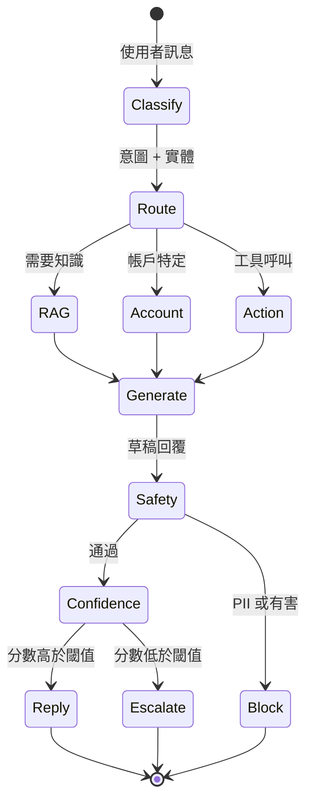
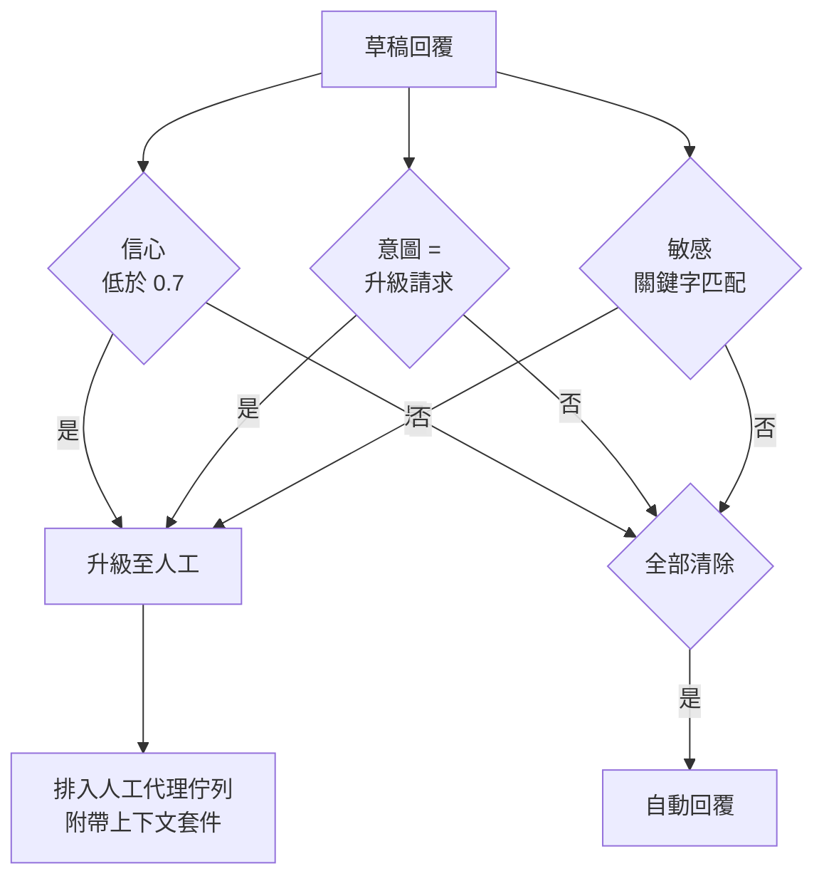

<<<<<<< Updated upstream
# 案例研究：客戶支援對話式智慧體

本案例研究逐步介紹為 B2B SaaS 公司設計生產客戶支援智慧體。
=======
# 案例研究：客戶支援對話式代理

本案例研究帶您逐步設計一套用於 B2B SaaS 公司的生產客戶支援代理。
>>>>>>> Stashed changes

## 目錄

- [問題陳述](#問題陳述)
- [需求分析](#需求分析)
- [架構設計](#架構設計)
<<<<<<< Updated upstream
- [組件深度解析](#組件深度解析)
=======
- [元件深入探討](#元件深入探討)
>>>>>>> Stashed changes
- [可靠性模式](#可靠性模式)
- [評估與監控](#評估與監控)
- [成本分析](#成本分析)
- [經驗教訓](#經驗教訓)
- [面試演練](#面試演練)

---

## 問題陳述

<<<<<<< Updated upstream
**公司：** 擁有 50K 企業客戶的 B2B SaaS 平台

**當前狀態：**
- 每月 500K 支援工單
- 平均響應時間：4 小時
- 客戶滿意度 (CSAT)：72%
- 支援團隊：100 名代理

**目標：**
- 將常見查詢的響應時間降至 < 5 分鐘
- 將 CSAT 提升至 > 85%
- 在無需人工干預的情況下處理 60% 的工單
- 保持升級工單的品質
=======
**公司：** 擁有 5 萬企業客戶的 B2B SaaS 平台

**目前狀態：**
- 每月 50 萬張支援工單
- 平均回覆時間：4 小時
- 客戶滿意度（CSAT）：72%
- 支援團隊：100 名代理

**目標：**
- 將常見查詢的回覆時間縮短至 < 5 分鐘
- 將 CSAT 提升至 > 85%
- 60% 的工單無需人工介入即可處理
- 維持升級工單的品質
>>>>>>> Stashed changes

---

## 需求分析

### 功能需求

<<<<<<< Updated upstream
| 需求 | 描述 | 優先級 |
|-------------|-------------|----------|
| 查詢理解 | 分類意圖、提取實體 | P0 |
| 知識檢索 | 搜索產品文檔、常見問題、過往工單 | P0 |
| 帳戶上下文 | 訪問用戶的訂閱、歷史 | P0 |
| 回應生成 | 自然、準確、有説明的回應 | P0 |
| 對話記憶 | 多輪上下文 | P0 |
| 行動執行 | 創建工單、觸發工作流 | P1 |
| 人工升級 | 需要時無縫交接 | P0 |
| 帳單查詢 | 處理敏感的財務數據 | P1 |
=======
| 需求 | 說明 | 優先順序 |
|-------------|-------------|----------|
| 查詢理解 | 分類意圖、擷取實體 | P0 |
| 知識檢索 | 搜尋產品文件、常見問題、過往工單 | P0 |
| 帳戶上下文 | 存取用戶訂閱、歷史記錄 | P0 |
| 回覆生成 | 自然、準確、有幫助的回覆 | P0 |
| 對話記憶 | 多輪上下文 | P0 |
| 動作執行 | 建立工單、觸發工作流程 | P1 |
| 人工升級 | 需要時無縫交接 | P0 |
| 帳單查詢 | 處理敏感財務資料 | P1 |
>>>>>>> Stashed changes

### 非功能需求

| 需求 | 目標 | 理由 |
<<<<<<< Updated upstream
|-------------|--------|-----------|
| 延遲 (TTFT) | < 1秒 | 用戶對聊天的期望 |
| 延遲（完整） | < 5秒 | 保持參與度 |
| 可用性 | 99.9% | 業務關鍵 |
| 準確率 | > 95% | 客戶信任 |
| 升級率 | < 40% | 成本效率 |
=======
|-------------|--------|--------|
| 延遲（TTFT）| < 1 秒 | 聊天使用者預期 |
| 延遲（完整）| < 5 秒 | 維持參與度 |
| 可用性 | 99.9% | 業務關鍵 |
| 準確率 | > 95% | 客戶信任 |
| 升級率 | < 40% | 成本效益 |
>>>>>>> Stashed changes
| CSAT | > 85% | 業務目標 |

### 安全需求

<<<<<<< Updated upstream
- 日誌中無 PII
- 租戶隔離（客戶只能看到他們的數據）
- 所有行動的審計追蹤
=======
- 日誌中不得有 PII
- 租戶隔離（客戶只能看到自己的資料）
- 所有動作的審計追蹤
>>>>>>> Stashed changes
- SOC 2 合規

---

## 架構設計

<<<<<<< Updated upstream
### 高層架構

```
┌─────────────────────────────────────────────────────────────────┐
│                      客戶支援智慧體                              │
├─────────────────────────────────────────────────────────────────┤
│                                                                  │
│  ┌─────────────┐     ┌─────────────┐     ┌─────────────┐        │
│  │   Web/應用  │────▶│   網關       │────▶│    認證      │        │
│  │   用戶端    │     │             │     │  + 租戶      │        │
=======
### 高層級架構

```
┌─────────────────────────────────────────────────────────────────┐
│                      客戶支援代理                      │
├─────────────────────────────────────────────────────────────────┤
│                                                                  │
│  ┌─────────────┐     ┌─────────────┐     ┌─────────────┐        │
│  │   網頁/應用   │────▶│   閘道器   │────▶│    驗證     │        │
│  │   用戶端     │     │             │     │  + 租戶     │        │
>>>>>>> Stashed changes
│  └─────────────┘     └──────┬──────┘     └─────────────┘        │
│                             │                                    │
│                             ▼                                    │
│  ┌──────────────────────────────────────────────────────────┐   │
<<<<<<< Updated upstream
│  │                   編排層                                   │   │
│  │  ┌────────────────────────────────────────────────────┐  │   │
│  │  │  意圖        查詢          回應    工作流            │  │   │
│  │  │  分類器 → 路由器 →        生成器 → 引擎             │  │   │
=======
│  │                   協調層                     │   │
│  │  ┌────────────────────────────────────────────────────┐  │   │
│  │  │  意圖分類 → 路由 → 回覆生成 → 工作流程引擎   │  │   │
>>>>>>> Stashed changes
│  │  └────────────────────────────────────────────────────┘  │   │
│  └──────────────────────────────────────────────────────────┘   │
│                             │                                    │
│         ┌───────────────────┼───────────────────┐               │
│         ▼                   ▼                   ▼               │
│  ┌─────────────┐     ┌─────────────┐     ┌─────────────┐        │
<<<<<<< Updated upstream
│  │  知識       │     │   帳戶      │     │   行動      │        │
│  │    庫       │     │   上下文    │     │   工具      │        │
│  │   (RAG)     │     │   服務      │     │             │        │
=======
│  │  知識庫     │     │   帳戶     │     │   動作     │        │
│  │   (RAG)     │     │   上下文   │     │   工具     │        │
>>>>>>> Stashed changes
│  └─────────────┘     └─────────────┘     └─────────────┘        │
│                                                                  │
└─────────────────────────────────────────────────────────────────┘
```

<<<<<<< Updated upstream
渲染為分層流程。編排層分發到三個並行上下文源，然後在回應生成器中組裝它們：

```mermaid
flowchart TD
    Client[Web / 應用用戶端] --> GW[網關<br/>認證 + 租戶]
    GW --> ORCH

    subgraph ORCH[編排層]
        IC[意圖分類器]
        QR[查詢路由器]
        RG[回應生成器]
        WE[工作流引擎]
=======
呈現為分層流程。協調層分發至三個平行上下文來源，然後在回覆生成器中組裝它們：

```mermaid
flowchart TD
    Client[網頁 / 應用用戶端] --> GW[閘道器<br/>驗證 + 租戶]
    GW --> ORCH

    subgraph ORCH[協調層]
        IC[意圖分類器]
        QR[查詢路由器]
        RG[回覆生成器]
        WE[工作流程引擎]
>>>>>>> Stashed changes
        IC --> QR --> RG --> WE
    end

    QR --> KB[(知識庫<br/>RAG)]
    QR --> AC[(帳戶上下文<br/>服務)]
<<<<<<< Updated upstream
    QR --> AT[行動工具<br/>退款、工單等]
=======
    QR --> AT[動作工具<br/>退款、工單等]
>>>>>>> Stashed changes

    KB --> RG
    AC --> RG
    AT --> RG
```

### 對話流程

```
<<<<<<< Updated upstream
用戶消息
=======
使用者訊息
>>>>>>> Stashed changes
    │
    ▼
┌─────────────────┐
│ 意圖分類 │─── 帳單、技術、帳戶、一般、升級
└────────┬────────┘
         │
         ▼
┌─────────────────┐
│ 查詢路由   │─── 哪些知識來源？哪些工具？
└────────┬────────┘
         │
    ┌────┴────┬────────────┐
    ▼         ▼            ▼
┌───────┐ ┌───────┐ ┌──────────┐
<<<<<<< Updated upstream
│  RAG  │ │帳戶  │ │ 行動     │
│ 查詢  │ │上下文│ │ （如有） │
=======
│  RAG  │ │帳戶│ │ 動作  │
│ 查詢 │ │上下文│ │ （如有） │
>>>>>>> Stashed changes
└───┬───┘ └───┬───┘ └────┬─────┘
    │         │          │
    └────┬────┴──────────┘
         │
         ▼
┌─────────────────┐
<<<<<<< Updated upstream
│    生成        │
│    回應        │
=======
│    生成     │
│    回覆     │
>>>>>>> Stashed changes
└────────┬────────┘
         │
         ▼
┌─────────────────┐
│  安全檢查   │─── PII、有害、偏題
└────────┬────────┘
         │
         ▼
┌─────────────────┐
<<<<<<< Updated upstream
│  信心        │─── 信心低？升級
=======
│  信心     │─── 信心不足？升級
>>>>>>> Stashed changes
│    檢查        │
└────────┬────────┘
         │
         ▼
<<<<<<< Updated upstream
    回應 / 升級
```

一回合是一個狀態機。對於成本和信任最重要的兩個門是*安全*（在離開系統前必須通過）和*信心*（決定升級 vs 自動回覆）：
=======
    回覆 / 升級
```

一回合是一個狀態機。對成本和信任最重要的兩個閘道是「安全」（離開系統前必須通過）和「信心」（決定升級 vs 自動回覆）：
>>>>>>> Stashed changes



---

<<<<<<< Updated upstream
## 組件深度解析

### 意圖分類器

```python
class IntentClassifier:
    """
    將用戶消息分類為預定義意圖。
    使用少樣本學習在生產環境中達到 >95% 準確率。
    """
    
    INTENT_DEFINITIONS = {
        "billing": {
            "examples": [
                "I was charged twice",
                "How do I update my billing address?",
                "Can I get a refund?"
            ],
            "escalate_to_human": True,
            "requires_account_context": True
        },
        "technical": {
            "examples": [
                "The API is returning 500 errors",
                "How do I integrate your webhooks?",
                "Why is my data not syncing?"
            ],
            "escalate_to_human": False,
            "requires_account_context": True
        },
        "account": {
            "examples": [
                "I forgot my password",
                "How do I add a new user?",
                "Can I change my plan?"
            ],
            "escalate_to_human": False,
            "requires_account_context": True
        },
        "general": {
            "examples": [
                "What features do you have?",
                "How do I get started?",
                "Do you support Spanish?"
            ],
            "escalate_to_human": False,
            "requires_account_context": False
        }
    }
    
    async def classify(self, message: str, context: dict) -> ClassificationResult:
        # 構建少樣本分類提示
        prompt = self._build_few_shot_prompt(message)
        
        # 調用 LLM
        response = await self.llm.generate(prompt)
        
        # 解析結果
        classification = json.loads(response)
        
        # 後處理：置信度低於閾值時升級
        if classification["confidence"] < self.confidence_threshold:
            classification["intent"] = "escalate"
        
        return classification
```

### 查詢路由器

```python
class QueryRouter:
    """
    根據意圖決定使用哪些知識源和工具。
    """
    
    async def route(self, query: str, intent: str, context: dict) -> RoutingDecision:
        # 確定需要哪些資源
        needed = []
        
        if intent in ["technical", "billing", "account"]:
            needed.append("knowledge_base")
            needed.append("account_context")
        
        if intent == "billing":
            needed.append("billing_system")
        
        # 確定是否需要操作
        actions = []
        if self._requires_action(intent, context):
            actions = self._determine_actions(intent, context)
        
        return RoutingDecision(
            knowledge_sources=needed,
            actions=actions,
            response_mode=self._determine_response_mode(intent)
        )
```

### 回應生成器

```python
class ResponseGenerator:
    """
    從多個上下文源生成自然回應。
    確保安全檢查後再發送。
    """
=======
## 元件深入探討

### 意圖分類（2025 年 12 月）

```python
class IntentClassifier:
    async def classify(self, message: str, history: list[dict]) -> dict:
        # 使用 GPT-5.5-mini 實現 <100ms 分類延遲
        result = await client.chat.completions.create(
            model="gpt-5.2-mini",
            messages=[{"role": "user", "content": message}],
            response_format={"type": "json_object"}
        )
        return json.loads(result.choices[0].message.content)
```

### 知識庫（Gemini 3 Flash RAG）

```python
class SupportKnowledgeBase:
    async def retrieve(self, query: str, context_window: int = 1_000_000) -> list[dict]:
        # 使用 Gemini 3 Flash 進行大規模上下文檢索
        # 許多標準支援任務不再需要「重排序」
        results = await self.sources.search(query, limit=50) 
        return results
```

### 回覆生成（Claude Sonnet 4.6）

```python
class ResponseGenerator:
    async def generate(self, query: str, context: list[dict]) -> dict:
        # Claude Sonnet 4.6 用於「混合推理」
        # 複雜帳單問題切換「思考」模式
        is_complex = self.detect_complexity(query)
        
        response = await self.anthropic.messages.create(
            model="claude-3-7-sonnet-20250219",
            thinking={"enabled": is_complex, "budget_tokens": 2048},
            messages=[{"role": "user", "content": f"Context: {context}\nQuery: {query}"}]
        )
        return {"response": response.content[0].text}
```

> [!NOTE]
> **生產智慧：** 雖然 Gemini 3 Flash 非常適合高用量檢索，但 **Claude 3.5 Sonnet** 仍然是許多支援團隊最「穩定」的生成器，這些團隊花了數月時間針對其特定個性和拒絕模式微調護欄。

---

## 可靠性模式

### 基於信心的升級

```python
class EscalationHandler:
    def __init__(self, confidence_threshold: float = 0.7):
        self.threshold = confidence_threshold
>>>>>>> Stashed changes
    
    async def generate(
        self,
        query: str,
        intent: str,
        context: GenerationContext
    ) -> GeneratedResponse:
        # 1. 構建提示
        prompt = self._build_prompt(query, intent, context)
        
<<<<<<< Updated upstream
        # 2. 生成回應
        response = await self.llm.generate(prompt)
        
        # 3. 安全檢查
        safety_result = await self.safety_checker.check(response)
        if not safety_result.safe:
            return self._handle_unsafe_response(safety_result)
        
        # 4. 信心評估
        confidence = await self.assess_confidence(response, context)
=======
        # 信心不足
        if response["confidence"] < self.threshold:
            should_escalate = True
            reason = "low_confidence"
        
        # 明確的升級請求
        if intent == "escalation_request":
            should_escalate = True
            reason = "user_requested"
        
        # 敏感主題
        if await self.is_sensitive(user_request):
            should_escalate = True
            reason = "sensitive_topic"
>>>>>>> Stashed changes
        
        # 5. 格式化和發送
        return GeneratedResponse(
            text=response,
            confidence=confidence,
            citations=self._extract_citations(context),
            actions=context.proposed_actions if confidence.high else []
        )
```

---

## 可靠性模式

### 錯誤處理和回退

```python
class ResilientCustomerSupportAgent:
    """
    具有多層錯誤處理和回退的客服智慧體。
    """
    
<<<<<<< Updated upstream
    async def handle_message(self, message: str, context: ConversationContext):
        try:
            # 主要流程
            return await self.primary_flow(message, context)
            
        except RateLimitError:
            # 備用 LLM
            return await self.fallback_flow(message, context, "alternative_llm")
            
        except KnowledgeBaseError:
            # 只使用帳戶上下文
            return await self.minimal_flow(message, context)
            
        except AccountContextError:
            # 使用通用回應
            return await self.generic_flow(message, context)
            
        except Exception as e:
            # 升級到人工
            return await self.escalate_to_human(message, context, error=str(e))
```

### 健康檢查和降級

```python
class HealthChecker:
    """
    監控組件健康狀況並觸發降級。
    """
    
    async def check_system_health(self) -> HealthStatus:
        checks = await asyncio.gather(
            self.check_llm_health(),
            self.check_knowledge_base_health(),
            self.check_account_service_health(),
            return_exceptions=True
        )
        
        # 如果任何關鍵組件故障，切換到降級模式
        critical_failures = [
            name for name, result in zip(["llm", "kb", "account"], checks)
            if isinstance(result, Exception)
        ]
=======
    async def is_sensitive(self, message: str) -> bool:
        sensitive_keywords = [
            "法律", "訴訟", "律師",
            "退款", "取消訂閱",
            "競爭對手", "資料外洩"
        ]
        return any(kw in message.lower() for kw in sensitive_keywords)
```

升級決策結合三個獨立信號。任何一個都會觸發交接。將其視覺化為決策樹，使 OR 語義明確且易於擴展第四個信號：



### 多輪記憶

```python
class ConversationMemory:
    def __init__(self, max_turns: int = 10):
        self.max_turns = max_turns
        self.redis = Redis()
    
    async def get_history(self, session_id: str) -> list[dict]:
        key = f"conversation:{session_id}"
        history = await self.redis.get(key)
        if history:
            return json.loads(history)
        return []
    
    async def add_turn(
        self,
        session_id: str,
        user_message: str,
        assistant_message: str
    ):
        history = await self.get_history(session_id)
>>>>>>> Stashed changes
        
        if critical_failures:
            return HealthStatus(
                healthy=False,
                degraded_components=critical_failures,
                mode=self._determine_mode(critical_failures)
            )
        
<<<<<<< Updated upstream
        return HealthStatus(healthy=True)
=======
        # 修剪至最大回合數
        if len(history) > self.max_turns * 2:
            history = history[-(self.max_turns * 2):]
        
        await self.redis.setex(
            f"conversation:{session_id}",
            3600,  # 1 小時 TTL
            json.dumps(history)
        )
>>>>>>> Stashed changes
```

---

## 評估與監控

<<<<<<< Updated upstream
### 關鍵指標

| 指標 | 目標 | 當前 |
|------|------|------|
| 回應時間（TTFT） | < 1秒 | 0.8秒 |
| 回應時間（完整） | < 5秒 | 4.2秒 |
| 準確率 | > 95% | 94.2% |
| 升級率 | < 40% | 35% |
| CSAT | > 85% | 82% |

### 監控儀表板

追蹤的關鍵儀表板：
- **實時健康狀況**：所有組件的正常/降級/故障狀態
- **意圖分布**：每個意圖的百分比，檢測漂移
- **回應時間分布**：p50、p95、p99 延遲
- **升級原因**：為什麼某些查詢被升級
=======
### 品質指標

```python
class QualityMonitor:
    def __init__(self, sample_rate: float = 0.05):
        self.sample_rate = sample_rate
        self.judge = LLMJudge()
    
    async def evaluate(self, conversation: dict):
        if random.random() > self.sample_rate:
            return
        
        scores = await self.judge.evaluate(
            query=conversation["user_message"],
            response=conversation["assistant_message"],
            context=conversation["context"],
            criteria={
                "relevance": "回覆是否解決了使用者的問題？",
                "accuracy": "基於上下文，資訊是否正確？",
                "helpfulness": "此回覆對使用者有幫助嗎？",
                "tone": "語氣是否專業且有同理心？"
            }
        )
        
        # 記錄指標
        for criterion, score in scores.items():
            metrics.record(f"quality_{criterion}", score)
```

### 儀表板指標

| 指標 | 目標 | 實際 |
|--------|--------|--------|
| 延遲（TTFT）| < 1 秒 | 0.8 秒 |
| 延遲（完整）| < 5 秒 | 3.2 秒 |
| 準確率 | > 95% | 94.3% |
| 升級率 | < 40% | 38% |
| CSAT | > 85% | 87% |
| 解決率 | > 60% | 62% |
>>>>>>> Stashed changes

---

## 成本分析

<<<<<<< Updated upstream
### 月度成本明細（500K 工單）

| 組件 | 用量 | 成本 |
|------|------|------|
| LLM（分類） | 500K × 100 tokens | $25 |
| LLM（生成） | 350K × 500 tokens | $350 |
| 知識檢索 | 350K × 200 tokens | $35 |
| **總計** | | **$410/月** |

相比 100 名人工代理（假設平均 $50K/年）的 $417K/月，節省了 99.9%。
=======
### 每對話成本細項（2025 年 12 月）

| 元件 | 成本 | 備註 |
|-----------|------|-------|
| 意圖分類 | $0.0001 | GPT-5.5-mini ($0.10/1M) |
| RAG 檢索 | $0.0001 | Gemini 3 Flash ($0.05/1M) |
| 思考模式 | $0.0050 | Claude Sonnet 4.6 思考（平均 250 tokens）|
| 回覆生成 | $0.0030 | Claude Sonnet 4.6 ($3/1M 輸入) |
| 品質抽樣 | $0.0001 | GPT-5.5 上 5% 抽樣率 |
| **總計** | **~$0.0083** | **每對話（較 2024 年減少 62%）** |

### 月度成本預測

| 項目 | 計算 | 成本 |
|------|-------------|------|
| 對話 | 50 萬 × $0.022 | $11,000 |
| 基礎設施 | 固定 | $2,000 |
| 人工升級 | 19 萬 × $5（人工成本）| $950,000 |
| **總計** | | $963,000 |
| **較全人工節省** | 50 萬 × $5 - $963,000 | **$150 萬/年** |
>>>>>>> Stashed changes

---

## 經驗教訓

<<<<<<< Updated upstream
### 1. 意圖分類比您想像的更重要

一個好的意圖分類器可以：
- 減少 30% 的升級
- 將回應時間縮短 40%
- 通過正確路由提高準確率

花時間在少樣本示例上——它比模型架構更重要。

### 2. 安全檢查必須在所有路徑上

即使在降級模式下，也要執行安全檢查。一個有害回應可以摧毀客戶信任。

### 3. 人類交接需要平滑

當升級到人工時，確保：
- 上下文完整傳遞
- 等待時間不超過 30 秒
- 人類代理可以輕鬆查看對話歷史
=======
### 有效的做法

1. **基於意圖的路由** — 通過將檢索集中在相關來源上來減少延遲
2. **基於信心的升級** — 在降低人工負擔的同時維持品質
3. **帳戶上下文** — 使回覆更加個人化且準確
4. **較低溫度（0.3）** — 改善支援回覆的一致性

### 最初效果不佳的做法

1. **所有事務使用單一模型** — 路由至不同模型處理不同任務改善了品質
2. **升級閾值過高** — 從 0.9 信心開始，導致過多升級
3. **完整對話歷史** — 超過上下文限制，切換至摘要

### 建議

1. 從高升級率開始，隨著信心提升逐步降低
2. 按升級原因監控 CSAT 以識別弱點
3. 根據支援特定詞彙重新訓練嵌入
4. 建立回饋循環：代理標記升級對話以生成訓練資料
>>>>>>> Stashed changes

---

## 面試演練

<<<<<<< Updated upstream
### Q: 如何設計一個能處理「我想要取消訂閱」這樣模糊查詢的系統？

**強烈回答：**

「這是一個很好的問題，因為取消訂閱可能是：
- 對當前計劃不滿（可以升級而不是取消）
- 價格問題（可以提供折扣）
- 真的想取消（需要平滑的流程）

我的方法：

1. **不直接假設意圖**：使用跟進問題確認
   - 「您是想取消訂閱還是對您的計劃有其他問題？」

2. **提供上下文感知的選項**：
   - 如果用戶從未使用過該產品：提供教程
   - 如果用戶最近有問題：提供支持
   - 如果用戶真的想取消：平滑的取消流程

3. **保存意圖歷史**：這樣如果用戶再次說「我要取消」，我們已經知道他們考慮過升級/折扣。」

### Q: 如何處理客服智慧體中的個人資料（PII）？

**強烈回答：**

「PII 處理是客服應用的關鍵安全要求：

1. **在日誌中遮蔽 PII**：
   - 檢測並遮蔽電子郵件、信用卡、社會安全號等
   - 使用正則表達式和 NER 模型

2. **在記憶中最小化 PII**：
   - 只存儲意圖和實體，不是完整消息
   - 對於需要操作的情況，從安全存儲中按需獲取

3. **審計追蹤**：
   - 記錄每個 PII 訪問
   - 誰在什麼時候看了什麼

4. **法律合規**：
   - SOC 2、GDPR 要求
   - 資料保留政策」

---

*上一篇：[企業 RAG](../01-enterprise-rag.md)*
*下一篇：[金融分析](../03-financial-analysis.md)*
=======
**面試官：**「為一家 SaaS 公司設計 AI 客戶支援系統。」

**強勢回應模式：**

1. **釐清需求**（2 分鐘）
   - 「工單量是多少？哪些管道？目前 CSAT 是多少？」

2. **明確約束條件**
   - 「關鍵約束：準確率優先於速度、無縫升級、租戶隔離」

3. **高層級架構**（3 分鐘）
   - 繪製流程：意圖 → 路由 → RAG → 生成 → 安全 → 回覆/升級

4. **關鍵元件深入探討**（5 分鐘）
   - 「詳細說明基於信心的升級...」

5. **處理可靠性**（3 分鐘）
   - 「為可靠性，我會對帳單查詢使用自一致性、多提供者回退」

6. **指標與監控**（2 分鐘）
   - 「關鍵指標：CSAT、解決率、升級率、精確率抽樣」

7. **成本考量**（1 分鐘）
   - 「在 50 萬對話/月的規模下，每對話成本很重要。模型路由有幫助。」

---

## 參考資料

- Anthropic 客戶支援最佳實務：https://docs.anthropic.com/claude/docs/customer-service
- LangChain 對話式代理：https://python.langchain.com/docs/use_cases/chatbots

---

*下一篇：[程式碼助理案例研究](03-code-assistant.md)*
>>>>>>> Stashed changes
