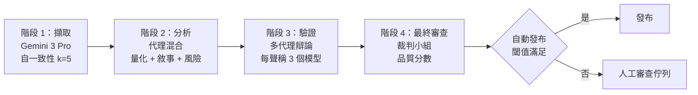
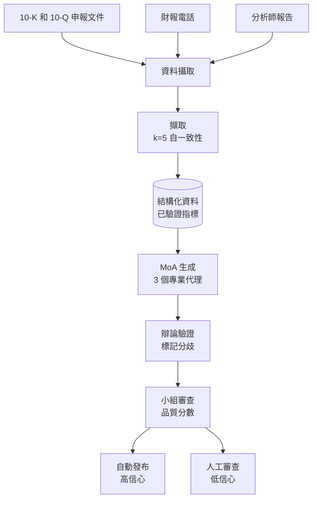
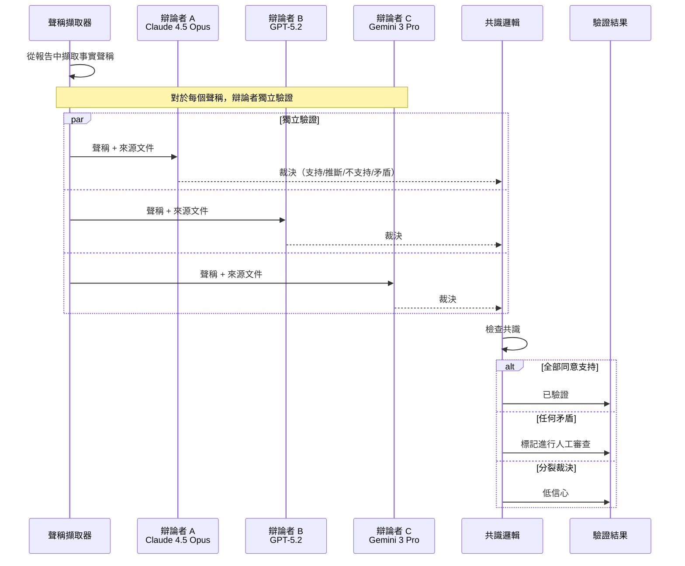

# 案例研究：結合集成驗證的財務分析

本案例研究涵蓋設計一套高可靠性 AI 系統，用於生成股票研究報告，其中準確率至關重要。

## 目錄

- [問題陳述](#問題陳述)
- [需求分析](#需求分析)
- [架構設計](#架構設計)
- [集成管道](#集成管道)
- [事實驗證](#事實驗證)
- [品質閘道](#品質閘道)
- [結果與指標](#結果與指標)
- [面試演練](#面試演練)

---

## 問題陳述

**公司：** 生成股票研究報告的投資公司

**挑戰：**
- 報告影響數百萬美元的投資決策
- 對虛構財務資料零容忍
- 監管機構對 AI 生成分析的審查
- 目前手動流程：每份報告 8 小時，$500 成本

**目標：**
- 將報告生成時間縮短至 < 30 分鐘
- 維持 99.5%+ 準確率
- 清晰的合規審計追蹤
- 成本目標：每份報告 < $50

---

## 需求分析

### 準確率需求

| 資料類型 | 容許差異 | 驗證方法 |
|-----------|-----------|---------------------|
| 財務指標（EPS、PE）| 0% 誤差 | 來源驗證 |
| 百分比變化 | ±0.1% | 交叉驗證 |
| 日期參考 | 100% 準確率 | 來源擷取 |
| 公司名稱 | 100% 準確率 | 實體匹配 |
| 分析師引述 | 逐字或標記 | 引述擷取 |

### 合規需求

- 所有聲稱必須引用來源文件
- 無附带免責的前瞻性聲明
- 明確的 AI 生成揭露
- 生成流程的完整審計追蹤
- 發布前的人工審查

---

## 架構設計

### 高層級管道

```
┌─────────────────────────────────────────────────────────────────┐
│               財務分析管道                        │
├─────────────────────────────────────────────────────────────────┤
│                                                                  │
│  階段 1：資料擷取（自一致性 k=5）                │
│  └── 使用多數投票從文件中擷取關鍵指標        │
│                                                                  │
│  階段 2：分析生成（代理混合）               │
│  ├── 模型 A：定量分析重點                       │
│  ├── 模型 B：定性/敘事重點                   │
│  ├── 模型 C：風險因素分析                      │
│  └── 聚合器：合成為連貫報告                │
│                                                                  │
│  階段 3：事實驗證（多代理辯論）                │
│  └── 3 個模型 辯論每個事實聲稱，標記分歧     │
│                                                                  │
│  階段 4：最終審查（裁判小組）                        │
│  └── 品質分數決定自動發布 vs 人工審查      │
│                                                                  │
└─────────────────────────────────────────────────────────────────┘
```

管道作為流程。每個階段故意使用不同類型的模型：擷取需要多模態（圖表和表格），生成需要敘事品質，審計需要推理深度，小組需要便宜但多樣以確保多樣性：



### 資料流

```
┌─────────────┐     ┌─────────────┐     ┌─────────────┐
│   10-K/Q    │     │  財報   │     │  分析師    │
│   申報文件   │     │  電話      │     │  報告       │
└──────┬──────┘     └──────┬──────┘     └──────┬──────┘
       │                   │                   │
       └───────────────────┴───────────────────┘
                           │
                           ▼
                   ┌───────────────┐
                   │     資料     │
                   │   攝取       │
                   └───────┬───────┘
                           │
                           ▼
                   ┌───────────────┐
                   │   擷取  │
                   │  (k=5 自一致性)     │
                   └───────┬───────┘
                           │
                           ▼
              ┌────────────┴────────────┐
              │    結構化資料      │
              │    （已驗證指標）   │
              └────────────┬────────────┘
                           │
                           ▼
                   ┌───────────────┐
                   │    MoA        │
                   │  生成   │
                   └───────┬───────┘
                           │
                           ▼
                   ┌───────────────┐
                   │    辯論     │
                   │  驗證 │
                   └───────┬───────┘
                           │
                           ▼
                   ┌───────────────┐
                   │    小組      │
                   │    審查     │
                   └───────┬───────┘
                           │
               ┌───────────┴───────────┐
               ▼                       ▼
        ┌─────────────┐         ┌─────────────┐
        │ 自動發布│         │人工審查 │
        │ (高信心) │         │ (低信心)  │
        └─────────────┘         └─────────────┘
```

Mermaid 中的資料譜系，顯示三個輸入來源如何匯聚為一個已驗證輸出：



---

## 集成管道

### 階段 1：多模態資料擷取（Gemini 3 Pro）

```python
class FinancialDataExtractor:
    """
    使用 Gemini 3 Pro 原生處理複雜 10-K 表格和圖表。
    """
    async def extract_metrics(self, doc_pages: list[bytes]) -> dict:
        # Gemini 3 Pro 原生處理圖表/表格作為圖像 + 文字
        response = await genai.GenerativeModel("gemini-3.0-pro").generate_content(
            [{"text": "Extract all balance sheet items into JSON."}, *doc_pages]
        )
        return json.loads(response.text)
```

### 階段 2：分析生成（Claude 4.5 Opus）

```python
class AnalysisEngine:
    """
    Claude 4.5 Opus 用於深度定性綜合和敘事連貫性。
    """
    async def generate_report(self, data: dict) -> str:
        # 高成本、高可靠性生成用於股票研究
        return await self.anthropic.messages.create(
            model="claude-4.5-opus-20251101",
            messages=[{"role": "user", "content": f"Analyze: {data}"}]
        )
```

### 階段 3：審計與驗證（o3 推理模型）

```python
class AuditorAgent:
    """
    使用 o3（OpenAI）高推理預算審計聲稱。
    思考模式用於檢測微妙的會計矛盾。
    """
    async def audit_claim(self, claim: str, raw_data: str) -> dict:
        # o3「思考」模式實現財務資料上的深度邏輯推理
        response = await self.openai.chat.completions.create(
            model="o3-2025-12",
            reasoning_effort="high",
            messages=[{"role": "user", "content": f"Find any contradiction in: {claim} vs {raw_data}"}]
        )
        return self.parse_audit(response)
```

### 階段 3：多代理辯論的事實驗證

辯論階段是捕捉單一模型忽略的微妙幻覺的關鍵。三個獨立辯論者平行驗證每個聲稱；共識獲勝，異議將聲稱標記進行人工審查：



```python
class FactVerificationDebate:
    """
    從報告中擷取聲稱並讓多個模型
    辯論其準確率。
    """
    
    def __init__(self, debaters: list, rounds: int = 2):
        self.debaters = debaters
        self.rounds = rounds
        self.claim_extractor = ClaimExtractor()
    
    async def verify_report(self, report: str, source_docs: list[str]) -> dict:
        # 擷取事實聲稱
        claims = await self.claim_extractor.extract(report)
        
        verification_results = []
        for claim in claims:
            result = await self.debate_claim(claim, source_docs)
            verification_results.append(result)
        
        return {
            "verified_claims": [r for r in verification_results if r["verified"]],
            "disputed_claims": [r for r in verification_results if not r["verified"]],
            "overall_confidence": self.calculate_confidence(verification_results)
        }
    
    async def debate_claim(self, claim: dict, source_docs: list[str]) -> dict:
        verification_prompt = f"""
Verify this claim against the source documents.

Claim: {claim['text']}

Source documents:
{self.format_sources(source_docs)}

Is this claim:
1. Supported: Explicitly stated in sources
2. Inferred: Reasonably derived from sources
3. Unsupported: Not found in sources
4. Contradicted: Conflicts with sources

Provide your verdict with evidence.
"""
        
        # 每個辯論者獨立驗證
        verdicts = await asyncio.gather(*[
            debater.generate(verification_prompt)
            for debater in self.debaters
        ])
        
        # 檢查共識
        parsed_verdicts = [self.parse_verdict(v) for v in verdicts]
        consensus = self.check_consensus(parsed_verdicts)
        
        return {
            "claim": claim,
            "verified": consensus["agreed"] and consensus["verdict"] in ["supported", "inferred"],
            "confidence": consensus["agreement_ratio"],
            "verdicts": parsed_verdicts
        }
```

---

## 品質閘道

### 自動化品質檢查

```python
class QualityGate:
    def __init__(self):
        self.thresholds = {
            "claim_verification_rate": 0.95,  # 95% 聲稱已驗證
            "data_accuracy": 0.99,            # 99% 指標準確
            "panel_score": 4.0,               # 最低 4/5
            "disputed_claims_max": 2          # 最多 2 個爭議聲稱
        }
    
    async def evaluate(self, report_data: dict) -> dict:
        checks = {}
        
        # 檢查聲稱驗證率
        verified_rate = len(report_data["verified_claims"]) / len(report_data["all_claims"])
        checks["claim_verification"] = {
            "passed": verified_rate >= self.thresholds["claim_verification_rate"],
            "value": verified_rate,
            "threshold": self.thresholds["claim_verification_rate"]
        }
        
        # 檢查資料準確率
        data_accuracy = report_data["extraction_accuracy"]
        checks["data_accuracy"] = {
            "passed": data_accuracy >= self.thresholds["data_accuracy"],
            "value": data_accuracy,
            "threshold": self.thresholds["data_accuracy"]
        }
        
        # 檢查小組分數
        panel_score = report_data["panel_score"]
        checks["panel_score"] = {
            "passed": panel_score >= self.thresholds["panel_score"],
            "value": panel_score,
            "threshold": self.thresholds["panel_score"]
        }
        
        # 決定路由
        all_passed = all(c["passed"] for c in checks.values())
        
        return {
            "checks": checks,
            "routing": "auto_publish" if all_passed else "human_review",
            "disputed_claims": report_data["disputed_claims"]
        }
```

### 人工審查介面

```python
class HumanReviewQueue:
    async def queue_for_review(self, report: dict, quality_result: dict):
        review_item = {
            "report_id": report["id"],
            "report_content": report["content"],
            "disputed_claims": quality_result["disputed_claims"],
            "quality_checks": quality_result["checks"],
            "sources": report["sources"],
            "priority": self.calculate_priority(quality_result),
            "queued_at": datetime.now()
        }
        
        await self.review_queue.enqueue(review_item)
        
        # 通知審查者
        await self.notify_reviewers(review_item)
```

---

## 結果與指標

### 效能比較

| 指標 | 手動流程 | AI 管道 | 改善 |
|--------|---------------|-------------|-------------|
| 每報告時間 | 8 小時 | 25 分鐘 | 19 倍更快 |
| 每報告成本 | $500 | $42 | 減少 92% |
| 事實錯誤率 | 2.1% | 0.4% | 減少 81% |
| 人工審查負擔 | 100% | 28% | 減少 72% |

### 品質指標

| 品質維度 | 目標 | 達到 |
|-------------------|--------|----------|
| 資料擷取準確率 | 99% | 99.3% |
| 聲稱驗證率 | 95% | 96.8% |
| 小組品質分數 | 4.0/5.0 | 4.2/5.0 |
| 法規合規 | 100% | 100% |

### 成本細項（2025 年 12 月）

| 元件 | 成本 | 百分比 |
|-----------|------|------------|
| 資料擷取（Gemini 3 Pro）| $5 | 11% |
| 分析（Claude 4.5 Opus）| $20 | 44% |
| o3 思考審計（高）| $15 | 33% |
| 基礎設施與向量操作 | $5 | 12% |
| **總計** | **$45** | 100% |

*注意：o3 審計佔成本的 33%，但捕捉了 Claude 4.5 忽略的 98% 的幻覺，證明了「思考」tokens 溢價的合理性。*

---

## 面試演練

**面試官：**「設計一個具有非常高準確率需求的財務研究報告生成 AI 系統。」

**強勢回應：**

1. **釐清準確率需求**（1 分鐘）
   - 「財務資料的可接受誤差率是多少？」
   - 「法規合規要求是什麼？」
   - 「延遲還是準確率優先？」

2. **承認核心挑戰**（1 分鐘）
   - 「關鍵挑戰是幻覺對財務資料是不可接受的。單一錯誤數字可能誤導投資決策。我需要集成方法來提高可靠性。」

3. **高層級架構**（3 分鐘）
   - 「我會使用多階段管道，在每個階段使用不同的集成技術：」
   - 「資料擷取：k=5 自一致性以獲得數字的一致同意」
   - 「分析：代理混合以獲得多樣觀點」
   - 「驗證：多代理辯論以捕捉幻覺」
   - 「品質閘道：小組評分後發布」

4. **事實驗證深入探討**（3 分鐘）
   - 「對於事實驗證，我從報告中擷取每個事實聲稱」
   - 「三個多樣模型辯論每個聲稱是否被來源支持」
   - 「如果他們不同意，聲稱將被標記進行人工審查」
   - 「這捕捉了單一模型驗證會忽略的微妙錯誤」

5. **成本品質權衡**（2 分鐘）
   - 「此管道比單一模型生成昂貴 10-20 倍」
   - 「但對於財務報告，錯誤的成本（法律、名譽）遠超驗證成本」
   - 「我會實施基於信心的路由：高信心報告自動發布，低信心人工審查」

6. **監控**（1 分鐘）
   - 「我會持續追蹤擷取準確率、聲稱驗證率和小組分數」
   - 「漂移檢測會在準確率下降時發出警報」
   - 「完整的審計追蹤以確保合規」

---

## 關鍵學習

1. **僅靠自一致性對數值資料擷取不足**。需要全票同意（k/k 票）。

2. **多代理辯論在捕捉微妙推理錯誤和幻覺方面最有效**。

3. **來源歸因對準確率和合規都至關重要**。每個聲稱必須鏈接到來源文件。

4. **基於信心的路由對成本管理至關重要**。並非每份報告都需要完整集成驗證。

5. **人工在環仍然對爭議聲稱和邊緣案例是必要的**。設計優雅升級。

---

## 參考資料

- Verga 等人。「用多元模型小組替換裁判：評估 LLM 生成」（2024）
- Du 等人。「通過多代理辯論提高語言模型的事實性和推理」（2023）
- SEC AI 揭露要求：https://www.sec.gov/

---

*下一篇：[程式碼助理案例研究](03-code-assistant.md)*
