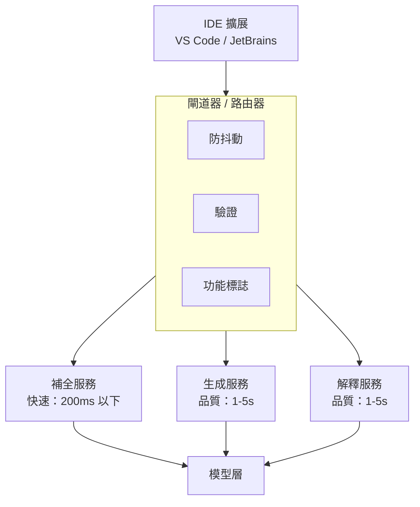
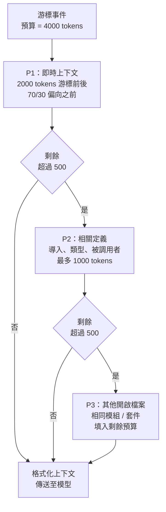
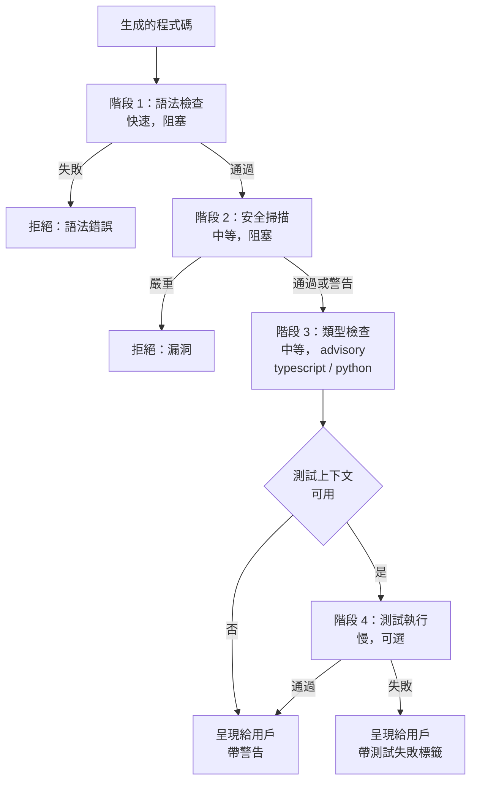

# 案例研究：AI 程式碼助理

本案例研究涵蓋設計一套提供即時建議、程式碼生成和調試幫助的生產程式碼助理。

## 目錄

- [問題陳述](#問題陳述)
- [需求分析](#需求分析)
- [架構設計](#架構設計)
- [程式碼生成管道](#程式碼生成管道)
- [品質保證](#品質保證)
- [效能優化](#效能優化)
- [結果與指標](#結果與指標)
- [面試演練](#面試演練)

---

## 問題陳述

**公司：** 構建 IDE 擴展的開發者工具公司

**目標：**
- 開發者輸入時提供即時代碼補全
- 從自然語言生成多行程式碼
- 程式碼解釋和調試協助
- 支援 20+ 程式語言

**約束：**
- 補全延遲 < 200ms（打字流暢度）
- 生成延遲 < 3s（可接受的暫停）
- 安全：程式碼不得離開客戶基礎設施（企業選項）
- 成本：在規模上可持續（數百萬開發者）

---

## 需求分析

### 功能需求

| 功能 | 說明 | 延遲目標 |
|---------|-------------|----------------|
| 行內補全 | 完成目前行/區塊 | < 200ms |
| 多行生成 | 從註釋生成函數/類別 | < 3s |
| 程式碼解釋 | 解釋選取的程式碼 | < 5s |
| 錯誤修復 | 建議錯誤修復 | < 2s |
| 重構 | 建議改進 | < 5s |
| 文件 | 生成文件字串 | < 2s |

### 品質需求

| 維度 | 目標 | 測量方式 |
|-----------|--------|-------------|
| 接受率 | > 30% | 展示/接受建議 |
| 語法正確率 | > 99% | 編譯/解析成功 |
| 安全性 | 0 漏洞 | SAST 掃描通過率 |
| 相關性 | > 85% | 用戶評分 |

---

## 架構設計

### 高層級架構

```
┌─────────────────────────────────────────────────────────────────┐
│                    程式碼助理架構                   │
├─────────────────────────────────────────────────────────────────┤
│                                                                  │
│  ┌─────────────┐                                                │
│  │     IDE     │                                                │
│  │  擴展  │                                                │
│  └──────┬──────┘                                                │
│         │                                                        │
│         ▼                                                        │
│  ┌─────────────────────────────────────────────────────────┐    │
│  │                    閘道器 / 路由器                      │    │
│  │  ┌──────────┐  ┌──────────┐  ┌──────────┐              │    │
│  │  │ 防抖動 │  │  驗證    │  │ 功能   │              │    │
│  │  │          │  │          │  │  標誌   │              │    │
│  │  └──────────┘  └──────────┘  └──────────┘              │    │
│  └─────────────────────────┬───────────────────────────────┘    │
│                            │                                     │
│         ┌──────────────────┼──────────────────┐                 │
│         ▼                  ▼                  ▼                 │
│  ┌─────────────┐    ┌─────────────┐    ┌─────────────┐         │
│  │  補全服務   │    │ 生成服務    │    │ 解釋服務    │         │
│  │  （快速）    │    │ （品質）   │    │ （品質）   │         │
│  └──────┬──────┘    └──────┬──────┘    └──────┬──────┘         │
│         │                  │                  │                  │
│         └──────────────────┼──────────────────┘                 │
│                            ▼                                     │
│                    ┌─────────────┐                              │
│                    │   型     │
│                    │   層     │
│                    └─────────────┘                              │
│                                                                  │
└─────────────────────────────────────────────────────────────────┘
```

作為流程的架構。三個服務層按延遲 vs 品質分開（補全在 200ms 以下，生成和解釋優先品質），共享一個模型層：



### 上下文組裝

```python
class CodeContextAssembler:
    """
    組裝程式碼補全的上下文。
    挑戰：在延遲和上下文豐富度之間取得平衡。
    """
    
    def __init__(self, max_tokens: int = 4000):
        self.max_tokens = max_tokens
    
    def assemble(
        self,
        cursor_position: dict,
        file_content: str,
        open_files: list[dict],
        project_context: dict
    ) -> str:
        context_parts = []
        remaining_tokens = self.max_tokens
        
        # 優先順序 1：即時上下文（游標前後）
        immediate = self.get_immediate_context(
            file_content, cursor_position, tokens=2000
        )
        context_parts.append(immediate)
        remaining_tokens -= count_tokens(immediate)
        
        # 優先順序 2：相關導入和定義
        if remaining_tokens > 500:
            related = self.get_related_definitions(
                file_content, cursor_position, tokens=min(1000, remaining_tokens)
            )
            context_parts.append(related)
            remaining_tokens -= count_tokens(related)
        
        # 優先順序 3：其他開啟的檔案（相同模組/套件）
        if remaining_tokens > 500:
            other_files = self.get_relevant_open_files(
                open_files, cursor_position, tokens=remaining_tokens
            )
            context_parts.append(other_files)
        
        return self.format_context(context_parts)
    
    def get_immediate_context(
        self,
        content: str,
        cursor: dict,
        tokens: int
    ) -> str:
        lines = content.split("\n")
        cursor_line = cursor["line"]
        
        # 獲取游標前的行（更重要）
        before_ratio = 0.7
        before_tokens = int(tokens * before_ratio)
        after_tokens = tokens - before_tokens
        
        # 從游標向外擴展
        before_lines = lines[:cursor_line]
        after_lines = lines[cursor_line:]
        
        # 截斷以符合
        before_text = self.truncate_to_tokens(
            "\n".join(before_lines), before_tokens, from_end=True
        )
        after_text = self.truncate_to_tokens(
            "\n".join(after_lines), after_tokens, from_end=False
        )
        
        return f"{before_text}\n<CURSOR>\n{after_text}"
```

上下文組裝是一個基於優先順序的預算分配。模型只看到在 4000 token 上限中存活下來的內容，所以順序很重要：即時程式碼優先（總是符合），然後是相關定義，然後才是在有剩餘預算時的其他開啟檔案：



---

## 程式碼生成管道

### 補全服務（2025 年 12 月）

```python
class DeepCompletion:
    """
    使用投機解碼實現亞 150ms 延遲。
    """
    def __init__(self):
        self.model = "o4-mini"  # 原生程式碼優化的小模型
        self.draft_model = "nano-code-1b" # 本地設備上的小型模型
    
    async def complete(self, context: str) -> str:
        # 投機解碼：1B 模型起草，o4-mini 驗證
        return await self.openai.generate(
            model=self.model,
            draft_model=self.draft_model,
            prompt=context,
            max_tokens=64
        )
```

### 生成服務（「Claude Code」時代）

```python
class AgenticGeneration:
    """
    使用 Claude Sonnet 4.6（混合）進行自主重構。
    """
    async def refactor_module(self, folder_path: str):
        # 啟用「思考」的 Claude Sonnet 4.6 以確保架構一致性
        agent = ClaudeCodeAgent(
            model="claude-3-7-sonnet",
            tools=["ls", "read_file", "write_file", "test_runner"]
        )
        
        # 代理探索程式碼庫、理解依賴關係並應用修復
        return await agent.run(f"Refactor {folder_path} to use async/await.")
```

> [!TIP]
> **生產選擇：** 雖然 Claude Opus 4.7 是編碼強者，但 **Claude Sonnet 4.6** 在 2025 年 12 月是 IDE 的首選生產選擇，因為其**混合推理**：開發者可以為困難 bug 切換「思考」，為樣板程式碼切換「快速」。

---

## 品質保證

### 多階段驗證

驗證器是一個快速失敗的關卡。廉價檢查（語法）首先運行並嚴格阻止；昂貴檢查（測試執行）最後運行，僅在上下文允許時運行。任何阻塞失敗都會短路其餘部分：



```python
class CodeVerifier:
    """
    在呈現給用戶之前驗證生成的程式碼。
    """
    
    async def verify(self, code: str, language: str, context: str) -> VerificationResult:
        results = {}
        
        # 階段 1：語法檢查（快速，阻塞）
        syntax_ok = self.check_syntax(code, language)
        if not syntax_ok:
            return VerificationResult(passed=False, reason="syntax_error")
        
        # 階段 2：安全掃描（中等，阻塞）
        security = await self.security_scan(code, language)
        if security.has_critical:
            return VerificationResult(passed=False, reason="security_vulnerability")
        results["security"] = security
        
        # 階段 3：類型檢查（如適用，中等）
        if language in ["typescript", "python"]:
            type_result = await self.type_check(code, context, language)
            results["types"] = type_result
        
        # 階段 4：測試執行（如可用，慢，可選）
        if self.has_test_context(context):
            test_result = await self.run_tests(code, context)
            results["tests"] = test_result
        
        return VerificationResult(
            passed=True,
            details=results,
            warnings=security.warnings if security else []
        )
    
    def check_syntax(self, code: str, language: str) -> bool:
        parsers = {
            "python": self.parse_python,
            "javascript": self.parse_javascript,
            "typescript": self.parse_typescript,
            # ... 其他語言
        }
        
        parser = parsers.get(language)
        if not parser:
            return True  # 無法驗證，假定 OK
        
        try:
            parser(code)
            return True
        except SyntaxError:
            return False
    
    async def security_scan(self, code: str, language: str) -> SecurityResult:
        # 運行靜態分析
        if language == "python":
            result = await self.run_bandit(code)
        elif language in ["javascript", "typescript"]:
            result = await self.run_eslint_security(code)
        else:
            result = await self.run_semgrep(code, language)
        
        return result
```

### 接受率優化

```python
class AcceptanceOptimizer:
    """
    從用戶接受模式中學習以改進建議。
    """
    
    def __init__(self):
        self.feedback_store = FeedbackStore()
    
    async def record_feedback(
        self,
        suggestion_id: str,
        accepted: bool,
        edited: bool,
        context_hash: str
    ):
        await self.feedback_store.record({
            "suggestion_id": suggestion_id,
            "accepted": accepted,
            "edited": edited,
            "context_hash": context_hash,
            "timestamp": datetime.now()
        })
    
    async def should_show_suggestion(
        self,
        suggestion: str,
        confidence: float,
        user_context: dict
    ) -> bool:
        # 類似建議的歷史接受率
        historical_rate = await self.get_historical_rate(
            user_context["user_id"],
            user_context["language"],
            confidence
        )
        
        # 基於用戶偏好的閾值
        threshold = user_context.get("suggestion_threshold", 0.3)
        
        # 僅在可能接受時展示
        return (confidence * historical_rate) > threshold
```

---

## 效能優化

### 延遲優化

| 技術 | 影響 | 實作 |
|-----------|--------|----------------|
| 請求防抖動 | -50ms | IDE 中 150ms 防抖動 |
| 連線池化 | -30ms | 持久 HTTP/2 |
| 模型預熱 | -100ms | 預先載入模型 |
| 投機解碼 | -40% | 起草模型 + 驗證 |
| 邊緣快取 | -80ms | 常見模式的 CDN |

### 快取策略

```python
class CompletionCache:
    """
    補全的多級快取。
    """
    
    def __init__(self):
        self.local_cache = LRUCache(max_size=10000)  # 記憶體中
        self.redis_cache = Redis()  # 分散式
    
    def get_cache_key(self, context: str) -> str:
        # 對上下文進行雜湊以獲取快取金鑰
        # 包含語言和游標位置
        return hashlib.sha256(context.encode()).hexdigest()[:16]
    
    async def get(self, context: str) -> str | None:
        key = self.get_cache_key(context)
        
        # 首先檢查本地
        local = self.local_cache.get(key)
        if local:
            return local
        
        # 檢查分散式
        remote = await self.redis_cache.get(f"completion:{key}")
        if remote:
            self.local_cache.set(key, remote)
            return remote
        
        return None
    
    async def set(self, context: str, completion: str):
        key = self.get_cache_key(context)
        
        # 設定於兩個快取中
        self.local_cache.set(key, completion)
        await self.redis_cache.setex(
            f"completion:{key}",
            3600,  # 1 小時 TTL
            completion
        )
```

---

## 結果與指標

### 效能結果

| 指標 | 目標 | 達到 |
|--------|--------|----------|
| 補全延遲（p50）| < 200ms | 145ms |
| 補全延遲（p99）| < 500ms | 380ms |
| 生成延遲（p50）| < 3s | 2.1s |
| 語法正確率 | > 99% | 99.5% |
| 安全性（零高嚴重性）| 100% | 99.8% |
| 接受率 | > 30% | 34% |

### 成本分析（2025 年 12 月）

| 元件 | 每 100 萬建議成本 | 備註 |
|-----------|------------------------|-------|
| **補全（o4-mini）** | $0.20 | 為大量優化 |
| **代理任務（Claude Sonnet 4.6）** | $45.00 | 假設 10k tokens + 思考 |
| **驗證（本地）** | $0.00 | 轉移至設備上的 Nano |
| **基礎設施** | $15.00 | 受管 GPU 服務 |
| **總計（混合）** | **~$12.00** | **較 2024 年減少 90%** |

*混合成本假設 98% 補全，2% 高價值代理重構。*

---

## 面試演練

**面試官：**「為 IDE 設計一個 AI 程式碼助理。」

**強勢回應：**

1. **釐清需求**（1 分鐘）
   - 「補全與生成的目標延遲是多少？」
   - 「企業部署與就地選項？」
   - 「需要支援哪些語言？」

2. **識別關鍵挑戰**（1 分鐘）
   - 「核心張力是延遲與品質。補全需要 < 200ms 以保持打字流暢，但好的程式碼需要豐富上下文和驗證。」

3. **雙層架構**（3 分鐘）
   - 「我會將補全（快速）與生成（品質）分開：」
   - 「補全：較小模型、最小上下文、投機解碼」
   - 「生成：前沿模型、best-of-N、語法和安全驗證」

4. **上下文組裝**（2 分鐘）
   - 「討論優先順序：即時上下文、相關定義、專案範圍」
   - 「4000 token 預算的優先順序分配」

5. **驗證策略**（2 分鐘）
   - 「多階段驗證：語法 → 安全 → 類型 → 測試」
   - 「失敗快速短路」

6. **成本優化**（1 分鐘）
   - 「補全量大大超過生成量」
   - 「快取和投機解碼顯著降低成本」

---

*下一篇：[內容審核案例研究](04-content-moderation.md)*
