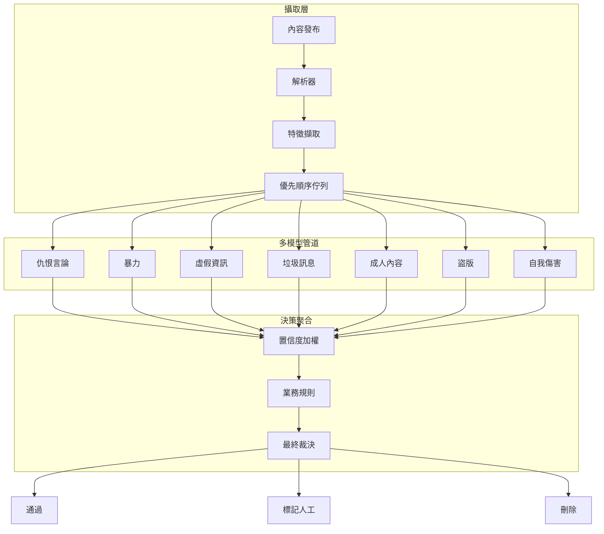
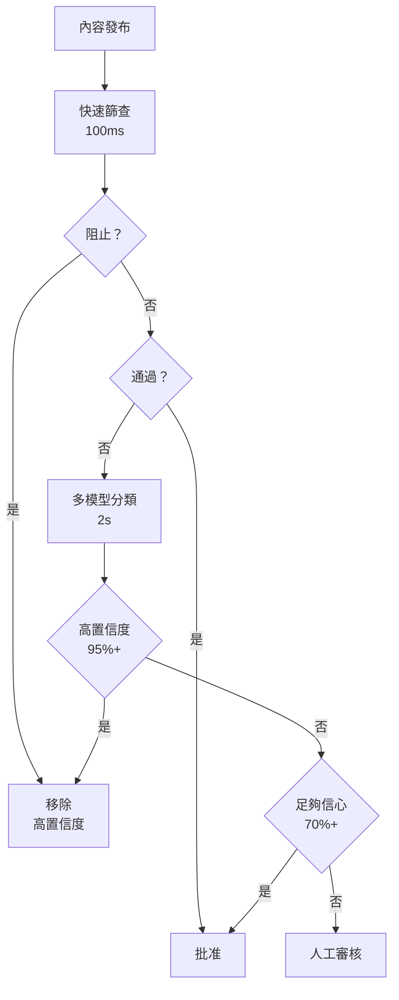

# 案例研究：內容審核系統

本案例研究涵蓋設計一套大規模的 AI 內容審核系統，用於社交媒體平台。

## 目錄

- [問題陳述](#問題陳述)
- [需求分析](#需求分析)
- [架構設計](#架構設計)
- [審核管道](#審核管道)
- [使用者舉報管道](#使用者舉報管道)
- [成本分析](#成本分析)
- [面試演練](#面試演練)

---

## 問題陳述

**公司：** 擁有 5 億使用者的社交媒體平台

**挑戰：**
- 每日 10 億則內容發布
- 需要在 < 30 秒內審核
- 多種違規類型（仇恨言論、暴力、虛假資訊等）
- 誤判影響用户体验
- 區域合規要求（歐盟 DSA、德國 NetzDG 等）

**目標：**
- 95%+ 準確率
- 30 秒內完成審核
- 誤判率 < 3%
- 7x24 可用性

---

## 需求分析

### 違規類型

| 類型 | 說明 | 審核難度 |
|-----------|-------------|---------------|
| 仇恨言論 | 針對群體的攻擊性言論 | 中等 |
| 暴力內容 | 暴力圖片/影片 | 高 |
| 虛假資訊 | 誤導性健康/政治內容 | 高 |
| 垃圾訊息 | 商業垃圾郵件 | 低 |
| 成人內容 | 色情內容 | 中等 |
| 盜版內容 | 侵權材料 | 中等 |
| 自我傷害 | 自殺/自傷內容 | 高 |

### 延遲需求

| 管道 | P50 | P99 | 理由 |
|-------------|--------|--------|----------------|
| 自動化審核 | 5s | 15s | 速度至關重要 |
| 使用者舉報 | 30s | 60s | 人力 involved |
| 上訴 | 5 分鐘 | 15 分鐘 | 批量處理 |

---

## 架構設計

### 高層級架構

```
┌─────────────────────────────────────────────────────────────────┐
│                    內容審核平台                        │
├─────────────────────────────────────────────────────────────────┤
│                                                                  │
│  ┌──────────────────────────────────────────────────────────┐   │
│  │                    攝取層                           │   │
│  │  內容 → 解析 → 特徵擷取 → 排隊                │   │
│  └──────────────────────────────────────────────────────────┘   │
│                            │                                     │
│                            ▼                                     │
│  ┌──────────────────────────────────────────────────────────┐   │
│  │                   多模型管道                        │   │
│  │                                                          │   │
│  │   ┌─────────┐  ┌─────────┐  ┌─────────┐  ┌─────────┐    │   │
│  │   │ 仇恨言論 │  │ 暴力   │  │ 虛假    │  │ 垃圾    │    │   │
│  │   │ 檢測器  │  │ 檢測器 │  │ 資訊    │  │ 訊息    │    │   │
│  │   └─────────┘  └─────────┘  └─────────┘  └─────────┘    │   │
│  │                                                          │   │
│  │   ┌─────────┐  ┌─────────┐  ┌─────────┐                 │   │
│  │   │ 成人    │  │ 盜版    │  │ 自我    │                 │   │
│  │   │ 內容    │  │ 內容    │  │ 傷害    │                 │   │
│  │   └─────────┘  └─────────┘  └─────────┘                 │   │
│  └──────────────────────────────────────────────────────────┘   │
│                            │                                     │
│                            ▼                                     │
│  ┌──────────────────────────────────────────────────────────┐   │
│  │                   決策聚合                        │   │
│  │   置信度加權 → 規則 → 最終裁決            │   │
│  └──────────────────────────────────────────────────────────┘   │
│                            │                                     │
│         ┌──────────────────┼──────────────────┐                 │
│         ▼                  ▼                  ▼                 │
│  ┌─────────────┐    ┌─────────────┐    ┌─────────────┐         │
│  │    通過     │    │   標記     │    │   刪除     │         │
│  │             │    │  (人工)    │    │             │         │
│  └─────────────┘    └─────────────┘    └─────────────┘         │
│                                                                  │
└─────────────────────────────────────────────────────────────────┘
```

三層架構，強調安全護欄（任何單一模型錯誤不應導致錯誤刪除）和分層延遲（快速路徑 < 30s，複雜案例退回人工）：



---

## 審核管道

### 階層化審核

```python
class HierarchicalModeration:
    """
    內容審核的階層化方法。
    便宜的快速模型先運行，昂貴的推理按需觸發。
    """
    
    async def moderate(self, content: Content) -> ModerationResult:
        # 階段 1：快速粗篩（< 100ms）
        fast_result = await self.fast_screener(content)
        if fast_result.decision == "block":
            return ModerationResult(
                decision="remove",
                reason="fast_screener_block",
                confidence=0.9
            )
        
        if fast_result.decision == "pass":
            return ModerationResult(
                decision="approve",
                confidence=fast_result.confidence
            )
        
        # 階段 2：多模型分類（< 2s）
        # 沒有快速決策，運行所有專門模型
        model_results = await asyncio.gather(*[
            self.classify_with_model(content, model_name)
            for model_name in self.active_models
        ])
        
        # 階段 3：置信度加權決策
        decision = self.aggregate_decisions(model_results)
        
        if decision.confidence > 0.95:
            return decision
        
        # 階段 4：低置信度 → 人工審核
        if decision.confidence < 0.7:
            return await self.escalate_to_human(content, decision)
        
        return decision
    
    async def fast_screener(self, content: Content) -> FastResult:
        # 快速、輕量篩查模型
        result = await self.light_model.predict(content)
        return result
    
    async def classify_with_model(
        self,
        content: Content,
        model_name: str
    ) -> ModelResult:
        model = self.models[model_name]
        
        # 處理不同類型的內容
        if content.type == "text":
            result = await model.classify_text(content.text)
        elif content.type == "image":
            result = await model.classify_image(content.image)
        elif content.type == "video":
            result = await model.classify_video(content.video, content.thumbnail)
        else:
            result = ModelResult(decision="unknown", confidence=0.0)
        
        return ModelResult(
            model_name=model_name,
            decision=result.decision,
            confidence=result.confidence,
            categories=result.categories
        )
    
    def aggregate_decisions(self, results: list[ModelResult]) -> ModerationResult:
        # 置信度加權投票
        # 某些模型對某些類別更準確
        category_weights = {
            "hate_speech": {"hate_model": 0.6, "safety_model": 0.4},
            "violence": {"violence_model": 0.7, "safety_model": 0.3},
            "misinformation": {"fact_check_model": 0.5, "safety_model": 0.5},
            # ...
        }
        
        decisions = []
        for result in results:
            weight = category_weights.get(result.category, {}).get(
                result.model_name, 0.5
            )
            decisions.append({
                "decision": result.decision,
                "confidence": result.confidence * weight
            })
        
        # 最高置信度決策獲勝
        best = max(decisions, key=lambda x: x["confidence"])
        
        return ModerationResult(
            decision=best["decision"],
            confidence=best["confidence"],
            model_results=results
        )
```

階層化流程。安全護欄確保單一模型錯誤不會導致錯誤刪除。成本護欄在置信度足夠高時提前退出昂貴模型：



### 虛假資訊專門管道

```python
class MisinformationDetector:
    """
    使用 RAG 和事實核查資料庫檢測虛假資訊。
    """
    
    async def check_claim(
        self,
        text: str,
        context: dict
    ) -> ClaimCheckResult:
        # 1. 擷取聲稱
        claims = await self.claim_extractor.extract(text)
        
        results = []
        for claim in claims:
            # 2. 搜尋事實核查資料庫
            fact_checks = await self.fact_check_db.search(
                claim=claim.text,
                topics=context.get("topics", [])
            )
            
            if not fact_checks:
                # 3. 沒有已知事實核查，標記為「未經核查」
                results.append({
                    "claim": claim.text,
                    "status": "unchecked",
                    "confidence": 0.5
                })
                continue
            
            # 4. 比較 claim 與 fact checks
            match = self.match_claim_to_factcheck(claim, fact_checks)
            
            if match.alignment == "supports":
                results.append({
                    "claim": claim.text,
                    "status": "supported",
                    "fact_check": match.source,
                    "confidence": match.confidence
                })
            elif match.alignment == "contradicts":
                results.append({
                    "claim": claim.text,
                    "status": "false",
                    "fact_check": match.source,
                    "confidence": match.confidence
                })
            else:
                results.append({
                    "claim": claim.text,
                    "status": "disputed",
                    "fact_check": match.source,
                    "confidence": 0.3
                })
        
        return self.aggregate_results(results)
```

---

## 使用者舉報管道

```python
class UserReportingPipeline:
    """
    處理使用者對已發布內容的舉報。
    """
    
    async def process_report(
        self,
        report: UserReport,
        content: Content
    ) -> ReportResult:
        # 1. 驗證舉報者權限
        if not await self.validate_reporter(report.user_id, content.author_id):
            return ReportResult(status="invalid", reason="permission_denied")
        
        # 2. 快速自動化檢查
        automated_check = await self.moderation.moderate(content)
        
        if automated_check.decision == "remove":
            # 內容已被標記，記錄報告
            return ReportResult(
                status="auto_removed",
                decision=automated_check
            )
        
        # 3. 優先順序基於報告數量和嚴重性
        priority = self.calculate_priority(report, content)
        
        # 4. 加入人工審核佇列
        review_item = {
            "content": content,
            "report": report,
            "priority": priority,
            "previous_decisions": automated_check
        }
        
        await self.human_review_queue.enqueue(review_item)
        
        return ReportResult(
            status="queued",
            priority=priority,
            queue_position=await self.human_review_queue.get_position(review_item)
        )
```

---

## 成本分析

### 審核成本細項（2025 年 12 月）

| 類型 | 數量/天 | 成本/1K | 每日成本 |
|-------------|----------------|---------------|------------|
| 文字審核 | 8 億 | $0.10 | $80,000 |
| 圖片審核 | 2 億 | $0.50 | $100,000 |
| 影片審核 | 1,000 萬 | $2.00 | $20,000 |
| 人工審核 | 100 萬 | $5.00 | $5,000,000 |
| **總計** | | | **$5,200,000/天** |

### 成本優化策略

| 策略 | 節省 | 實作 |
|-----------|--------|----------------|
| 快速退出 | 60% | 高置信度決策提前退出 |
| 模型蒸餾 | 40% | 蒸餾模型用於快速路徑 |
| 人機比例 | 30% | 減少人工審核需求 |

---

## 面試演練

**面試官：**「為社交媒體平台設計一個大規模內容審核系統。」

**強勢回應：**

1. **釐清需求**（2 分鐘）
   - 「每日内容量和目標延遲是多少？」
   - 「有哪些違規類型？」
   - 「區域合規要求？」

2. **階層化方法**（3 分鐘）
   - 「核心設計是階層化管道，快速模型先運行」
   - 「高置信度決策提前退出以節省成本」
   - 「低置信度退回人工」

3. **多模型聚合**（3 分鐘）
   - 「每種違規類型有專門模型」
   - 「置信度加權聚合減少單一模型錯誤」
   - 「安全護欄防止錯誤刪除」

4. **延遲優化**（2 分鐘）
   - 「快速篩查 < 100ms」
   - 「多模型並行」
   - 「CDN 用於熱門內容快取」

5. **成本考量**（1 分鐘）
   - 「人工審核是最大成本」
   - 「蒸餾和快速退出優化成本」

---

*下一篇：[即時搜尋案例研究](05-real-time-search.md)*
