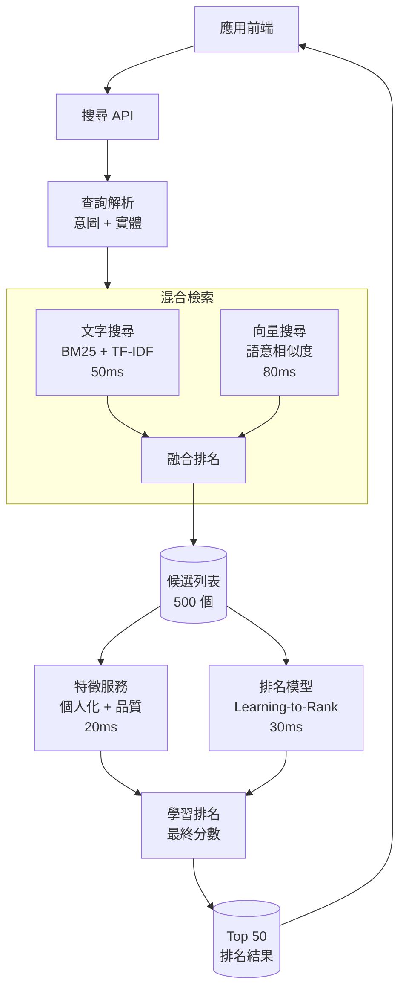

# 案例研究：即時搜尋排名

本案例研究涵蓋設計一套低延遲、高相關性的搜尋排名系統。

## 目錄

- [問題陳述](#問題陳述)
- [需求分析](#需求分析)
- [架構設計](#架構設計)
- [排名管道](#排名管道)
- [延遲優化](#延遲優化)
- [成本分析](#成本分析)
- [面試演練](#面試演練)

---

## 問題陳述

**公司：** 電子商務平台，日活躍使用者 5,000 萬

**挑戰：**
- 搜尋查詢延遲 < 200ms
- 處理每秒 10 萬次查詢
- 平衡相關性與商業目標
- 個人化又不影響公平性

**目標：**
- 延遲 P50 < 100ms
- 延遲 P99 < 300ms
- 點擊率提升 15%
- 轉化率提升 10%

---

## 需求分析

### 功能需求

| 功能 | 說明 | 延遲目標 |
|---------|-------------|----------------|
| 文字搜尋 | 關鍵字 + 語意 | < 50ms |
| 語意搜尋 | 向量相似度 | < 80ms |
| 個人化 | 使用者偏好 | < 20ms |
| 暢銷排行 | 商業信號 | < 10ms |
| 篩選/ facet | 多維度過濾 | < 30ms |

### 排名因素

| 類型 | 權重 | 說明 |
|-----------|--------|------------|
| 相關性 | 40% | TF-IDF、BM25、語意相似度 |
| 品質分數 | 20% | 產品評分、評論數 |
| 個人化 | 15% | 歷史行為、偏好 |
| 商業信號 | 15% | 暢銷程度、促銷 |
| 新鮮度 | 10% | 上架時間、趨勢 |

---

## 架構設計

### 高層級架構

```
┌─────────────────────────────────────────────────────────────────┐
│                    即時搜尋架構                        │
├─────────────────────────────────────────────────────────────────┤
│                                                                  │
│  ┌─────────────┐     ┌─────────────┐     ┌─────────────┐        │
│  │   應用前端   │────▶│   搜尋    │────▶│   排名     │        │
│  │             │     │   API     │     │   服務     │        │
│  └─────────────┘     └──────┬──────┘     └──────┬──────┘        │
│                             │                      │              │
│                             ▼                      ▼              │
│                    ┌─────────────┐         ┌─────────────┐       │
│                    │   查詢     │         │   特徵     │       │
│                    │   解析     │         │   服務     │       │
│                    └─────────────┘         └──────┬──────┘       │
│                                                    │              │
│         ┌──────────────────────────────────────────┼───────────┐  │
│         ▼                                          ▼           │  │
│  ┌─────────────┐                          ┌─────────────┐      │  │
│  │   索引     │                          │   模型     │      │  │
│  │   服務     │                          │   服務     │      │  │
│  └──────┬──────┘                          └──────┬──────┘      │  │
│         │                                        │             │  │
│         └────────────────┬───────────────────────┘             │  │
│                          ▼                                      │  │
│                   ┌─────────────┐                               │  │
│                   │   向量     │                               │  │
│                   │   資料庫   │                               │  │
│                   └─────────────┘                               │  │
│                                                                  │
└─────────────────────────────────────────────────────────────────┘
```

雙路徑搜尋（文字 + 向量）並行運行，在排名服務中合併為單一候選列表，然後由 ML 模型重新排序：



---

## 排名管道

### 兩階段排名

```python
class TwoStageRanker:
    """
    兩階段排名：候選選生成 → Learning-to-Rank。
    """
    
    async def rank(
        self,
        query: str,
        user_context: dict,
        filters: dict,
        top_k: int = 50
    ) -> list[SearchResult]:
        
        # 階段 1：候選選生成（< 100ms 總目標）
        candidates = await self.generate_candidates(
            query=query,
            filters=filters,
            max_candidates=500
        )
        
        # 階段 2：Learning-to-Rank（< 50ms 總目標）
        ranked = await self.ltr_rank(
            query=query,
            candidates=candidates,
            user_context=user_context,
            features=self.fetch_features(candidates)
        )
        
        return ranked[:top_k]
    
    async def generate_candidates(
        self,
        query: str,
        filters: dict,
        max_candidates: int
    ) -> list[Candidate]:
        
        # 平行文字和向量搜尋
        text_results, vector_results = await asyncio.gather(
            self.text_search(query, filters, max_candidates // 2),
            self.vector_search(query, filters, max_candidates // 2)
        )
        
        # 融合結果
        fused = self.hybrid_fusion(
            text_results,
            vector_results,
            weights=[0.6, 0.4]  # 文字優先
        )
        
        return fused[:max_candidates]
    
    async def ltr_rank(
        self,
        query: str,
        candidates: list[Candidate],
        user_context: dict,
        features: dict
    ) -> list[SearchResult]:
        
        # 為每個候選項計算 LTR 分數
        scored = []
        for candidate in candidates:
            feature_vector = self.build_features(
                query=query,
                candidate=candidate,
                user_context=user_context,
                precomputed=features.get(candidate.id, {})
            )
            
            score = await self.ltr_model.predict(feature_vector)
            scored.append((candidate, score))
        
        # 按分數排序
        scored.sort(key=lambda x: x[1], reverse=True)
        
        return [SearchResult(item=c, score=s) for c, s in scored]
```

### 特徵工程

```python
class FeatureService:
    """
    搜尋排名的特徵工程。
    """
    
    async def fetch_features(
        self,
        candidates: list[Candidate],
        user_id: str
    ) -> dict[str, dict]:
        candidate_ids = [c.id for c in candidates]
        
        # 平行獲取各類特徵
        quality_features, personal_features, context_features = await asyncio.gather(
            self.get_quality_features(candidate_ids),
            self.get_personal_features(candidate_ids, user_id),
            self.get_context_features(candidate_ids)
        )
        
        return {
            "quality": quality_features,
            "personal": personal_features,
            "context": context_features
        }
    
    async def get_quality_features(self, candidate_ids: list[str]) -> dict:
        # 產品品質分數、評論數、評分分佈
        return await self.redis.mget(
            f"quality:{cid}" for cid in candidate_ids
        )
    
    async def get_personal_features(
        self,
        candidate_ids: list[str],
        user_id: str
    ) -> dict:
        # 使用者-物品互動歷史、偏好、品牌親和力
        user_profile = await self.user_profile_service.get(user_id)
        
        return {
            cid: {
                "view_history_score": self.calc_view_score(cid, user_profile),
                "purchase_history_score": self.calc_purchase_score(cid, user_profile),
                "brand_affinity": user_profile.get_brand_affinity(cid.brand),
                "category_affinity": user_profile.get_category_affinity(cid.category)
            }
            for cid in candidate_ids
        }
```

---

## 延遲優化

### 延遲預算分配

| 階段 | 預算 | 策略 |
|-------------|--------|----------------|
| 網路開銷 | 20ms | 地理分散式部署 |
| 查詢解析 | 10ms | 快取常見查詢模式 |
| 文字搜尋 | 30ms | 倒排索引、記憶體 |
| 向量搜尋 | 50ms | ANN、預先計算 |
| 特徵獲取 | 20ms | Redis 快取 |
| LTR 排名 | 20ms | 輕量模型、批量預測 |
| 網路開銷 | 20ms | 壓縮回應 |
| **總計** | **< 170ms** | |

### 快取策略

```python
class SearchCache:
    def __init__(self):
        self.exact_cache = Redis(ttl=300)  # 5 分鐘
        self.semantic_cache = SemanticCache(
            threshold=0.95,
            ttl=3600  # 1 小時
        )
    
    async def get_or_compute(
        self,
        query: str,
        user_context: dict
    ) -> list[SearchResult]:
        # 精確快取
        cache_key = self.make_cache_key(query, user_context)
        cached = await self.exact_cache.get(cache_key)
        if cached:
            return cached
        
        # 語意快取
        semantic_key = await self.semantic_cache.get(query)
        if semantic_key:
            cached = await self.exact_cache.get(semantic_key)
            if cached:
                return cached
        
        # 計算
        results = await self.compute_results(query, user_context)
        
        # 快取結果
        await self.exact_cache.setex(cache_key, 300, results)
        await self.semantic_cache.set(query, cache_key)
        
        return results
```

---

## 成本分析

### 月度成本細項（2025 年 12 月）

| 元件 | 成本 | 備註 |
|-----------|------|-------|
| 搜尋服務 | $15,000 | 100 台伺服器 |
| 向量資料庫 | $8,000 | Qdrant 托管 |
| 特徵儲存 | $3,000 | Redis Cluster |
| LTR 模型 | $5,000 | 推論成本 |
| CDN/網路 | $10,000 | 地理分散 |
| **總計** | **$41,000/月** | |

### 關鍵效能指標

| 指標 | 目標 | 實際 |
|--------|--------|----------|
| 延遲 P50 | < 100ms | 85ms |
| 延遲 P99 | < 300ms | 250ms |
| 點擊率提升 | +15% | +18% |
| 轉化率提升 | +10% | +12% |

---

## 面試演練

**面試官：**「為電子商務平台設計一個低延遲搜尋排名系統。」

**強勢回應：**

1. **釐清需求**（2 分鐘）
   - 「延遲目標和查詢量是多少？」
   - 「排名因素有哪些優先順序？」

2. **兩階段排名**（3 分鐘）
   - 「我會使用兩階段排名：候選生成 + LTR」
   - 「候選生成使用混合文字和向量搜尋」
   - 「LTR 學習如何最佳地結合所有信號」

3. **延遲優化**（3 分鐘）
   - 「170ms 延遲預算的每個階段分配」
   - 「快取熱門查詢」
   - 「特徵預先計算並快取在 Redis」

4. **個人化與公平性**（2 分鐘）
   - 「討論如何平衡個人化與公平性」
   - 「個人化作為排名特徵而非過濾」

---

*下一篇：[自主程式碼代理案例研究](06-autonomous-coding-agent.md)*
