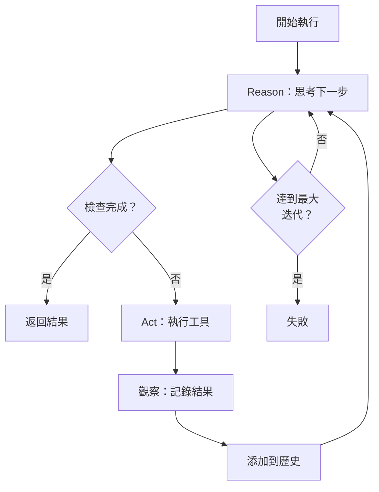

# 案例研究：自主程式碼代理

本案例研究涵蓋設計一個能夠自主完成複雜軟體開發任務的 AI 代理。

## 目錄

- [問題陳述](#問題陳述)
- [需求分析](#需求分析)
- [架構設計](#架構設計)
- [代理核心](#代理核心)
- [工具系統](#工具系統)
- [安全與控制](#安全與控制)
- [評估框架](#評估框架)
- [面試演練](#面試演練)

---

## 問題陳述

**目標：** 建立一個能夠自主解決真實 GitHub 問題的代理

**核心能力：**
- 理解自然語言問題描述
- 在複雜程式碼庫中導航
- 閱讀和理解現有程式碼
- 編寫和修改程式碼
- 執行測試並驗證修復
- 處理漫長的多步任務

**挑戰：**
- 上下文視窗限制（即使 100K+，複雜專案仍需策略）
- 任務中途失敗恢復
- 避免破壞性變更
- 成本控制（o3 級推理模型很昂貴）
- 評估代理品質

---

## 需求分析

### 能力需求

| 能力 | 說明 | 關鍵指標 |
|---------|-------------|----------------|
| 程式碼理解 | 理解大型程式碼庫結構 | 準確回答架構問題 |
| 問題修復 | 解決真實 bug | SWE-bench 通過率 |
| 測試生成 | 編寫有意義的測試 | 覆蓋率提升 |
| 重構 | 改善程式碼品質 | 靜態分析分數 |
| 多檔案編輯 | 跨多個檔案協調變更 | 任務完成率 |

### SWE-bench 效能目標

| 模型 | 目標 | 2025 年 12 月 |
|-----------|--------|----------------|
| Claude Opus 4.7 | 70%+ | 67% |
| GPT-5.2 | 65%+ | 61% |
| Claude Sonnet 4.6 | 55%+ | 52% |
| Gemini 3 Ultra | 60%+ | 55% |

---

## 架構設計

### 高層級架構

```
┌─────────────────────────────────────────────────────────────────┐
│                    自主代理架構                        │
├─────────────────────────────────────────────────────────────────┤
│                                                                  │
│  ┌──────────────────────────────────────────────────────────┐   │
│  │                    代理核心                         │   │
│  │  ┌─────────────┐  ┌─────────────┐  ┌─────────────┐      │   │
│  │  │   規劃器    │  │   記憶     │  │   工具     │      │   │
│  │  │             │  │             │  │   執行器   │      │   │
│  │  └─────────────┘  └─────────────┘  └─────────────┘      │   │
│  └──────────────────────────────────────────────────────────┘   │
│                            │                                     │
│         ┌──────────────────┼──────────────────┐                 │
│         ▼                  ▼                  ▼                 │
│  ┌─────────────┐    ┌─────────────┐    ┌─────────────┐         │
│  │   檔案     │    │   終端     │    │   測試     │         │
│  │   操作     │    │   操作     │    │   執行     │         │
│  └─────────────┘    └─────────────┘    └─────────────┘         │
│                                                                  │
│  ┌──────────────────────────────────────────────────────────┐   │
│  │                    安全層                           │   │
│  │  沙箱 → 速率限制 → 變更審查 → 復原機制          │   │
│  └──────────────────────────────────────────────────────────┘   │
│                                                                  │
└─────────────────────────────────────────────────────────────────┘
```

三層架構。核心層是代理的頭腦：規劃器創建任務計劃，記憶維護歷史上下文，工具執行器調用工具。工具層是代理的手：通過安全沙箱中的隔離操作與系統互動。安全層是代理的免疫系統：防止破壞性變更並確保可控性：

```mermaid
flowchart TD
    subgraph CORE[代理核心]
        PL[規劃器<br/>任務分解]
        MEM[記憶<br/>上下文 + 歷史]
        TOOL[工具執行器<br/>工具調用]
        PL --> TOOL
        MEM --> PL
        MEM --> TOOL
    end

    subgraph TOOLS[工具層]
        FS[檔案操作<br/>讀/寫/搜尋]
        TM[終端執行<br/>bash 命令]
        TE[測試執行<br/>pytest/unittest]
        WEB[網頁搜尋<br/>文件檢索]
    end

    subgraph SEC[安全層]
        SB[沙箱隔離]
        RL[速率限制]
        CR[變更審查]
        RV[復原機制]
        CORE --> TOOLS --> SEC --> SB --> RV
    end

    USER[使用者查詢] --> CORE
    SB --> FS & TM & TE & WEB
```

---

## 代理核心

### 規劃器

```python
class TaskPlanner:
    """
    將高層級任務分解為可執行的步驟。
    使用「思考」模式進行複雜規劃。
    """
    
    async def plan(
        self,
        task: str,
        context: dict
    ) -> list[Step]:
        # 使用 Claude Sonnet 4.6 的混合模式
        # 簡單任務不需要思考，複雜任務使用
        is_complex = self.detect_complexity(task)
        
        response = await self.anthropic.messages.create(
            model="claude-3-7-sonnet-20250219",
            thinking={"enabled": is_complex, "budget_tokens": 2048},
            messages=[{
                "role": "user",
                "content": f"分解此任務：{task}\n\nContext: {context}"
            }]
        )
        
        return self.parse_plan(response)
    
    def detect_complexity(self, task: str) -> bool:
        complexity_indicators = [
            "refactor", "architecture", "redesign",
            "multiple files", "across", "migrate"
        ]
        return any(ind in task.lower() for ind in complexity_indicators)
```

### 記憶系統

```python
class AgentMemory:
    """
    分層記憶：最近操作、關鍵發現、任務狀態。
    """
    
    def __init__(self, max_turns: int = 50):
        self.short_term = []  # 最近操作
        self.important_findings = []  # 關鍵發現
        self.task_state = {}  # 當前任務狀態
        self.max_turns = max_turns
    
    async def add_operation(self, operation: dict):
        self.short_term.append(operation)
        
        # 如果重要，添加到重要發現
        if operation.get("important"):
            self.important_findings.append(operation)
        
        # 修剪超出限制
        if len(self.short_term) > self.max_turns:
            # 保留重要的
            self.short_term = self.short_term[-self.max_turns:]
    
    def get_context_for_prompt(self) -> str:
        # 格式化上下文以傳遞給 LLM
        parts = []
        
        if self.task_state:
            parts.append(f"任務狀態：{self.task_state}")
        
        if self.important_findings:
            parts.append(f"關鍵發現：{self.important_findings}")
        
        if self.short_term:
            recent = self.short_term[-10:]  # 最近 10 個操作
            parts.append(f"最近操作：{recent}")
        
        return "\n".join(parts)
```

### ReAct 執行循環

```python
class ReActExecutor:
    """
    Reason + Act 執行循環。
    """
    
    async def execute(
        self,
        task: str,
        max_iterations: int = 50
    ) -> ExecutionResult:
        
        history = []
        observations = []
        
        for iteration in range(max_iterations):
            # 1. Reason：思考下一步
            action = await self.reason(
                task=task,
                history=history,
                observations=observations
            )
            
            # 2. Check 完成條件
            if action.type == "finish":
                return ExecutionResult(
                    success=True,
                    result=action.result,
                    iterations=iteration + 1
                )
            
            # 3. Act：執行工具
            result = await self.execute_action(action)
            observations.append({"action": action, "result": result})
            history.append(action)
            
            # 4. 檢查錯誤
            if result.get("error"):
                observations.append({"error": result["error"]})
        
        return ExecutionResult(
            success=False,
            result="最大迭代次數達到",
            iterations=max_iterations
        )
    
    async def reason(
        self,
        task: str,
        history: list,
        observations: list
    ) -> Action:
        prompt = f"""
任務：{task}

歷史操作：{history}
觀察：{observations}

基於以上，確定下一步操作。
"""
        response = await self.llm.generate(prompt)
        return self.parse_action(response)
```

ReAct 循環是代理的心跳。每個迭代：Reason 產生下一步，Act 執行它，觀察更新記憶。任何錯誤都會被記錄並影響後續 Reasoning。迴圈在成功、完成標誌或最大迭代時終止：



---

## 工具系統

### 檔案操作工具

```python
class FileOperationTool:
    """
    安全檔案操作的工具定義。
    """
    
    def __init__(self, workspace_root: str):
        self.workspace_root = workspace_root
        self.allowed_extensions = [
            ".py", ".js", ".ts", ".java", ".go",
            ".rs", ".cpp", ".c", ".h", ".md",
            ".json", ".yaml", ".yml", ".toml"
        ]
    
    async def read_file(self, path: str, offset: int = 0, limit: int = 1000) -> dict:
        # 路徑驗證
        full_path = self.validate_path(path)
        
        # 讀取並返回
        content = await aiofiles.read(full_path)
        
        return {
            "path": path,
            "content": content,
            "offset": offset,
            "total_lines": len(content.split("\n"))
        }
    
    async def search_files(
        self,
        pattern: str,
        path: str = None
    ) -> list[dict]:
        # 使用 ripgrep 進行內容搜尋
        results = await self.run_command([
            "rg", "--json", pattern,
            path or self.workspace_root,
            "--ignore-case"
        ])
        
        return [self.parse_match(r) for r in results]
    
    def validate_path(self, path: str) -> str:
        full_path = os.path.join(self.workspace_root, path)
        
        # 防止路徑遍歷
        if not os.path.abspath(full_path).startswith(self.workspace_root):
            raise SecurityError("路徑遍歷攻擊")
        
        return full_path
```

### 測試執行工具

```python
class TestExecutionTool:
    """
    安全執行測試的工具定義。
    """
    
    async def run_tests(
        self,
        test_path: str = None,
        verbose: bool = True
    ) -> dict:
        
        # 建構命令
        cmd = ["pytest"]
        if verbose:
            cmd.append("-v")
        if test_path:
            cmd.append(test_path)
        
        # 在隔離環境中執行
        result = await self.sandbox.run(
            cmd,
            timeout=300,  # 5 分鐘超時
            cwd=self.workspace_root
        )
        
        return {
            "exit_code": result.exit_code,
            "stdout": result.stdout,
            "stderr": result.stderr,
            "passed": result.exit_code == 0
        }
```

---

## 安全與控制

### 沙箱隔離

```python
class SandboxIsolation:
    """
    使用 Firecracker microVM 進行安全隔離。
    """
    
    async def execute(self, command: list, **kwargs) -> ExecutionResult:
        # 在 microVM 中執行命令
        vm = await self.vm_pool.acquire()
        
        try:
            result = await vm.run(command, **kwargs)
            return result
        finally:
            await self.vm_pool.release(vm)
    
    async def apply_restrictions(self, vm):
        # 網路限制
        await vm.set_network_policy(allowed=False)
        
        # 檔案系統限制
        await vm.set_filesystem_policy(
            self.workspace_root,
            read=True,
            write=True,
            execute=False
        )
        
        # 資源限制
        await vm.set_resource_limits(
            cpu_time=300,  # 5 分鐘
            memory=2GB,
            disk=1GB
        )
```

### 變更審查

```python
class ChangeReview:
    """
    在套用變更前進行安全審查。
    """
    
    async def review_changes(
        self,
        original: str,
        modified: str,
        file_path: str
    ) -> ReviewResult:
        
        checks = []
        
        # 1. 語法檢查
        syntax_ok = self.check_syntax(modified, file_path)
        checks.append({"check": "syntax", "passed": syntax_ok})
        
        # 2. 安全性掃描
        security_issues = await self.security_scan(modified, file_path)
        checks.append({
            "check": "security",
            "passed": len(security_issues) == 0,
            "issues": security_issues
        })
        
        # 3. 變更大小檢查
        size_check = len(modified) / len(original) < 5  # 不應增加 5 倍
        checks.append({"check": "size", "passed": size_check})
        
        # 4. 依賴檢查
        deps_ok = await self.check_dependencies(modified, file_path)
        checks.append({"check": "dependencies", "passed": deps_ok})
        
        all_passed = all(c["passed"] for c in checks)
        
        return ReviewResult(
            approved=all_passed,
            checks=checks,
            requires_human_approval=not all_passed
        )
```

---

## 評估框架

### SWE-bench 評估

SWE-bench 是代理編碼的事實標準基準。它測試代理解析真實 GitHub issue 的能力。這些問題需要真正的程式碼理解和修改，而不僅僅是回答問題。

```python
class SWEBenchEvaluator:
    """
    在 SWE-bench 上評估代理。
    """
    
    async def evaluate(self, agent: CodeAgent, dataset: str = "swe_bench_verified"):
        results = []
        
        for instance in tqdm(self.load_dataset(dataset)):
            result = await self.run_instance(agent, instance)
            results.append(result)
        
        return self.compute_metrics(results)
    
    async def run_instance(
        self,
        agent: CodeAgent,
        instance: dict
    ) -> InstanceResult:
        # 設置環境
        await self.setup_environment(instance)
        
        # 執行代理
        start_time = time.time()
        try:
            result = await agent.execute(instance["problem_statement"])
            elapsed = time.time() - start_time
            success = await self.verify_patch(instance, result.patch)
        except Exception as e:
            elapsed = time.time() - start_time
            success = False
            result = str(e)
        
        return InstanceResult(
            instance_id=instance["instance_id"],
            success=success,
            elapsed_time=elapsed,
            result=result
        )
```

### 評估指標

| 指標 | 說明 | 目標 |
|-----------|-------------|----------|
| 通過率 | 通過的 SWE-bench 比率 | > 60% |
| 平均時間 | 每個問題的平均時間 | < 10 分鐘 |
| 成本效率 | 每個問題的平均成本 | < $5 |
| 恢復率 | 從錯誤中恢復的比率 | > 80% |

---

## 面試演練

**面試官：**「設計一個能夠自主解決 GitHub issue 的 AI 代理。」

**強勢回應：**

1. **釐清範圍**（1 分鐘）
   - 「這是程式碼助理（人類主導）還是自主代理（代理主導）？」
   - 「需要支援哪些語言和框架？」

2. **核心架構**（3 分鐘）
   - 「代理核心：規劃器、記憶、工具執行器」
   - 「ReAct 執行循環」
   - 「安全隔離（Firecracker microVM）」

3. **關鍵能力**（3 分鐘）
   - 「程式碼庫理解：搜尋、語義解析」
   - 「多步規劃：複雜任務分解」
   - 「錯誤恢復：嘗試替代方法」

4. **安全考量**（2 分鐘）
   - 「沙箱隔離防止破壞」
   - 「變更審查和復原機制」
   - 「速率限制和成本控制」

5. **評估框架**（1 分鐘）
   - 「SWE-bench 作為主要基準」
   - 「通過率、時間、成本」

---

*下一篇：[多租戶 SaaS 案例研究](07-multi-tenant-saas.md)*
