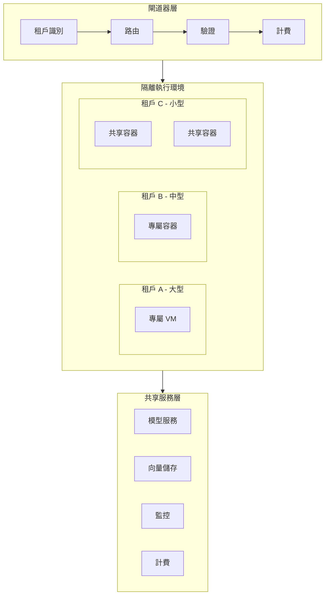

# 案例研究：多租戶 SaaS 平台

本案例研究涵蓋設計一個為多個客戶組織提供 AI 服務的多租戶 SaaS 平台。

## 目錄

- [問題陳述](#問題陳述)
- [需求分析](#需求分析)
- [架構設計](#架構設計)
- [隔離策略](#隔離策略)
- [成本管理](#成本管理)
- [合規與安全](#合規與安全)
- [面試演練](#面試演練)

---

## 問題陳述

**場景：** 建立一個向企業客户提供 AI 服務的平台

**挑戰：**
- 100+ 企業客戶（租戶）
- 每個租戶有獨特需求和資料隔離要求
- 嚴格的合規要求（HIPAA、SOC 2、GDPR）
- 需要隔離又不影響成本效率
- 效能穩定性（單一租戶流量不影響其他租戶）

**目標：**
- 99.9% 可用性
- 租戶級隔離
- 成本效益
- 靈活配置

---

## 需求分析

### 租戶需求

| 需求 | 小型租戶 | 大型租戶 |
|-----------|-------------|-------------|
| 同時使用者 | 10-50 | 500-5000 |
| 每日 API 呼叫 | 1,000 | 500,000 |
| 資料量 | 1GB | 100GB |
| SLA | 99.5% | 99.9% |
| 支援 | 標準 | 專屬 |

### 隔離需求

| 層級 | 說明 | 成本 |
|-----------|-------------|--------|
| 邏輯隔離 | 共享基礎設施，邏輯分區 | $ |
| 容器隔離 | Docker/Kubernetes 隔離 | $$ |
| VM 隔離 | 專用 VM | $$$ |
| 專屬部署 | 完全獨立部署 | $$$$ |

---

## 架構設計

### 高層級架構

```
┌─────────────────────────────────────────────────────────────────┐
│                    多租戶 SaaS 架構                   │
├─────────────────────────────────────────────────────────────────┤
│                                                                  │
│  ┌──────────────────────────────────────────────────────────┐   │
│  │                    閘道器層                           │   │
│  │  租戶識別 → 路由 → 驗證 → 計費                    │   │
│  └──────────────────────────────────────────────────────────┘   │
│                            │                                     │
│                            ▼                                     │
│  ┌──────────────────────────────────────────────────────────┐   │
│  │                    隔離執行環境                      │   │
│  │                                                          │   │
│  │   ┌─────────────┐  ┌─────────────┐  ┌─────────────┐      │   │
│  │   │   租戶 A    │  │   租戶 B    │  │   租戶 C    │      │   │
│  │   │  (大型)     │  │  (中型)     │  │  (小型)     │      │   │
│  │   │  專屬 VM    │  │  專屬容器   │  共享容器    │      │   │
│  │   └─────────────┘  └─────────────┘  └─────────────┘      │   │
│  └──────────────────────────────────────────────────────────┘   │
│                            │                                     │
│                            ▼                                     │
│  ┌──────────────────────────────────────────────────────────┐   │
│  │                    共享服務層                        │   │
│  │  模型服務 │  向量儲存 │  監控  │  計費              │   │
│  └──────────────────────────────────────────────────────────┘   │
│                                                                  │
└─────────────────────────────────────────────────────────────────┘
```

三層隔離模型。閘道器確保正確路由和驗證。隔離執行環境根據租戶規模和需求進行分層。共享服務層在隔離邊界內提供經濟高效的共享資源：



---

## 隔離策略

### 租戶識別與路由

```python
class TenantAwareGateway:
    """
    識別租戶並正確路由請求。
    """
    
    async def route(self, request: Request) -> Response:
        # 1. 從 JWT/header 識別租戶
        tenant_id = self.extract_tenant_id(request)
        
        # 2. 獲取租戶配置
        tenant_config = await self.tenant_service.get(tenant_id)
        
        # 3. 應用速率限制
        await self.rate_limiter.check(tenant_id, request)
        
        # 4. 路由至正確的隔離環境
        executor = self.get_tenant_executor(tenant_config)
        
        # 5. 附加租戶上下文
        request.tenant_context = {
            "tenant_id": tenant_id,
            "tier": tenant_config.tier,
            "quota": tenant_config.quota,
            "features": tenant_config.enabled_features
        }
        
        # 6. 執行請求
        response = await executor.execute(request)
        
        # 7. 記錄計費
        await self.billing_service.record_usage(
            tenant_id=tenant_id,
            operation=request.operation,
            tokens_used=response.usage
        )
        
        return response
    
    def extract_tenant_id(self, request: Request) -> str:
        # 優先順序：JWT > API Key > Header
        if request.jwt:
            return self.validate_jwt_and_extract_tenant(request.jwt)
        
        if request.api_key:
            return self.validate_api_key_and_extract_tenant(request.api_key)
        
        return request.headers.get("X-Tenant-ID")
```

### 分層隔離策略

```python
class TieredIsolation:
    """
    根據租戶規模和需求進行分層隔離。
    """
    
    TIER_CONFIG = {
        "enterprise": {
            "isolation": "dedicated_vm",
            "vm_type": "firecracker",
            "cpu": "reserved_8",
            "memory": "32GB",
            "models": ["claude-opus-4", "gpt-5"],
            "sla": 0.999
        },
        "business": {
            "isolation": "dedicated_container",
            "cpu": "reserved_4",
            "memory": "16GB",
            "models": ["claude-sonnet-4", "gpt-5-mini"],
            "sla": 0.999
        },
        "starter": {
            "isolation": "shared_container",
            "cpu": "2",
            "memory": "4GB",
            "models": ["claude-haiku-4"],
            "sla": 0.995
        }
    }
    
    def get_isolation_level(self, tenant: Tenant) -> str:
        # 根據使用量和需求選擇隔離級別
        if tenant.plan == "enterprise" or tenant.dau > 1000:
            return "dedicated_vm"
        elif tenant.plan == "business" or tenant.dau > 100:
            return "dedicated_container"
        else:
            return "shared_container"
```

### Firecracker VM 隔離

```python
class FirecrackerIsolation:
    """
    使用 Firecracker microVM 實現租戶隔離。
    """
    
    async def get_or_create_vm(self, tenant_id: str) -> FirecrackerVM:
        # 檢查現有 VM
        if tenant_id in self.active_vms:
            return self.active_vms[tenant_id]
        
        # 創建新 VM
        vm_config = self.build_vm_config(tenant_id)
        vm = await self.firecracker.create(vm_config)
        
        # 等待 VM 就緒
        await vm.start()
        await vm.wait_for_ready()
        
        self.active_vms[tenant_id] = vm
        return vm
    
    def build_vm_config(self, tenant_id: str) -> VMConfig:
        tenant = self.tenant_service.get(tenant_id)
        
        return VMConfig(
            vcpu_count=self.TIER_CONFIG[tenant.tier].get("cpu", 2),
            mem_size_mib=self.TIER_CONFIG[tenant.tier].get("memory", 4096),
            # 網路隔離
            net_config=NetConfig(
                allow_telemetry=False,  # 禁用遠程遙測
                allow_metadata=False
            ),
            # 檔案系統唯讀根
            rootfs=ReadOnlyRoot(
                image=self.model_vm_image
            ),
            # 資源限制
            jailer=JailerConfig(
                uid_map=0,  # 在命名空間內運行
                gid_map=0
            )
        )
```

---

## 成本管理

### 成本分配

```python
class TenantCostAllocator:
    """
    追蹤並分配每個租戶的成本。
    """
    
    async def allocate_costs(self, period: str = "monthly"):
        # 1. 獲取原始使用資料
        usage_data = await self.metrics_service.get_usage(period)
        
        # 2. 按租戶分組
        tenant_costs = defaultdict(lambda: {
            "compute": 0,
            "storage": 0,
            "api_calls": 0,
            "model_usage": defaultdict(int)
        })
        
        for record in usage_data:
            tenant_id = record["tenant_id"]
            
            # 計算模型成本
            model_cost = self.calculate_model_cost(
                model=record["model"],
                tokens=record["tokens"],
                period=period
            )
            
            # 計算計算成本
            compute_cost = self.calculate_compute_cost(
                cpu_seconds=record["cpu_time"],
                memory_gb_seconds=record["memory_usage"]
            )
            
            # 計算儲存成本
            storage_cost = self.calculate_storage_cost(
                gb_days=record["storage_used"]
            )
            
            tenant_costs[tenant_id]["model_usage"][record["model"]] += model_cost
            tenant_costs[tenant_id]["compute"] += compute_cost
            tenant_costs[tenant_id]["storage"] += storage_cost
        
        return tenant_costs
    
    def calculate_model_cost(
        self,
        model: str,
        tokens: int,
        period: str
    ) -> float:
        rates = {
            "claude-opus-4": {"input": 0.015, "output": 0.075},
            "claude-sonnet-4": {"input": 0.003, "output": 0.015},
            "gpt-5": {"input": 0.01, "output": 0.03},
            # ...
        }
        
        rate = rates.get(model, {"input": 0, "output": 0})
        return (tokens["input"] * rate["input"] + 
                tokens["output"] * rate["output"])
```

### 成本監控儀表板

| 指標 | 計算方式 | 告警閾值 |
|-----------|------------|---------------|
| 每 API 呼叫成本 | 總成本 / API 呼叫數 | > $0.01 |
| 每使用者成本 | 總成本 / 活躍使用者 | > $50/月 |
| 模型成本佔比 | 模型成本 / 總成本 | > 70% |
| 閒置容量成本 | 未使用 VM 的成本 | > 20% |

---

## 合規與安全

### SOC 2 合規

```python
class SOC2Compliance:
    """
    SOC 2 Type II 合規控制。
    """
    
    async def verify_compliance(self) -> ComplianceReport:
        controls = {}
        
        # CC6：邏輯和實體存取控制
        controls["access_control"] = await self.verify_access_controls()
        
        # CC7：系統作業
        controls["system_operations"] = await self.verify_system_operations()
        
        # CC9：風險緩解
        controls["risk_mitigation"] = await self.verify_risk_mitigation()
        
        return ComplianceReport(
            compliant=all(c["passed"] for c in controls.values()),
            controls=controls,
            evidence=self.gather_evidence(controls)
        )
    
    async def verify_access_controls(self) -> ControlResult:
        # 驗證租戶隔離
        violations = []
        
        for tenant_id in self.active_tenants:
            # 嘗試跨租戶存取
            for other_id in self.active_tenants:
                if tenant_id != other_id:
                    can_access = await self.test_cross_tenant_access(
                        tenant_id, other_id
                    )
                    if can_access:
                        violations.append(f"{tenant_id} 可存取 {other_id}")
        
        return ControlResult(
            passed=len(violations) == 0,
            violations=violations
        )
```

### 審計日誌

```python
class AuditLogger:
    """
    所有租戶操作的不可變審計日誌。
    """
    
    async def log(
        self,
        tenant_id: str,
        operation: str,
        resource: str,
        result: str,
        metadata: dict = None
    ):
        entry = {
            "timestamp": datetime.now().isoformat(),
            "tenant_id": tenant_id,
            "operation": operation,
            "resource": resource,
            "result": result,
            "user": metadata.get("user_id"),
            "ip_address": metadata.get("ip"),
            "user_agent": metadata.get("user_agent")
        }
        
        # 寫入 Append-only 日誌
        await self.audit_log.append(entry)
        
        # 即時威脅偵測
        if self.is_suspicious(entry):
            await self.security_alert(tenant_id, entry)
```

---

## 面試演練

**面試官：**「為多租戶 AI SaaS 平台設計系統架構。」

**強勢回應：**

1. **釐清隔離需求**（2 分鐘）
   - 「租戶的合規要求是什麼？」
   - 「延遲敏感度如何？」

2. **分層隔離策略**（3 分鐘）
   - 「小型租戶：共享容器（成本效益）」
   - 「中型租戶：專屬容器（效能隔離）」
   - 「大型租戶：Firecracker VM（嚴格隔離）」

3. **閘道器職責**（2 分鐘）
   - 「租戶識別、路由、驗證、計費」
   - 「速率限制和配額執行」

4. **成本管理**（2 分鐘）
   - 「追蹤每個租戶的模型、計算、儲存成本」
   - 「識別閒置容量和成本最佳化機會」

5. **合規與安全**（2 分鐘）
   - 「SOC 2 控制：存取控制、系統作業、風險緩解」
   - 「不可變審計日誌」

---

*下一篇：[客戶支援自動化案例研究](08-customer-support-automation.md)*
