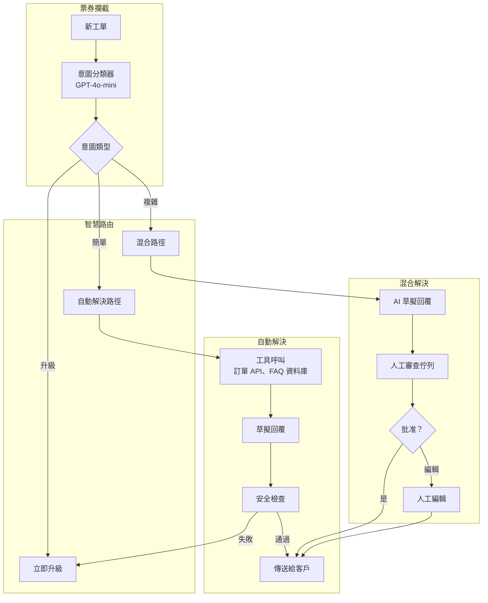
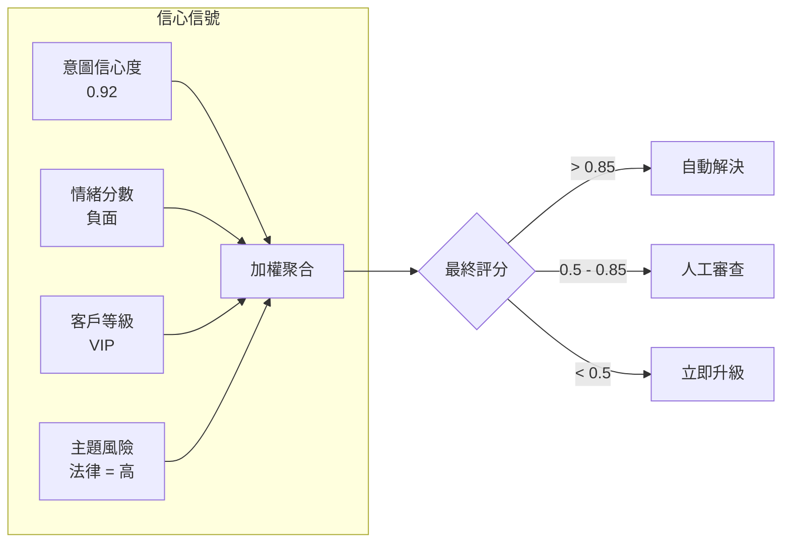
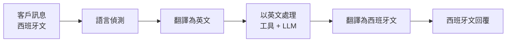

# 案例研究：AI 驅動的客戶支援系統

## 問題背景

一間電子商務公司每月處理 **200 萬張支援工單**。他們希望建立一個 AI 系統，能自動解決 60% 的工單而無須人工介入，同時能無縫地將複雜問題升級處理。

**面試中给出的限制條件：**
- 全年 24 小時、12 種語言營運
- 必須與現有的 Zendesk 和 Salesforce 整合
- 不能做出虛假承諾（退款、交貨日期等）
- 人工客服必須能夠在對話中途接管
- 成本目標：每張已解決工單 $0.05

---

## 面試問題

> 「設計一個能自動處理『我的訂單到哪裡了？』的客戶支援 AI，但要能識別何時應將『我要告你詐欺』升級給人工處理。」

---

## 解決方案架構



---

## 關鍵設計決策

### 1. 三層級路由（自動 / 混合 / 升級）

**答案：** 並非所有工單都相同。我們將其分類為三種路徑：

| 路徑 | 標準 | 範例 | 人工介入 |
|------|------|------|----------|
| **自動** | 高信心度、低風險 |「我的訂單到哪裡了？」| 無 |
| **混合** | 中等信心度或中等風險 |「我要求退款」| 審查 AI 草稿 |
| **升級** | 法律、威脅、VIP、低信心度 |「這是詐欺」| 完整人工處理 |

### 2. 工具型解決，而非純生成

**答案：** AI 並不「知道」訂單在哪裡。它呼叫訂單 API 工具。這對於準確性至關重要：

```python
@tool
def get_order_status(order_id: str) -> dict:
    """從 OMS 擷取即時訂單狀態。"""
    order = oms_client.get_order(order_id)
    return {
        "status": order.status,
        "shipped_date": order.shipped_at,
        "estimated_delivery": order.eta,
        "tracking_url": order.tracking_url
    }
```

LLM 協調工具，但從不捏造資料。

### 3. 為何發送前要安全檢查？

**答案：** 即使是自動解決的工單，也需經過安全篩選：

1. **承諾偵測**：標記「我保證」或「我們會支付」等陳述
2. **情緒不符**：捕捉 AI 在客戶憤怒時表現愉快的狀況
3. **個資洩漏**：確保不出現內部備註或其他客戶資料
4. **競爭者提及**：標記 AI 推薦競爭者的情況

---

## 升級智慧

最困難的部分是知道**何時**要升級。我們使用結合多種信號的信心評分：



**關鍵洞察：** VIP 客戶詢問簡單問題仍然進入混合路徑，因為犯錯的成本更高。

---

## 多語言支援

12 種語言，無須 12 個獨立模型：



**為何不用原生多語言模型？**

成本。GPT-4o 能處理全部 12 種語言。使用每種語言的專業模型需要 12 個部署。翻譯增加延遲但簡化基礎設施。

---

## 人工接管（中對話接管）

當人工接管時，他們需要完整上下文：

```python
def handoff_to_human(conversation_id: str, agent_id: str):
    conversation = get_conversation(conversation_id)
    
    # 為人工客服生成摘要
    summary = llm.generate(f"""
    為人工客服摘要此對話：
    - 客戶問題
    - AI 已嘗試的解決方案
    - 為何發生升級
    
    對話：
    {conversation.messages}
    """)
    
    # 創建交接套件
    return {
        "summary": summary,
        "customer_sentiment": conversation.sentiment,
        "attempted_solutions": conversation.tool_calls,
        "full_transcript": conversation.messages,
        "customer_tier": conversation.customer.tier
    }
```

---

## 成本分析

| 元件 | 每張工單成本 |
|------|-------------|
| 意圖分類（GPT-4o-mini） | $0.002 |
| 工具呼叫（訂單 API、FAQ 搜尋） | $0.001 |
| 回覆生成（GPT-4o-mini） | $0.008 |
| 安全檢查 | $0.003 |
| 翻譯（如需要，30% 的工單） | $0.004 |
| **平均總計** | **$0.018** |

60% 自動解決率：**每張已解決工單 $0.03**（遠低於 $0.05 目標）

---

## 面試後續問題

**問：如果 AI 一直道歉但從未真正提供幫助怎麼辦？**

答：我們追蹤「解決有效性」而非僅「已發送回覆」。如果客戶在 24 小時內就同一問題再次回覆，該工單標記為「未解決」，該 AI 模式被標記需審查。我們也執行每週分析：「哪些片語與客戶後續回覆相關？」

**問：如何處理堅持要與人工對話的客戶？**

答：明確的升級片語（「我要找人工」、「找經理」）會觸發立即移交，無論信心評分如何。我們從不與升級請求爭辯。

**問：如何防止客戶試圖破解支援 AI？**

答：輸入淨化加上嚴格的僅限工具回覆。AI 無法被提示透露系統提示詞，因為它不生成自由形式答案：它呼叫工具並摘要其輸出。系統提示詞也非常狹窄：「你幫助處理 [公司] 的訂單問題。你不能討論其他主題。」

---

## 面試關鍵要點

1. **分層路由平衡自動化與風險**：並非所有工單都應自動解決
2. **工具型接地防止幻覺**：AI 檢索事實，而非生成事實
3. **信心是多維的**：意圖清晰度 + 情緒 + 客戶等級 + 主題風險
4. **人工移交需要上下文**：摘要，而非僅傾倒對話記錄

---

*相關章節：[Human-in-the-Loop 模式](../07-agentic-systems/08-human-in-the-loop-patterns.md)，[Guardrails 實作](../13-reliability-and-safety/01-guardrails-implementation.md)*