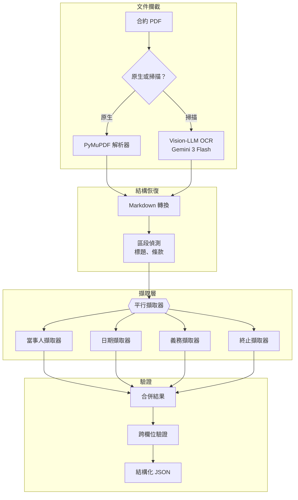
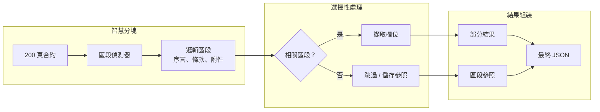

# 案例研究：文件智慧 pipeline

## 問題背景

一間法律科技公司需要每月處理 **50,000 份合約**，擷取關鍵條款（當事人、日期、義務、終止條款）並載入可搜尋的資料庫。

**面試中给出的限制條件：**
- 文件範圍從 2 頁到 200 頁
- 混合掃描 PDF 和原生數位文件
- 多語言（英文、德文、法文、西班牙文）
- 關鍵欄位擷取準確率：95%+
- 成本目標：每份文件低於 $0.50

---

## 面試問題

> 「設計一個 pipeline，接收 100 頁合約 PDF 並將當事人、生效日期、終止條件和付款條款等結構化資料擷取為 JSON。」

---

## 解決方案架構



---

## 關鍵設計決策

### 1. Vision-LLM 取代傳統 OCR

**答案：** 掃描合約通常有印章、手寫註釋和複雜版面（表格、多欄）。傳統 OCR（Tesseract）輸出雜亂。Gemini 3 Flash 「看見」版面並產生保留表格的乾淨 Markdown。成本較高但準確率提升值得投資。

| 方法 | 100 頁掃描合約 | 準確率 | 成本 |
|------|----------------|--------|------|
| Tesseract | 雜訊、斷裂表格 | 60% | $0.02 |
| AWS Textract | 較好但仍掙扎於版面 | 75% | $0.15 |
| Gemini 3 Flash | 乾淨 Markdown，表格完整 | 92% | $0.35 |

### 2. 平行擷取器 vs 單次通過

**答案：** 單一提示要求所有欄位比專業擷取器產生更差結果。每個擷取器都有專注提示和結構定義：

```python
parties_schema = {
    "type": "object",
    "properties": {
        "party_a": {"type": "object", "properties": {
            "name": {"type": "string"},
            "role": {"type": "string"},
            "address": {"type": "string"}
        }},
        "party_b": {"type": "object", "properties": {...}}
    }
}

# 每個擷取器平行執行
async def extract_all(document: str):
    results = await asyncio.gather(
        extract_parties(document, parties_schema),
        extract_dates(document, dates_schema),
        extract_obligations(document, obligations_schema),
        extract_termination(document, termination_schema)
    )
    return merge_results(results)
```

### 3. 跨欄位驗證

**答案：** 擷取錯誤常透過不一致性顯現：
- 如果 `effective_date` 在 `termination_date` 之後，有問題
- 如果 `party_a` 名稱出現在 `obligations` 但拼法不同，標記需審查
- 如果擷取到 `payment_amount` 但 `payment_frequency` 為空，不完整

---

## 處理 200 頁文件

上下文窗口挑戰：



**關鍵洞察：** 並非所有 200 頁都包含可擷取欄位。附件（附加原始文件）儲存為參照而非處理。「條款與條件」區段通常佔文件 80% 但包含大多數關鍵欄位。

---

## 多語言處理

德文合約使用與英文不同的結構。我們維護語言特定擷取器：

```python
EXTRACTORS = {
    "en": {
        "parties": EnglishPartiesExtractor(),
        "dates": StandardDatesExtractor(),
        "termination": EnglishTerminationExtractor()
    },
    "de": {
        "parties": GermanPartiesExtractor(),  # 處理 "GmbH"、"AG" 模式
        "dates": GermanDatesExtractor(),       # DD.MM.YYYY 格式
        "termination": GermanTerminationExtractor()  # "Kündigung" 模式
    }
}
```

---

## 成本細項

| 階段 | 每 100 頁文件成本 |
|------|-------------------|
| OCR（Gemini 3 Flash，如為掃描） | $0.18 |
| 區段偵測（GPT-4o-mini） | $0.03 |
| 欄位擷取（4 個平行，GPT-4o-mini） | $0.12 |
| 驗證 | $0.02 |
| **總計（掃描）** | **$0.35** |
| **總計（原生 PDF）** | **$0.17** |

平均（60% 原生、40% 掃描）：**每文件 $0.24**（低於 $0.50 目標）

---

## 面試後續問題

**問：如果擷取信心度低怎麼辦？**

答：我們輸出每個欄位的信心評分。低於 0.8 的欄位標記需人工審查。UI 顯示「審查佇列」，人工只需驗證不確定的欄位，而非整份文件。這將人工工作量減少到平均每文件 30 秒。

**問：如何處理非標準版面的合約？**

答：我們維護已知合約模板的「版面資料庫」。區段偵測器首先嘗試匹配已知模板。如果沒有匹配，回退到啟發式偵測（尋找編號區段、全大寫標題等）。未知版面被標記並在人工審查後加入資料庫。

**問：關鍵條款定義在附件中的合約如何處理？**

答：我們偵測交叉參照（「如附件 A 中定義」）並解析它們。當主文件參照時，擷取提示包含相關附件內容。這防止了當答案在附件中時出現「空」擷取。

---

## 面試關鍵要點

1. **Vision-LLM 勝過傳統 OCR**：複雜版面（表格、註釋）
2. **平行專業擷取器優於單次通過**：結構化擷取
3. **跨欄位驗證在錯誤到達資料庫前捕捉擷取錯誤**
4. **並非所有頁面都需要處理**：偵測相關區段，跳過附件

---

*相關章節：[OCR 與版面](../10-document-processing/01-ocr-and-layout.md)，[結構化生成](../05-prompting-and-context/06-structured-generation.md)*