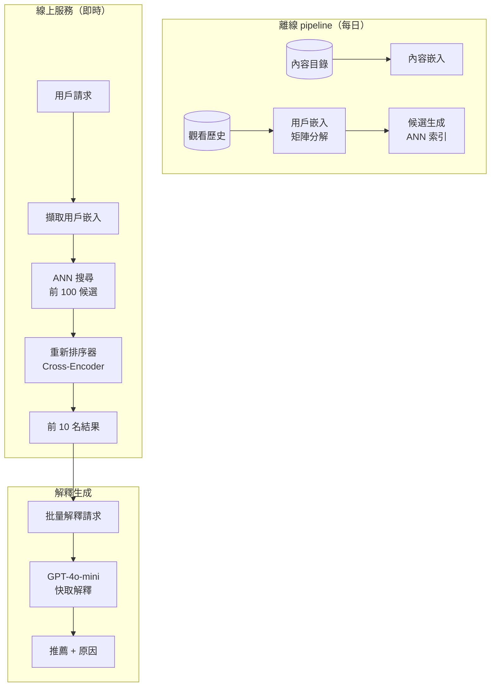
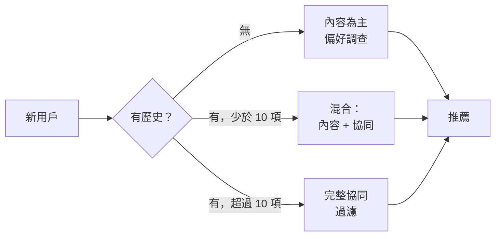

# 案例研究：AI 驅動的推薦引擎

## 問題背景

一個擁有 **5,000 萬用戶**的串流平台需要建立結合協同過濾與 LLM 生成解釋的推薦系統：「因為您喜歡《全面啟動》，您可能會喜歡《天能》，因為其燒腦的時間機械。」

**面試中给出的限制條件：**
- 即時推薦（p95 低於 200ms）
- 必須解釋每個推薦的原因
- 新用戶冷啟動處理
- 隱私：不能在用戶間洩漏觀看歷史
- 每日活躍用戶：500 萬，每位觀看 10+ 組推薦

---

## 面試問題

> 「設計一個大規模推薦電影並以自然語言解釋推薦原因的系統。」

---

## 解決方案架構



---

## 關鍵設計決策

### 1. 為何不全部使用 LLM？

**答案：** 規模經濟。為 5,000 萬用戶 × 每天 10 組推薦 × 500M LLM 呼叫/天 = 每天 $500K。在 $0.001/次呼叫，相當昂貴。替代方案：

| 元件 | 角色 | 每用戶/天成本 |
|------|------|--------------|
| 嵌入查詢 | 擷取預先計算向量 | $0.00001 |
| ANN 搜尋 | 尋找候選 | $0.0001 |
| Cross-encoder 重新排序 | 評分前 100 名 | $0.001 |
| LLM 解釋 | 自然語言 | $0.005 |
| **總計** | | **$0.006** |

LLM 僅用於最終解釋，而非排名本身。

### 2. 解釋快取

**答案：** 大多數解釋可以快取。「因為您看了《全面啟動》」適用於數千用戶。我們在（內容配對、原因類型）等級快取解釋：

```python
cache_key = f"{source_movie}:{target_movie}:{reason_type}"
# 範例："inception:tenet:time_mechanics"

explanation = cache.get(cache_key)
if not explanation:
    explanation = generate_explanation(source_movie, target_movie, reason_type)
    cache.set(cache_key, explanation, ttl=86400)
```

快取命中率：預熱後 85%+。

### 3. 冷啟動處理

**答案：** 新用戶沒有協同過濾的歷史。我們使用**混合方法**：



---

## 個人化解釋挑戰

解釋必須感覺個人化，而非通用：

**不佳：**「《天能》是一部受歡迎的驚悚片。」
**良好：**「因為您喜歡《全面啟動》的燒腦劇情，《天能》提供同一位導演的類似時間操控謎題。」

我們透過在提示中包含用戶上下文來實現：

```python
prompt = f"""
為什麼這個用戶會喜歡 {target_movie} 生成一句話解釋。

用戶上下文：
- 最近觀看：{recent_movies}
- 偏好類型：{genres}
- 不喜歡：{dislikes}

觸發此推薦的源電影：{source_movie}
原因類別：{reason_type}

解釋：
"""
```

---

## 延遲預算

| 階段 | 目標 | 實際 p95 |
|------|------|----------|
| 用戶嵌入查詢 | 5ms | 3ms |
| ANN 搜尋（前 100） | 20ms | 15ms |
| Cross-encoder 重新排序 | 50ms | 45ms |
| LLM 解釋（快取） | 10ms | 8ms |
| LLM 解釋（未命中） | 500ms | 450ms |
| **總計（快取命中）** | **85ms** | **71ms** |
| **總計（快取未命中）** | **575ms** | **513ms** |

為達到 200ms p95，我們確保解釋快取命中率 95%+ 並非同步生成新內容配對的解釋。

---

## 面試後續問題

**問：如何防止 LLM 對電影產生幻覺事實？**

答：LLM 接收每部電影的結構化事實表（導演、演員、主題、獎項）作為上下文。它只能使用此表中的資訊。我們還有後生成驗證器，根據目錄元資料檢查聲稱。

**問：如果用戶品味快速改變怎麼辦？**

答：我們使用**近期加權嵌入更新**。近期觀看加權是較舊觀看的 3 倍。為即時響應，我們維護「會話嵌入」捕捉當前會話行為並與歷史嵌入混合。

**問：如何 A/B 測試推薦演算法？**

答：我們將 user_id 雜湊以一致地將用戶分配到實驗桶。每個桶可以有不同候選生成、排名或解釋策略。我們追蹤每個桶的參與指標（點擊率、觀看時間、跳過率）。

---

## 面試關鍵要點

1. **LLM 用於解釋，非排名**：使用傳統 ML 處理規模，LLM 處理個人化
2. **積極快取**：內容配對的解釋可跨用戶重用
3. **冷啟動是一個光譜**：新用戶 → 內容為主；有一些歷史 → 混合；完整歷史 → 協同
4. **延遲預算需要快取命中率目標**：圍繞延遲 SLA 設計快取

---

*相關章節：[語意快取](../08-memory-and-state/05-semantic-caching.md)，[成本優化](../04-inference-optimization/07-cost-optimization-playbook.md)*