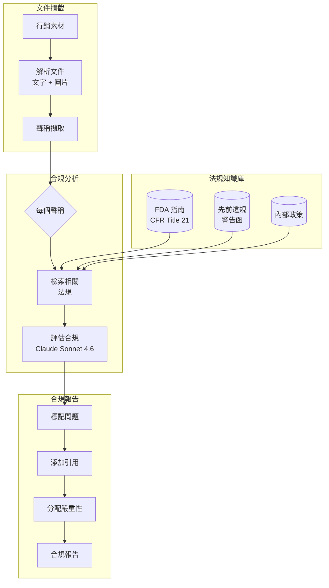
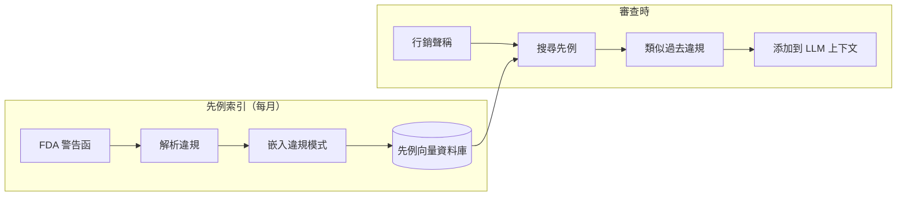
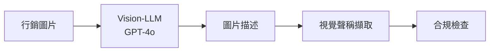

# 案例研究：法規遵循自動化

## 問題背景

一間製藥公司必須確保所有行銷材料符合 **FDA 法規**。目前，每個素材的法律審查需要 2 週。他們希望 AI 預先篩選材料並標記問題，將法律審查縮短至 2 天。

**面試中给出的限制條件：**
- 必須引用具體法規章節，而非僅「這似乎有問題」
- 假陰性（漏掉違規）不可接受
- 假陽性（過度標記）應低於 20%
- 每月 500 個行銷素材
- 監管機構檢查需要稽核軌跡

---

## 面試問題

> 「設計一個審查製藥行銷材料並識別具有引用具體法規違規的系統。」

---

## 解決方案架構



---

## 關鍵設計決策

### 1. 合規檢查前先擷取聲稱

**答案：** 行銷材料內容密集。將整份文件對照法規檢查效率低下。我們首先擷取個別**聲稱**：

```python
claims = extract_claims(document)
# 範例輸出：
# [
#   {"text": "減少 80% 症狀", "type": "有效性", "location": "第 2 頁，第 3 段"},
#   {"text": "無不良反應報告", "type": "安全性", "location": "第 3 頁，標題"},
#   {"text": "經醫生推薦", "type": "背書", "location": "第 1 頁，圖片"}
# ]
```

每個聲稱然後獨立對照相關法規檢查。

### 2. 為何對法規使用 RAG 而非微調？

**答案：** 法規會變。FDA 每月更新指南文件。微調需要在每次更新後重新訓練。RAG 允許我們：
- 新聞稿發布時立即更新法規索引
- 追蹤每個審查使用的法規版本（稽核軌跡）
- 為法律審查者顯示精確的來源段落

### 3. 保守標記策略

**答案：** 假陰性（漏掉的違規）是災難性的；假陽性（額外審查）只是浪費時間。我們使用**閾值層級**：

| 信心度 | 動作 |
|--------|------|
| >90% 違規 | 標記為高嚴重性 |
| 70-90% 潛在 | 標記為中等，引用顧慮 |
| 50-70% 不確定 | 標記為低，註明模糊性 |
| <50% 可能合規 | 不標記，但記錄以供稽核 |

我們永不輸出「合規」而不記錄推理。

---

## 先例資料庫

法規通常模糊。先前 FDA 警告函澄清規則的執行方式：



**為何這很重要：** 像「經臨床證明」這樣的聲稱基於法規本身可能看起來沒問題。但如果我們發現 5 封警告函引用公司使用「經臨床證明」但沒有特定試驗數據，那就是危險信號。

---

## 稽核軌跡要求

每個決策必須可追蹤：

```python
compliance_decision = {
    "claim_id": "claim_003",
    "claim_text": "無不良反應報告",
    "decision": "VIOLATION",
    "severity": "HIGH",
    "regulation_cited": "21 CFR 202.1(e)(5)",
    "regulation_text": "廣告不得包含聲稱...",
    "precedent_cited": "警告函 2023-FDA-04521",
    "reasoning": "聲稱暗示絕對安全性，與...矛盾",
    "model_used": "claude-3-7-sonnet-20251022",
    "timestamp": "2025-12-21T10:30:00Z",
    "reviewer_id": null,  # 人工審查時填寫
    "final_decision": null  # 法律審查後填寫
}
```

---

## 處理圖片和影片

製藥行銷包括視覺聲稱（快樂患者、前後圖片）：



**範例：** 顯示患者跑步的圖片暗示有效性。如果藥物是治療關節炎，我們檢查臨床試驗是否支持「改善活動性」聲稱。

---

## 成本分析

| 階段 | 每素材成本 |
|------|-----------|
| 文件解析 | $0.05 |
| 聲稱擷取 | $0.15 |
| 法規檢索 | $0.02 |
| 合規評估（每聲稱，平均 12 個聲稱） | $1.80 |
| 圖片分析（平均 5 張圖片） | $0.75 |
| 報告生成 | $0.10 |
| **總計** | **$2.87** |

每月 500 個素材：**每月 $1,435**（對比等效法律小時的 $50K+/月）

---

## 面試後續問題

**問：如何處理需要人工判斷的法規？**

答：我們不替換人類；我們分流。系統以信心分數標記問題。低信心標記轉到資深法律顧問。高信心明確項目跳過詳細審查。這將 2 週審查減少到 2 天，方法是將人工注意力集中在邊緣情況。

**問：如果 FDA 在月中更新法規怎麼辦？**

答：我們有「法規監控」服務，監控 FDA RSS 饋送和 Federal Register 更新。當偵測到相關更新，我們重新索引並標記任何可能受變更影響的近期審查。

**問：如何在審計期間向監管機構解釋 AI 的推理？**

答：每個決策包括完整推理鏈：擷取的聲稱、檢索的法規、引用先例、模型評估。我們可以向監管機構展示為何做出決定，並提供所有元件的版本號碼。

---

## 面試關鍵要點

1. **首先擷取聲稱**：將複雜文件分解為可審查單元
2. **先例資料庫優於純法規文字**：規則如何執行很重要
3. **高風險領域的保守閾值**：優化召回率，而非精確度
4. **稽核軌跡是架構**：從第一天就設計可解釋性

---

*相關章節：[RAG 基礎](../06-retrieval-systems/01-rag-fundamentals.md)，[Guardrails 實作](../13-reliability-and-safety/01-guardrails-implementation.md)*