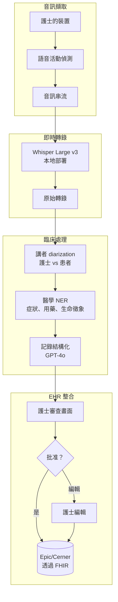
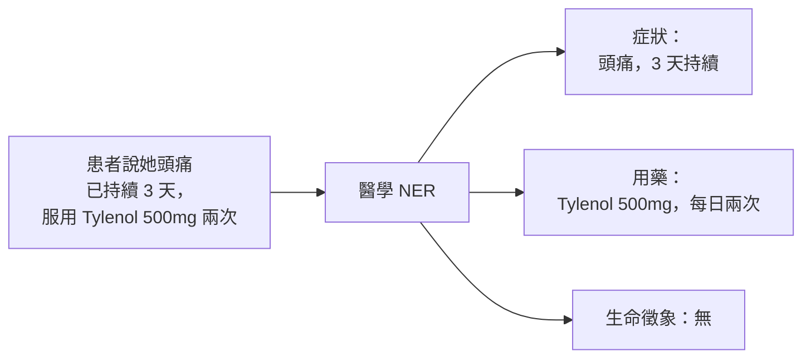

# 案例研究：醫療照護語音 AI 助理

## 問題背景

一間醫院網路希望建立一個**語音 AI 助理**，幫助護士記錄患者就診情況。護士自然說話；AI 即時產生結構化臨床記錄。

**面試中给出的限制條件：**
- HIPAA 合規（PHI 處理）
- 在吵雜的醫院環境中運作
- 即時轉錄（低於 500ms 延遲）
- 必須正確使用醫學術語
- 與現有 EHR（Epic/Cerner）整合

---

## 面試問題

> 「設計一個護士在患者就診期間可以對話的語音助理，並在 EHR 中產生結構化臨床記錄。」

---

## 解決方案架構



---

## 關鍵設計決策

### 1. 本地部署 ASR 符合 HIPAA

**答案：** PHI 不能在沒有加密和 BAA 的情況下離開醫院網路。我們在本地 GPU 伺服器部署 Whisper Large v3，而非使用雲端 API：

| 選項 | 延遲 | HIPAA | 成本 |
|------|------|-------|------|
| 雲端 ASR（OpenAI） | 200ms | 需要 BAA，資料離開網路 | $0.006/分鐘 |
| 本地部署 Whisper | 150ms | 完全控制，無資料輸出 | $0.002/分鐘（攤銷 GPU） |

本地部署在延遲和合規上都勝出。

### 2. 講者 diarization：誰說了什麼

**答案：** 記錄必須區分「患者報告頭痛」和「護士觀察患者表情痛苦」。我們使用：

```python
# Pyannote 用於講者 diarization
diarization = pipeline("audio.wav")
# 輸出：[(0.0, 1.5, "SPEAKER_0"), (1.5, 4.2, "SPEAKER_1"), ...]

# 基於聲紋對應講者
roles = identify_roles(diarization, known_nurse_voiceprint)
# 輸出：{"SPEAKER_0": "nurse", "SPEAKER_1": "patient"}
```

護士的裝置在設定時擷取其聲紋用於角色識別。

### 3. 醫學 NER 用於結構化擷取

**答案：** 我們需要結構化資料，而非僅文字。醫學 NER 擷取：



我們使用微調的 BioBERT 模型進行 NER，而非 LLM，因為 NER 需要快速和確定性。

---

## 處理吵雜環境

醫院很吵。我們使用多種策略：

1. **定向麥克風**：護士裝置聚焦附近言語
2. **抗噪 ASR 模型**（Whisper 在噪音資料上訓練）
3. **信心閾值**：如果 ASR 信心 <0.7，我們標記需護士審查而非猜測
4. **關鍵字偵測**：醫學術語有自訂發音模型

---

## 結構化記錄格式

LLM 產生 SOAP 格式記錄：

```python
note_prompt = f"""
根據此就診轉錄生成臨床 SOAP 記錄。

轉錄：
{transcript_with_speakers}

擷取的實體：
- 症狀：{symptoms}
- 用藥：{medications}
- 生命徵象：{vitals}

輸出格式：
S（主觀）：患者報告的症狀
O（客觀）：護士的觀察和測量
A（評估）：臨床印象
P（計劃）：下一步、醫囑
"""
```

---

## EHR 整合（FHIR）

輸出必須是 EHR 的機器可讀格式：

```json
{
  "resourceType": "DocumentReference",
  "status": "current",
  "type": {
    "coding": [{"system": "http://loinc.org", "code": "34117-2", "display": "病史和身體檢查記錄"}]
  },
  "subject": {"reference": "Patient/12345"},
  "author": [{"reference": "Practitioner/nurse789"}],
  "content": [{
    "attachment": {
      "contentType": "text/plain",
      "data": "base64-encoded-soap-note"
    }
  }],
  "context": {
    "encounter": {"reference": "Encounter/visit456"}
  }
}
```

---

## 延遲預算

| 階段 | 目標 | 實際 |
|------|------|------|
| 音訊擷取到 VAD | 50ms | 30ms |
| ASR 轉錄 | 200ms | 150ms |
| Diarization | 100ms | 80ms |
| NER 擷取 | 50ms | 40ms |
| LLM 結構化 | 500ms | 450ms |
| **端到端總計** | **900ms** | **750ms** |

為即時感，我們在 NER 和 LLM 在已完成句子運行時串流部分轉錄。

---

## 面試後續問題

**問：如何處理醫學縮寫和術語？**

答：我們維護自訂詞彙表，將縮寫（PRN、BID、SOB）對應到完整術語。這注入到 ASR 模型（更好的辨識）和 LLM 提示（記錄中正確擴展）。

**問：如果護士在句子中途更正怎麼辦？**

答：我們偵測更正模式（「其實，我的意思是...」、「不對，是...」）並僅使用更正版本。指示 LLM 偏好較晚的陳述當衝突存在。

**問：如何確保 AI 不會錯過關鍵資訊？**

答：我們有「完整性檢查」驗證記錄包含所有擷取實體。如果 NER 發現「胸痛」但 SOAP 記錄未提及，標記需護士審查。我們還運行「安全關鍵」偵測器，升級自殺意念、虐待或其他強制報告觸發因素的提及。

---

## 面試關鍵要點

1. **醫療照護使用本地部署**：HIPAA 通常需要本地處理
2. **Diarization 至關重要**：誰說了什麼在臨床上很重要
3. **混合擷取**：快速 NER 用於結構化，LLM 用於文字生成
4. **始終有人工審查**：特別是臨床文件

---

*相關章節：[多模態模型](../02-model-landscape/04-multimodal-models.md)，[可靠性模式](../15-ai-design-patterns/05-reliability-patterns.md)*