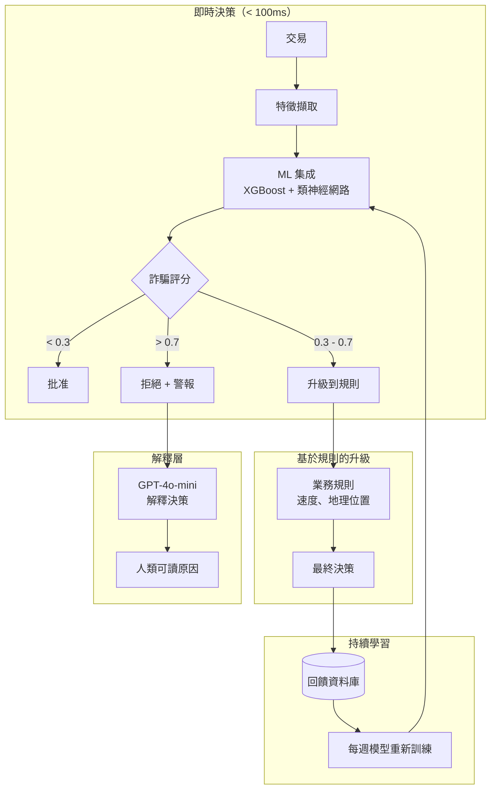
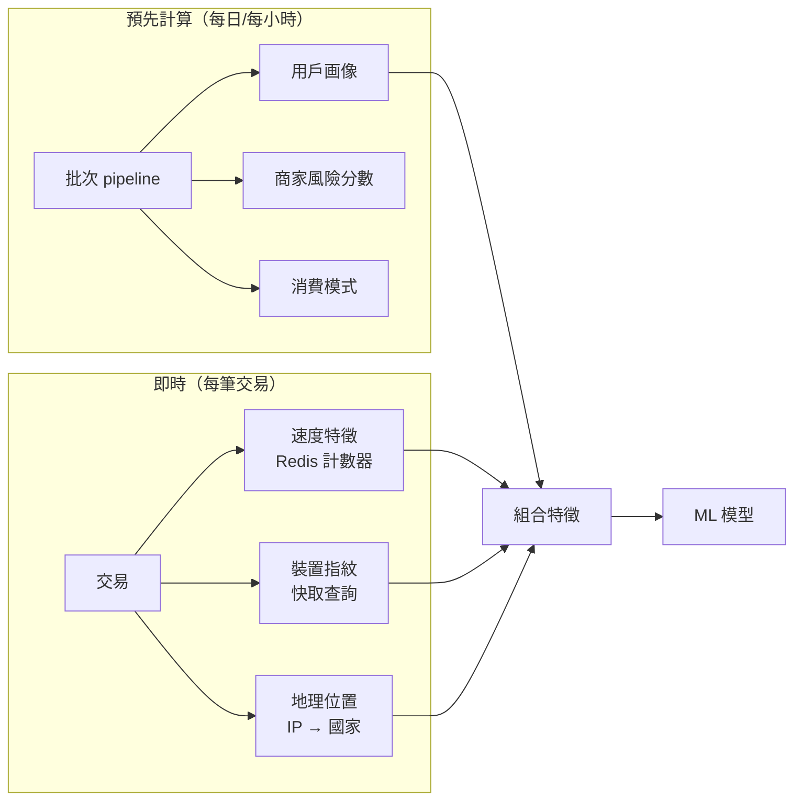
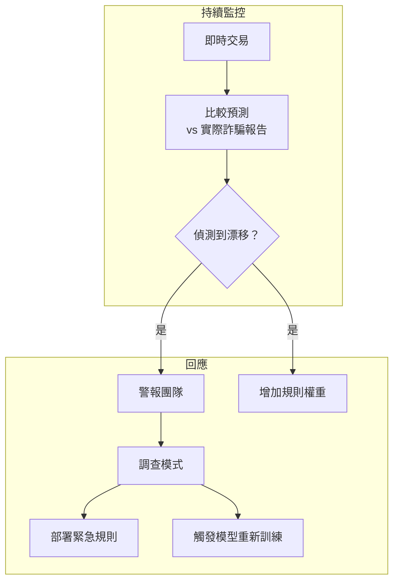

# 案例研究：即時詐騙偵測

## 問題背景

一家支付處理商每天處理 **1,000 萬筆交易**。他們需要即時偵測詐騙交易，在完成前阻止，同時將困擾合法客戶的假陽性降至最低。

**面試中给出的限制條件：**
- 決策延遲：低於 100ms
- 假陽性率：低於 0.1%（千分之一）
- 必須能解釋為何標記交易
- 法規要求 7 年稽核軌跡
- 詐騙模式持續演變

---

## 面試問題

> 「設計一個在 100ms 內決定批准、拒絕或升級信用卡交易的系統，並能解釋該決策。」

---

## 解決方案架構



---

## 關鍵設計決策

### 1. 為何 ML + 規則，而非純 ML？

**答案：** 純 ML 模型是黑箱。監管機構要求爭議的可解釋決策。我們使用 ML 評分，然後應用透明規則進行最終決策：

| 層 | 角色 | 速度 | 可解釋性 |
|------|------|------|----------|
| ML 集成 | 捕捉複雜模式 | 10ms | 低 |
| 業務規則 | 編碼已知詐騙類型 | 5ms | 高 |
| 組合 | 兩全其美 | 15ms | 中-高 |

規則範例：「如果在 1 小時內在不同國家有 5+ 筆交易則阻止」可向監管機構解釋。

### 2. 三方決策：批准 / 升級 / 拒絕

**答案：** 二元批准/拒絕太粗糙。「灰區」（0.3-0.7 分數）進入基於規則的升級或高價值交易的人工審查：

```python
def decide(transaction, fraud_score):
    if fraud_score < 0.3:
        return "APPROVE", None
    elif fraud_score > 0.7:
        reason = explain_rejection(transaction, fraud_score)
        return "REJECT", reason
    else:
        # 灰區：應用業務規則
        if check_velocity_rules(transaction):
            return "REJECT", "Velocity limit exceeded"
        if check_geography_rules(transaction):
            return "ESCALATE", "Unusual location"
        return "APPROVE", None
```

### 3. 為何用 LLM 解釋，而非 SHAP/LIME？

**答案：** SHAP 值告訴你「特徵 X 貢獻了 0.3 到分數」。客戶和監管機構想要「此交易被標記是因為它從您從未訪問過的國家的新裝置發起，金額是您通常購買的 10 倍。」

我們使用特徵重要性作為輸入生成自然語言解釋：

```python
prompt = f"""
解釋為何此交易被標記為潛在詐騙。

交易詳情：
- 金額：${amount}
- 商家：{merchant}
- 地點：{location}
- 裝置：{device}

最主要貢獻因素：
1. {factors[0]['feature']}：{factors[0]['contribution']}
2. {factors[1]['feature']}：{factors[1]['contribution']}
3. {factors[2]['feature']}：{factors[2]['contribution']}

為持卡人寫 2 句話解釋。
"""
```

---

## 速度特徵工程

100ms 預算意味著特徵必須預先計算：



**關鍵洞察：** 用戶画像（平均消費、典型商家、家鄉地理位置）離線計算。即時僅添加交易特定特徵。

---

## 處理演變的詐騙模式

詐騙者適應。上個月的模型會錯過這個月的攻擊。



**緊急規則**可在幾分鐘內部署（只需設定更新）。模型重新訓練需要數天但能捕捉更細微的模式。

---

## 面試後續問題

**問：如何處理模型延遲飆升？**

答：我們有**回退堆疊**。如果 ML 模型在 50ms 內未回應，我們回退到僅基於規則的評分。規則涵蓋最常見的詐騙模式。如果所有系統緩慢，我們也對低於 $10 的交易有「預設批准」。

**問：協同攻擊如何處理？**

答：我們維護全局速度計數器（不僅按用戶）。如果我們看到 1 分鐘內不同卡向同一個陌生商家有 100 筆交易，觸發商家級別阻止，即使個別交易看起來乾淨。

**問：如何平衡詐騙預防與客戶體驗？**

答：我們追蹤「侮辱率」：被阻止的合法客戶百分比。每個產品團隊都有侮辱預算。如果詐騙模型的侮辱率超過預算，我們自動放寬閾值並警報團隊。接受稍多詐騙比激怒忠誠客戶更好。

---

## 面試關鍵要點

1. **ML 用於評分，規則用於可解釋性**：結合兩者用於受監管領域
2. **三方決策減少假陽性**：灰區獲得額外審查
3. **預先計算一切可能**：即時預算僅用於組合
4. **持續重新訓練至關重要**：詐騙模式每週演變

---

*相關章節：[評估與可觀測性](../14-evaluation-and-observability/)，[可靠性模式](../15-ai-design-patterns/05-reliability-patterns.md)*