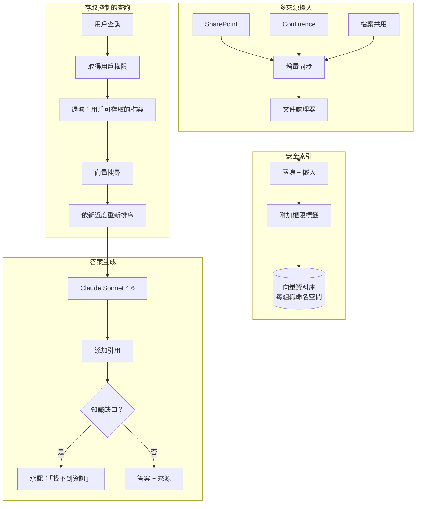
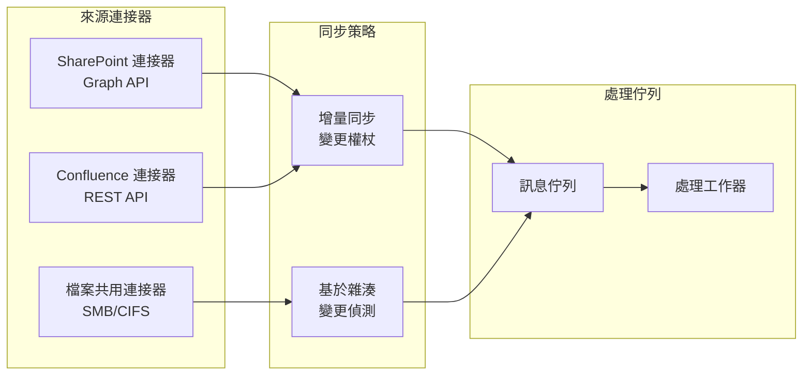

# 案例研究：企業知識管理

## 問題背景

一間擁有 **10,000 名員工**的顧問公司有數十年的專案報告、方法論文件和專業知識散落在 SharePoint、Confluence 和檔案共用中。他們希望建立一個 AI 系統，讓顧問可以問「我們如何處理汽車客戶的供應鏈優化？」並獲得從內部知識綜合的答案。

**面試中给出的限制條件：**
- 跨 15 個資料來源，200 萬份文件
- 存取控制：協理不能看到合夥人層級內容
- 每個聲稱必須引用來源
- 過時資料處理：舊方法論不應覆蓋新的
- 應識別知識缺口，而非產生幻觉

---

## 面試問題

> 「設計一個內部知識助理，讓菜鳥顧問可以提問並僅基於他們有權限查看的文件獲取答案。」

---

## 解決方案架構



---

## 關鍵設計決策

### 1. 權限感知檢索

**答案：** 每個區塊帶有其來源的權限中繼資料：

```python
chunk = {
    "content": "我們處理汽車供應鏈的方法...",
    "source": "sharepoint://projects/acme-motors/final-report.docx",
    "permissions": {
        "read_groups": ["partners", "managers", "automotive-team"],
        "classification": "confidential"
    },
    "last_modified": "2024-03-15",
    "author": "jane.doe@firm.com"
}
```

在查詢時，我們在檢索前過濾：

```python
def search(query: str, user: User):
    user_groups = get_user_groups(user.id)
    
    return vector_db.search(
        query=query,
        filter={
            "permissions.read_groups": {"$in": user_groups}
        }
    )
```

### 2. 新近度加權排名

**答案：** 2024 年方法論文件在同一主題上應排名高於 2019 年的。我們使用**衰減函數**：

```python
def recency_boost(doc_date):
    age_days = (today - doc_date).days
    # 半衰期 365 天
    return 0.5 ** (age_days / 365)

final_score = semantic_score * 0.7 + recency_boost(doc.date) * 0.3
```

這防止過時實踐淹沒當前指導。

### 3. 知識缺口偵測

**答案：** 我們必須區分「我找不到任何東西」和「我在捏造東西」：

```python
def generate_answer(query: str, retrieved_docs: list):
    if len(retrieved_docs) == 0 or max_relevance_score < 0.5:
        return {
            "answer": "我無法在我們的知識庫中找到此查詢的相關資訊。",
            "confidence": "low",
            "suggestion": "嘗試直接聯繫汽車實踐負責人。"
        }
    
    # 從檢索內容生成
    answer = llm.generate(query, context=retrieved_docs)
    return {"answer": answer, "confidence": "high", "sources": [d.source for d in retrieved_docs]}
```

---

## 多來源同步



**關鍵洞察：** SharePoint 和 Confluence 支援變更權杖（增量同步）。檔案共用需要雜湊比較。兩者都饋入統一處理佇列。

---

## 處理衝突資訊

不同文件可能有衝突指導。我們呈現這個：

```python
def detect_conflicts(retrieved_docs):
    # 按主題分組
    topics = cluster_by_topic(retrieved_docs)
    
    for topic, docs in topics.items():
        if has_contradictions(docs):
            return {
                "warning": "發現衝突指導",
                "perspectives": [
                    {"source": d.source, "date": d.date, "view": summarize(d)}
                    for d in docs
                ],
                "recommendation": "依據最新文件或諮詢實踐負責人。"
            }
```

---

## 成本分析

| 元件 | 每月成本 |
|------|----------|
| 嵌入（200 萬文件 × 更新） | $500 |
| 向量資料庫（Pinecone Enterprise） | $2,000 |
| LLM 生成（50K 查詢） | $3,000 |
| 同步基礎設施（連接器） | $500 |
| **總計** | **$6,000/月** |

ROI：顧問平均每週節省 2 小時搜尋資訊。10,000 名顧問 × $100/小時 × 2 小時 × 4 週 = 每月 $800 萬的生產力。系統自負盈虧 1,300 倍。

---

## 面試後續問題

**問：如何處理具有混合權限的文件？**

答：我们在區塊級別進行分塊，每個區塊繼承其祖先中最嚴格的權限。機密區段中的段落標記為「機密」。

**問：即時協作文件（Google Docs、即時 Confluence 頁面）呢？**

答：我們有單獨的「即時文件」pipeline，進行更頻繁的同步（每 5 分鐘 vs 靜態檔案的每日）。這些文件在搜尋結果中標記為「草稿」，直到它們最終確定。

**問：如何防止系統成為未授權資料的洩漏抽象？**

答：我們從不在 LLM 上下文中包含未授權內容，甚至不說「我無法向您展示這個」。系統表現得像未授權文件不存在。這防止推斷攻擊，用戶探測「您有關於 X 的資訊嗎？」以發現機密專案的存在。

---

## 面試關鍵要點

1. **權限必須在檢索時強制執行，而非生成時**：在 LLM 看到內容前過濾
2. **新近度加權防止過時知識**：舊文件在相關性中衰減
3. **承認缺口而非產生幻觉**：信心閾值和回退訊息
4. **多來源同步是複雜的**：不同 API 需要不同策略

---

*相關章節：[RAG 基礎](../06-retrieval-systems/01-rag-fundamentals.md)，[多租戶 RAG 隔離](../12-security-and-access/04-multi-tenant-rag-isolation.md)*