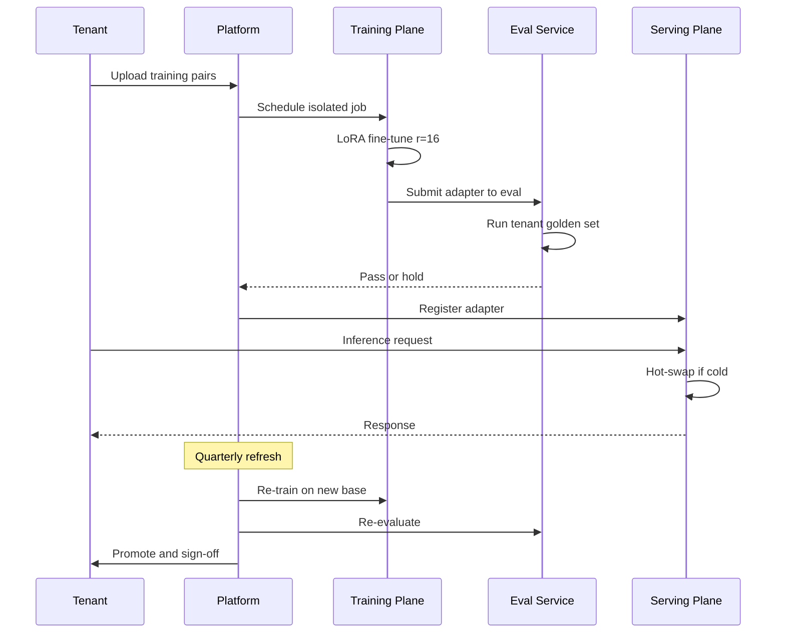

# 案例研究：多租戶微調平台

一家垂直 AI 廠商從單一基礎模型加每租戶 LoRA 適配器為 280 個客戶提供服務，具備隔離訓練、每租戶 eval-as-PRD，以及將 p99 延遲保持在 1.2 秒以下的嘈雜鄰居緩解。

## 業務問題

法律科技領域的垂直 SaaS 廠商營運一個合約分析產品。其 280 個企業客戶每個都期望模型尊重他們的模板、他們的先例語料庫和他們首選的起草風格。現成提示不夠：客戶運行盲 A/B 測試對抗通用模型，當輸出偏離其公司風格時拒絕產品。每租戶獨立微調模型也不可行：70B 參數，每個模型在磁碟上為 140 GB，需要專用 H100 來服務，會破壞單位經濟。

2026 年 5 月的現實限制：

- 280 個付費租戶，年增長一倍
- 每個租戶有 1,000 到 250,000 個歷史合約配對（輸入加首選編輯）
- 租戶要求在他們自己的測試集上證明適合度的 eval 報告
- 每查詢延遲預算：p99 低於 1.2 秒
- 租戶在不同合規 regime：SOC 2、ISO 27001、HIPAA、FedRAMP Moderate

團隊選擇每租戶 LoRA 適配器在共享基礎模型上。LoRA（[Hu et al., 2021](https://arxiv.org/abs/2106.09685)）和 QLoRA（[Dettmers et al., 2023](https://arxiv.org/abs/2305.14314)）已成熟；vLLM 的 multi-LoRA 服務（[文件](https://docs.vllm.ai/en/latest/models/lora.html)）和 SGLang 的適配器交換讓多個適配器共享 GPU 記憶體中的一個基礎模型。Anyscale 和 Together AI 都已發布此模式的生產案例研究（[Anyscale 2024 文章](https://www.anyscale.com/blog/fine-tuning-llms-lora-or-full-parameter-an-in-depth-analysis)，[Together AI multi-LoRA 服務](https://www.together.ai/blog/multi-lora-inference)）。

## 架構

```mermaid
flowchart TB
    subgraph Train["訓練平面"]
        TENANT[租戶資料] --> ETL[每租戶 ETL]
        ETL --> ISO[隔離作業執行器]
        ISO --> ADAPTER[LoRA 適配器構件]
    end

    subgraph Registry["適配器登錄"]
        ADAPTER --> REG[適配器存放區 S3]
        REG --> META[中繼資料索引]
        META --> EVAL[每租戶 Eval 套件]
    end

    subgraph Serve["服務平面"]
        REQ[請求] --> AUTH[認證和租戶 ID]
        AUTH --> ROUTER[適配器路由器]
        ROUTER --> CACHE{適配器在 GPU 中？}
        CACHE -->|是| INFER[vLLM Multi-LoRA]
        CACHE -->|否| LOAD[從 S3 熱交換]
        LOAD --> INFER
        INFER --> RESP[回覆]
    end

    subgraph Limits配額與隔離]
        AUTH --> QUOTA[每租戶配額]
        QUOTA --> ROUTER
    end
```

### 元件

| 層 | 技術 | 目的 |
|------|------|------|
| 基礎模型 | Llama 4 70B int8 | 跨所有租戶共享 |
| 適配器 | LoRA r=16，注意力層，~120 MB 每租戶 | 每租戶適配 |
| 訓練 | 8x H100 節點上的 DeepSpeed ZeRO-3 | 租戶隔離作業 |
| 服務 | vLLM 0.7+ 搭配 PagedAttention 和 multi-LoRA | 一個基礎，多個適配器 |
| 適配器存放區 | 每租戶 KMS 金鑰的 S3 | 靜態加密 |
| Eval 存放區 | 每租戶黃金集，每次重新訓練時運行 | 每租戶 eval-as-PRD |

### 訓練時資料流

1. 客戶透過具有專用 IAM 角色的每租戶 S3 桶上傳訓練配對；KMS 金鑰是每租戶的。
2. ETL 作業在限定該租戶的 Kubernetes 命名空間中運行；節點選擇器確保不與另一租戶的作業共同排程。
3. 訓練在每租戶通常 4 到 10 小時的 8x H100 pod 上運行；r=16 的 LoRA 適合每個 H100 80 GB，留下激活記憶體的空間。
4. 自動對租戶的黃金集運行 eval；如果指標回歸超過閾值，構件保持在 staging。
5. 適配器構件（約 120 MB，70B 基礎，r=16 注意力適配器）上傳到登錄，中繼資料索引更新。

### 服務時資料流

1. 請求帶著租戶 JWT 到達閘道。
2. 路由器解析該租戶的適配器版本。
3. 如果適配器在 GPU 記憶體中熱（每節點 200 個 LRU 緩存），推論繼續。
4. 如果冷，適配器從 S3 熱交換 200 到 600ms。我們通過基於租戶流量模式的預熱來隱藏此延遲。
5. vLLM 使用適配器運行請求；PagedAttention 因為 KV 是請求範圍而非適配器範圍，所以跨租戶安全共享 KV 緩存。

## 關鍵設計決策

### 1. LoRA r=16 優於全量微調

每租戶全量 70B 微調約花費 $4,500 計算，產生 140 GB 構件，並 pin 住一個 H100。r=16 的 LoRA 每租戶每次重新訓練花費 $80 到 $400，產生 120 MB 構件，並共享 GPU。我們內部合約分析 eval 上準確率差距為 100 分制的 1.6 分。我們接受這個差距，因為成本差異為 50 倍，營運故事（熱交換、臨時構件）也簡單得多。[Anyscale 文章](https://www.anyscale.com/blog/fine-tuning-llms-lora-or-full-parameter-an-in-depth-analysis)上的類似比較也得出了相同結論。

### 2. 適配器交換預算和嘈雜鄰居問題

vLLM 的 multi-LoRA 支援將適配器保留在 GPU 記憶體中，但每個適配器消耗約幾百 MB。在運行 70B 基礎（int8 約 40 GB）的 80 GB H100 上，我們約有 30 GB 用於適配器和 KV 緩存。這預算約 200 個適配器常駐。我們使用 LRU 搭配流量感知預熱和尾部租戶 pin：具有嚴格延遲 SLA 的前 30 個租戶被 pin 且從不被驅逐；其餘的輪換。一個適配器為冷的租戶支付 200 到 600ms 的尾部懲罰。我們在租戶 SLA 中明確說明這是冷啟動預算。

嘈雜鄰居失敗：一個租戶突然暴增到 10 倍正常流量，將其他適配器驅出緩存。緩解：閘道處每租戶 token-bucket 速率限制，加上對過去 60 秒內提供流量的任何適配器的動態驅逐保護。

### 3. 每租戶 eval 套件作為閘道

我們將租戶的黃金集視為產品需求文件。訓練 pipeline 在每次重新訓練後針對該集合運行新適配器；如果指標在複合指標上回歸超過 2 分，構件被保留，Slack 通知發給租戶的 CSM。這是 Hamel Husain 寫的「eval-as-PRD」模式（[如何構建領域特定 evals](https://hamel.dev/blog/posts/evals/)），我們將其擴展為每租戶。每個租戶的黃金集在入職期間與他們的法律團隊共同策展（60 到 90 分鐘研討會），每季度刷新。

### 4. 透過 Kubernetes 命名空間加網路策略的訓練時隔離

多租戶是深度防禽問題。訓練作業在每租戶命名空間中運行；網路政策防止出口到該租戶 S3 前綴和中央指標服務之外的任何內容；節點選擇器防止共同排程。我們也對每租戶使用專用 KMS 金鑰進行桶加密和模型構件加密。洩漏的構件解密金鑰將暴露一個租戶，而非全部。

### 5. 服務時隔離：共享 GPU 沒問題，KV 緩存不是

基礎模型是共享的。適配器是每租戶的。KV 緩存是每請求的。PagedAttention（[vLLM 論文](https://arxiv.org/abs/2309.06180)）確保 KV 區塊按請求隔離，因此即使 Tenant A 和 Tenant B 在單個推論批次中共享一個 GPU，他們的注意力計算和 KV 狀態不會混合。我們用紅隊提示進行了審計：50K 對抗配對中無跨租戶洩漏。

### 6. 模型生命週期和基礎模型刷新

基礎模型每 6 到 9 個月升級。當升級發生時，所有適配器必須針對新基礎重新訓練。我們使用每個租戶的儲存訓練資料自動運行重新訓練；我們運行他們的 eval 套件；我們要求租戶在推廣前簽字。280 個租戶在 4 個專用訓練節點上的完整基礎刷新週期約需 3 週；我們公開分享時間表。未通過 eval 的適配器標記為人工審查，前一個基礎+適配器對保持服務直到解決。

### 7. 為何specifically r=16

粗心地閱讀 LoRA 論文建議 r=4 或 r=8 是標準選擇。我們在領域上進行了 sweep：r=4 在有 50K+ 訓練配對的租戶上擬合不足；r=8 可接受；r=16 達到從 r=32 可用增益的 95%。r=32 使構件大小和訓練成本加倍，增益不到 1 個指標分數。我們標準化到 r=16 跨注意力層（Q、K、V、O）並跳過 MLP 層。這是 [Anyscale 文章](https://www.anyscale.com/blog/fine-tuning-llms-lora-or-full-parameter-an-in-depth-analysis)對類似工作負載推薦的相同配置。

### 8. 冷啟動工程

從 S3 熱交換需要 200 到 600ms 冷。我們用流量感知預熱來隱藏：一個 sidecar 程序讀取過去 60 分鐘的租戶流量並在分鐘邊界預加載前 50 個冷適配器。預熱命中率為 78%，針對尾部延遲測量；其餘冷未命中通常是新規或在 idle 後返回的租戶，兩者都可以接受懲罰。

## 租戶生命週期序列



## 失敗模式和緩解

### F1：重新訓練後適配器品質回歸

重新訓練在租戶黃金集上產生比前一版本更差的模型。緩解：eval 閘道阻止推廣；前一個適配器保持 live；警報發給團隊和租戶。我們保留每租戶的前 3 個適配器版本用於回滾。回滾中位時間：6 分鐘。

### F2：訓練時跨租戶資料 bleed

ETL pipeline 中的錯誤從錯誤租戶的 S3 桶讀取。緩解：每租戶 IAM 角色；訓練作業在啟動時承擔租戶的角色，對其他桶有零憑證。回歸測試驗證在 Tenant A 角色下運行的作業無法列出 Tenant B 的桶；它在每個 CI 建置上運行。

### F3：流量峰值下適配器緩存顛簸

貿易展推動 30 個租戶同時峰值，驅出大多數其他適配器。p99 延遲從 1.1s 飆升至 4.8s。緩解：閘道對每個租戶進行速率限制；緩存為頂級租戶使用 pin 槽；我們保持 20% 的緩存容量作為儲備。當日曆上有已知事件時，我們在非高峰時預熱。

### F4：錯誤訓練資料毒害適配器

租戶意外上傳包含客戶 PII 或來自錯誤司法管辖區的合約。適配器過擬合到錯誤模式。緩解：自動 PII 偵測器在訓練前對輸入運行；eval 套件捕捉司法管辖区特定案例上的漂移；租戶可以在啟動重新訓練前在儀表板中抽樣檢查他們的訓練集。

### F5：基礎模型升級破壞舊適配器

新基礎模型有不同的 tokenizer 或層命名，適配器的矩陣形狀不再適用。緩解：每個基礎升級都被視為強制重新訓練。我們從不針對未在其上訓練的基礎提供適配器。服務平面中的防護拒絕加載沒有匹配基礎版本的適配器。

### F6：訓練平面成本失控

配置錯誤的作業在訓練步驟中迴圈，消耗 80 H100 小時而不產生檢查點。緩解：每租戶每月訓練預算；每作業超時（24 小時硬上限）；如果 loss plateau 超過 2 小時則向 SRE 發送頁面的看門狗。我們在過去 6 個月中中止了 14 個這樣的作業。

### F7：訓練中途 GPU 節點故障

8 個 H100 之一上的硬體故障使作業崩潰。緩解：DeepSpeed 每 30 分鐘檢查點；自動在新節點上恢復；我們維護一小部分熱備用節點。平均恢復時間：18 分鐘。作業級別重試預算：3 次嘗試後警報人類。

### F8：適配器簽署金鑰輪換破壞舊客戶端

我們為篡改偵測簽署適配器清單。在不協作的情況下輪換簽署金鑰會破壞服務平面的驗證步驟。緩解：輪換窗口期間的雙重簽署；客戶端在 7 天內接受舊或新金鑰；只有在所有客戶端驗證新金鑰後我們才退役舊金鑰。

### F9：透過共享 eval 基礎設施的租戶交叉污染

eval 執行器意外地將 eval 結果寫入錯誤租戶的指標桶。緩解：eval 結果發布的每租戶憑證；寫入時租戶 ID 檢查驗證目的地與運行作業的租戶匹配；不匹配拒絕寫入並警報。

### F10：適配器版本失控

3 年和 280 個租戶後，我們在登錄中有超過 10,000 個適配器版本。儲存便宜但中繼資料服務變慢。緩解：分層儲存，舊版本 90 天後自動歸檔到冷儲存；中繼資料服務僅索引每租戶當前加前 3 個版本；冷歸檔回滾場景 1 分鐘 SLA。

### F11：服務負載時適配器校驗和不正確

S3 熱交換期間的網路瞬斷腐敗了適配器位元組；vLLM 加載它但推論產生廢話。緩解：每個適配器在中繼資料中有 SHA-256 校驗和；服務平面在負載時驗證校驗和並拒絕服務不匹配的適配器；警報頁面 SRE 並重試負載。

## 營運注意事項

### 監控和 SLO

| SLO | 目標 | 我們測量的內容 |
|-----|------|----------------|
| 服務 p99 延遲 | 低於 1.2s，熱 | 95% 的租戶在任何時候都是熱緩存的 |
| 冷啟動 p99 | 低於 1.0s 添加 | 適配器 S3 負載時間 |
| 訓練作業成功率 | 超過 98% | 到達適配器推廣的作業 |
| Eval 閘道通過率 | 超過 90% | 清除租戶黃金集的適配器 |
| 跨租戶稽核發現 | 0 | 每季度自動紅隊 |

### 成本模型

我們混合流量下每租戶經濟學：

- 訓練：每次重新訓練 $80 到 $400；每季度刷新
- 服務：共享 GPU；每 token 成本 $0.18 每百萬輸入，$0.36 每百萬輸出（接近 Llama 4 的廠商等價物）
- 適配器儲存：每租戶每月 $0.04，120 MB
- Eval：每次重新訓練 $5
- 每租戶總計：每季度 $80 到 $800，取決於流量

在 280 個租戶，每月計算約 $180K，對比總收入 $720K，75% 毛利率符合計劃。

### On-call playbook

- 跨許多租戶的 p99 飆升：檢查適配器緩存命中率；如果低，節流暴增租戶並預熱熱集合。
- 單租戶回歸警報：檢查 eval delta；如果真實，回滾到之前的適配器；ping CSM。
- 訓練佇列積壓：橫向擴展訓練節點（我們保持 2 個 standby）；如果持續，呼叫平台團隊進行容量規劃。
- 訓練作業卡住：檢查檢查點時間戳；如果 2 小時無進展，殺掉並從最後檢查點恢復；loss 曲線異常可能表示錯誤資料。
- 租戶入職瓶頸：eval 研討會是長極；我們安排 3 週提前期並保持預建黃金集模板的積壓。

### 入職儀式

新租戶入職需要 4 到 6 週：1 週法律和 DPA 審查，1 週 eval-set 研討會，2 週首次訓練，1 週金絲雀推出。，我們在 runbook 中記錄每個租戶的入職，CSM 擁有日曆。eval 研討會是最高槓桿小時：這是客戶的領域專家將他們的判斷編碼到我們測試集的地方。

### 租戶離開

離開是一個清潔操作：我們刪除租戶的訓練資料，將所有適配器版本退休到 90 天冷歸檔（以防爭議），90 天後撤銷他們的 KMS 金鑰，並提供刪除證書。pipeline 是自動化的；CSM 簽字。

### 合規姿態

我們持有 SOC 2 Type II 並獲得 ISO 27001 認證。客戶稽核包包括：每租戶資料落地證明、靜態加密證據（帶 KMS 金鑰 ID）、訓練作業日誌和 eval 報告。我們每月自動生成包。

## 優秀面試候選人涵蓋的內容

- 他們引用 vLLM 的 multi-LoRA 服務和 PagedAttention 的名字，並解釋為何 KV 緩存隔離是共享 GPU 多租戶的關鍵。
- 他們區分每租戶 eval-as-PRD 與單一全局 eval；前者對垂直 AI 是強制的。
- 他們用具體數據（成本比率、準確率差距、構件大小）來衡量 LoRA 與全量 FT 的權衡。
- 他們命名嘈雜鄰居問題並提出至少三種緩解措施（速率限制、pin、驅逐保護）。
- 他們走過基礎模型刷新儀式；這是區分已發貨平台與原型的運營現實。
- 他們明確處理 rank 選擇問題（為何 r=16 而非 r=4 或 r=32），並帶有經驗數據而非傳聞。

## 參考文獻

- Hu et al.，[LoRA：大語言模型的低秩適配](https://arxiv.org/abs/2106.09685)
- Dettmers et al.，[QLoRA：量化 LLM 的高效微調](https://arxiv.org/abs/2305.14314)
- [vLLM Multi-LoRA 服務文件](https://docs.vllm.ai/en/latest/models/lora.html)
- Kwon et al.，[使用 PagedAttention 進行 LLM 服務的高效記憶體管理](https://arxiv.org/abs/2309.06180)
- Anyscale，[微調 LLM：LoRA 或全量參數](https://www.anyscale.com/blog/fine-tuning-llms-lora-or-full-parameter-an-in-depth-analysis)
- Together AI，[大規模 Multi-LoRA 推論](https://www.together.ai/blog/multi-lora-inference)
- Hamel Husain，[如何構建領域特定 evals](https://hamel.dev/blog/posts/evals/)
- Eugene Yan，[Evals：為 LLM 應用構建](https://eugeneyan.com/writing/evals/)
- Microsoft，[DeepSpeed ZeRO-3](https://www.deepspeed.ai/training/)
- [SGLang 適配器交換](https://github.com/sgl-project/sglang)
- [Kubernetes Multi-Tenancy WG 模式](https://github.com/kubernetes-sigs/multi-tenancy)

相關章節：[LoRA 和微調](../03-training-and-adaptation/02-lora-and-peft.md)，[多租戶 RAG 隔離](../12-security-and-access/04-multi-tenant-rag-isolation.md)，[推論優化](../04-inference-optimization/01-inference-fundamentals.md)。