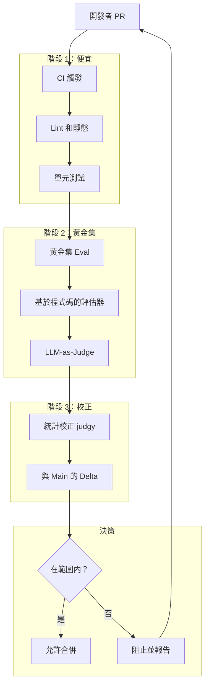
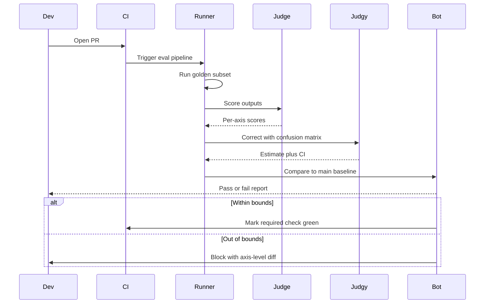

# 案例研究：AI 產品的 Eval 閘道 CI/CD

一個 28 名工程師的 AI 產品團隊用 eval 閘道 CI 替換合併後的回歸 hunts：每個 PR 在合併按鈕出現前運行黃金集、LLM-as-judge 統計校正和失敗模式分類法。

## 業務問題

一家 AI 優先 SaaS 公司發布了一個面向客戶的答案機器人，建構在 RAG pipeline 加上代理循環上。六個月前團隊發布了一個「小」提示變更，在特定合約類型上回歸答案品質，當客戶注意到時失去了 $4M 續約。事件後回顧發現三件事：該變更未針對合約特定測試集進行評估； spot 檢查中使用的 LLM-as-judge 指標漂移了 11 點而沒人注意到；一個需要 2 天回滾的修復花了 9 天，因為沒有人有安全回滾的基準。

2026 年 5 月的現實限制：

- 28 名工程師跨 4 個團隊；每週約 50 個 PR 觸及 AI 表面
- 受監管行業的客戶拒絕接受其特定領域查詢的回歸
- 每 PR eval 預算：低於 $40 模型支出；全運行預算：低於 $1,200
- PR 到合併時間目標：包括 eval 在內低於 90 分鐘
- 每季度審計師對 eval 方法論簽字

2026 年 5 月的現實是 eval 閘道 CI 不再是可有可無的。Hamel Husain 的 [eval 部落格系列](https://hamel.dev/blog/posts/evals/)、Eugene Yan 的文章（[evals](https://eugeneyan.com/writing/evals/)）和 [judgy 庫](https://github.com/ai-evaluation/judgy)（統計校正）都已收斂到一個 playbook。Phoenix、Langfuse、Braintrust 和 Galileo 都提供 CI 整合。問題不再是「我們應該這樣做」而是「如何在不加倍週期時間的情況下這樣做」。

## 架構

### 元件

| 層 | 技術 | 目的 |
|------|------|------|
| 黃金集 | repo 中的 YAML，每表面 1,200 到 4,000 個案例 | 穩定測試基礎 |
| 基於程式碼的評估器 | Pytest 搭配自訂斷言 | 便宜、確定性檢查 |
| LLM 判斷者 | Claude Sonnet 4.7 用於判斷 | 主觀品質 |
| 統計校正 | [judgy](https://github.com/ai-evaluation/judgy) | 將判斷分數轉換為帶 CI 的估計 |
| Pipeline | GitHub Actions 加上自訂執行器 | CI 編排 |
| 追蹤存放區 | Langfuse | 每 PR 可觀測性 |
| 註釋 | Argilla 自托管 | 人類重新標記用於判斷校準 |

### 資料流

1. PR 開啟；GitHub Actions 觸發；階段 1（lint、單元、類型檢查）在 2 分鐘內運行。
2. 階段 2 針對代表性子集開始黃金集 eval（預設為完整集的 10 到 25%；保護分支或標籤說 `full-eval` 時為 100%）。
3. 每個黃金集案例通過新構建運行，生成輸出，並由 (a) 基於程式碼的評估器（在適用確定性檢查的地方，如 JSON schema、regex、事實查找）和 (b) LLM 判斷者評分。
4. 階段 3 使用 `judgy` 校正判斷分數，並帶有 judge prompt 的 train/dev/test 分裂。
5. 校正估計（帶信心區間）與 `main` 的最後一個綠色建置進行比較；如果 CI 下限在容差範圍內，PR 合併；否則阻止並帶詳細報告。

## 關鍵設計決策

### 1. 黃金集構建和輪換

每個黃金集從三個來源構建：過去 90 天的生產追蹤樣本（從錯誤分析中分層的失敗模式）、由單獨紅隊 LLM 生成的綜合對抗案例，以及來自客戶支援票的策展邊緣案例。我們每季度輪換 10 到 15% 的案例；我們從不刪除案例（案例歸檔到冷凍的「歷史回歸」集，僅在夜間運行）。這避免了 eval 集隨產品漂移的過擬合陷阱。

大小：每表面 1,200 案例是底線；低於此，校正分數 CI 太寬，無法在 95% 信心下偵測 2 分回歸。Eugene Yan 涵蓋了這個大小數學；我們為我們的指標重新派生。

### 2. 判斷的 train/dev/test 分裂

LLM 判斷者本身就是一個具有 prompt 參數和 few-shot 範例的模型。我們將判斷 prompt 視為模型並應用 train/dev/test 紀律：60% 的人類標籤案例調優判斷 prompt，20% 選擇最佳 prompt 變體，20% 是我們僅在主要判斷 prompt 變更前諮詢的保留。這是 [judgy 方法論](https://github.com/ai-evaluation/judgy) 和 Hamel 的 eval 帖子的核心模式。

重新校準頻率：每 30 天，50 個 fresh 案例由 2 個人重新標記（需要 Cohen's kappa 超過 0.7）；如果判斷者在 dev 集上的準確率降至 80% 以下，我們重新調優。

### 3. 使用 judgy 進行統計校正

在我們領域，主觀類別上的天真 LLM-as-judge 準確率約為 75% 到 88%。原始判斷分數是有偏差的。`judgy` 使用保留集上判斷者的混淆矩陣計算真實通過率的校正估計，並返回信心區間。我們在 CI 下限在容差範圍內時閘道。這意味著我們從不僅因判斷噪聲而阻止 PR，也從不批准判斷者未捕捉到的回歸。

數學：如果判斷者在保留集上有 85% 精確率和 92% 召回率，而新構建的判斷者報告通過率為 89%，校正估計約為 87%，95% CI 約為 83% 到 91%。如果 CI 下限在 `main` 的 2 分以內，我們允許合併。（[參考：judgy README 數學](https://github.com/ai-evaluation/judgy#statistical-correction)）

### 4. 失敗模式分類法作為斷言表面

我們不將「品質」評分為單一數字。我們沿著從失敗模式分類法繪製的軸評分：幻觉、檢索未命中、格式違規、拒絕、角色破壞、引用錯誤。分類法是對 6 個月內 800 個生產失敗應用錯誤分析（[Hamel 的開放編碼 + 軸向編碼 pipeline](https://hamel.dev/blog/posts/field-guide/)）的輸出。按軸分數使我們能夠在整體品質提高時阻止 hallucination 回歸。

### 5. 每 PR eval 預算

完整 eval 集運行花費 $80 到 $200，取決於模型支出。每週 50 個 PR，天真成本為 $4K 到 $10K/週。我們綁定這個：

- 預設 PR 運行 10 到 25% 的黃金集，按失敗模式分層（所以所有失敗模式都代表）。
- `full-eval` 標籤觸發 100%。
- 夜間 cron 在 `main` 上運行 100% 以捕捉我們錯過的任何漂移。
- 新的 judge-prompt 變更在冷凍歷史集上觸發 100% 運行。

這將每 PR 成本限制在 $40 以下，每週總成本在 $1,200 以下。

### 6. 判斷 prompt 漂移偵測

即使有校準，判斷 prompt 也會漂移：底層模型更新，few-shot 範例變得不具代表性，prompt 的詞彙對模型來說感到過時。我們透過以下方式監控漂移：

- 每月重新運行保留集並報告與上個月的準確率 delta。
- 追蹤判斷者間一致性（我們並行運行兩個判斷 prompt；隨時間推移的分歧表示其中一個漂移）。
- 在 git 中版本化判斷 prompt；回滾是 1 提交操作。

當漂移超過 3 點或 kappa 降至 0.65 以下時，我們打開維護 ticket。

### 7. 快取 eval pipeline

典型的黃金集案例生成輸出，然後被判斷。輸出在給定 prompt 和模型版本時是確定的。我們快取 (prompt-hash, model-version) 到 (output, judge-score) 以便重新運行相同 eval 幾乎免費。在僅觸及編排程式碼（而非 prompt）的 PR 上，緩存命中率約為 70%；這在此類變更上減少 3 倍成本。

### 8. PR 級儀器

每個 PR 的 eval 報告包括：每軸通過率 vs main、每軸新失敗的範例、每軸新通過的範例、judge 校正 CI 邊界、總成本，以及指向追蹤存放區的鏈接，以便工程師可以重放任何失敗案例。報告在運行完成後 3 分鐘內作為 GitHub 評論發布。

## CI Pipeline 序列

## 失敗模式和緩解

### F1：判斷 prompt 漂移未被注意

判斷者在模型升級後逐漸少偵測幻觉。緩解：每月保留集重放；判斷者間一致性追蹤；保護分支的「freeze judge」模式，即使可用更新模型也 pin judge 模型版本。我們之前被打破的漂移事件正是這個；我們現在在一個週期內捕捉漂移。

### F2：Eval 集變得過擬合

少數案例被重複調試；prompt 隱含地針對它們調整。緩解：每季度輪換；保留的對抗案例從不向工程師顯示在失敗報告中（僅結果）。單獨的紅隊團隊擁有保留集。

### F3：單個 PR 運行 eval 的角落，錯過回歸

分層抽樣：我們確保每個 PR 的 10% 樣本包含每個 12 個失敗模式中至少 1 個案例。夜間全運行仍在 `main` 上發生。每 PR 覆蓋有界但不為零。

### F4：意外全運行導致成本超支

每個 PR 上的 `full-eval` 標籤使成本增加三倍。緩解：標籤需要 CODEOWNERS 文件的核准；自動化提醒 ping 套用它的任何人。我們還將每月 eval 支出上限設為 $5K 並拒絕啟動會超過它的作業。

### F5：阻斷率太高；開發者學會忽略

如果 35% 的 PR 被阻止，開發者停止閱讀報告並尋找繞過方法。緩解：我們將閘道容差調整為將阻斷率保持在 5 到 12%；我們將阻斷率視為 SLI；當它飆升我們調查原因（通常判斷者對新失敗模式太嚴格）。目標是浮現真實回歸，而非作為 gatekeeping 玩具。

### F6：保留集洩漏到訓練或 prompt

保留案例最終作為 few-shot 範例。緩解：保留集儲存在具有單獨存取清單的單獨 repo 中；工程師無法讀取它；只有 eval 執行器有部署金鑰。失敗報告包括 hash，而非 raw 案例，用於保留失敗。

### F7：判斷模型棄用

廠商宣布判斷模型終止。緩解：我們在並行中保持至少兩個判斷模型校準；當棄用登陸時，我們有 60 天窗口在保持 kappa 閾值的情況下交換。 judge prompt 的 git 歷史加上校準數據使這成為例行程序。

### F8：Eval 執行器佇列飽和

發布時間周圍的 PR 激增使 evals 佇列 30 分鐘深。緩解：專用 eval-runner GPU 池搭配自動擴展；保護分支的優先級通道；如果佇列深度超過 20，我們自動將非保護 PR 降級到 5% 樣本以更快清除積壓。

## 營運注意事項

### 監控

| SLO | 目標 |
|-----|------|
| PR 到合併 p95 | 低於 90 分鐘 |
| 每 PR eval 成本 p95 | 低於 $40 |
| 阻斷率（假陰性 + 真實回歸） | 5 到 12% |
| 判斷者間評分者 kappa | 超過 0.7 |
| 保留集重放準確率 delta 月度 | 低於 3 點 |
| 生產回歸逃逸（部署後） | 每季度低於 1 |

### 成本模型

每週 50 個 PR：

- 預設抽樣：每 PR 平均 $25；每週 $1,250
- 全 eval 運行（約每週 8 個）：每個 $100；每週 $800
- 夜間 cron：每個 $200；每週 $1,400
- 判斷重新校準：每月 $50
- 總計：每月約 $14K

這通過一次防止的回歸來自負盈虧。我們的事件後估計失去的 $4M 續約表明即使每年一次 savings 也遠遠有界。

### On-call playbook

- 阻斷率飆升：檢查是否有任何最近變更到判斷 prompt 或黃金集驅動這個；比較每軸分數與基準。
- Eval 成本飆升：檢查樣本率配置；對 `full-eval` 標籤進行速率限制。
- 判斷漂移警報：觸發校準週期；如果漂移嚴重則將判斷旋轉到備份模型。
- 保留集 breach（hash 碰撞）：立即隔離，重新生成受影響案例。
- Eval 執行器停機：PR 帶清晰「eval 待處理」狀態排隊；當執行器關閉時我們從不自動合併；SRE 在 15 分鐘內呼叫。

### 季度回顧

每季度 AI 團隊回顧：失敗模式分類法（類別是否仍匹配真實生產錯誤？）、黃金集輪換（哪些 10 到 15% 過時？）、判斷校準歷史（漂移是否加速？）和阻斷率趨勢（閘道是否成為劇院？）。此回顧饋入下季度的 eval 路線圖。我們使用 [Hamel field-guide](https://hamel.dev/blog/posts/field-guide/) 儀式：對最近 50 個失敗進行開放編碼會議，然後軸向編碼以更新分類法。

### 審計師包

eval pipeline 產生季度審計師包：方法論文件（git 中的版本化）、黃金集摘要（每失敗模式計數）、判斷校準結果（Cohen's kappa 隨時間推移）、阻斷率直方圖，以及失敗 PR 的樣本及理由。包是自動生成的，由工程主管簽字。

### 為何我們不使用單一複合品質分數

誘惑是將所有軸滾動成一個數字並在其上閘道。我們不這樣做。複合隱藏回歸：hallucination 回歸可能會被格式合規改進掩蓋。我們在每軸分數上閘道，以便每個軸有自己的信心區間和自己的 block。成本是更多報告噪聲；好處是我們從不在關鍵維度上靜默回歸。

## 優秀面試候選人涵蓋的內容

- 他們區分基於程式碼的評估器（便宜、確定性）與 LLM-as-judge（昂貴、主觀）並在不同階段使用兩者。
- 他們明確命名統計校正；他們理解原始判斷分數是有偏差的估計，信心區間是閘道的正確抽象。
- 他們從錯誤分析定義失敗模式分類法並在每軸分數上閘道，而非單一複合。
- 他們指定判斷本身的 train/dev/test 紀律，包括重新校準的 kappa 閾值。
- 他們明確綁定 eval 成本；他們知道全運行對每個 PR 來說太昂貴，分層抽樣是槓桿。
- 他們有判斷-prompt 漂移的故事：他們監控它，版本控制 prompt，他們有回滾計劃。
- 他們使用 hash 和單獨存取清單保護保留集以防止洩漏。

## 參考文獻

- Hamel Husain，[您的 AI 產品需要 evals](https://hamel.dev/blog/posts/evals/)
- Hamel Husain，[快速改進 AI 產品的領域指南](https://hamel.dev/blog/posts/field-guide/)
- Eugene Yan，[Evals：為 LLM 應用構建](https://eugeneyan.com/writing/evals/)
- Eugene Yan，[LLM-as-judge](https://eugeneyan.com/writing/llm-evaluators/)
- [judgy 庫](https://github.com/ai-evaluation/judgy)
- [Phoenix evals](https://docs.arize.com/phoenix/evaluation/concepts-evals)
- [Langfuse 評估](https://langfuse.com/docs/scores/overview)
- [Braintrust](https://www.braintrust.dev/docs)
- [Galileo evaluate](https://www.rungalileo.io/blog/llm-evaluation)
- Zheng et al.，[判斷 LLM-as-a-Judge](https://arxiv.org/abs/2306.05685)
- [Argilla 註釋平台](https://docs.argilla.io/)
- [pytest-html 報告整合](https://pytest-html.readthedocs.io/)

相關章節：[評估與可觀測性](../14-evaluation-and-observability/01-evaluation-fundamentals.md)，[可靠性與安全](../13-reliability-and-safety/01-reliability-fundamentals.md)，[AI Evals 綜合指南](../ai_evals_comprehensive_study_guide.md)。