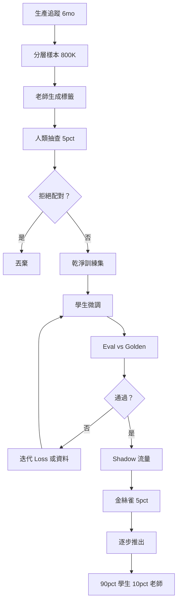

# 案例研究：客戶特定蒸餾 Pipeline

一家 B 輪 AI 產品透過在 6 個月的生產追蹤上蒸餾 7B 學生模型，將前沿模型支出從每月 $50K 削減至 $4 到 6K，3 個月回報和 4 到 6 個月的重新蒸餾頻率。

## 業務問題

一個已規模化的 AI 產品（每月約 800 萬用戶請求）運行在前沿模型上。成本線在 2026 年初超過每月 $50K，成長每季度 18%，財務要求一個計劃。團隊有一個清晰的認識：約 90% 的生產流量屬於少量recurring 任務模式（意圖分類、結構化提取、文件摘要、三種分類 triage）。前沿模型對這些來說是大材小用；在前沿自身輸出上微調的更小模型可以一小部分成本服務它們。

2026 年 5 月的現實限制：

- 每月 $50K 前沿模型支出，成長中
- 延遲預算：高流量任務低於 350ms p95
- 品質標準：客戶黃金集上低於 2% 回歸
- 合規：客戶資料不能離開特定雲端區域
- 人數：1 名 ML 工程師加 part-time 平台支持

蒸餾模式已成熟：DistilBERT（[Sanh et al., 2019](https://arxiv.org/abs/1910.01108)）、TinyBERT、Alpaca 風格指令蒸餾（[Taori et al., 2023](https://github.com/tatsu-lab/stanford_alpaca)），以及 chain-of-thought 蒸餾的近期工作（[Hsieh et al., 2023](https://arxiv.org/abs/2305.02301)）都顯示 7 到 13B 學生可以在專注任務上恢復 92% 到 98% 的老師效能。前沿實驗室 FDE 團隊（Anthropic Field Engineering、OpenAI Solutions）在會議上演示了預算數學；以下數字與這些團隊向客戶報價的數字一致。

## 架構

```mermaid
flowchart LR
    subgraph Collect["追蹤收集"]
        PROD[生產流量] --> TRACES[追蹤存放區]
        TRACES --> SAMPLER[分層抽樣器]
        SAMPLER --> CURATE[策展佇列]
    end

    subgraph Label["標記"]
        CURATE --> TEACHER[老師前沿模型]
        TEACHER --> LABELS[蒸餾配對]
        LABELS --> HUMAN[人類抽查]
        HUMAN --> CLEAN[乾淨配對]
    end

    subgraph Train["蒸餾"]
        CLEAN --> FT[學生微調 8x H100]
        FT --> EVAL[Eval 套件]
        EVAL --> CANARY[金絲雀群組]
    end

    subgraph Serve["服務"]
        CANARY --> SHADOW[Shadow 流量]
        SHADOW --> ROLLOUT[逐步推出]
        ROLLOUT --> STUDENT[學生模型服務]
    end
```

### 元件

| 層 | 技術 | 目的 |
|------|------|------|
| 老師 | 前沿模型（Claude Opus 4.7 或等效） | 標籤來源 |
| 學生 | Llama 4 7B int4 或 Qwen 3.6 7B | 生產服務 |
| 追蹤存放區 | S3 加 Langfuse | 抽樣和回放 |
| 訓練器 | 8x H100 上的 DeepSpeed 加 FSDP | 一週訓練運行 |
| Eval | 每任務黃金集，回歸時呼叫 | 品質閘道 |
| 服務 | FP8 的 vLLM | 350ms p95 |

### 資料流

1. 6 個月的生產追蹤在 Langfuse 加 S3 中累積。
2. 抽樣器按任務類別分層抽樣，重新平衡以確保稀有類別被代表。
3. 老師（前沿模型）為每個樣本生成目標輸出，如果任務受益於推理蒸餾，通常帶 chain-of-thought 推理追蹤。
4. 人類領域專家對老師標籤的 5% 隨機樣本進行抽查；我們應用拒絕採樣，只保留人類與老師一致的分對。
5. 學生在 8x H100（約 $22K 計算）上微調約 1 週，產生 7B 模型。
6. 模型通過每任務 eval，在生產上以 shadow 運行 2 週，然後逐步推出：5%、20%、50%、90% 在 3 週內，自動回滾連接到即時品質指標。

## 關鍵設計決策

### 1. 在真實生產追蹤上蒸餾，而非合成資料

誘惑是透過 LLM 生成綜合 prompt 並用老師標記它們。我們嘗試了；它產生一個在合成 prompt 上表現出色而在真實流量上下降 4 到 7 點的模型。生產追蹤捕捉重要的事件、奇異性和尾部案例。我們收集 6 個月的追蹤，按任務類別分層抽樣，並使用真實 prompt 作為蒸餾來源。這與前沿實驗室 FDE 團隊推薦的實踐一致。

### 2. 帶人類抽查的拒絕採樣

老師錯誤傳播到學生。92% 的老師精確率變成 90% 的學生精確率，如果您訓練每個老師輸出。我們對老師標籤的隨機樣本進行 5% 人類抽查，我們拒絕人類不同意的大師。這捕捉約 4% 的標籤並將最終學生的品質在複合指標上提升 2 到 4 點。成本：每次重新蒸餾約 $1,800 的人類標記，頂部計算。

### 3. Chain-of-thought 蒸餾在值得的地方

對於推理密集型任務（在我們的情況下是 triage 類別），我們使用 Hsieh et al. 的[帶原理的蒸餾](https://arxiv.org/abs/2305.02301)方法：老師發出答案和推理追蹤；學生被訓練發出兩者。這給學生結構化思維，而這是輸入-輸出配對 alone 不會開發的。我們對分類或提取任務不使用這個（沒有增益，額外延遲）。

### 4. 帶人類標記的 Eval-set 構建

我們的 eval 集與訓練集分開策展。它包含 1,800 個跨高流量任務類別的案例，由 3 位領域專家以多數票標記。我們每季度重新標記 200 個案例以追蹤分佈漂移。Eval 集是 canary 推出的閘道信號；複合指標上 2 分回歸阻止生產部署。我們在訓練資料抽樣期間從不看 eval-set 範例。

### 5. Canary 推出和 shadow 流量

即使 eval 通過，生產也有尾部行為 eval 集錯過的。我們的推出：

- 第 1 週：僅 shadow 流量，無用戶影響。我們在 100% 流量上比較學生 vs 老師輸出，delta 分類器將分歧標記為人類審查。
- 第 2 週：5% 即時流量。如果任何這些(a) 延遲 p95 超過 500ms、(b) 即時用戶豎起大拇指率下降超過 1 點、(c) 特定領域 guardrail 以更高頻率觸發，自動回滾。
- 第 3 週：20%。相同的 guardrails。
- 第 4 週：50%。
- 第 5 週：90%。10% 永久路由到老師用於持續追蹤收集和重新蒸餾。

這個保守的 ramp 在過去一年捕捉了 eval 集錯過的兩個回歸。

### 6. 重新蒸餾頻率

世界在漂移。新產品功能改變任務分佈；用戶學習新行為；老師本身隨著新模型發布而改進。我們每 4 到 6 個月重新蒸餾一次。pipeline 部分自動化：追蹤抽樣、老師標記和訓練是腳本化的；人類抽查和 eval 審查仍然需要一個人。每次重新蒸餾約 $26K 全包（$22K 計算、$1,800 標記、加 overhead），需要 4 到 6 週。

### 7. 蒸餾何時不適合

蒸餾並非總是正確。反對信號：

- 流量低（每月少於 200K 請求）。回報永遠不會實現。
- 任務高度可變。如果每個請求都獨一無二，學生無法學習有用的分佈。
- 老師本身不穩定或快速演變。針對移動目標重新蒸餾浪費精力。
- 品質標準非常嚴格（需要超過 99% 保真度）。蒸餾差距是真實的；如果您不能容忍，使用老師。

我們使用快速篩選啟發式：至少 60% 的流量落入 5 個或更少的任務模式，並且這些任務的每月支出超過 $20K。如果兩者都失敗，我們放棄蒸餾。

### 8. 量化選擇

我們在 int4（GPTQ via vLLM with FP8 KV cache）中提供 7B 學生。int4 將記憶體減少約 4 倍，並將 H100 吞吐量提高約 2.3 倍 vs FP16。我們測量複合指標上 0.4 點的準確率下降，在容忍範圍內。我們考慮了 int8（更小下降、更小加速）和 FP8（生態系統不太成熟）；int4 在每請求成本上獲勝。

### 9. 訓練資料上的隱私考慮

生產追蹤預設包含用戶 PII。訓練前，我們執行刪除過程：微調的 NER 模型標記 PII 範圍，我們用類別 token（`[EMAIL]`、`[PERSON_NAME]`）替換它們。學生學習結構模式而不記憶特定身份。刪除模型本身在標籤樣本上評估，precision 超過 98% 且recall 超過 95%。

## 成本和回報

| 項目 | 金額 |
|------|------|
| 追蹤收集（6 個月） | 已作為可觀測性支出支付 |
| 老師標記（約 800K 配對） | $42K 一次性 |
| 人類抽查 | $8K 一次性 |
| 計算（8x H100 1 週，加重試） | $32K 一次性 |
| Eval 套件策展 | $14K 一次性 |
| 平台工程（overhead） | $24K 一次性 |
| **總前期** | **$120K** |

| 每月運行率 | 之前 | 之後 |
|------------------|--------|-------|
| 前沿模型（10% 流量，加重新蒸餾工具） | $50K | $5K |
| 學生模型服務（專用 H100 上的 vLLM） | $0 | $1,200 |
| **每月總計** | **$50K** | **$6.2K** |

每月節省：約 $44K。回報：120K / 44K，約 2.7 個月。我們為財務四捨五入為「3 個月回報」。

重新蒸餾每 5 個月平均花費 $26K，我們將其攤銷到相同的節省線。年度淨節省：約 $470K。

## 蒸餾 Pipeline

## 失敗模式和緩解

### F1：老師升級使學生過時

前沿模型廠商發布新代，老師品質跳升，我們的學生現在在用戶期望相對於市場其他產品的表現上表現不足。緩解：我們每月監控老師 vs 學生的比較 eval；當差距超過 4 點，我們加速重新蒸餾日曆。針對更強的老師重新蒸餾是直接的；pipeline 相同。

### F2：訓練和服務之間的分佈漂移

新產品功能一夜之間改變用戶行為（通知活動推動異常查詢，新定價層轉變用戶類型）。學生的訓練分佈不再匹配生產。緩解：當輸入嵌入分佈移動超過閾值時，線上漂移監控標記；如果漂移是結構性的，我們觸發緊急重新蒸餾；如果是暫時的，我們將受影響的切片路由到老師。

### F3：老師幻觉烘烤到學生

老師偶爾 hallucinate；拒絕採樣捕捉大多數但不是全部。學生然後更自信地 hallucinate，因為模式在訓練分佈中。緩解：eval 集上的faithfulness 檢查；如果 hallucination 率相對於基準增長，觸發訓練資料的重新清理。

### F4：過度路由到老師導致成本回歸

10% 老師回退隨著工程師為各種邊緣情況添加回退而攀升。緩解：老師支出預算警報；回退路由的季度稽核；每個回退規則需要理由和到期日。

### F5：Canary 推出錯過尾部回歸

eval 集和 shadow 流量看起來都很好，但 5% 即時暴露了傷害特定客戶群體的回歸。緩解：即時流量上的每區段品質指標，自動回滾 per 區段；我們按客戶層級、語言和任務類別進行區段監控。

### F6：合規違規：訓練資料落地

客戶合約要求資料停留在特定區域；我們的預設訓練計算在不同的區域。緩解：我們維護區域本地訓練容量；每客戶訓練資料綁定到客戶的區域；我們從不將 raw 追蹤複製到區域外。orchestrator 拒絕啟動會違反落地規則的作業。

### F7：罕見任務上的災難性遺忘

學生忘記了在訓練中只看到兩次的類別。緩解：分層抽樣保證稀有類別的最小覆蓋；eval 套件明確包括稀有類別案例；canary 推出單獨監控每類別品質。

### F8：老師和學生之間的成本追蹤失敗

一些查詢在 shadow 期間同時路由到學生和老師；成本會計重複計算除非明確。緩解：每個呼叫（shadow、primary、fallback）上的成本標籤，帶每日對帳報告，捕捉標記錯誤的流量。

## 營運注意事項

### 監控

| SLO | 目標 |
|-----|------|
| 學生 p95 延遲 | 低於 350ms |
| 品質 delta vs 老師（校正） | 在 2 點內 |
| 老師回退率 | 目標 10%，超過 15% 警報 |
| 每 1K 請求成本 | 低於蒸餾前 30% |
| 重新蒸餾頻率 | 每 4 到 6 個月 |

### 成本模型

每月穩態：$6.2K 服務 plus 攤銷重新蒸餾（$5.2K/月）。與 $50K 僅老師相比，全面攤銷後每月節省約 $38K。年度化：~456K 節省 net。

### On-call playbook

- 品質回歸警報：用手動 eval-set 回放確認；如果真實，在下一個訓練週期之前將受影響的切片路由到老師；打開優先級 ticket。
- 成本超支：檢查回退路由；如果流量模式轉變，計劃重新蒸餾；如需要節流。
- 延遲飆升：檢查 GPU 利用率；如果嘈雜鄰居，隔離學生節點。
- 漂移警報：檢查輸入嵌入直方圖；如果漂移大且持久，觸發緊急重新蒸餾。
- Eval-set 洩漏：如果在訓練資料中找到保留的 eval 案例，立即退役案例並執行去重過程；在季度內刷新 eval 集。

### 比較 eval 頻率

每月一次，我們運行比較 eval：500 個案例樣本，學生 vs 老師，由 LLM-as-judge 加 50 案例人類樣本評分。輸出是 AI 團隊擁有的單一儀表板 tile。擴大的差距是需要重新蒸餾的早期警告。

### 重新蒸餾儀式

當重新蒸餾被安排時，我們遵循 4 週儀式：第 1 週，用當前老師抽樣 fresh 追蹤並標記；第 2 週，訓練和評估；第 3 週，shadow 流量；第 4 週，逐步推出。完整儀式是清單化的；ML 工程師 solo 運行，逐步推出階段有平台支持。

### 面向客戶的溝通

當我們將客戶的流量轉移到蒸餾學生時，我們告訴他們。面向客戶的措辭：「您的高流量查詢現在由我們根據您的流量微調的模型提供服務，為延遲和成本優化。在您的季度報告中，eval 證據顯示品質在前沿基準的 2 點以內。」大多數客戶不在意只要品質保持；一些（金融服務、醫療保健）需要明確簽字，我們將那些查詢路由到老師，除非他們選擇加入。

## 優秀面試候選人涵蓋的內容

- 他們明確做出預算數學並提前對話：前期成本、回報期、持續重新蒸餾成本。
- 他們按名稱引用蒸餾論文（DistilBERT、Alpaca、帶原理的蒸餾）並使用「學生」、「老師」和「拒絕採樣」的語言。
- 他們解釋為何生產追蹤優於合成資料，以及為何人類抽查老師標籤很重要。
- 他們走過帶具體百分比和自動回滾 gate 的 canary 推出；他們命名 shadow 流量錯過的回歸類型。
- 他們說蒸餾不幫助的地方，展示他們做過而不是只看過的。
- 他們處理老師升級場景：當前沿改進時，差距擴大，重新蒸餾是修復。
- 他們將隱私工作（PII 在訓練資料中刪除）作為 pipeline 的一部分，而非事後的想法。

## 參考文獻

- Sanh et al.，[DistilBERT，BERT 的蒸餾版本](https://arxiv.org/abs/1910.01108)
- Hinton et al.，[將神經網路中的知識蒸餾](https://arxiv.org/abs/1503.02531)
- Taori et al.，[Stanford Alpaca：一個指令遵循 LLaMA 模型](https://github.com/tatsu-lab/stanford_alpaca)
- Hsieh et al.，[逐步蒸餾](https://arxiv.org/abs/2305.02301)
- Jiao et al.，[TinyBERT：用於自然語言理解的 BERT 蒸餾](https://arxiv.org/abs/1909.10351)
- Anthropic，[關於蒸餾模式](https://www.anthropic.com/research)
- OpenAI，[平台中的蒸餾](https://platform.openai.com/docs/guides/distillation)
- [vLLM FP8 推論](https://docs.vllm.ai/en/latest/quantization/fp8.html)
- [Langfuse 追蹤抽樣](https://langfuse.com/docs/observability/sampling)
- Hamel Husain，[快速改進 AI 產品的領域指南](https://hamel.dev/blog/posts/field-guide/)
- [DeepSpeed 用於訓練](https://www.deepspeed.ai/training/)
- [Together AI 蒸餾案例研究](https://www.together.ai/blog/distillation)

相關章節：[微調與蒸餾](../03-training-and-adaptation/03-distillation.md)，[推論優化](../04-inference-optimization/01-inference-fundamentals.md)，[成本管理](../11-infrastructure-and-mlops/05-cost-management.md)。