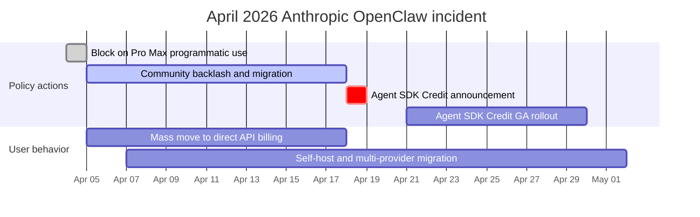

# OpenClaw 深度解析：開源個人 AI 代理程式

OpenClaw 是一個**開源、自託管的個人 AI 代理程式**，透過 LLMs 使用訊息平台作為主要介面來執行任務。你可以透過 WhatsApp、Telegram、Slack、Discord 或 Signal 與它交談，它會回覆——執行 shell 命令、控制瀏覽器、管理日曆、處理電子郵件，以及協調多步驟工作流程。

## 目錄

- [什麼是 OpenClaw](#what-is-openclaw)
- [歷史：Clawdbot 到 Moltbot 到 OpenClaw](#history)
- [架構深度解析](#architecture)
- [AgentSkills 系統](#agentskills)
- [LLM 提供商配置](#llm-providers)
- [訊息平台整合](#messaging-integrations)
- [安全性模型](#security-model)
- [部署模式](#deployment-patterns)
- [效能優化與擴展](#performance)
- [真實世界使用案例](#use-cases)
- [限制與何時不使用 OpenClaw](#limitations)
- [與替代方案的比較](#comparison)
- [入門：快速設定指南](#getting-started)
- [系統設計面試切入點](#system-design-interview)
- [參考文獻](#references)

---

## 什麼是 OpenClaw

OpenClaw 是：

- **個人 AI 代理程式**：不是聊天機器人——是一個代表你行動的自主代理程式
- **自託管**：在你的機器、VPS 或樹莓派上運行——你控制你的資料
- **訊息原生**：生活在你已經使用的聊天應用程式中（WhatsApp、Telegram、Slack、Discord、Signal、iMessage 以及 20+ 其他）
- **LLM 無關**：可與 Claude、GPT-4、Gemini、DeepSeek 或本地模型配合使用
- **技能可擴展**：100+ 預配置技能，帶有撰寫自訂技能的簡單格式
- **開源**：MIT 授權，2026 年初擁有 250K+ GitHub 星標

```bash
# The simplest way to start
git clone https://github.com/openclaw/openclaw.git
cd openclaw
docker compose up -d

# Or via npm
npm install -g openclaw
openclaw start
```

**與聊天機器人的關鍵區別：**
- ChatGPT/Claude.ai：你輸入，它回覆文字
- OpenClaw：你輸入，它**做事**——執行命令、編輯檔案、發送電子郵件、控制智慧家居裝置、管理你的日曆

---

## 歷史

### 命名時間線

| 日期 | 名稱 | 事件 |
|------|------|------|
| 2025 年 11 月 | **Clawdbot** | Peter Steinberger 發布第一個原型，大約用了一小時構建 |
| 2026 年 1 月 | 2,000 星標 | 早期採用者發現這個專案 |
| 2026 年 1 月 27 日 | **Moltbot** | 在 Anthropic 商標投訴後更名（保留龍蝦主題） |
| 2026 年 1 月 30 日 | **OpenClaw** | 再次更名——Steinberger 發現「Moltbot」說起來很彆扭 |
| 2026 年 2 月 | 145,000+ 星標 | 爆發性增長，超越許多成熟的開源專案 |
| 2026 年 2 月 14 日 | -- | Steinberger 加入 OpenAI，理由是需要資源來擴展規模 |
| 2026 年 3 月 | 250,000+ 星標 | 超越 GitHub 上的 React；史上增長最快的 OSS 專案之一 |

### 創建者

Peter Steinberger 是一位奧地利軟體工程師，之前花了 13 年構建 PSPDFKit，這是一款全球開發者使用的 PDF 工具包，2024 年出售了公司。他稱自己是「氛圍程式設計師」，並表示他發布他不閱讀的程式碼——體現了新的 AI 優先開發理念，人類提供意圖，AI 提供實作。

### 為何病毒式傳播

OpenClaw 觸動了神經，因為它解決了一個真實問題：LLMs 很強大但無狀態。每個對話從零開始。OpenClaw 給予 LLMs **持久性**（跨對話的記憶）、**能動性**（行動的能力，而不僅僅是談話）和**觸及範圍**（與你已經使用的應用程式整合）。它是自託管和開源的事實意味著任何人都可以在不信任第三方服務的情況下運行它。

---

## 架構

### 高層概覽

```
                         OPENCLAW ARCHITECTURE
 ===========================================================

  Messaging Platforms              OpenClaw Gateway           LLM Providers
 ┌──────────────┐              ┌─────────────────────┐     ┌──────────────┐
 │  WhatsApp    │──┐           │                     │     │  Anthropic   │
 │  (Baileys)   │  │           │   GATEWAY            │     │  (Claude)    │
 ├──────────────┤  │  Channel  │   ┌──────────────┐  │     ├──────────────┤
 │  Telegram    │──┼──Adapters─┼──>│  Router      │  │     │  OpenAI      │
 │  (grammY)    │  │           │   │  (sessions,  │  │     │  (GPT-4)     │
 ├──────────────┤  │           │   │   bindings)  │  │     ├──────────────┤
 │  Slack       │──┤           │   └──────┬───────┘  │     │  Google      │
 │  (Bolt)      │  │           │          │          │     │  (Gemini)    │
 ├──────────────┤  │           │   ┌──────▼───────┐  │     ├──────────────┤
 │  Discord     │──┤           │   │ Agent Runtime│──┼────>│  DeepSeek    │
 │  (discord.js)│  │           │   │ (AI loop,    │  │     ├──────────────┤
 ├──────────────┤  │           │   │  tool calls, │  │     │  Local/      │
 │  Signal      │──┤           │   │  memory)     │  │     │  Ollama      │
 │  (signal-cli)│  │           │   └──────┬───────┘  │     └──────────────┘
 ├──────────────┤  │           │          │          │
 │  iMessage    │──┤           │   ┌──────▼───────┐  │     Tools & Skills
 │  (BlueBubbles│  │           │   │  Tool Layer  │  │     ┌──────────────┐
 ├──────────────┤  │           │   │  (skills,    │──┼────>│  Shell exec  │
 │  Teams       │──┘           │   │   browser,   │  │     │  Browser     │
 │  IRC, Matrix │              │   │   files,     │  │     │  File I/O    │
 │  20+ more... │              │   │   cron)      │  │     │  Calendar    │
 └──────────────┘              │   └──────────────┘  │     │  Email       │
                               │                     │     │  100+ more   │
                               │   ┌──────────────┐  │     └──────────────┘
                               │   │  Memory &    │  │
                               │   │  State       │  │     Storage
                               │   │  (sessions,  │──┼────>┌──────────────┐
                               │   │   workspace) │  │     │  ~/.openclaw/│
                               │   └──────────────┘  │     │  (state,     │
                               └─────────────────────┘     │   memory,    │
                                                           │   config)    │
                                localhost:18789             └──────────────┘
```

### 核心元件

**1. Gateway**

Gateway 是一個長期運行的 WebSocket 伺服器（預設：`localhost:18789`），作為工作階段、路由和通道連線的單一真理來源。它處理：

- 接受來自所有訊息平台的連線（透過通道介面卡）
- 將訊息路由到正確的代理程式
- 工作階段管理和狀態持久化
- 認證和存取控制
- 熱重載設定變更

**2. 通道介面卡**

當來自任何平台的訊息到達時，通道介面卡將其正規化為標準內部格式。每個介面卡包裝特定於平台的函式庫：

| 平台 | 介面卡函式庫 | 協定 |
|----------|----------------|----------|
| WhatsApp | Baileys | WebSocket（非官方） |
| Telegram | grammY | Bot API |
| Slack | Bolt | Events API |
| Discord | discord.js | Gateway API |
| Signal | signal-cli | D-Bus |
| iMessage | BlueBubbles | REST API |
| IRC | irc-framework | IRC 協定 |
| Matrix | matrix-js-sdk | Matrix 協定 |
| Microsoft Teams | Bot Framework | REST API |

**3. Agent Runtime**

Agent Runtime 是 AI 迴圈。對於每個收到的訊息，它：

1. 從工作階段歷史、工作區記憶體和相關技能組裝上下文
2. 將組裝的提示傳送給配置的 LLM
3. 從模型接收工具呼叫
4. 對系統功能執行工具呼叫
5. 將結果返回給模型以進行下一次迭代
6. 持久化更新後的狀態（記憶體、檔案、工作階段歷史）

**4. 多代理程式路由**

OpenClaw 支援在一個 Gateway 程序內運行多個代理程式。每個代理程式擁有自己的工作區、agentDir、工作階段和工具配置。入站訊息透過綁定路由到代理程式：

```json
{
  "agents": {
    "list": [
      {
        "name": "work-assistant",
        "agentDir": "./agents/work",
        "channels": ["slack-work"]
      },
      {
        "name": "home-assistant",
        "agentDir": "./agents/home",
        "channels": ["whatsapp-personal", "telegram"]
      },
      {
        "name": "devops-bot",
        "agentDir": "./agents/devops",
        "channels": ["discord-infra"]
      }
    ]
  }
}
```

這意味著你可以有一個在 Slack 上的工作助理、一個在 WhatsApp 上的個人助理和一個在 Discord 上的 DevOps 機器人——全部從一個 Gateway 運行，擁有完全隔離的記憶體和許可。

---

## AgentSkills 系統

### 技能如何運作

技能是 OpenClaw 獲得超越基本對話能力的機制。每個技能是一個目錄，包含帶有 YAML 前置資料的 `SKILL.md` 檔案（元資料）和 markdown 指令（行為）。

```
~/.openclaw/skills/
  weather/
    SKILL.md           # 必需：元資料 + 指令
    scripts/
      fetch_weather.py # 可選：可執行腳本
    references/
      api_docs.md      # 可選：補充文件

  email-manager/
    SKILL.md
    scripts/
      process_inbox.py
```

### SKILL.md 格式

```yaml
---
name: weather-lookup
description: >
  Fetch current weather and forecasts for any location.
  Responds to queries about temperature, rain, and conditions.
triggers:
  - weather
  - temperature
  - forecast
  - "is it going to rain"
tools:
  - web_search
  - bash
---

# Weather Lookup Skill

When the user asks about weather:

1. Use the web_search tool to find current conditions
2. Extract temperature, humidity, wind, and forecast
3. Present in a concise, readable format
4. Include both metric and imperial units

## Example Response Format

"Currently 72F (22C) and partly cloudy in San Francisco.
Forecast: Clear skies through Thursday, rain expected Friday."
```

### 技能解析順序

技能可以存在於多個位置。當發生名稱衝突時，最本地的副本優先：

```
優先順序（最高優先）：
  1. <workspace>/skills/        # 專案特定技能
  2. ~/.openclaw/skills/        # 使用者全域技能
  3. <installed-packages>/      # npm 安裝的技能
  4. <bundled>/skills/          # 隨 OpenClaw 附帶
```

### 選擇性注入

OpenClaw **不會**將每個技能注入每個提示。執行時選擇性注入僅與當前回合相關的技能，基於技能描述和觸發關鍵字。這防止了提示膨脹並保持模型效能高水平。

### 建立自訂技能

```bash
# Create the skill directory
mkdir -p ~/.openclaw/skills/deploy-checker
cd ~/.openclaw/skills/deploy-checker

# Create the SKILL.md
cat > SKILL.md << 'EOF'
---
name: deploy-checker
description: >
  Monitor deployment status across staging and production.
  Checks health endpoints, recent commits, and CI status.
triggers:
  - deploy
  - deployment
  - "is staging up"
  - "prod status"
tools:
  - bash
  - web_search
---

# Deploy Checker

When asked about deployment status:

1. Run `curl -s https://staging.myapp.com/health` to check staging
2. Run `curl -s https://myapp.com/health` to check production
3. Check recent git log: `git log --oneline -5`
4. Report status in a clear format

## Response Format

Staging: [UP/DOWN] - version X.Y.Z - deployed 2h ago
Production: [UP/DOWN] - version X.Y.Z - deployed 1d ago
Last 3 commits: ...
EOF
```

### 社群技能生態系統

OpenClaw 技能生態系統快速增長，社群維護的集合包含數千個跨類別的技能，如 DevOps、家庭自動化、內容建立、資料分析等。然而，這種開放性帶來風險——在安裝之前始終審查第三方技能，因為早期目錄中有惡意腳本的事件。

---

## LLM 提供商配置

### 配置檔案

OpenClaw 從 `~/.openclaw/openclaw.json`（JSON5 格式——允許註釋和尾隨逗號）讀取配置。Gateway 監看此檔案並透過熱重載自動應用變更。

```json5
{
  // Model provider configuration
  "models": {
    "providers": {
      "anthropic": {
        "baseUrl": "https://api.anthropic.com",
        "apiKey": "${ANTHROPIC_API_KEY}",  // env var substitution
        "models": {
          "claude-sonnet-4": {
            "maxTokens": 8192
          }
        }
      },
      "openai": {
        "baseUrl": "https://api.openai.com/v1",
        "apiKey": "${OPENAI_API_KEY}",
        "models": {
          "gpt-4o": {
            "maxTokens": 4096
          }
        }
      },
      "custom-deepseek": {
        "api": "openai",  // OpenAI-compatible API
        "baseUrl": "https://api.deepseek.com/v1",
        "apiKey": "${DEEPSEEK_API_KEY}",
        "models": {
          "deepseek-chat": {
            "maxTokens": 4096
          }
        }
      },
      "local-ollama": {
        "api": "openai",
        "baseUrl": "http://localhost:11434/v1",
        "apiKey": "ollama",  // Ollama accepts any key
        "models": {
          "llama3.1:70b": {
            "maxTokens": 2048
          }
        }
      }
    }
  },

  // Default agent model
  "agents": {
    "defaults": {
      "model": "anthropic/claude-sonnet-4"
    }
  }
}
```

### 提供商選擇策略

| 提供商 | 最適合 | 權衡 |
|----------|----------|------------|
| Anthropic (Claude) | 複雜推理、編碼任務、長上下文 | 較高成本、最佳品質 |
| OpenAI (GPT-4o) | 通用用途、快速回覆 | 速度和品質的良好平衡 |
| Google (Gemini) | 注重預算的測試、慷慨的免費方案 | 較低推理品質 |
| DeepSeek | 最便宜的前沿級選項（V4 Flash $0.14/$0.28 每 1M，V4 Pro $0.435/$0.87，2026 年 5 月 22 日永久折扣後）；1M 上下文；最適合高容量、快取友好的工作負載 | 可變可用性；也可自行托管開源權重 |
| 本地 (Ollama) | 注重隱私、離線使用 | 需要強大硬體、較低品質 |

### OpenClaw 內的模型路由

你可以為不同代理程式配置不同模型，實現成本優化：

```json5
{
  "agents": {
    "defaults": {
      "model": "openai/gpt-4o-mini"  // 便宜的預設
    },
    "list": [
      {
        "name": "coding-agent",
        "model": "anthropic/claude-sonnet-4"  // 高階編碼
      },
      {
        "name": "reminder-bot",
        "model": "google/gemini-2.0-flash"  // 簡單任務便宜
      }
    ]
  }
}
```

---

## 訊息平台整合

OpenClaw 透過其通道介面卡架構支援 20+ 訊息平台：

### 支援的平台

| 平台 | 函式庫 | 狀態 | 備註 |
|----------|---------|--------|-------|
| WhatsApp | Baileys | 穩定 | 非官方 API；需要個人帳戶 |
| Telegram | grammY | 穩定 | 官方 Bot API；最可靠的通道 |
| Slack | Bolt | 穩定 | 需要工作區應用安裝 |
| Discord | discord.js | 穩定 | 需要 Bot token |
| Signal | signal-cli | 穩定 | 需要連結的裝置 |
| iMessage | BlueBubbles | 穩定 | 僅限 macOS；需要 BlueBubbles 伺服器 |
| Google Chat | Chat API | 穩定 | 需要工作區管理員批准 |
| Microsoft Teams | Bot Framework | Beta | 2026 年 Q2 全面發布 |
| IRC | irc-framework | 穩定 | 經典協定支援 |
| Matrix | matrix-js-sdk | 穩定 | 聯合、自託管友好 |
| Mattermost | API | 穩定 | 自託管 Slack 替代方案 |
| LINE | Messaging API | 穩定 | 日本/東南亞流行 |
| Feishu (Lark) | Open API | 穩定 | 中國流行 |
| Twitch | TMI.js | 穩定 | 僅聊天 |
| WeChat | -- | Beta | 需要自訂橋接 |
| Nostr | -- | Beta | 去中心化協定 |
| WebChat | 內建 | 穩定 | 基於瀏覽器的備選 |

### 跨通道的統一上下文

一個關鍵的架構決策：Gateway 跨所有通道維護**一個統一的記憶體系統**。如果你在 WhatsApp 上告訴你的代理程式某些事情，它會記得當你從 Slack 發訊息時的內容。這意味著你的 AI 代理程式無論使用哪個應用程式與其聯繫，都有一致的上下文。

```
          WhatsApp ──┐
          Telegram ──┤     ┌─────────────────────┐
          Slack    ──┼────>│  Shared Memory Pool  │
          Discord  ──┤     │  (per-agent, cross-  │
          Signal   ──┘     │   channel sessions)  │
                           └─────────────────────┘
```

---

## 安全性模型

### 安全哲學

OpenClaw 的安全模型假設「個人助理」威脅模型：一個受信任的操作員，可能是多個代理程式。優先事項是：

1. **身份第一**：誰可以與機器人交談？
2. **範圍其次**：機器人允許在哪裡行動？
3. **模型最後**：假設模型可以被操縱，限制爆炸半徑

### 許可層

```
 Layer 1: Channel Authentication
 ─────────────────────────────────
 Who can message the bot?
 Configured per-channel with allowlists.

 Layer 2: Agent Tool Allow/Deny
 ─────────────────────────────────
 Which tools can this agent use?
 Configured per-agent in agents.list[].tools.

 Layer 3: Sandbox Tool Policy
 ─────────────────────────────────
 Separate from agent permissions.
 Even if agent allows a tool, sandbox may block it.

 Layer 4: Elevated Access
 ─────────────────────────────────
 Some tools require host-level access.
 Gated per-channel and per-user with allowFrom lists.
```

### 沙盒隔離

對於非主要工作階段（子代理程式、cron 工作、隔離任務），OpenClaw 支援 Docker 沙盒隔離：

```yaml
# docker-compose.sandbox.yml
services:
  openclaw-sandbox:
    image: openclaw/sandbox:latest
    network_mode: "none"        # No network access
    read_only: true             # Read-only root filesystem
    volumes:
      - ./workspace:/workspace  # Restricted workspace only
    security_opt:
      - no-new-privileges:true
```

使用 `network: "none"`，沙盒化子代理程式無法發出出站請求、無法滲透資料、無法訪問外部服務——即使運行惡意程式碼。

### 關鍵安全警告

**預設 localhost 信任**：預設情況下，OpenClaw 信任來自 localhost 的連線而無需認證。如果 Gateway 位於配置不當的反向代理後面，該代理轉發所有請求到 localhost，外部攻擊者將獲得完全存取權。對於遠端部署始終配置認證。

**技能供應鏈**：社群技能目錄中有惡意套件的事件。安裝前始終審查第三方技能。固定技能版本。為不受信任的技能使用沙盒。

### 強化檢查清單

```
[x] Set state directory permissions to 700
[x] Configure channel allowlists (do not leave open)
[x] Enable sandbox for sub-agents and cron jobs
[x] Use environment variables for API keys, never hardcode
[x] Put Gateway behind authenticated reverse proxy for remote access
[x] Review all third-party skills before installation
[x] Set up monitoring for unusual tool invocations
[x] Restrict elevated tool access to specific users
[x] Run Gateway as non-root user
[x] Enable TLS for WebSocket connections
```

---

## 部署模式

### 選項 1：本地開發（最快開始）

```bash
# Clone and run
git clone https://github.com/openclaw/openclaw.git
cd openclaw
cp .env.example .env
# Edit .env: add ANTHROPIC_API_KEY or OPENAI_API_KEY

npm install
npm start
```

**需求**：Node.js 20+、512MB RAM、任何作業系統。

### 選項 2：Docker（推薦用於生產）

```yaml
# docker-compose.yml
version: "3.8"
services:
  openclaw:
    image: openclaw/openclaw:latest
    container_name: openclaw-gateway
    restart: unless-stopped
    ports:
      - "18789:18789"
    volumes:
      - ./state:/app/state         # Persistent state
      - ./openclaw.json:/app/openclaw.json  # Configuration
    environment:
      - ANTHROPIC_API_KEY=${ANTHROPIC_API_KEY}
      - OPENAI_API_KEY=${OPENAI_API_KEY}
    mem_limit: 2g
    logging:
      driver: json-file
      options:
        max-size: "10m"
        max-file: "3"
```

```bash
docker compose up -d
docker logs -f openclaw-gateway  # Watch logs
```

### 選項 3：雲端 VPS（常開）

OpenClaw 很輕量——任何具有 512MB RAM 和 1 個 CPU 核心的機器都足夠。每月 $4-6 的 VPS 即可。

**快速部署選項：**
- **DigitalOcean**：1-Click App，內建安全強化
- **Railway**：從 GitHub README 一鍵部署按鈕（約 5 分鐘）
- **Contabo**：VPS 方案的免費 1-click OpenClaw 附加元件
- **AWS Lightsail**：每月 $3.50 的實例輕鬆運行
- **Raspberry Pi**：在 Pi 4 上運行良好，4GB RAM

### 生產架構

```
                    PRODUCTION DEPLOYMENT
 ===================================================

  Internet
     │
     ▼
 ┌───────────────┐
 │  Cloudflare   │     SSL termination
 │  (CDN/WAF)    │     DDoS protection
 └───────┬───────┘
         │
         ▼
 ┌───────────────┐
 │  Nginx        │     Reverse proxy
 │  (with auth)  │     Rate limiting
 └───────┬───────┘     WebSocket upgrade
         │
         ▼
 ┌───────────────────────────────────────┐
 │  Docker                              │
 │  ┌─────────────────────────────────┐ │
 │  │  openclaw-gateway               │ │
 │  │  (main process)                 │ │
 │  └────────────┬────────────────────┘ │
 │               │                      │
 │  ┌────────────▼────────────────────┐ │
 │  │  openclaw-sandbox               │ │
 │  │  (isolated sub-agents)          │ │
 │  │  network: none                  │ │
 │  └─────────────────────────────────┘ │
 │                                      │
 │  Volume: ./state (700 permissions)   │
 └──────────────────────────────────────┘
         │
         ▼
    LLM APIs
    (Anthropic, OpenAI, etc.)
```

### 用於遠端存取的 Nginx 配置

```nginx
# /etc/nginx/sites-available/openclaw
server {
    listen 443 ssl http2;
    server_name openclaw.yourdomain.com;

    ssl_certificate /etc/letsencrypt/live/openclaw.yourdomain.com/fullchain.pem;
    ssl_certificate_key /etc/letsencrypt/live/openclaw.yourdomain.com/privkey.pem;

    location / {
        proxy_pass http://127.0.0.1:18789;
        proxy_http_version 1.1;
        proxy_set_header Upgrade $http_upgrade;
        proxy_set_header Connection "upgrade";
        proxy_set_header Host $host;
        proxy_set_header X-Real-IP $remote_addr;

        # Basic auth for web interface
        auth_basic "OpenClaw";
        auth_basic_user_file /etc/nginx/.htpasswd;
    }
}
```

---

## 效能優化與擴展

### 記憶體指南

| 部署 | 建議 RAM | 理由 |
|------------|----------------|-----------|
| 個人、輕量使用 | 512MB - 1GB | 少量技能、短對話 |
| 個人、日常使用 | 4GB | 中等技能數量、瀏覽器自動化 |
| 團隊或高頻率 | 8GB | 多個代理程式、並發對話 |
| 生產標準 | 16GB | 完整技能套件、重度自動化 |

### 上下文視窗管理

LLM 注意力隨上下文長度二次方擴展。當上下文從 50K 增加到 100K tokens 時，模型多做四倍的工作。實際優化：

- **限制上下文視窗**：100K tokens 對大多數任務來說足夠了
- **開始新對話**：長歷史累積了數百條訊息；定期重啟
- **禁用未使用的技能**：每個載入的技能都增加到上下文預算中

### 技能優化

```
 DO: Enable only skills you actively use
 DO: Write concise SKILL.md descriptions
 DO: Use specific trigger keywords

 DON'T: Enable everything "just in case"
 DON'T: Write verbose skill instructions
 DON'T: Load 50+ skills simultaneously
```

每個啟用的技能都會增加代理程式必須在每個回合評估的上下文。如果你過去一週沒有使用某個技能，請禁用它。

### 延遲減少

1. **禁用冗長推理**：`thinkingDefault` 設定控制內部推理。對於即時互動，跳過思維鏈可將處理時間減少大約一半
2. **使用更快的模型**：將簡單任務（提醒、查詢）路由到較小的模型
3. **共置提供商**：使用靠近你的伺服器的 LLM 提供商和區域
4. **使用 Docker 監控**：`docker stats openclaw-gateway` 用於即時資源使用情況

---

## 真實世界使用案例

### 1. 開發工作流程協調器

一個名為「Patch」的主管代理程式透過 Telegram 協調 5-20 個並行 Claude Code 實例。開發者從手機發送高層級指令，主管啟動編碼代理程式、分配任務、審查輸出、執行測試並合併程式碼。

```
Developer (phone)
     │
     ▼ Telegram message: "Fix auth bug and add rate limiting"
┌─────────────┐
│  Patch      │ (OpenClaw supervisor agent)
│  Agent      │
└──────┬──────┘
       │ Spawns parallel workers
       ├──> Claude Code instance 1: Fix auth bug
       ├──> Claude Code instance 2: Add rate limiting
       └──> Claude Code instance 3: Update tests
              │
              ▼
       Results merged, tests pass
       PR created automatically
```

### 2. 大規模電子郵件分類

一位開發者使用 himalaya CLI 整合為 OpenClaw 提供對擁有 15,000 條訊息的電子郵件帳戶的存取。代理程式處理了積壓——取消訂閱垃圾郵件、按緊急程度分類並起草回覆以供審查。

### 3. 家庭自動化中心

一個名為「Claudette」的代理程式透過 Home Assistant 透過 Home Assistant 的 ha-mcp 技能控制整個房子。它控制 Philips Hue 燈泡、Elgato 設備，並根據天氣預報調整鍋爐設定——全部透過 WhatsApp 命令。

### 4. 內容生產管道

使用並行 Discord 工作者的多代理程式內容工作流程：
- 代理程式 1：研究和大綱
- 代理程式 2：撰寫初稿
- 代理程式 3：生成縮圖和社群媒體素材
- 主管：審查、編輯和發布

### 5. CI/CD 監控

一個常開的代理程式監看 GitHub Actions、GitLab CI 或 Jenkins，並在構建失敗、測試錯誤或部署完成時透過 Telegram 發出警報。它還可以自動分類失敗並開啟問題。

### 6. 自動化客戶入職

當新客戶簽約時，代理程式啟動完整工作流程：建立專案資料夾、發送歡迎電子郵件、排定啟動電話並將後續提醒添加到任務清單。

---

## 限制與何時不使用 OpenClaw

### 已知限制

**過度自主性**：OpenClaw 的自主性可能成為負擔。你要求它做一件事，它可能會透過推理迴圈漫遊、反覆呼叫工具或在執行中途重新詮釋你的目標。結果需要手動審查。

**配置複雜性**：良好地運行 OpenClaw 涉及管理環境、許可、工具連接器和執行沙盒。許多使用者報告花在配置上的時間比使用系統的時間多。

**記憶體脆弱性**：對話內聊天歷史是暫時的，在 Gateway 重啟時丟失。工作區檔案僅保留明確保存的內容。如果對話從未保存到記憶體檔案，則沒有任何內容可在之後檢索。

**資源消耗**：容器在使用多個技能時可能使用 2GB+ RAM。長對話歷史加劇了這個問題。

**非官方 API**：WhatsApp 整合使用 Baileys（非官方）。這可能因 WhatsApp 更新而中斷，可能違反服務條款。其他非官方介面卡存在類似風險。

### 何時不使用 OpenClaw

| 場景 | 為何不行 | 更好的替代方案 |
|----------|---------|-------------------|
| 多租戶 SaaS | 非為敵對多使用者隔離設計 | 帶適當租戶邊界的自訂代理程式框架 |
| 高風險自動化 | 不可預測的執行路徑、難以稽核 | 確定性工作流程引擎（Temporal、Prefect） |
| 即時系統 | LLM 延遲（每回合 1-5 秒）太慢 | 事件驅動架構 |
| 受監管產業 | 無合規認證、稽核追蹤基本 | 帶 SOC2/HIPAA 的企業 AI 平台 |
| 團隊 > 10 人 | 單一操作員信任模型無法擴展 | 帶適當 RBAC 的共享代理程式平台 |
| 模糊的真實世界任務 | 在緊密範圍環境中表現最佳，錯誤代價低廉 | 人類操作員 |

---

## 2026 年 4 月 Anthropic 封鎖與反轉事件

OpenClaw 依賴 Claude Pro 和 Claude Max 訂閱來驅動代理程式工作，到 2026 年 4 月這被視為成本控制功能：用戶可以使用現有的個人 Claude 方案運行 OpenClaw，而不是支付 API 費率。2026 年 4 月 4 日，Anthropic 更改了政策。一個新的執行情條封鎖了第三方代理程式框架作為 Pro 和 Max 訂閱的程式化中介。在幾小時內，指向 Pro 和 Max 帳戶的 OpenClaw 實例開始返回錯誤。大約 135,000 個活躍的 OpenClaw 部署受到影響，這些用戶中有相當一部分轉向直接 API 計費，費率是其先前有效成本的 5 倍或更多。社群挫敗感在 Hacker News 和 X 上持續了近兩週。

Anthropic 在 4 月中旬反轉了政策，推出了名為 Agent SDK Credit 的新產品，這是一個捆綁到 Pro 和 Max 方案中的計量補貼（Max 的補貼更高），明確授權用於透過 Anthropic Agent SDK 進行的程式化代理程式使用。與 Agent SDK 整合的框架（包括 OpenClaw）可以再次驅動個人訂閱，但現在在透明的配額內，且僅透過 Agent SDK 路徑。直接 Claude.ai 網頁工作階段抓取仍然被禁止。

### 事件時間線



### 這在架構上意味著什麼

這次事件不是安全事件。這是具有安全和可靠性後果的產品政策事件。三個教訓如下：

**提供商政策是你架構的一部分。** 供應商條款中的一行執行實際上與持續時間取決於政策持續時間的服務中斷相同，從可用性角度來看。如果你的代理程式平台的經濟學依賴於特定提供商方案，提供商的策略團隊就在你的關鍵路徑上。將他們的服務條款視為執行時依賴項，而非法律構件。

**多提供商抽象是操作衛生，而非優化。** 配置了 Anthropic 和 OpenAI 提供商、每個代理程式有模型路由規則的 OpenClaw 使用者在封鎖期間以降級品質繼續工作。在每個代理程式定義中硬編碼單一提供商的用戶則完全停滯。抽象層建構成本低廉，其覆蓋的失敗模式是真實的。

**自托管後盾對個人資料代理程式很重要。** 有意義的 OpenClaw 部署子集在兩週內將預設代理程式切換到本地 Ollama 模型（Llama 3.3 70B 是最常見的選擇），接受較低品質以保證可用性。教訓不是本地模型與前沿模型競爭；而是擁有一個即使在降級品質下也能工作的後備路徑，是嚴肅部署的一部分。

### 供應商風險檢查清單

- 每個代理程式定義都透過提供商抽象層路由；沒有代理程式硬編碼單一提供商模型名稱。
- 配置包括每個代理程式的有記錄的備用提供商，以及經過測試的切換腳本。
- 對於個人資料或營收關鍵的代理程式，至少一個後備路徑使用可自托管的模型（Ollama、vLLM 或租戶隔離的雲端提供商）。
- 部署的手冊將提供商服務條款和可接受使用作為監控文件對待，訂閱提供商安全公告和政策更新郵件清單。
- 代理程式配置中的成本預算根據現實的最壞情況（直接 API 費率）設定，而非樂觀情況。
- 每週金絲雀測試透過抽象層呼叫每個提供商，並在 4xx 變更時發出警報，在影響生產流量之前發現策略轉變。

**來源：**
- [Axios: Anthropic blocks OpenClaw third-party agents](https://www.axios.com/2026/04/06/anthropic-openclaw-subscription-openai)
- [VentureBeat: OpenClaw reversal with Agent SDK credit](https://venturebeat.com/technology/anthropic-reinstates-openclaw-and-third-party-agent-usage-on-claude-subscriptions-with-a-catch)

---

## 與替代方案的比較

| 特性 | OpenClaw | Hermes Agent | Claude Code | Open Interpreter |
|---------|----------|-------------|-------------|-----------------|
| **主要介面** | 訊息應用程式 | 訊息應用程式 | 終端機/CLI | 終端機/CLI |
| **架構** | Gateway + 通道介面卡 | 學習迴圈 + 技能記憶體 | 代理式 CLI | 簡單 REPL |
| **LLM 支援** | 任何（Claude、GPT、Gemini、本地） | 任何 | 僅限 Claude | 任何 |
| **訊息平台** | 20+（WhatsApp、Telegram、Slack 等） | 6（Telegram、Discord、Slack、WhatsApp、Signal、email） | 無（僅終端機） | 無（僅終端機） |
| **記憶體** | 每助理跨對話 | 多層級（對話、持久化、技能） | 僅對話（CLAUDE.md 用於上下文） | 僅對話 |
| **技能/外掛** | 100+ 捆綁、社群生態系統 | 自學習技能系統 | MCP 工具 | 有限外掛 |
| **自托管** | 是（必需） | 是（必需） | 否（Anthropic 托管） | 是 |
| **GitHub 星標** | 250K+ | 22K+ | N/A（閉源） | 55K+ |
| **最適合** | 多通道個人 AI 助理 | 隨時間學習的個人代理程式 | 軟體開發 | 快速本地自動化 |
| **最弱之處** | 可預測性、企業使用 | 平台覆蓋範圍 | 非編碼任務 | 複雜工作流程 |

### 選擇正確的工具

```
Need multi-channel messaging?          --> OpenClaw
Need an agent that learns from usage?  --> Hermes Agent
Need autonomous coding specifically?   --> Claude Code
Need quick one-off local automation?   --> Open Interpreter
Need enterprise-grade reliability?     --> Custom solution or commercial platform
```

---

## 入門

### 最小設定（5 分鐘）

```bash
# 1. Clone the repository
git clone https://github.com/openclaw/openclaw.git
cd openclaw

# 2. Copy and edit environment file
cp .env.example .env
# Add your LLM API key:
# ANTHROPIC_API_KEY=sk-ant-...
# or OPENAI_API_KEY=sk-...

# 3. Start with Docker
docker compose up -d

# 4. Check logs
docker logs -f openclaw-gateway
```

### 連接你的第一個通道（Telegram）

Telegram 是最容易設定的通道：

```json5
// ~/.openclaw/openclaw.json
{
  "channels": {
    "telegram": {
      "enabled": true,
      "token": "${TELEGRAM_BOT_TOKEN}",  // From @BotFather
      "allowedUsers": ["your_telegram_id"]
    }
  },
  "models": {
    "providers": {
      "anthropic": {
        "apiKey": "${ANTHROPIC_API_KEY}"
      }
    }
  },
  "agents": {
    "defaults": {
      "model": "anthropic/claude-sonnet-4"
    }
  }
}
```

### 安裝你的第一個技能

```bash
# Install a community skill
cd ~/.openclaw/skills
git clone https://github.com/example/weather-skill.git weather

# Or create your own (see AgentSkills section above)
mkdir my-skill && cat > my-skill/SKILL.md << 'EOF'
---
name: my-first-skill
description: A simple greeting skill
---
When the user says hello, respond warmly and offer to help.
EOF
```

### 驗證一切正常

```bash
# Check Gateway health
curl http://localhost:18789/health

# Check logs for errors
docker logs openclaw-gateway --tail 50

# Send a test message via Telegram to your bot
# It should respond within 2-5 seconds
```

---

## 系統設計面試切入點

### 提示：「設計一個像 OpenClaw 這樣的個人 AI 助理平台」

這是一個出色的系統設計問題，因為它涵蓋了訊息系統、代理程式協調、安全性、多租戶和即時通訊。

### 需求收集

**功能性：**
- 使用者透過訊息平台互動（WhatsApp、Slack、Telegram）
- 代理程式可以執行任務：執行命令、管理檔案、發送電子郵件、控制裝置
- 記憶體跨對話和通道持久化
- 支援每使用者多個隔離代理程式
- 可擴展的技能/外掛系統

**非功能性：**
- 低延遲（< 5 秒回覆時間，包括 LLM 推理）
- 可自托管（使用者控制他們的資料）
- 安全（沙盒化執行、許可控制）
- 可靠（24/7 正常運作時間以實現常開助理）

### 高層設計

```
                     SYSTEM DESIGN

 ┌──────────────────────────────────────────────────────┐
 │                   API Gateway                         │
 │  ┌────────────┐  ┌────────────┐  ┌────────────┐     │
 │  │ WhatsApp   │  │ Telegram   │  │ Slack      │     │
 │  │ Webhook    │  │ Webhook    │  │ Events API │     │
 │  └─────┬──────┘  └─────┬──────┘  └─────┬──────┘     │
 │        └───────────────┼───────────────┘             │
 │                        ▼                              │
 │              ┌─────────────────┐                     │
 │              │ Message Router  │                     │
 │              │ (user lookup,   │                     │
 │              │  agent binding) │                     │
 │              └────────┬────────┘                     │
 └───────────────────────┼──────────────────────────────┘
                         │
          ┌──────────────▼──────────────┐
          │       Agent Orchestrator     │
          │  ┌───────────────────────┐  │
          │  │ Context Assembler     │  │
          │  │ (memory + skills +    │  │
          │  │  session history)     │  │
          │  └───────────┬───────────┘  │
          │              ▼              │
          │  ┌───────────────────────┐  │
          │  │ LLM Router           │  │
          │  │ (model selection,    │  │
          │  │  fallback, caching)  │  │
          │  └───────────┬───────────┘  │
          │              ▼              │
          │  ┌───────────────────────┐  │
          │  │ Tool Executor        │  │
          │  │ (sandboxed, gated,   │  │
          │  │  audited)            │  │
          │  └───────────────────────┘  │
          └─────────────────────────────┘
                         │
          ┌──────────────▼──────────────┐
          │       Storage Layer          │
          │  ┌──────┐ ┌──────┐ ┌─────┐ │
          │  │Memory│ │State │ │Audit│ │
          │  │Store │ │Store │ │ Log │ │
          │  └──────┘ └──────┘ └─────┘ │
          └─────────────────────────────┘
```

### 關鍵設計決策

**1. 為什麼是單一 Gateway 程序（而非微服務）？**

OpenClaw 作為單一程序運行，因為個人助理使用案例不需要水平擴展。一個使用者意味著一個 Gateway。這消除了分散式系統複雜性（服務發現、服務間認證、最終一致性），並保持足夠簡單，可在樹莓派上部署。

**2. 為什麼是通道介面卡，而非統一的訊息 API？**

每個訊息平台都有獨特的約束（訊息大小限制、媒體支援、輸入指示器、已讀回執）。每個平台的薄介面卡保留了平台特定功能，同時正規化了核心訊息格式。這是四人幫的轉接器模式。

**3. 如何處理工具執行安全性？**

深度防禦方法：(a) 代理程式層級工具允許清單定義代理程式可以理論上使用的工具。(b) 沙盒層級策略單獨控制哪些工具可以實際執行。(c) 提升存取需要每使用者、每通道的授權。(d) 子代理程式的 Docker 隔離確保即使惡意提示欺騙模型，爆炸半徑也被控制。

**4. 如何管理記憶體而無需向量資料庫？**

OpenClaw 使用簡單的基於檔案的記憶體系統（狀態目錄中的 markdown 檔案），而非向量資料庫。對於單一使用者代理程式，對幾百個記憶體檔案進行全文搜索足夠快。這避免了運行和維護向量資料庫的操作負擔。

**5. 如何處理多通道對話連續性？**

所有通道透過相同的路由器路由，該路由器將平台特定的使用者 ID 對應到統一的內部使用者身份。記憶體儲存按代理程式（而非通道）鍵控，因此在 WhatsApp 和 Slack 之間切換可在對話中途維持上下文。這在概念上類似於 CRM 如何將電子郵件、電話和聊天關聯到一個客戶記錄。

### 擴展討論

| 規模 | 架構 | 備註 |
|-------|-------------|-------|
| 1 使用者 | VPS 上的單一程序 | OpenClaw 的預設設計 |
| 10 使用者 | 多個 Gateway 實例，每使用者一個 | 每個使用者自我托管 |
| 1,000 使用者 | 托管多租戶平台 | 需要完全重新設計：適當隔離、共享基礎設施、計費 |
| 100K+ 使用者 | 具有代理程式池的分散式系統 | 需要水平擴展、基於佇列的調度、共享技能註冊表 |

從「個人助理」到「多租戶平台」的架構跳躍是巨大的。OpenClaw 有意不跨越這個邊界，這既是優勢（簡單）也是限制（無法在不進行重大重構的情況下擴展到 SaaS 產品）。

### 面試官可能問的後續問題

**Q：如何添加向量資料庫以實現長期記憶？**

添加 RAG 管道：當代理程式儲存記憶體時，對其進行嵌入並儲存在向量資料庫（Qdrant、Weaviate）中。在每個回合，檢索 top-K 相關記憶體並將它們注入上下文。這以儲存複雜性換取更好的長期回憶，而不會使上下文視窗膨脹。

**Q：如何使其成為多租戶？**

在容器層級隔離：每個租戶獲得自己的 Gateway 容器，具有單獨的儲存卷、網路命名空間和 API 金鑰配置。使用 Kubernetes 配合每租戶命名空間。在前面添加路由層，將租戶網域對應到容器。

**Q：如何處理速率限制以控制 LLM 成本？**

三個層級：(a) Gateway 處的每使用者訊息速率限制，(b) 在協調器中追蹤的每代理程式 token 預算，(c) 將簡單查詢傳送到更便宜模型的模型路由。在接近預算時警示使用者，並允許配置每日/每月上限。

---

## 參考文獻

- OpenClaw Official Documentation -- https://docs.openclaw.ai
- OpenClaw GitHub Repository -- https://github.com/openclaw/openclaw
- OpenClaw Wikipedia -- https://en.wikipedia.org/wiki/OpenClaw
- OpenClaw Skills Documentation -- https://docs.openclaw.ai/tools/skills
- OpenClaw Security Architecture -- https://docs.openclaw.ai/gateway/security
- OpenClaw Configuration Reference -- https://docs.openclaw.ai/gateway/configuration
- OpenClaw Multi-Agent Routing -- https://docs.openclaw.ai/concepts/multi-agent
- Milvus Blog: Complete Guide to OpenClaw -- https://milvus.io/blog/openclaw-formerly-clawdbot-moltbot-explained-a-complete-guide-to-the-autonomous-ai-agent.md
- DigitalOcean: What is OpenClaw -- https://www.digitalocean.com/resources/articles/what-is-openclaw
- awesome-openclaw-agents (Community Skills) -- https://github.com/mergisi/awesome-openclaw-agents

---

*下一章：請參閱 [Claude Code 深度解析](../09-frameworks-and-tools/09-claude-code.md) 了解與 Anthropic 專注於編碼的代理程式方法的比較。*
